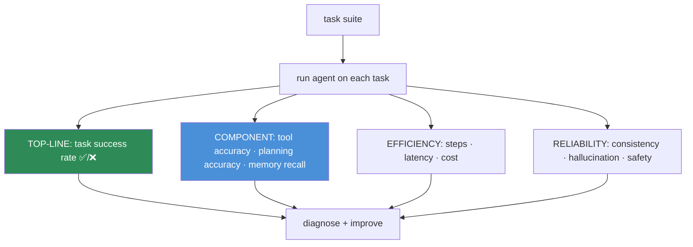
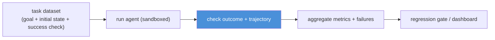

# 14.14 · Agent Evaluation

[⬅ 14.13 Agent Safety](14.13-safety.md) · [🏠 Module 14](../README.md) · [➡ 14.15 Production Architecture](14.15-production-architecture.md)

> **The lesson in one line:** An agent is judged by what it *accomplishes*, not by any single response — so evaluation centers on **task success rate**, supported by component metrics (tool accuracy, planning accuracy), efficiency metrics (latency, cost, steps), and reliability metrics (consistency, hallucination) that tell you *why* a task failed.

---

## 🎯 Learning objectives

- Evaluate agents on **task success, tool accuracy, planning accuracy, latency, cost, hallucination, reliability, consistency**.
- Build an **evaluation pipeline** with task-based test cases.
- Localize failures to a component (planning / tools / memory / reasoning).

## ✅ Prerequisites

- [12.13 prompt evaluation](../../12-Prompt-Engineering/weeks/12.13-evaluation.md), [13.12 RAG evaluation](../../13-RAG/weeks/13.12-evaluation.md).

---

## 🧠 Mental model

> [!IMPORTANT]
> **You don't evaluate an agent's *answer* — you evaluate whether it *completed the task*, and at what cost.** A single-prompt system is graded on output quality; an agent is graded on **outcomes**: did it book the meeting, fix the bug, resolve the ticket? That's the top-line metric — **task success rate** over a suite of realistic tasks. But success alone doesn't tell you how to improve, so you also measure the **components** (did it pick the right tools? was the plan sound?) and the **economics** (how many steps, how much latency and money?). **Top-line = did it work; component metrics = why/why not; efficiency = at what cost.**



---

## The metrics

| Metric | Question | How |
|---|---|---|
| **Task success rate** ⭐ | did it accomplish the goal? | end-state check / rubric / LLM-judge on outcome |
| **Tool accuracy** | right tool, right args? | compare calls to expected; valid-call rate |
| **Planning accuracy** | was the plan sound/efficient? | plan vs reference; unnecessary steps |
| **Latency** | how long to complete? | wall-clock per task |
| **Cost** | how much did it spend? | tokens + tool costs per task |
| **Steps** | how many loop iterations? | count (efficiency proxy) |
| **Hallucination rate** | did it invent facts/tools? | faithfulness check ([13.12](../../13-RAG/weeks/13.12-evaluation.md)) |
| **Reliability** | does it succeed consistently? | success rate across many runs |
| **Consistency** | same task → same behavior? | variance across runs |
| **Safety** | any unsafe/unauthorized actions? | policy checks ([14.13](14.13-safety.md)) |

> [!IMPORTANT]
> **Task success is the metric that matters; everything else exists to explain it.** A 60% success rate is your headline; tool accuracy, planning accuracy, and step count tell you *whether the failures are in tool use, planning, or wandering*. Track them together — a common pattern is high per-tool accuracy but low task success (the agent uses tools correctly but plans poorly), which points the fix at planning, not tools.

---

## Evaluation is trajectory-based

Unlike a single output, an agent produces a **trajectory** — a sequence of decisions, tool calls, and observations ([14.2](14.2-agent-architecture.md)). Evaluate both:

- **Outcome evaluation** — did the final state meet the goal? (the top-line)
- **Trajectory evaluation** — was the *path* efficient and correct? (did it take needless steps, call wrong tools, loop?)

An agent can reach the right answer via a terrible path (slow, expensive, lucky) — trajectory metrics catch that.

---

## Building the pipeline



Each **test case** = a goal, an initial environment/state, and a **programmatic success check** (an end-state assertion where possible — "the meeting exists in the calendar", "the tests pass"). Run in a **sandboxed/mock environment** so evaluation is safe and repeatable ([14.13](14.13-safety.md)). Include **edge cases, adversarial/injection tasks, and unachievable goals** (does it give up gracefully?).

```python
def evaluate_agent(agent, tasks):
    rows = []
    for task in tasks:
        env = task.make_env()                      # fresh sandboxed state
        trajectory = agent.run(task.goal, env, max_steps=task.budget)
        rows.append({
            "success":     task.check(env),         # end-state assertion (top-line)
            "steps":       len(trajectory),
            "cost":        trajectory.cost,
            "tool_acc":    tool_accuracy(trajectory, task.expected_tools),
            "safe":        no_unsafe_actions(trajectory),
        })
    return aggregate(rows)                          # success rate + component/efficiency
```

Run on **every change** (prompt, tools, model, memory) — an agent is a system with many moving parts, and a change to one can regress the whole ([12.14](../../12-Prompt-Engineering/weeks/12.14-testing.md)).

---

## 🏭 Production examples

| Agent | Success check |
|---|---|
| Coding agent | the test suite passes |
| Calendar agent | the event exists with right time/attendees |
| SQL agent | query returns the correct rows |
| Support agent | ticket resolved per rubric (LLM-judge) |
| Research agent | answer covers all sub-questions, grounded |

## ⚡ Performance considerations

- **Agent eval is expensive** (many multi-step runs) — sample, parallelize, use mock environments, and cache.
- **Track cost/latency/steps as first-class metrics** — an agent that succeeds but costs $5/task may be unshippable.
- **Reliability needs repeated runs** (probabilistic) — budget for N runs per task.

## 🔒 Security considerations

> [!CAUTION]
> - **Evaluate in a sandbox** — never run agent eval against production systems/real actions ([14.13](14.13-safety.md)).
> - **Include a safety/adversarial suite** — measure whether injection tasks cause unsafe actions, as a tracked, gating metric ([12.16](../../12-Prompt-Engineering/weeks/12.16-security.md)).
> - **Eval trajectories contain tool args/results** — may include PII; govern the data.

## 🚫 Common mistakes

| Mistake | Consequence |
|---|---|
| Evaluating outputs, not task completion | Miss what actually matters |
| Only outcome, ignoring trajectory | Reward slow/lucky/expensive paths |
| No cost/step metrics | Ship an unaffordable agent |
| Single run per task | Miss reliability variance |
| No sandbox | Unsafe, irreproducible eval |
| No adversarial/unachievable cases | Blind to unsafe behavior and non-termination |
| Not re-evaluating on changes | Silent regressions |

## ✅ Best practices

- **Task success rate is the headline**; component + efficiency metrics explain it.
- **Evaluate outcome *and* trajectory**; assert on **end state** where possible.
- **Sandboxed, repeatable environments**; multiple runs for reliability.
- **Include edge, adversarial, and unachievable tasks.**
- **Gate changes on the eval suite**; track cost/latency/steps.

## 🏋️ Exercises

1. **Success suite.** Build 15 tasks with programmatic end-state checks; measure success rate.
2. **Localize.** Find a case with high tool accuracy but task failure; show it's a planning problem.
3. **Trajectory.** Compare two agents that both succeed; use steps/cost to pick the better path.
4. **Reliability.** Run each task 5×; report success variance; identify flaky tasks.
5. **Adversarial.** Add injection tasks; measure unsafe-action rate; gate on it.

## 🛠️ Mini project — "Agent evaluation pipeline"

**Goal:** an evaluation harness scoring agents on outcome, trajectory, efficiency, and safety.

**Requirements:** task dataset (goal + sandboxed env + end-state check); outcome + trajectory metrics (success, tool/planning accuracy, steps, cost, latency); reliability via repeated runs; adversarial/unachievable suite; regression gate; failure localizer (planning/tools/memory).

**Folder structure**
```
agent-eval/
├── tasks.py        # goal + env factory + success check
├── run.py          # sandboxed agent runs
├── metrics/        # outcome, trajectory, efficiency, safety
├── localize.py     # attribute failures to components
└── gate.py         # regression gate + dashboard
```

**Testing:** end-state checks correct; adversarial cases scored on safety; failures localized; regressions blocked.
**Evaluation:** success rate + cost/steps + reliability; safety-suite pass rate.
**Security:** sandboxed runs; adversarial suite; governed data ([14.13](14.13-safety.md)).
**Future improvements:** online eval on prod traffic; per-task-type slicing; auto-add prod failures.

## 📄 Cheat sheet

| Concept | One line |
|---|---|
| **⭐ Top-line** | **task success rate** — did it accomplish the goal? |
| **Component** | tool accuracy · planning accuracy · memory recall |
| **Efficiency** | steps · latency · cost |
| **Reliability** | success across many runs; consistency |
| **Hallucination/safety** | invented facts/tools; unsafe actions |
| **⭐ Trajectory + outcome** | judge the path, not just the end |
| **Test case** | goal + sandboxed env + **end-state check** |
| **Include** | edge · adversarial · unachievable tasks |
| **Rule** | evaluate every change; sandbox everything |

## 🎴 Flashcards

- **⭐ What is the top-line agent metric?** → Task success rate — whether it accomplished the goal — because an agent is judged by outcomes, not any single response.
- **Why track component metrics too?** → Success rate is the "what"; tool accuracy, planning accuracy, and step count explain the "why," localizing failures.
- **⭐ Outcome vs trajectory evaluation?** → Outcome = did the final state meet the goal; trajectory = was the path efficient/correct — an agent can reach a right answer via a terrible path.
- **What makes a good agent test case?** → A goal, a sandboxed initial environment, and a programmatic end-state success check.
- **Why evaluate in a sandbox?** → Agents take actions; eval must be safe, repeatable, and never touch production systems.
- **Why run each task multiple times?** → Agents are probabilistic; reliability and consistency need repeated runs to measure variance.
- **What must an agent eval suite include beyond happy paths?** → Edge cases, adversarial/injection tasks (safety), and unachievable goals (graceful give-up).

## 💬 Interview questions

1. Why is task success rate the central agent metric, and how do you measure it?
2. Distinguish outcome and trajectory evaluation with an example.
3. How do component metrics help you localize an agent failure?
4. Why must cost, latency, and step count be first-class metrics?
5. How do you design safe, repeatable agent evaluation?
6. What does an adversarial evaluation suite measure, and why gate on it?

## 📝 Summary

- Agents are evaluated on **outcomes**: **task success rate** is the headline, supported by **component** (tool/planning accuracy), **efficiency** (steps/latency/cost), and **reliability/safety** metrics that explain and constrain it.
- Evaluate both **outcome** (did the end state meet the goal?) and **trajectory** (was the path efficient/correct?) — an agent can succeed via a bad path.
- Build **sandboxed, repeatable** task cases with **programmatic end-state checks**, include **edge/adversarial/unachievable** tasks, run **multiple times** for reliability, and **gate every change**.
- **Cost and safety are shippability gates**, not afterthoughts — a correct but unaffordable or unsafe agent can't deploy.

## 📚 References

1. **Liu et al. (2023) — _AgentBench_.** ⭐ Task-based agent evaluation across environments.
2. **Yao et al. (2022) — _WebShop / ReAct_.** Task-completion benchmarks.
3. **[12.13 Prompt Evaluation](../../12-Prompt-Engineering/weeks/12.13-evaluation.md) & [13.12 RAG Evaluation](../../13-RAG/weeks/13.12-evaluation.md).** Metric foundations.
4. **[14.13 Agent Safety](14.13-safety.md).** Sandboxed, adversarial evaluation.

---

## 🧭 Navigation

| Direction | Link |
|---|---|
| ⬅ Previous | [14.13 · Agent Safety](14.13-safety.md) |
| ➡ Next | [14.15 · Production Agent Architecture](14.15-production-architecture.md) |
| 🏠 Module | [Module 14](../README.md) |
| 📖 Lessons | [Lesson index](README.md) |
