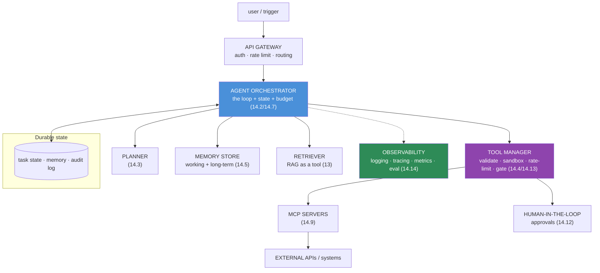
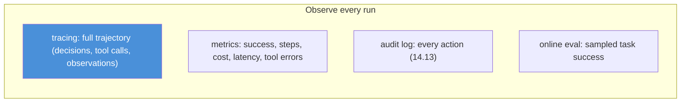

# 14.15 · Production Agent Architecture

[⬅ 14.14 Agent Evaluation](14.14-evaluation.md) · [🏠 Module 14](../README.md) · [➡ 14.16 Frameworks](14.16-frameworks.md)

> **The lesson in one line:** A production agent is not a script — it's a **service-oriented system** where the agent loop is one component among many (gateway, planner, memory store, retriever, tool manager, MCP servers, monitoring), each scaled and secured independently, so the whole thing is observable, bounded, and recoverable.

---

## 🎯 Learning objectives

- Design the **production agent architecture**: gateway → planner → memory → retriever → tool manager → MCP → external APIs → monitoring/logging/evaluation.
- Add **observability, state management, and reliability** to agents.
- Understand what changes when an agent goes from notebook to service.

## ✅ Prerequisites

- [14.2 agent architecture](14.2-agent-architecture.md), [14.13 safety](14.13-safety.md), [13.15 production RAG](../../13-RAG/weeks/13.15-production-architecture.md), [11.20 production LLM](../../11-LLMs/weeks/11.20-production-architecture.md).

---

## 🧠 Mental model

> [!IMPORTANT]
> **The notebook agent is a `while` loop calling an LLM; the production agent is a distributed system where that loop is one service surrounded by the machinery that makes it safe, observable, and reliable.** Agents are especially demanding in production because they're **stateful** (a task spans many steps and may pause for humans), **long-running** (minutes to hours), **action-taking** (real side effects), and **expensive/unpredictable** (variable step counts). So the architecture must handle **durable state, resumability, per-component scaling, tight security boundaries, and deep observability** — you can't debug an agent you can't see.

---

## The production architecture



| Component | Job |
|---|---|
| **API gateway** | auth, rate limiting, request routing ([11.20](../../11-LLMs/weeks/11.20-production-architecture.md)) |
| **Orchestrator** | runs the loop, owns budgets/termination, persists state ([14.2](14.2-agent-architecture.md), [14.7](14.7-agent-loops.md)) |
| **Planner** | decomposition/planning ([14.3](14.3-planning.md)) |
| **Memory store** | working + long-term, durable ([14.5](14.5-memory.md)) |
| **Retriever** | RAG-as-a-tool for knowledge ([13](../../13-RAG/README.md)) |
| **Tool manager** | validated, sandboxed, rate-limited, gated tool execution ([14.4](14.4-tool-calling.md), [14.13](14.13-safety.md)) |
| **MCP servers** | standardized tool/data access ([14.9](14.9-mcp.md)) |
| **Human-in-the-loop** | approvals/escalation ([14.12](14.12-human-in-the-loop.md)) |
| **Observability** | logging, tracing, metrics, online eval ([14.14](14.14-evaluation.md)) |

---

## What changes from notebook to service

### Durable, resumable state
A production agent task must **survive restarts and pauses**. Persist the task state (goal, memory, trajectory, step) to a store after each step, so the agent can **resume** — essential for long tasks and human-in-the-loop waits ([14.12](14.12-human-in-the-loop.md)). Treat each step like a **checkpoint**.

### Observability (the non-negotiable)


> [!IMPORTANT]
> **You cannot operate an agent you cannot see. Trace the entire trajectory of every run** — each decision, tool call, argument, and observation — because when an agent misbehaves, the *why* is buried in the step sequence ([14.14](14.14-evaluation.md)). Agent observability is deeper than a normal service's: you need the *reasoning trace*, not just request/response logs. This is also your safety audit trail ([14.13](14.13-safety.md)).

### Per-component scaling & reliability
- **Stateless orchestrator workers** + durable state → scale horizontally; any worker resumes any task.
- **Timeouts, retries, circuit breakers** around tools and the LLM ([14.4](14.4-tool-calling.md)).
- **Budgets enforced centrally** (step/cost/time) — the orchestrator is the control point ([14.7](14.7-agent-loops.md)).
- **Graceful degradation** — return best partial result on budget/failure.

---

## 🏭 Production examples

| Concern | Choice |
|---|---|
| Long-running tasks | durable state + resumable orchestrator + event-driven waits |
| Human approvals | pause task, persist state, resume on approval ([14.12](14.12-human-in-the-loop.md)) |
| Many tools | MCP servers, tool manager with least privilege ([14.9](14.9-mcp.md), [14.13](14.13-safety.md)) |
| Debuggability | full trajectory tracing + replay |
| Cost control | central budgets + monitoring + right-sized models |

## ⚡ Performance considerations

- **Sequential LLM calls dominate latency** — minimize steps (planning), parallelize independent tool calls/sub-agents, stream progress.
- **State persistence per step** adds overhead but enables resumability — use fast stores.
- **Prompt-cache stable prefixes**; cache retrievals ([13.16](../../13-RAG/weeks/13.16-performance.md)).
- **Per-component autoscaling** — the tool manager, retriever, and orchestrator scale differently.

## 🔒 Security considerations

> [!CAUTION]
> - **The tool manager is the security choke point** — all validation, sandboxing, rate limits, permission gates, and audit logging concentrate here ([14.13](14.13-safety.md)).
> - **Durable state and traces hold sensitive data** (goals, tool args/results, memory) — encrypt, scope by tenant, govern retention.
> - **Isolate tenants** end-to-end (state, memory, tools) — one task must never see another's data.
> - **MCP servers are permission boundaries** — scope and sandbox them ([14.9](14.9-mcp.md)).

## 🚫 Common mistakes

| Mistake | Consequence |
|---|---|
| Monolithic in-memory agent | Can't scale, resume, or survive restarts |
| No trajectory tracing | Undebuggable in production |
| Budgets not enforced centrally | Runaway cost across the system |
| No durable state | Long tasks/approvals lost on restart |
| Scattered tool security | Inconsistent enforcement; gaps |
| Monitoring uptime, not agent quality | Silent success-rate decay |
| No tenant isolation | Cross-tenant leakage |

## ✅ Best practices

- **Service-oriented**: orchestrator + planner + memory + retriever + tool manager + MCP + observability.
- **Durable, resumable state** (checkpoint each step); event-driven for pauses.
- **Trace the full trajectory**; monitor **task success/cost/steps** online.
- **Centralize budgets and tool security** (the tool manager).
- **Per-component scaling; tenant isolation; graceful degradation.**

## 🏋️ Exercises

1. **Decompose.** Take your [14.2](14.2-agent-architecture.md) agent and split it into orchestrator, tool manager, memory, and observability services.
2. **Resumability.** Persist state each step; kill and restart mid-task; show it resumes.
3. **Tracing.** Emit a full trajectory trace; reconstruct a failed run from it.
4. **Central budget.** Enforce step/cost budgets in the orchestrator; show a runaway is bounded.
5. **Approval pause.** Persist state on an approval request; resume on approval without losing progress.

## 🛠️ Mini project — "Production agent platform"

**Goal:** a service-oriented agent deployment with durability, observability, and centralized safety.

**Requirements:** gateway (auth/rate-limit); stateless orchestrator + durable step-checkpointed state (resumable); planner/memory/retriever services; tool manager (validate/sandbox/rate-limit/gate/audit); MCP integration; human-in-the-loop pauses; full trajectory tracing + online metrics; tenant isolation.

**Folder structure**
```
agent-platform/
├── gateway/        # auth, rate limit, routing
├── orchestrator/   # loop + budgets + durable state + resume
├── services/       # planner, memory, retriever
├── tool-manager/   # validate, sandbox, rate-limit, gate, audit
├── mcp/            # MCP server integration
└── observability/  # tracing, metrics, online eval
```

**Testing:** resumes after restart; budgets enforced centrally; full traces captured; tenant isolation holds; approvals pause/resume.
**Evaluation:** online task success/cost/latency; trace-based debugging time ([14.14](14.14-evaluation.md)).
**Security:** tool-manager choke point; encrypted state; tenant isolation ([14.13](14.13-safety.md)).
**Monitoring:** success rate, cost/task, step distributions, tool error rates, approval rates.
**Future improvements:** multi-region; agent replay/debugger; canary agent versions.

## 📄 Cheat sheet

| Concept | One line |
|---|---|
| **⭐ Service-oriented** | orchestrator + planner + memory + retriever + tool manager + MCP + observability |
| **Orchestrator** | runs the loop; owns budgets/termination; persists state |
| **Tool manager** | the security choke point (validate/sandbox/limit/gate/audit) |
| **⭐ Durable state** | checkpoint each step → resumable (long tasks, approvals) |
| **⭐ Observability** | trace the **full trajectory**; monitor success/cost/steps |
| **Scaling** | stateless workers + durable state; per-component |
| **Central budgets** | orchestrator enforces step/cost/time |
| **Tenant isolation** | state, memory, tools — end to end |

## 🎴 Flashcards

- **⭐ Why is a production agent a distributed system, not a script?** → It's stateful, long-running, action-taking, and cost-unpredictable, needing durable state, resumability, per-component scaling, tight security, and deep observability.
- **What are the main components of a production agent architecture?** → Gateway, orchestrator (loop + budgets + state), planner, memory store, retriever, tool manager, MCP servers, human-in-the-loop, and observability.
- **⭐ Why is durable, resumable state essential?** → Tasks span many steps and may pause for human approval; persisting state per step lets the agent survive restarts and resume long tasks.
- **⭐ Why is observability deeper for agents?** → You must trace the full reasoning trajectory (decisions, tool calls, observations), not just request/response, to debug misbehavior — it's also the safety audit trail.
- **Where do agent security controls concentrate?** → The tool manager — validation, sandboxing, rate limits, permission gates, and audit logging.
- **Where are budgets enforced in production?** → Centrally in the orchestrator (step/cost/time), which is the control point for the whole loop.

## 💬 Interview questions

1. How does an agent change when it moves from notebook to production service?
2. Draw the production agent architecture and describe each component.
3. Why are durable state and resumability critical for agents?
4. Why is trajectory tracing essential, and how is agent observability different?
5. Where do you concentrate agent security controls, and why?
6. How do you scale a stateful agent system?

## 📝 Summary

- A production agent is a **service-oriented system**: a stateless **orchestrator** (loop + central budgets + durable state) surrounded by **planner, memory, retriever, tool manager, MCP servers, human-in-the-loop, and observability**.
- Agents are **stateful, long-running, and action-taking**, so production adds **durable/resumable state** (checkpoint each step), **deep observability** (full trajectory tracing), **centralized budgets and tool security** (the tool manager), and **tenant isolation**.
- **You cannot operate an agent you cannot see** — trajectory tracing is both the debugging tool and the safety audit trail; monitor **task success, cost, and steps**, not just uptime.
- The **tool manager is the security choke point**, and the orchestrator enforces budgets and enables **graceful degradation** ([14.13](14.13-safety.md), [14.7](14.7-agent-loops.md)).

## 📚 References

1. **[11.20 Production LLM Architecture](../../11-LLMs/weeks/11.20-production-architecture.md) & [13.15 Production RAG](../../13-RAG/weeks/13.15-production-architecture.md).** ⭐ The surrounding system.
2. **[16 · MLOps](../../16-MLOps/README.md).** Deployment, monitoring, versioning.
3. **LangGraph / durable-execution patterns.** Resumable agent state.
4. **[14.14 Agent Evaluation](14.14-evaluation.md).** Online monitoring.

---

## 🧭 Navigation

| Direction | Link |
|---|---|
| ⬅ Previous | [14.14 · Agent Evaluation](14.14-evaluation.md) |
| ➡ Next | [14.16 · Frameworks](14.16-frameworks.md) |
| 🏠 Module | [Module 14](../README.md) |
| 📖 Lessons | [Lesson index](README.md) |
