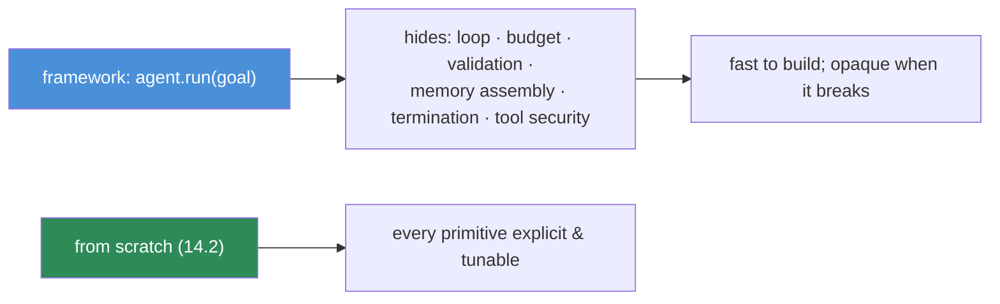

# 14.16 · Frameworks

[⬅ 14.15 Production Architecture](14.15-production-architecture.md) · [🏠 Module 14](../README.md) · [➡ 14.17 Projects & Summary](14.17-projects-summary.md)

> **The lesson in one line:** Agent frameworks — LangGraph, CrewAI, AutoGen, OpenAI Agents SDK, Semantic Kernel, PydanticAI — package the loop, tools, memory, and multi-agent plumbing you built by hand, which accelerates development enormously; but because they hide the loop and its guardrails, you must understand the primitives first (as this module made you) to choose, use, and debug them well.

---

## 🎯 Learning objectives

- Know what the major **agent frameworks** offer and how they differ.
- Map framework concepts back to the **primitives** (loop, tools, memory, multi-agent) you built.
- Decide **when a framework helps and when to build by hand**.

## ✅ Prerequisites

- The whole module — you must know the primitives a framework abstracts. [13.17 RAG frameworks](../../13-RAG/weeks/13.17-frameworks.md) (the same help-vs-hide lesson).

---

## 🧠 Mental model

> [!IMPORTANT]
> **Every agent framework is a packaging of the exact primitives you built in 14.2–14.13: a loop, a tool layer, memory, and multi-agent coordination — plus opinions about how to wire them.** `agent.run(goal)` hides the loop you wrote by hand, the budget you set, the validation you added, and the memory you assembled. That's a huge accelerator for the 80% that's boilerplate — *and* a liability for the 20% that determines whether your agent is reliable and safe, because those decisions are now buried in someone else's abstraction. **You built the loop first ([14.2](14.2-agent-architecture.md)) precisely so you can see through any framework** — know what it's doing, tune what matters, and debug when it breaks.



---

## The frameworks

| Framework | Character | Strength | Watch out |
|---|---|---|---|
| **LangGraph** | agents as **graphs** (nodes = steps, edges = control flow); durable state | explicit control flow, cycles, human-in-the-loop, resumability ([14.15](14.15-production-architecture.md)) | steeper concepts; verbose |
| **CrewAI** | **role-based multi-agent** ("crews" of agents with roles/tasks) | fast multi-agent setups; intuitive roles ([14.8](14.8-multi-agent.md)) | opinionated; less low-level control |
| **AutoGen** | **conversational multi-agent** (agents talk to each other) | flexible agent-to-agent conversations, research | free-form chat can be hard to control |
| **OpenAI Agents SDK** | lightweight agents + tools + handoffs + guardrails | simple, production-minded primitives | provider-oriented |
| **Semantic Kernel** | enterprise **plugins/planners** (C#/Python) | enterprise integration, planners | heavier; enterprise-shaped |
| **PydanticAI** | **type-safe** agents built on Pydantic | structured outputs, validation, typing ([12.6](../../12-Prompt-Engineering/weeks/12.6-structured-outputs.md)) | newer ecosystem |

They cluster into: **graph/control-flow** (LangGraph), **multi-agent orchestration** (CrewAI, AutoGen), **lightweight/typed** (OpenAI Agents SDK, PydanticAI), and **enterprise** (Semantic Kernel). All provide the same core: a loop, tool binding, memory, and (often) multi-agent coordination.

---

## When frameworks help vs when to build by hand

| Frameworks help | Build by hand |
|---|---|
| Prototyping fast; standard patterns | Tight control over the loop/budgets |
| Multi-agent boilerplate (CrewAI/AutoGen) | Custom/unusual control flow |
| Durable state & resumability (LangGraph) | Minimal dependencies; full transparency |
| Tool/memory integrations out of the box | Debugging subtle reliability/safety issues |
| Small team, broad surface | Security-critical agents (own every boundary) |

> [!IMPORTANT]
> **Build the core once by hand, then adopt a framework for leverage — not the reverse.** A framework used without understanding the primitives gives you an agent you can't debug: when it loops, wanders, or takes an unsafe action, the cause is inside the abstraction. Having built the loop, tools, memory, and safety yourself, you can read any framework's docs and map them to primitives, know which knobs matter (budgets, validation, permissions), and drop to custom code for the parts that determine reliability and safety. **Use the framework for plumbing; own the guardrails.**

---

## 💻 Same agent, two ways

**From scratch** (the [14.2](14.2-agent-architecture.md) loop) — you own the loop, budget, validation, memory. **With a framework** — the loop is `agent.run(goal)`; you configure tools, memory, and (crucially) **still set budgets, validation, and permissions** ([14.13](14.13-safety.md)). The framework removes boilerplate; it does **not** remove your responsibility for the guardrails — those must be configured explicitly, because the defaults are rarely safe enough for production.

---

## 🏭 Production examples

| Need | Choice |
|---|---|
| Complex control flow + resumability | LangGraph |
| Role-based multi-agent product | CrewAI |
| Research / agent conversations | AutoGen |
| Lightweight typed agent | PydanticAI / OpenAI Agents SDK |
| Enterprise (.NET, plugins) | Semantic Kernel |
| Max control / security-critical | build by hand + minimal libs |

## ⚡ Performance considerations

- **Frameworks add overhead and hidden LLM calls** (extra planning/reflection steps) — profile the real token/latency cost ([14.14](14.14-evaluation.md)).
- **Default budgets/steps may be generous** — set them explicitly to control cost.
- **Abstraction can obscure parallelism** — verify independent work actually runs in parallel.

## 🔒 Security considerations

> [!CAUTION]
> - **Frameworks don't make agents safe by default** — you must still configure **least privilege, sandboxing, approval gates, and rate limits** ([14.13](14.13-safety.md)); verify the framework's defaults, don't assume them.
> - **Framework tool/plugin ecosystems are a supply-chain surface** — vet third-party tools/agents; pin versions.
> - **Hidden autonomy** — some frameworks auto-loop or auto-delegate; confirm you know every action path and its guardrails.

## 🚫 Common mistakes

| Mistake | Consequence |
|---|---|
| Framework-first, no primitive knowledge | Undebuggable agents |
| Assuming defaults are safe | Missing budgets/permissions/sandbox |
| Not profiling hidden calls | Surprise cost/latency |
| Over-abstracting a simple agent | Complexity for a 40-line loop |
| Ignoring supply-chain risk | Malicious tools/plugins |
| Never dropping to custom code | Stuck when the abstraction fights you |

## ✅ Best practices

- **Understand the primitives first** (this module); then use a framework for leverage.
- **Explicitly configure guardrails** (budgets, validation, least privilege, approvals) — never trust defaults.
- **Profile hidden calls/cost**; verify parallelism.
- **Vet framework tool ecosystems**; pin versions.
- **Own the security-critical parts**; use the framework for plumbing.

## 🏋️ Exercises

1. **Same agent, two ways.** Build one agent from scratch and in a framework; compare code, control, and debuggability.
2. **Expose defaults.** For a framework, find its default max-steps, budget, and tool permissions. Were they safe?
3. **Multi-agent framework.** Build a coordinator-workers system in CrewAI/AutoGen; map its concepts to [14.8](14.8-multi-agent.md) primitives.
4. **Guardrail config.** Add explicit budgets, validation, and least privilege to a framework agent; confirm they take effect.
5. **Debug via trace.** Turn on framework tracing; reproduce the [14.14](14.14-evaluation.md) trajectory view; localize a failure.

## 🛠️ Mini project — "Framework bake-off"

**Goal:** the same agent built by hand and in a framework, compared.

**Requirements:** identical task, tools, and eval set; a from-scratch build ([14.2](14.2-agent-architecture.md)) and a framework build (LangGraph or CrewAI); expose the framework's hidden defaults; configure guardrails explicitly in both; evaluate ([14.14](14.14-evaluation.md)) and profile both; verify safety controls in both.

**Folder structure**
```
framework-bakeoff/
├── scratch_agent.py    # hand-built loop (14.2)
├── framework_agent.py  # framework build
├── expose.py           # reveal framework defaults
├── eval.py             # task success/cost both ways
└── safety.py           # verify guardrails in both
```

**Testing:** both meet the eval bar; guardrails enforced in both; framework trace matches the scratch trajectory.
**Evaluation:** success, cost, latency, lines-of-code/control comparison.
**Security:** least privilege + budgets configured (not defaulted) in both ([14.13](14.13-safety.md)).
**Future improvements:** hybrid (framework plumbing + custom safety); multi-framework comparison.

## 📄 Cheat sheet

| Framework | One line |
|---|---|
| **LangGraph** | agents as graphs; explicit control flow + durable/resumable state |
| **CrewAI** | role-based multi-agent crews |
| **AutoGen** | conversational multi-agent |
| **OpenAI Agents SDK** | lightweight agents + tools + handoffs + guardrails |
| **Semantic Kernel** | enterprise plugins + planners |
| **PydanticAI** | type-safe, validation-first agents |
| **⭐ Help** | prototypes, multi-agent boilerplate, integrations, resumability |
| **⭐ Hide** | the loop, budgets, validation, memory, **guardrails** |
| **Path** | build primitives first → framework for leverage → own the safety |

## 🎴 Flashcards

- **⭐ What do agent frameworks abstract?** → The primitives you built: the loop, tool layer, memory, and multi-agent coordination — plus the budgets, validation, and guardrails, which get hidden.
- **How do the major frameworks differ?** → LangGraph (graph control flow + durable state), CrewAI (role-based multi-agent), AutoGen (conversational multi-agent), OpenAI Agents SDK & PydanticAI (lightweight/typed), Semantic Kernel (enterprise plugins).
- **⭐ When should you build by hand vs use a framework?** → Build by hand for tight control, custom flow, minimal deps, and security-critical agents; use a framework for prototyping, multi-agent boilerplate, integrations, and resumability.
- **Do frameworks make agents safe by default?** → No — you must explicitly configure least privilege, sandboxing, approval gates, and budgets; defaults are rarely production-safe.
- **⭐ Why build the loop by hand before using a framework?** → So you can see through the abstraction — know what it does, tune the knobs that matter, and debug/secure it when it breaks.
- **What must you always verify in a framework agent?** → Its default budgets/steps, tool permissions, hidden LLM calls/cost, and that guardrails are actually enforced.

## 💬 Interview questions

1. Compare LangGraph, CrewAI, AutoGen, and PydanticAI. When would you pick each?
2. What do agent frameworks abstract, and why is that a double-edged sword?
3. When do you build an agent by hand versus with a framework?
4. Why don't frameworks make agents safe by default, and what must you configure?
5. How does building the loop by hand help you use frameworks well?
6. What supply-chain and cost risks do frameworks introduce?

## 📝 Summary

- Agent frameworks — **LangGraph** (graphs/durable state), **CrewAI** & **AutoGen** (multi-agent), **OpenAI Agents SDK** & **PydanticAI** (lightweight/typed), **Semantic Kernel** (enterprise) — package the **loop, tools, memory, and multi-agent** primitives you built.
- They **accelerate the boilerplate 80%** but **hide the loop and its guardrails** (budgets, validation, permissions) — the 20% that determines reliability and safety.
- **Build the primitives first** (as this module did) so you can **choose, tune, debug, and secure** any framework; **frameworks don't make agents safe by default** — configure guardrails explicitly.
- **Use the framework for plumbing; own the guardrails.**

## 📚 References

1. **LangGraph documentation.** ⭐ Graph-based agents, durable execution.
2. **CrewAI / AutoGen / Semantic Kernel / PydanticAI docs.** Multi-agent, enterprise, typed.
3. **OpenAI Agents SDK docs.** Lightweight agent primitives + guardrails.
4. **[14.2 Agent Architecture](14.2-agent-architecture.md).** The loop frameworks abstract.

---

## 🧭 Navigation

| Direction | Link |
|---|---|
| ⬅ Previous | [14.15 · Production Agent Architecture](14.15-production-architecture.md) |
| ➡ Next | [14.17 · Mini Projects & Summary](14.17-projects-summary.md) |
| 🏠 Module | [Module 14](../README.md) |
| 📖 Lessons | [Lesson index](README.md) |
