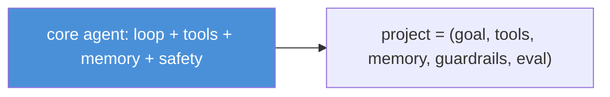
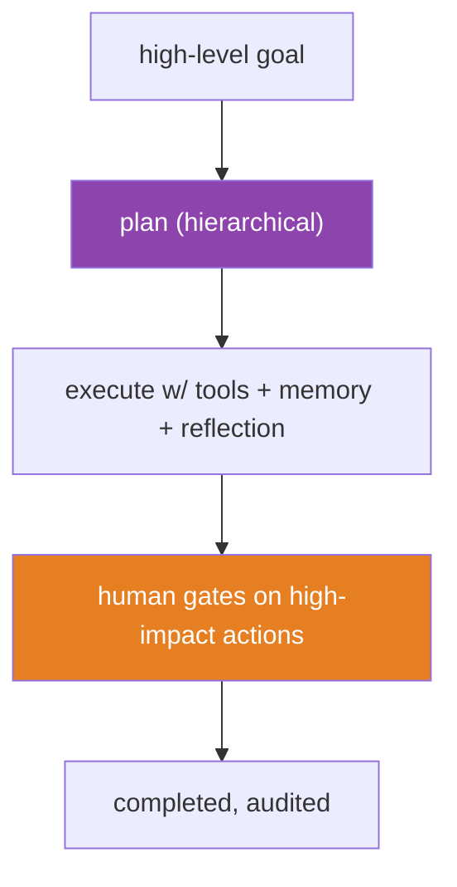
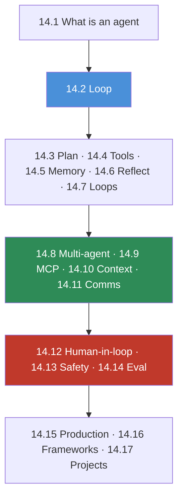

# 14.17 · Mini Projects & Summary

[⬅ 14.16 Frameworks](14.16-frameworks.md) · [🏠 Module 14](../README.md) · [➡ Module 15 · Fine-Tuning](../../15-Fine-Tuning/README.md)

> **The lesson in one line:** Ten projects — from a personal assistant to an autonomous task planner — assemble every primitive in this module into working agents, and together they turn "I understand agents" into "I can design, build, secure, evaluate, and deploy them."

---

## 🎯 Learning objectives

- Consolidate the module into **ten buildable agent projects**.
- For each: **requirements, folder structure, architecture, planning, tools, memory, evaluation, testing, security, monitoring, future improvements**.
- See how the primitives (loop, tools, memory, MCP, multi-agent, safety) compose per project.
- Leave with the module's through-lines internalized.

## ✅ Prerequisites

- All of Module 14. The projects are the payoff.

---

## 🧠 Mental model

> [!IMPORTANT]
> **Every project below is the same core loop ([14.2](14.2-agent-architecture.md)) with a different goal, toolset, and memory design — plus the guardrails that make it safe.** You are not learning ten different systems; you are learning to *configure one system ten ways*. Build a few end-to-end and the pattern becomes muscle memory: define the goal and success check, choose the tools (least privilege), design the memory, set the loop budget, add reflection where quality matters, gate the dangerous actions, and evaluate on task success. **The projects vary the parameters; the engineering discipline is constant.**

---

## The ten projects

For each: **goal → tools → memory → planning → safety → evaluation.**

### 1. Personal AI Assistant
General helper across calendar, email, notes.
- **Tools:** calendar, email (send behind approval), notes, search. **Memory:** long-term user preferences + conversation summary ([14.5](14.5-memory.md)). **Planning:** dynamic (ReAct). **Safety:** approval before send/delete; least privilege. **Eval:** task success on realistic requests.

### 2. Multi-Agent Research System
Coordinator + parallel researchers + synthesizer + critic ([14.8](14.8-multi-agent.md)).
- **Tools:** web search, fetch, retriever. **Memory:** shared findings blackboard ([14.11](14.11-communication.md)). **Planning:** hierarchical. **Safety:** per-agent least privilege; validated hand-offs. **Eval:** coverage of sub-questions, groundedness, cost vs single-agent.

### 3. Code Review Agent
Reviews diffs/PRs; comments and suggests fixes.
- **Tools:** repo read, static analysis, run tests (sandboxed). **Memory:** episodic "past review patterns". **Planning:** sequential (per-file) + reflection (run tests, [14.6](14.6-reflection.md)). **Safety:** read-only + sandbox; no auto-merge (human approves). **Eval:** real-issues-found rate; false-positive rate.

### 4. Customer Support Agent
Resolves tickets end to end; escalates when needed.
- **Tools:** KB retriever ([13](../../13-RAG/README.md)), order lookup, ticket actions. **Memory:** customer history (long-term) + current ticket (working). **Planning:** dynamic. **Safety:** ACL by customer; escalation on low confidence ([14.12](14.12-human-in-the-loop.md)). **Eval:** resolution rate, escalation appropriateness, faithfulness.

### 5. MCP File Assistant
Operates on files via a scoped MCP server ([14.9](14.9-mcp.md)).
- **Tools (via MCP):** read/search files (resources+tools), write behind approval. **Memory:** working (file state). **Planning:** dynamic. **Safety:** server scoped to one directory; sandbox; write approval. **Eval:** file-task success; no out-of-scope access.

### 6. Calendar Scheduling Agent
Books meetings across constraints/calendars.
- **Tools:** calendar read/write, availability, email invite. **Memory:** preferences (long-term). **Planning:** sequential with re-planning on conflicts. **Safety:** approval before creating events; rate limit. **Eval:** correct event created (end-state check).

### 7. Web Research Agent
Answers open questions from the live web.
- **Tools:** search, fetch, extract, calculator. **Memory:** working findings + summarize as it goes ([14.10](14.10-context-engineering.md)). **Planning:** dynamic + query decomposition. **Safety:** web content as untrusted (injection); no dangerous tools; rate limit. **Eval:** answer correctness, groundedness, citations.

### 8. SQL Database Agent
Answers questions by querying a database.
- **Tools:** get schema, run query (read-only role). **Memory:** episodic (past query patterns) + schema resource. **Planning:** inspect schema → write query → verify rows → correct ([14.6](14.6-reflection.md)). **Safety:** read-only DB role; query limits; validate SQL (no injection). **Eval:** query correctness on labeled questions.

### 9. Document Analysis Agent
Extracts/answers over long documents.
- **Tools:** parse, chunk+retrieve ([13](../../13-RAG/README.md)), structured extract ([12.6](../../12-Prompt-Engineering/weeks/12.6-structured-outputs.md)). **Memory:** working (findings) + externalized state. **Planning:** hierarchical (per section). **Safety:** doc as untrusted; PII handling. **Eval:** extraction F1, faithfulness.

### 10. Autonomous Task Planner ⭐
The flagship: decompose a high-level goal, execute end-to-end with tools, memory, reflection, and human gates.
- **Tools:** a broad but least-privilege set + MCP servers. **Memory:** full stack (working + long-term + episodic). **Planning:** hierarchical + re-planning ([14.3](14.3-planning.md)). **Safety:** budgets, sandbox, approval gates, audit — the full harness ([14.13](14.13-safety.md)). **Eval:** task success on multi-step goals; cost; safety-suite pass.

---

## Each project's checklist

Every project should specify: **Requirements · Folder structure · Architecture diagram · Planning strategy · Tool design · Memory design · Evaluation strategy · Testing strategy · Security considerations · Monitoring · Future improvements** — the same discipline, applied ten times.

---

## The module, connected

> [!IMPORTANT]
> **The one thing to remember: an agent is a loop, not a prompt — and the engineering is everything around the model.** The LLM decides; your code controls the loop, validates the tools, manages the memory, bounds the budget, and gates the dangerous actions. Capability comes from **tools**, continuity from **memory**, connectivity from **MCP**, reliability from **reflection and evaluation**, and safety from **least privilege and containment**. **Autonomy is powerful and dangerous in equal measure — you ship it by bounding it.**

---

## The through-lines (memorize)

| # | Through-line |
|---|---|
| 1 | An agent is a **loop, not a prompt** — model decides, code controls. |
| 2 | **Tools are the agent's hands** — capabilities = tools, nothing more. |
| 3 | **Memory is the agent's notebook** — the LLM is stateless. |
| 4 | **Autonomy is a liability** — bound it with budgets and termination. |
| 5 | **Least privilege is the load-bearing safety control** — assume breach. |
| 6 | **Failures must become observations** — that's how agents recover. |
| 7 | **Reflect (verify) before irreversible actions.** |
| 8 | **MCP is the USB-C of tools** — build once, connect anywhere. |
| 9 | **Evaluate task success, not tokens** — outcome + trajectory. |
| 10 | **Frameworks hide the guardrails** — build the primitives first. |

## 🏋️ Capstone challenge

Build **Project 10 (Autonomous Task Planner)** end-to-end: hierarchical planning with re-planning, a least-privilege toolset (some via MCP), the full memory stack with summarization, reflection before irreversible actions, human approval gates, a step/cost budget, an audit log, and an evaluation suite (task success + cost + a safety/adversarial sub-suite). **Success criteria:** completes multi-step goals with measured success rate, stays within budget, gates every high-impact action, blocks an injected instruction from causing an unsafe action, and produces a full trajectory trace.

## 📄 Cheat sheet

| Project | Highlights |
|---|---|
| **1 Personal assistant** | multi-tool + approval + preferences |
| **2 Multi-agent research** | coordinator/workers/critic + blackboard |
| **3 Code review** | sandbox + tests + reflection + human merge |
| **4 Support** | RAG + history + escalation |
| **5 MCP file assistant** | scoped MCP server + write approval |
| **6 Calendar** | end-state check + approval + re-plan |
| **7 Web research** | untrusted web + decompose + summarize |
| **8 SQL** | read-only + verify rows + reflection |
| **9 Document analysis** | RAG + structured extract + hierarchical |
| **10 Task planner** ⭐ | full stack: plan+memory+reflect+safety+eval |

## 🎴 Flashcards

- **⭐ The one thing to remember from agents?** → An agent is a loop, not a prompt — the LLM decides, and your code controls the loop, tools, memory, budget, and gates.
- **What varies across the ten projects, and what stays constant?** → The goal, tools, memory design, and guardrails vary; the core loop and engineering discipline stay constant.
- **What's the minimal agent project?** → A single-purpose assistant: one loop, a few least-privilege tools, working memory, and a budget.
- **What makes Project 10 the flagship?** → It composes the full stack — hierarchical planning, complete memory, reflection, human gates, safety harness, and evaluation.
- **Where does each agent capability come from?** → Capability from tools, continuity from memory, connectivity from MCP, reliability from reflection/evaluation, safety from least privilege/containment.

## 💬 Interview questions

1. Design an autonomous task-planner agent end-to-end.
2. How would you incrementally build from a single-tool assistant to a multi-agent system?
3. Pick two projects and contrast their memory and safety designs.
4. Where would you invest to make an agent reliable and safe for production?
5. Defend the claim "an agent is a loop, not a prompt."
6. What would you evaluate and monitor for a deployed agent?

## 📝 Summary

- **Ten projects** — personal assistant, multi-agent research, code review, support, MCP file assistant, calendar, web research, SQL, document analysis, and the flagship **autonomous task planner** — assemble every module primitive into working agents.
- They are **one core loop configured ten ways**: vary the **goal, tools, memory, and guardrails**; keep the **engineering discipline** constant (define success, least-privilege tools, memory design, loop budget, reflection, gates, task-success evaluation).
- The module's spine, proven: **an agent is a loop, not a prompt — the engineering is everything around the model**, and **autonomy is shipped by bounding it** (budgets, least privilege, human gates, evaluation).
- Onward: agents assemble the whole applied track — **[prompt engineering (12)](../../12-Prompt-Engineering/README.md)**, **[RAG (13)](../../13-RAG/README.md)**, and the **[LLM (11)](../../11-LLMs/README.md)** — into systems that act.

## 📚 References

1. **All Module 14 lessons ([14.1](14.1-what-are-agents.md)–[14.16](14.16-frameworks.md)).** Each project's primitives.
2. **Anthropic — _Building Effective Agents_.** ⭐ Patterns and simplicity.
3. **[14.13 Safety](14.13-safety.md), [14.14 Evaluation](14.14-evaluation.md), [14.15 Production](14.15-production-architecture.md).** Project 10's pillars.
4. **[Module 15 · Fine-Tuning](../../15-Fine-Tuning/README.md).** Next in the program.

---

## 🧭 Navigation

| Direction | Link |
|---|---|
| ⬅ Previous | [14.16 · Frameworks](14.16-frameworks.md) |
| ➡ Next | [Module 15 · Fine-Tuning](../../15-Fine-Tuning/README.md) |
| 🏠 Module | [Module 14](../README.md) |
| 📖 Lessons | [Lesson index](README.md) |
