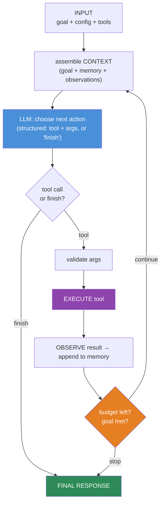
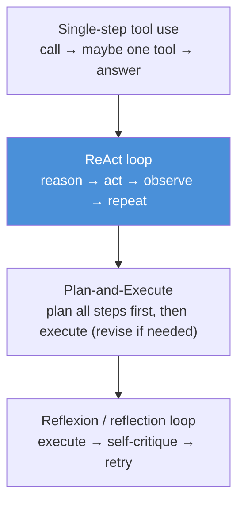
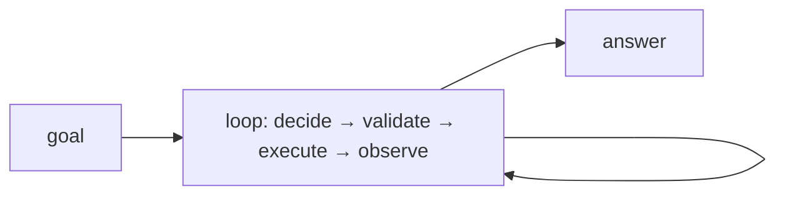

# 14.2 · Agent Architecture ⭐

[⬅ 14.1 What Are AI Agents?](14.1-what-are-agents.md) · [🏠 Module 14](../README.md) · [➡ 14.3 Planning](14.3-planning.md)

> **The lesson in one line:** An agent is a small, deterministic **control loop written in your code** that repeatedly calls the LLM to pick the next action, executes that action, appends the result to the context, and checks whether to stop — the LLM supplies the *decisions*, but *you* own the loop, the budget, and the termination.

---

## 🎯 Learning objectives

- Identify the **components** of an agent: inputs, planner, memory, tool selection, execution, feedback/observation, termination, final response.
- **Build a minimal agent loop from scratch** (the ReAct-style loop) in ~40 lines.
- Compare architectures: **single-step, ReAct, plan-and-execute, reflection**.
- Understand why the **loop lives in code**, not in the model.

## ✅ Prerequisites

- [14.1 what agents are](14.1-what-are-agents.md), [12.12 tool calling](../../12-Prompt-Engineering/weeks/12.12-tool-calling.md), [12.6 structured outputs](../../12-Prompt-Engineering/weeks/12.6-structured-outputs.md).

---

## 🧠 Mental model

> [!IMPORTANT]
> **The agent is not "the LLM" — the agent is the *loop around* the LLM, and that loop is ordinary, deterministic code you write.** Each iteration: assemble the context (goal + memory + observations), ask the LLM "what's the next action?", parse its **structured** answer, execute the chosen tool, append the result as a new observation, and decide whether to continue. The LLM is a **stateless decision function** called once per step; **all the state, control, budget, and safety live in your loop.** This separation is the whole architecture: *model decides, code controls.*



---

## The components

| Component | Job | Lesson |
|---|---|---|
| **Inputs** | the goal, configuration, available tools | 14.1 |
| **Context assembly** | build the prompt from goal + memory + observations | [14.10](14.10-context-engineering.md) |
| **Planner / decision** | the LLM chooses the next action (or a plan) | [14.3](14.3-planning.md) |
| **Tool selection & validation** | pick a tool, validate its arguments | [14.4](14.4-tool-calling.md) |
| **Execution** | run the tool (your code) | [14.4](14.4-tool-calling.md) |
| **Observation / feedback** | capture the result, add to memory | [14.5](14.5-memory.md) |
| **Termination** | budget, goal-met, or error → stop | [14.7](14.7-agent-loops.md) |
| **Final response** | synthesize the answer for the user | — |

---

## 💻 A minimal agent from scratch

The core ReAct-style loop — the whole architecture in ~40 lines:

```python
def run_agent(goal, tools, llm, max_steps=10, budget=None):
    memory = [f"Goal: {goal}"]                      # working memory (observations)
    for step in range(max_steps):                   # ⭐ the budget: code owns termination
        context = build_context(goal, memory, tools)          # perceive (14.10)
        decision = llm.decide(context, schema=ACTION_SCHEMA)  # reason+plan → structured (12.6)

        if decision.type == "finish":                # termination by the model
            return decision.answer

        tool = tools.get(decision.tool)              # tool selection (14.4)
        if tool is None:
            memory.append(f"Error: unknown tool {decision.tool}")
            continue
        try:
            args = validate(tool.schema, decision.args)       # validate (never trust args)
            result = tool.run(**args)                          # act / execute
            memory.append(f"Action: {decision.tool}({args}) → Observation: {result}")  # observe
        except Exception as e:
            memory.append(f"Action {decision.tool} failed: {e}")   # error → observation (14.6)

        if budget and budget.exceeded():             # cost/time budget
            break
    return llm.synthesize(goal, memory)              # final response from what we gathered
```

Where the LLM returns a **structured decision** ([12.6](../../12-Prompt-Engineering/weeks/12.6-structured-outputs.md)):

```python
ACTION_SCHEMA = {
  "type": "reason_then_act",
  "properties": {
    "thought": "string",                      # brief reasoning (kept short, 12.7)
    "type": {"enum": ["tool", "finish"]},
    "tool": "string",                         # if type == tool
    "args": "object",
    "answer": "string"                        # if type == finish
  }
}
```

> [!IMPORTANT]
> **Notice what the *code* owns and what the *model* owns.** The model owns: which tool, which arguments, when to finish. The code owns: the loop, `max_steps`, the budget, argument validation, error handling, tool execution, and memory. **This division is the safety and reliability boundary** — you never let the model control termination alone (it might loop forever), execute its own arguments (injection), or hold the only copy of state. *Model decides, code controls.*

---

## Architectures, simplest to most capable



| Architecture | How it works | Best for | Trade-off |
|---|---|---|---|
| **Single-step** | one call, at most one tool | simple augmentation | not really an agent; no adaptation |
| **ReAct** (reason+act) | interleave thought → action → observation each step | general-purpose, exploratory tasks | can wander; needs budgets |
| **Plan-and-Execute** | make a full plan up front, then execute steps | tasks with a clear structure | plan can go stale; needs re-planning ([14.3](14.3-planning.md)) |
| **Reflection** | act, then critique/verify, then retry | quality-critical tasks | extra LLM calls ([14.6](14.6-reflection.md)) |

Real agents **compose** these: e.g., plan-and-execute with a ReAct inner loop per step and a reflection pass at the end.

---

## 🏭 Production examples

| Concern | Architectural choice |
|---|---|
| Unpredictable task path | ReAct loop with a step budget |
| Known structure, many steps | plan-and-execute with re-planning |
| Correctness matters | add a reflection/verification step ([14.6](14.6-reflection.md)) |
| Long tasks | summarize memory to fit context ([14.10](14.10-context-engineering.md)) |
| Many independent subtasks | fan out to sub-agents ([14.8](14.8-multi-agent.md)) |

## ⚡ Performance considerations

- **Latency ≈ steps × (LLM call + tool time)** — minimize steps (better planning), parallelize independent tool calls, and cache.
- **Each step re-sends the growing context** — context grows every loop, so cost grows super-linearly unless you **compress/summarize memory** ([14.10](14.10-context-engineering.md)).
- **Right-size the model per role** — a cheap model for routine steps, a strong one for planning/reflection.

## 🔒 Security considerations

> [!CAUTION]
> - **The loop is your enforcement point** — validate tool arguments, cap steps/budget, and check permissions *in code* every iteration ([14.13](14.13-safety.md)). Never trust the model to self-limit.
> - **Observations are untrusted input** — a tool result (web page, file, API response) can carry prompt injection that steers the next decision ([12.16](../../12-Prompt-Engineering/weeks/12.16-security.md)); keep it as data.
> - **Fail closed** — on validation failure or unknown tool, record an error observation and continue or stop; never execute unvalidated actions.

## 🚫 Common mistakes

| Mistake | Consequence |
|---|---|
| Putting control logic in the prompt | Model "forgets" to stop; runaway loops |
| No `max_steps` / budget | Infinite loops, runaway cost |
| Executing tool args without validation | Injection, crashes, data loss |
| Free-text (not structured) decisions | Fragile parsing; unreliable tool selection |
| Not appending errors as observations | Agent can't recover from failures ([14.6](14.6-reflection.md)) |
| Unbounded memory growth | Context overflow, cost blow-up |

## ✅ Best practices

- **Structured decisions** ([12.6](../../12-Prompt-Engineering/weeks/12.6-structured-outputs.md)) — the LLM returns `{thought, tool, args}` or `{finish, answer}`, never free text you must scrape.
- **Code owns the loop, budget, validation, and memory.**
- **Every action's result (incl. errors) becomes an observation** the next step can see.
- **Start with ReAct + a small step budget**; add planning/reflection only when evaluation shows a need.

## 🏋️ Exercises

1. **Build it.** Implement the ~40-line loop with two real tools (e.g., calculator, web search). Confirm it solves a 3-step task and stops.
2. **Budget test.** Give it a goal it can't reach; verify `max_steps`/budget terminates it gracefully with a partial answer.
3. **Structured vs free-text.** Compare tool-selection reliability with structured decisions vs parsing free text.
4. **Error recovery.** Make a tool fail; show the agent reads the error observation and adapts.
5. **Architecture swap.** Re-implement the same task as plan-and-execute; compare steps, latency, and reliability to ReAct.

## 🛠️ Mini project — "Agent from scratch"

**Goal:** a minimal, framework-free agent with a clean loop, tool registry, memory, and budgets.

**Requirements:** ReAct loop; structured decisions; tool registry (schema + handler); working memory of observations; `max_steps` + cost budget; error-as-observation; final synthesis. No agent framework.

**Folder structure**
```
agent-core/
├── loop.py         # the control loop + termination
├── decide.py       # LLM structured decision
├── tools.py        # registry: schema + handler + validation
├── memory.py       # observation log (+ later: summarize, 14.10)
└── run.py          # entrypoint
```

**Architecture diagram**


**Testing:** solves a multi-step task; terminates on budget; recovers from a tool error; args always validated.
**Evaluation:** task success, steps taken, cost ([14.14](14.14-evaluation.md)).
**Security:** arg validation, step/budget caps, observations-as-data ([14.13](14.13-safety.md)).
**Monitoring:** log each step's decision/observation ([14.15](14.15-production-architecture.md)).
**Future improvements:** planning ([14.3](14.3-planning.md)), reflection ([14.6](14.6-reflection.md)), MCP tools ([14.9](14.9-mcp.md)).

## 📄 Cheat sheet

| Concept | One line |
|---|---|
| **⭐ Agent = loop in code** | model decides, **code controls** |
| **Loop step** | assemble context → decide → validate → execute → observe → check budget |
| **Structured decision** | `{thought, tool, args}` or `{finish, answer}` |
| **Code owns** | loop, budget, validation, memory, permissions |
| **Model owns** | which tool, which args, when to finish |
| **ReAct** | reason → act → observe → repeat (default) |
| **Plan-and-execute** | plan first, then execute (re-plan as needed) |
| **Reflection** | act → critique → retry (quality) |
| **⭐ Never** | let the model own termination or execute unvalidated args |

## 🎴 Flashcards

- **⭐ Where does the agent loop live — in the model or your code?** → In your code; the LLM is a stateless decision function called once per step, while the loop, budget, validation, and memory are code.
- **What does the model own vs the code own?** → Model: which tool, which args, when to finish. Code: the loop, step/cost budget, argument validation, execution, error handling, memory.
- **What is the ReAct loop?** → Interleave reasoning, acting (tool call), and observing the result each iteration until done.
- **Plan-and-execute vs ReAct?** → Plan-and-execute makes a full plan up front then executes (re-planning as needed); ReAct decides one step at a time.
- **Why must decisions be structured, not free text?** → Reliable, validatable tool selection and arguments; free text is fragile to parse.
- **⭐ Why must the code (not the model) own termination?** → The model can loop forever or forget to stop; a code-owned `max_steps`/budget guarantees the loop ends.
- **What happens to a tool error in the loop?** → It's appended as an observation so the agent can see it and adapt (reflection).

## 💬 Interview questions

1. Walk through the components of an agent loop. Which are code and which are the model?
2. Implement a minimal ReAct agent. Where do budgets and validation go?
3. Contrast ReAct, plan-and-execute, and reflection architectures.
4. Why must the loop and termination live in code, not the prompt?
5. How does the agent recover from a failed tool call?
6. Why is context growth a problem across loop steps, and how do you manage it?

## 📝 Summary

- An agent is a **deterministic control loop in your code** that calls the LLM once per step to choose the next action, executes it, appends the result as an observation, and checks a budget — **model decides, code controls.**
- The core loop (ReAct) is ~40 lines: assemble context → structured decision → validate → execute → observe → terminate. The **code owns** the loop, budget, validation, and memory; the **model owns** tool/args/finish choices.
- Architectures escalate from **single-step → ReAct → plan-and-execute → reflection**, and real agents compose them.
- The loop is the **safety and reliability boundary**: validate args, cap steps, treat observations as untrusted, and never let the model self-terminate.

## 📚 References

1. **Yao et al. (2022) — _ReAct_.** ⭐ The reason-act-observe loop.
2. **Anthropic — _Building Effective Agents_.** ⭐ Loop patterns; keep it simple.
3. **Wang et al. (2023) — _Plan-and-Solve_.** Plan-then-execute prompting.
4. **[12.6 Structured Outputs](../../12-Prompt-Engineering/weeks/12.6-structured-outputs.md).** Structured agent decisions.

---

## 🧭 Navigation

| Direction | Link |
|---|---|
| ⬅ Previous | [14.1 · What Are AI Agents?](14.1-what-are-agents.md) |
| ➡ Next | [14.3 · Planning](14.3-planning.md) |
| 🏠 Module | [Module 14](../README.md) |
| 📖 Lessons | [Lesson index](README.md) |
