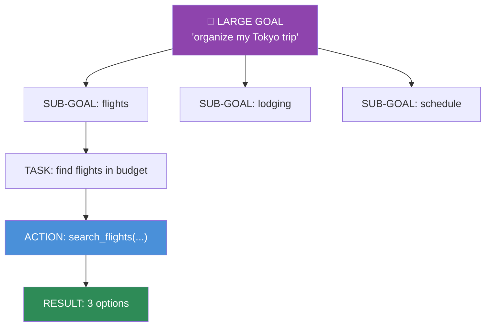
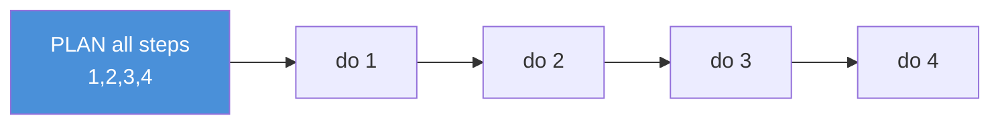
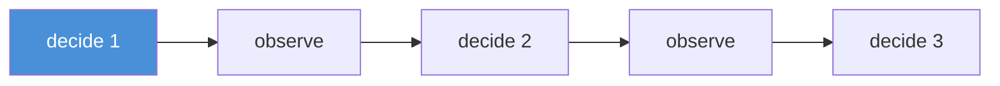
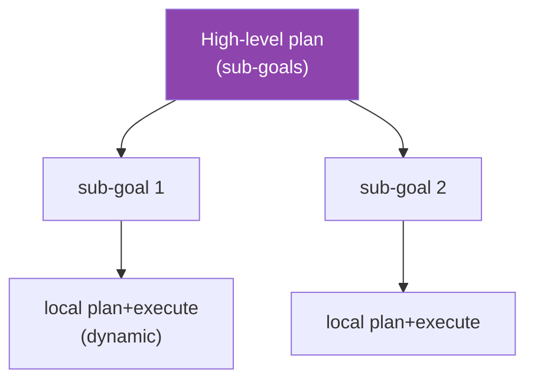
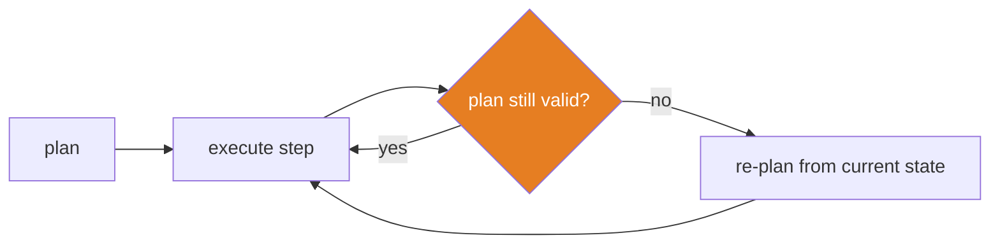

# 14.3 · Planning

[⬅ 14.2 Agent Architecture](14.2-agent-architecture.md) · [🏠 Module 14](../README.md) · [➡ 14.4 Tool Calling](14.4-tool-calling.md)

> **The lesson in one line:** Planning is how an agent turns a big, vague goal into an ordered set of executable actions — by **decomposing the goal into sub-goals into tasks into tool calls** — and the key design decision is *when* to plan: all up front (static), one step at a time (dynamic), or in layers (hierarchical).

---

## 🎯 Learning objectives

- Decompose a goal: **large goal → sub-goals → tasks → actions → results**.
- Distinguish **sequential, dynamic, and hierarchical** planning.
- Choose a planning strategy by task structure and predictability.
- Handle **re-planning** when reality diverges from the plan.

## ✅ Prerequisites

- [14.2 agent loop](14.2-agent-architecture.md), [12.7 reasoning](../../12-Prompt-Engineering/weeks/12.7-reasoning.md), [12.8 chaining](../../12-Prompt-Engineering/weeks/12.8-prompt-chaining.md).

---

## 🧠 Mental model

> [!IMPORTANT]
> **A goal like "organize my trip to Tokyo" is not executable — no single tool does it. Planning is the bridge from an abstract goal to concrete, callable actions.** The agent recursively breaks the goal down until each leaf is something a *tool* can actually do (search flights, check calendar, book hotel). The open question is *how much to plan before acting*: plan everything first and you're fast but brittle (reality diverges); plan one step at a time and you're adaptive but can lose the thread. **Planning is decomposition + a choice about when to commit.**



---

## Decomposition: goal → sub-goal → task → action → result

| Level | Example | Who executes |
|---|---|---|
| **Goal** | "organize my Tokyo trip" | the agent (plans) |
| **Sub-goal** | "book flights within $1200" | the agent (plans) |
| **Task** | "compare flights on 3 dates" | the agent (sequences) |
| **Action** | `search_flights(dest, dates)` | a **tool** ([14.4](14.4-tool-calling.md)) |
| **Result** | observation fed back to the agent | the loop ([14.2](14.2-agent-architecture.md)) |

**Good decomposition stops at the level of available tools.** Decompose until each leaf maps to one tool call; no finer, no coarser. If a leaf has no tool, that's a capability gap to fill.

---

## Planning strategies

### Sequential (static) planning
Make the **full plan up front**, then execute steps in order.


**Best for:** tasks with a clear, stable structure. **Weakness:** the plan is made *before* seeing any results — if step 2 surprises you, steps 3–4 may be wrong.

### Dynamic planning
Plan **one step at a time**, using each observation to decide the next (this is ReAct, [14.2](14.2-agent-architecture.md)).


**Best for:** open-ended, unpredictable tasks. **Weakness:** can wander or lose sight of the overall goal; needs budgets.

### Hierarchical planning
Plan in **layers**: a high-level planner sets sub-goals; a lower level plans/executes each. Combines a stable structure with local adaptivity.


**Best for:** complex tasks with clear phases but uncertain details. Maps naturally onto **multi-agent** systems ([14.8](14.8-multi-agent.md)) — a coordinator plans, workers execute.

| Strategy | Plan when | Adaptivity | Best for |
|---|---|---|---|
| **Sequential** | all up front | low | stable, well-understood tasks |
| **Dynamic** | each step | high | open-ended, unpredictable tasks |
| **Hierarchical** | layered | medium–high | complex tasks with phases |

> [!IMPORTANT]
> **The core trade-off: commitment vs adaptivity.** Static plans are efficient and legible but brittle when reality diverges. Dynamic plans adapt but risk wandering and cost more (a decision every step). **Plan-and-execute *with re-planning*** is the pragmatic middle: make a plan, execute, and **re-plan when an observation invalidates it.** Match the strategy to how predictable the task is.

---

## Re-planning

A plan is a hypothesis; observations test it. When a step fails or reveals new information, the agent should **revise the plan**, not blindly continue.



Triggers to re-plan: a tool failed, a result contradicts an assumption, the goal changed, or the agent is looping without progress ([14.6](14.6-reflection.md)).

---

## 🏭 Production examples

| Task | Planning strategy |
|---|---|
| Fixed multi-step report generation | sequential |
| Debugging / research (path unknown) | dynamic (ReAct) |
| "Build a feature": design → implement → test | hierarchical + re-planning |
| Data pipeline agent | sequential with re-plan on error |
| Multi-agent research | hierarchical (coordinator + workers, [14.8](14.8-multi-agent.md)) |

## ⚡ Performance considerations

- **Planning costs LLM calls.** Static planning pays once; dynamic pays every step — but static may waste steps executing a stale plan. Measure end-to-end ([14.14](14.14-evaluation.md)).
- **Good planning reduces total steps** (the biggest latency/cost lever, [14.2](14.2-agent-architecture.md)) — a strong planner that avoids dead ends beats a cheap one that wanders.
- **Parallelize independent sub-goals** where the plan is a DAG, not a chain.

## 🔒 Security considerations

> [!CAUTION]
> - **Plans built from untrusted observations can be poisoned** — an injected instruction in a tool result can insert a malicious step ([12.16](../../12-Prompt-Engineering/weeks/12.16-security.md)). Keep observations as data; constrain which actions a plan may contain.
> - **Bound the plan** — cap the number of steps and the tools a plan may use; a runaway plan is a runaway agent ([14.13](14.13-safety.md)).
> - **High-impact planned actions need approval** ([14.12](14.12-human-in-the-loop.md)).

## 🚫 Common mistakes

| Mistake | Consequence |
|---|---|
| Decomposing past the tool level | Over-planning; steps with no executor |
| Static plan, never re-planning | Executes a stale plan into failure |
| Dynamic planning with no goal anchor | Wanders; loses the overall objective |
| No progress check | Loops without advancing ([14.6](14.6-reflection.md)) |
| Ignoring dependencies | Executes steps out of order |
| Unbounded plans | Runaway cost/actions |

## ✅ Best practices

- **Decompose to the tool level** — each leaf is one callable action.
- **Prefer plan-and-execute with re-planning** for structured-but-uncertain tasks.
- **Anchor dynamic planning to the goal** — re-state the goal each step so the agent doesn't drift.
- **Detect no-progress and re-plan** rather than repeating failing actions.
- **Bound plans** (steps, tools) and gate high-impact steps.

## 🏋️ Exercises

1. **Decompose.** Take "publish a blog post from my notes" and decompose to the tool level; identify any capability gaps.
2. **Three strategies.** Solve one task with sequential, dynamic, and hierarchical planning; compare steps, cost, and robustness.
3. **Re-plan trigger.** Build an agent that re-plans when a tool fails; show it recovers vs a static plan that doesn't.
4. **Goal anchoring.** Make a dynamic agent drift off-goal, then fix it by re-stating the goal each step.
5. **Parallel plan.** Find a task whose sub-goals are independent; execute them in parallel and measure the speedup.

## 🛠️ Mini project — "Planner module"

**Goal:** a planner that decomposes goals and supports sequential, dynamic, and hierarchical modes with re-planning.

**Requirements:** goal → sub-goals → tasks → actions decomposition (to the tool level); pluggable strategy; re-plan on failure/no-progress; a plan representation (DAG) that allows parallel independent steps.

**Folder structure**
```
planner/
├── decompose.py    # goal → tool-level actions
├── strategies.py   # sequential / dynamic / hierarchical
├── replan.py       # triggers + re-planning
└── plan.py         # DAG representation + execution order
```

**Testing:** decomposition stops at tool level; re-plan fires on failure; independent steps parallelize; goal stays anchored.
**Evaluation:** steps-to-completion and success rate per strategy ([14.14](14.14-evaluation.md)).
**Security:** bounded plans; observation-derived steps constrained.
**Future improvements:** cost-aware planning; learned decomposition from past tasks.

## 📄 Cheat sheet

| Concept | One line |
|---|---|
| **Planning** | goal → sub-goals → tasks → **actions (tool calls)** → results |
| **Decompose to** | the tool level — each leaf is one callable action |
| **Sequential** | plan all up front; fast, brittle |
| **Dynamic (ReAct)** | plan each step from observations; adaptive, can wander |
| **Hierarchical** | layered: high-level sub-goals + local execution |
| **⭐ Trade-off** | commitment (static) vs adaptivity (dynamic) |
| **⭐ Pragmatic default** | plan-and-execute **with re-planning** |
| **Re-plan when** | a step fails, an assumption breaks, or no progress |

## 🎴 Flashcards

- **What is agent planning?** → Decomposing a goal into sub-goals, tasks, and finally tool-callable actions, then sequencing them.
- **How far should you decompose?** → To the tool level — until each leaf maps to one available tool call.
- **⭐ Sequential vs dynamic vs hierarchical planning?** → Plan-all-up-front (fast, brittle) vs plan-each-step (adaptive, can wander) vs layered high-level+local (structure + adaptivity).
- **⭐ The core planning trade-off?** → Commitment vs adaptivity; the pragmatic middle is plan-and-execute with re-planning.
- **When should an agent re-plan?** → When a step fails, an observation contradicts an assumption, the goal changes, or it's looping without progress.
- **Why does good planning improve performance?** → It reduces total steps — the biggest latency/cost lever — by avoiding dead ends.

## 💬 Interview questions

1. Walk through decomposing a vague goal into executable actions. Where do you stop?
2. Compare sequential, dynamic, and hierarchical planning with examples.
3. What is the commitment-vs-adaptivity trade-off, and how does re-planning resolve it?
4. When and how should an agent re-plan?
5. How does hierarchical planning relate to multi-agent systems?
6. What are the security risks of planning over untrusted observations?

## 📝 Summary

- **Planning bridges an abstract goal to callable actions** by decomposing **goal → sub-goals → tasks → actions → results**, stopping at the tool level.
- The strategies — **sequential** (plan up front), **dynamic** (plan each step), **hierarchical** (layered) — trade **commitment against adaptivity**; the pragmatic default is **plan-and-execute with re-planning**.
- **Re-plan** when steps fail, assumptions break, or progress stalls; **anchor dynamic planning to the goal** to prevent drift.
- Good planning **reduces total steps** (the main cost lever), and hierarchical planning maps naturally onto **multi-agent** systems ([14.8](14.8-multi-agent.md)).

## 📚 References

1. **Wang et al. (2023) — _Plan-and-Solve Prompting_.** ⭐ Plan then execute.
2. **Yao et al. (2022) — _ReAct_.** Dynamic step-by-step planning.
3. **Shinn et al. (2023) — _Reflexion_.** Re-planning via self-feedback.
4. **[12.8 Prompt Chaining](../../12-Prompt-Engineering/weeks/12.8-prompt-chaining.md).** Static decomposition analog.

---

## 🧭 Navigation

| Direction | Link |
|---|---|
| ⬅ Previous | [14.2 · Agent Architecture](14.2-agent-architecture.md) |
| ➡ Next | [14.4 · Tool Calling](14.4-tool-calling.md) |
| 🏠 Module | [Module 14](../README.md) |
| 📖 Lessons | [Lesson index](README.md) |
