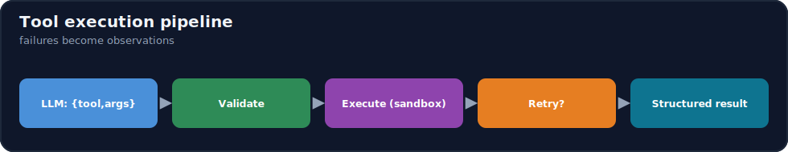
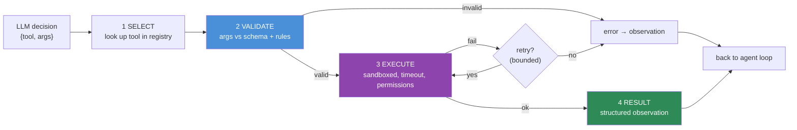

# 14.4 · Tool Calling

[⬅ 14.3 Planning](14.3-planning.md) · [🏠 Module 14](../README.md) · [➡ 14.5 Agent Memory](14.5-memory.md)

> **The lesson in one line:** Tools are the agent's hands — everything it can *do* comes from them — so a production agent needs a robust **tool-execution pipeline**: a clear schema the model calls, strict argument validation, sandboxed execution, structured results, and disciplined error handling with bounded retries.



---

## 🎯 Learning objectives

- Design **tool schemas** that the model uses correctly.
- Build a **tool-execution pipeline**: select → validate → execute → observe.
- Handle **errors and retries** so failures become recoverable observations.
- Return **structured results** the agent can reason over.

## ✅ Prerequisites

- [12.12 tool & function calling](../../12-Prompt-Engineering/weeks/12.12-tool-calling.md) — the foundation. [14.2 agent loop](14.2-agent-architecture.md).

---

## 🧠 Mental model

> [!IMPORTANT]
> **An agent's capabilities are *exactly* its tools — nothing more.** The LLM can *decide* to do anything, but it can only *do* what a tool lets it. So the tool layer is where capability, reliability, and safety all live. Building on [12.12](../../12-Prompt-Engineering/weeks/12.12-tool-calling.md): the model emits a structured **call** (tool name + arguments); your **pipeline** validates the arguments, executes the tool safely, and returns a structured **result** as the next observation. In an agent this happens **every loop step, many times**, so the pipeline must be robust: bad arguments, tool failures, and timeouts are *normal*, not exceptional, and must be handled as recoverable observations — not crashes.



---

## Tool schema design

A tool is defined by **name + description + argument JSON-Schema** — this *is* the model's instruction for when and how to call it ([12.12](../../12-Prompt-Engineering/weeks/12.12-tool-calling.md)).

```python
@dataclass
class Tool:
    name: str
    description: str          # WHEN to use it + what it does (the "prompt" for the tool)
    schema: dict              # JSON-Schema of arguments (types, enums, required)
    permission: str           # "read" | "write" | "dangerous" (for safety, 14.13)
    handler: Callable         # your code that runs it

search = Tool(
    name="search_orders",
    description="Look up a customer's orders by order ID. Use ONLY when the user "
                "references a specific order; do not use for general questions.",
    schema={"type":"object",
            "properties":{"order_id":{"type":"string","pattern":"^ORD-[0-9]{5}$"}},
            "required":["order_id"]},
    permission="read",
    handler=lambda order_id: db.get_orders(order_id),
)
```

**Schema design rules:**
- **Precise descriptions** with *when to use / when not to* — the top lever for correct selection.
- **Constrain arguments** (types, enums, patterns) — the schema is your first validation layer.
- **Few, well-named tools** beat many overlapping ones (too many confuses selection).
- **Tag a permission level** for the safety layer ([14.13](14.13-safety.md)).

---

## The execution pipeline

```python
def execute_tool(decision, registry, retries=2):
    tool = registry.get(decision.tool)
    if tool is None:
        return Observation(ok=False, error=f"unknown tool: {decision.tool}")

    # 2 · validate (never trust model-generated args)
    try:
        args = validate(tool.schema, decision.args)      # types/enums/required + business rules
    except ValidationError as e:
        return Observation(ok=False, error=f"invalid args: {e}")   # recoverable

    check_permission(tool, current_context)              # 14.13 (least privilege)

    # 3 · execute with timeout + sandbox, bounded retries for transient failures
    for attempt in range(retries + 1):
        try:
            result = run_sandboxed(tool.handler, args, timeout=TOOL_TIMEOUT)
            return Observation(ok=True, data=structured(result))     # 4 · structured result
        except TransientError as e:
            if attempt == retries:
                return Observation(ok=False, error=f"failed after retries: {e}")
            backoff(attempt)                             # exponential backoff
        except PermanentError as e:
            return Observation(ok=False, error=str(e))   # don't retry permanent failures
```

> [!IMPORTANT]
> **Every outcome — success, invalid arguments, tool failure, timeout — returns an *observation*, never an exception that crashes the loop.** The agent's whole ability to recover ([14.6](14.6-reflection.md)) depends on *seeing* what went wrong. A validation error becomes "invalid args: order_id must match ORD-#####", which the model reads next step and corrects. **Turn failures into feedback.**

---

## Error handling and retries

| Failure | Handling |
|---|---|
| **Invalid arguments** | validation error → observation; model corrects (don't retry the same args) |
| **Transient** (network, rate limit, timeout) | **bounded retries with backoff**; then give up gracefully |
| **Permanent** (404, permission denied, bad request) | no retry — return the error as an observation |
| **Unknown tool** | error observation; model picks a valid tool |
| **Tool crash / exception** | catch, sanitize, return as error observation (never leak stack traces to the model or user) |

> [!WARNING]
> **Bound retries and distinguish transient from permanent failures.** Retrying a permanent error (bad arguments, 403) wastes calls and can loop forever; not retrying a transient one (a flaky network) fails needlessly. Use **exponential backoff** for transient failures and a **retry cap** — and remember retries multiply cost and latency ([14.14](14.14-evaluation.md)).

---

## Structured results

Return results the agent can *reason over*, not raw dumps. A 500-line API response should become a concise, relevant structure ([14.10](14.10-context-engineering.md)) — otherwise it floods the context, buries the signal, and balloons cost. Include a status, the key data, and (on failure) a clear reason.

---

## 🏭 Production examples

| Tool type | Pipeline emphasis |
|---|---|
| Read APIs (search, lookup) | validation + concise structured results |
| Write actions (email, DB write) | permission gate + human approval ([14.12](14.12-human-in-the-loop.md)) |
| Code execution | strong sandbox + timeout ([14.13](14.13-safety.md)) |
| Flaky external APIs | retries + backoff + circuit breaker |
| RAG retriever as a tool | rerank/trim results before returning ([13.8](../../13-RAG/weeks/13.8-reranking.md)) |

## ⚡ Performance considerations

- **Tool latency + retries dominate step time** — set aggressive timeouts, cache idempotent calls, and **parallelize independent tool calls** where the model requests several.
- **Bloated results explode context cost** — trim/summarize before returning ([14.10](14.10-context-engineering.md)).
- **Cap retries** — they multiply latency and spend.

## 🔒 Security considerations

> [!CAUTION]
> - **Tool arguments are untrusted model output** — validate against schema *and* business rules; **never** pass them unsanitized into SQL/shell/eval/file paths/URLs ([12.16](../../12-Prompt-Engineering/weeks/12.16-security.md)).
> - **Least privilege + permission tiers** — read-only by default; write/dangerous tools gated and approved ([14.13](14.13-safety.md), [14.12](14.12-human-in-the-loop.md)).
> - **Sandbox execution** (esp. code/shell) with timeouts and resource limits.
> - **Tool results are untrusted data** — they re-enter the context and can carry injection that hijacks the next decision; keep them as data.
> - **Sanitize errors** — don't leak secrets or stack traces into observations.

## 🚫 Common mistakes

| Mistake | Consequence |
|---|---|
| Executing args without validation | Injection, crashes, data loss |
| Unbounded retries | Loops, runaway cost |
| Retrying permanent failures | Wasted calls; never succeeds |
| Returning raw/huge results | Context flood, cost blow-up |
| Crashing the loop on tool failure | No recovery; agent dies |
| Too many overlapping tools | Poor selection |
| Leaking stack traces to the model/user | Info disclosure |

## ✅ Best practices

- **Validate every argument**; treat model output as untrusted.
- **Failures → observations**, always; never crash the loop.
- **Distinguish transient vs permanent**; bounded backoff retries only for transient.
- **Return concise structured results**; trim before they hit the context.
- **Tag permissions**, sandbox dangerous tools, gate writes.
- **Keep the toolset small and well-described.**

## 🏋️ Exercises

1. **Pipeline.** Build select→validate→execute→observe with three tools; confirm bad args become recoverable observations.
2. **Retry logic.** Simulate transient vs permanent failures; verify backoff retries the former and not the latter, with a cap.
3. **Injection defense.** Feed a malicious argument (path traversal / SQL) ; show validation blocks it before execution.
4. **Result trimming.** Return a huge API payload; trim it to the relevant fields; measure context/cost reduction.
5. **Sandbox.** Run a code-execution tool with a timeout and resource limit; show it can't hang or escape.

## 🛠️ Mini project — "Tool execution pipeline"

**Goal:** a robust, reusable tool layer for agents.

**Requirements:** tool registry (name/description/schema/permission/handler); argument validation (schema + rules); sandboxed execution with timeout; transient/permanent error classification + bounded backoff retries; structured, trimmed results; permission checks; call logging.

**Folder structure**
```
tool-pipeline/
├── registry.py     # tools + schemas + permissions
├── validate.py     # args vs schema + business rules
├── execute.py      # sandbox + timeout + retries/backoff
├── result.py       # structured, trimmed observations
└── audit.py        # log every call + outcome
```

**Testing:** invalid args rejected pre-execution; transient retried, permanent not; sandbox enforces timeout; results trimmed; writes require permission.
**Evaluation:** tool success rate, retry rate, avg result size ([14.14](14.14-evaluation.md)).
**Security:** validation, least privilege, sandbox, sanitized errors ([14.13](14.13-safety.md)).
**Monitoring:** per-tool call counts/latency/failure rate.
**Future improvements:** circuit breakers; parallel calls; MCP tools ([14.9](14.9-mcp.md)).

## 📄 Cheat sheet

| Concept | One line |
|---|---|
| **⭐ Tools = the agent's capabilities** | it can only *do* what a tool allows |
| **Schema** | name + description (when to use) + arg JSON-Schema + permission |
| **Pipeline** | select → **validate** → execute (sandbox/timeout) → structured result |
| **⭐ Failures → observations** | never crash the loop; feedback enables recovery |
| **Retries** | transient only, bounded, with backoff; not permanent |
| **Results** | concise + structured; trim before context |
| **⭐ Security** | validate args, least privilege, sandbox, results-as-data |

## 🎴 Flashcards

- **⭐ Why is the tool layer so important in an agent?** → An agent can only *do* what its tools allow — capability, reliability, and safety all live in the tool layer.
- **What defines a tool?** → Name + description (when/how to use) + argument JSON-Schema + permission tier + handler.
- **⭐ What should happen when a tool call fails?** → It becomes a structured error *observation* the agent can read and recover from — never a crash of the loop.
- **How do you handle retries?** → Bounded exponential backoff for *transient* failures only; don't retry permanent failures (bad args, 403).
- **Why validate tool arguments?** → They're untrusted model output; unvalidated args into SQL/shell/paths are an injection/damage vector.
- **Why return structured, trimmed results?** → Raw/huge results flood the context, bury the signal, and balloon cost.
- **What permission should tools default to?** → Read-only; write/dangerous tools are gated and often require human approval.

## 💬 Interview questions

1. Design a tool-execution pipeline for an agent. What are its stages?
2. Why must every tool outcome become an observation rather than an exception?
3. How do you handle retries, and how do transient and permanent failures differ?
4. Why validate arguments, and what attacks does it prevent?
5. How do bloated tool results hurt an agent, and how do you fix it?
6. How do permission tiers and sandboxing fit into the pipeline?

## 📝 Summary

- **Tools are the agent's hands** — its capabilities are exactly its tools — so the tool layer carries capability, reliability, and safety.
- A production **execution pipeline** does select → **validate args** → execute (sandboxed, timed) → return a **structured, trimmed result**, with every outcome (success, bad args, failure) becoming a **recoverable observation**.
- **Bound retries** and split **transient (retry with backoff) vs permanent (don't)**; **trim results** so they don't flood context.
- **Security is non-negotiable**: validate arguments, apply least privilege/permission tiers, sandbox dangerous tools, and treat results as untrusted data ([14.13](14.13-safety.md)).

## 📚 References

1. **[12.12 Tool & Function Calling](../../12-Prompt-Engineering/weeks/12.12-tool-calling.md).** ⭐ The mechanism.
2. **Anthropic — _Building Effective Agents_ (tool design).** Concise tools, clear descriptions.
3. **[14.13 Agent Safety](14.13-safety.md).** Least privilege, sandboxing.
4. **[14.9 MCP](14.9-mcp.md).** Standardized tool exposure.

---

## 🧭 Navigation

| Direction | Link |
|---|---|
| ⬅ Previous | [14.3 · Planning](14.3-planning.md) |
| ➡ Next | [14.5 · Agent Memory](14.5-memory.md) |
| 🏠 Module | [Module 14](../README.md) |
| 📖 Lessons | [Lesson index](README.md) |
