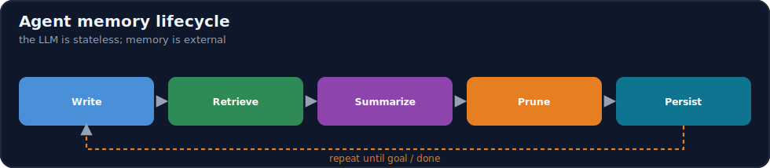
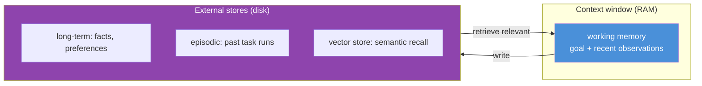
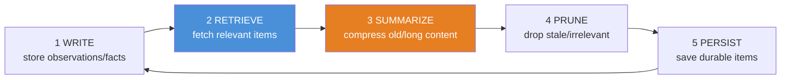

# 14.5 · Agent Memory ⭐

[⬅ 14.4 Tool Calling](14.4-tool-calling.md) · [🏠 Module 14](../README.md) · [➡ 14.6 Reflection](14.6-reflection.md)

> **The lesson in one line:** An LLM is stateless — it remembers nothing between calls — so an agent's "memory" is an **external system you build**: a fast **working memory** for the current task, a durable **long-term store** (often vector-based) for facts and past episodes, and a **lifecycle** (write → retrieve → summarize → prune) that keeps the right information in the finite context window.



---

## 🎯 Learning objectives

- Distinguish memory types: **short-term/working, long-term, semantic, episodic, vector, conversation**.
- Design the **memory lifecycle**: write → retrieve → summarize → prune → persist.
- Manage memory within the **context window** across long tasks.
- Choose what to remember, retrieve, and forget.

## ✅ Prerequisites

- [14.2 agent loop](14.2-agent-architecture.md), [13.5 embeddings/vector search](../../13-RAG/weeks/13.5-embeddings-similarity.md), [12.11 context engineering](../../12-Prompt-Engineering/weeks/12.11-context-engineering.md).

---

## 🧠 Mental model

> [!IMPORTANT]
> **The LLM has no memory — every call is a blank slate that only sees what's in its context window ([12.1](../../12-Prompt-Engineering/weeks/12.1-how-llms-interpret-prompts.md)). So "agent memory" is an illusion you engineer** by storing information outside the model and *putting the relevant pieces back into the context* on each call. Think of the context window as the agent's **RAM (small, fast, volatile)** and your external stores as its **disk (large, durable, slow)**. Memory management is the constant shuffle: keep the current task's state in the window, offload the rest to stores, and retrieve back what's relevant. **Without memory an agent can't do multi-step tasks; with unmanaged memory it overflows the window.**



---

## The memory types

| Type | Scope | Holds | Backed by |
|---|---|---|---|
| **Short-term / working** | current task | goal, recent actions & observations | the context window / a buffer |
| **Long-term** | across tasks/sessions | durable facts, user preferences | database / vector store |
| **Semantic** | knowledge | facts and concepts ("Paris is in France") | vector store / KB ([13](../../13-RAG/README.md)) |
| **Episodic** | experiences | records of past task runs ("last time I did X, Y happened") | database / vector store |
| **Vector memory** | retrieval mechanism | embeddings of anything, for similarity recall | vector DB ([13.6](../../13-RAG/weeks/13.6-vector-databases.md)) |
| **Conversation** | dialogue | the message history | buffer + summary |

> [!IMPORTANT]
> **These aren't rival implementations — they're roles.** Working memory (the loop's observation log, [14.2](14.2-agent-architecture.md)) is *always* present. Long-term memory persists across runs. **Semantic** vs **episodic** is a distinction of *content* — general facts vs specific past experiences — both usually **retrieved via a vector store** (the "vector memory" mechanism). Conversation memory is a specialized working memory for chat. A real agent uses several at once: working memory for the current step, vector-backed long-term for recall.

---

## The memory lifecycle



### 1. Write
Decide **what's worth storing**: task observations (working), useful facts/preferences (long-term), the outcome of a run (episodic). Not everything — writing noise pollutes future retrieval.

### 2. Retrieve
Pull the **relevant** memories into context for the current step — recent observations (working) plus semantically similar long-term items (vector search, [13.7](../../13-RAG/weeks/13.7-retrieval.md)). Retrieval is the same problem as RAG: relevance ranking into a finite window.

### 3. Summarize
When the task's history exceeds the window, **compress** it — replace a long run of observations with a running summary ("so far: found 3 flights, user prefers morning"). Summarization is how agents survive long tasks ([14.10](14.10-context-engineering.md)).

### 4. Prune
**Forget** what's stale, redundant, or wrong. Old observations that no longer matter, superseded facts, duplicates. Unpruned memory grows unbounded and degrades retrieval (more noise).

### 5. Persist
Save durable items (long-term facts, episodic records) to a store that survives the process, so the agent can recall across sessions.

---

## 💻 A memory system sketch

```python
class AgentMemory:
    def __init__(self, vector_store, llm):
        self.working = []                 # current-task observations (RAM)
        self.store = vector_store         # long-term / semantic / episodic (disk)
        self.llm = llm

    def write(self, item, durable=False):
        self.working.append(item)
        if durable:
            self.store.upsert(embed(item), item, meta={"type": item.kind})

    def context(self, goal, query, budget_tokens):
        recent = self.working[-K:]                          # working memory
        recalled = self.store.search(embed(query), top_k=5) # vector recall (13.7)
        history = self._maybe_summarize(self.working[:-K])  # summarize old (14.10)
        return fit(budget_tokens, [goal, history, *recalled, *recent])   # assemble within window

    def _maybe_summarize(self, old):
        if tokens(old) > SUMMARY_THRESHOLD:
            return self.llm.summarize(old)                   # compress
        return old
```

**Working memory is a list; long-term memory is a vector store; the `context()` method is the retrieve+summarize+fit step** run every loop iteration. This is where memory meets [context engineering (14.10)](14.10-context-engineering.md).

---

## 🏭 Production examples

| Agent | Memory design |
|---|---|
| Personal assistant | long-term user preferences (durable) + conversation summary |
| Coding agent | working memory of files/edits + episodic "past fixes" |
| Research agent | working memory of findings + summarize as it goes |
| Support agent | customer history (long-term) + current-ticket working memory |
| Long-running task planner | aggressive summarization + episodic checkpoints |

## ⚡ Performance considerations

- **Working memory grows every step** → context cost grows super-linearly. **Summarize** aggressively on long tasks ([14.10](14.10-context-engineering.md)).
- **Retrieval adds latency** (embedding + vector search) but is far cheaper than stuffing everything — retrieve, don't dump.
- **Prune** to keep the vector store small and retrieval sharp (noise hurts recall, [13.4](../../13-RAG/weeks/13.4-chunking.md)).
- **Cache** embeddings of stable memories.

## 🔒 Security considerations

> [!CAUTION]
> - **Memory is a persistence surface for sensitive data** — user PII, secrets seen in observations. Encrypt at rest, scope by user/tenant, and support deletion ([14.13](14.13-safety.md), [13.14](../../13-RAG/weeks/13.14-security.md)).
> - **Memory poisoning** — an attacker who gets malicious text written to long-term memory can influence *future* runs (a persistent injection). Validate/scope what gets written; treat recalled memory as untrusted data.
> - **Cross-user leakage** — never retrieve one user's memories into another's context; partition by tenant.

## 🚫 Common mistakes

| Mistake | Consequence |
|---|---|
| Treating context as the only memory | Agent forgets across sessions; can't do long tasks |
| Never summarizing | Context overflow on long tasks |
| Writing everything | Noisy store → bad retrieval |
| Never pruning | Unbounded growth, degraded recall |
| Retrieving irrelevant memories | Distractors, lost-in-the-middle ([12.11](../../12-Prompt-Engineering/weeks/12.11-context-engineering.md)) |
| No tenant scoping | Cross-user data leakage |
| Trusting recalled memory as instructions | Persistent injection |

## ✅ Best practices

- **Separate working (RAM) from long-term (disk)**; always keep the goal + recent observations in context.
- **Retrieve relevant memories** (vector search), don't dump the whole store.
- **Summarize old history** and **prune** stale/duplicate items.
- **Persist durable facts/episodes**; scope everything by user/tenant.
- **Treat recalled memory as untrusted data**; validate writes.

## 🏋️ Exercises

1. **Working vs long-term.** Build an agent that keeps working memory in context and writes durable preferences to a store; show it recalls a preference in a new session.
2. **Summarize to survive.** Run a long task; add summarization when history exceeds a threshold; show it completes vs overflowing without.
3. **Vector recall.** Store episodic records; retrieve the most similar past episode for a new task; show it helps.
4. **Prune impact.** Fill the store with noise; measure retrieval quality before/after pruning.
5. **Poisoning defense.** Write a malicious "memory"; show that scoping/validation and treating recall as data prevents it from hijacking a future run.

## 🛠️ Mini project — "Agent memory system"

**Goal:** a memory subsystem with working + long-term stores and the full lifecycle.

**Requirements:** working-memory buffer; vector-backed long-term (semantic + episodic); write policy (what's durable); retrieve (relevance + recency); summarize on threshold; prune (stale/duplicate); persist; tenant scoping.

**Folder structure**
```
agent-memory/
├── working.py      # current-task buffer
├── longterm.py     # vector store: semantic + episodic
├── lifecycle.py    # write / retrieve / summarize / prune / persist
├── assemble.py     # fit into context window (14.10)
└── scope.py        # per-user/tenant partitioning
```

**Testing:** recall across sessions works; summarization prevents overflow; pruning improves retrieval; no cross-tenant recall.
**Evaluation:** task success on long tasks; retrieval relevance; context size over time.
**Security:** encryption, tenant scoping, write validation, recall-as-data ([14.13](14.13-safety.md)).
**Future improvements:** memory importance scoring; forgetting curves; reflection-driven memory writes ([14.6](14.6-reflection.md)).

## 📄 Cheat sheet

| Concept | One line |
|---|---|
| **⭐ LLM is stateless** | memory is an external system you build |
| **Window = RAM, stores = disk** | keep current task in context; offload the rest |
| **Working/short-term** | goal + recent observations (in context) |
| **Long-term** | durable facts/preferences (DB/vector) |
| **Semantic vs episodic** | general facts vs specific past experiences |
| **Vector memory** | embeddings for similarity recall (the mechanism) |
| **⭐ Lifecycle** | write → retrieve → **summarize** → prune → persist |
| **Long tasks** | summarize aggressively to fit the window |
| **⚠️ Poisoning** | recalled memory is untrusted; scope + validate writes |

## 🎴 Flashcards

- **⭐ Why does an agent need external memory?** → The LLM is stateless — it only sees the context window — so persistence across steps/sessions must be built as an external system.
- **Working (RAM) vs long-term (disk) memory?** → Working holds the current task's goal + recent observations in context; long-term persists facts/episodes in a store, retrieved back when relevant.
- **Semantic vs episodic memory?** → Semantic = general facts/knowledge; episodic = records of specific past task runs. Both are usually retrieved via a vector store.
- **⭐ What are the memory lifecycle stages?** → Write → retrieve → summarize → prune → persist.
- **How do agents survive long tasks within a finite window?** → Summarize old history into a running summary and prune stale items.
- **What is memory poisoning?** → An attacker writes malicious content to long-term memory to influence future runs — a persistent injection; defend by scoping/validating writes and treating recall as data.
- **Why prune memory?** → Unbounded growth balloons cost and adds noise that degrades retrieval quality.

## 💬 Interview questions

1. Why is agent memory necessarily external, and what's the RAM/disk analogy?
2. Distinguish working, long-term, semantic, episodic, and vector memory.
3. Walk through the memory lifecycle. Where does summarization fit and why?
4. How do agents manage memory to survive very long tasks?
5. What is memory poisoning, and how do you defend against it?
6. How does agent memory relate to RAG retrieval?

## 📝 Summary

- The LLM is **stateless**, so agent memory is an **external system**: the context window is **RAM** (working memory: goal + recent observations), and stores are **disk** (long-term, semantic, episodic — usually vector-backed).
- The **lifecycle** — write → retrieve → **summarize** → prune → persist — keeps the *relevant* information in the finite window; **summarization** is how agents survive long tasks and **pruning** keeps retrieval sharp.
- Memory retrieval is **the same problem as RAG** (relevance into a window), and unmanaged memory overflows the context or poisons future retrieval.
- **Secure it**: encrypt, scope by tenant, validate writes, and treat recalled memory as **untrusted data** (guard against persistent injection).

## 📚 References

1. **Park et al. (2023) — _Generative Agents_.** ⭐ Memory stream, retrieval, reflection.
2. **Packer et al. (2023) — _MemGPT_.** ⭐ Virtual-context / memory paging for LLMs.
3. **[13.5–13.7 Embeddings, Vector DBs, Retrieval](../../13-RAG/weeks/13.5-embeddings-similarity.md).** The recall mechanism.
4. **[12.11 Context Engineering](../../12-Prompt-Engineering/weeks/12.11-context-engineering.md).** Fitting memory into the window.

---

## 🧭 Navigation

| Direction | Link |
|---|---|
| ⬅ Previous | [14.4 · Tool Calling](14.4-tool-calling.md) |
| ➡ Next | [14.6 · Reflection](14.6-reflection.md) |
| 🏠 Module | [Module 14](../README.md) |
| 📖 Lessons | [Lesson index](README.md) |
