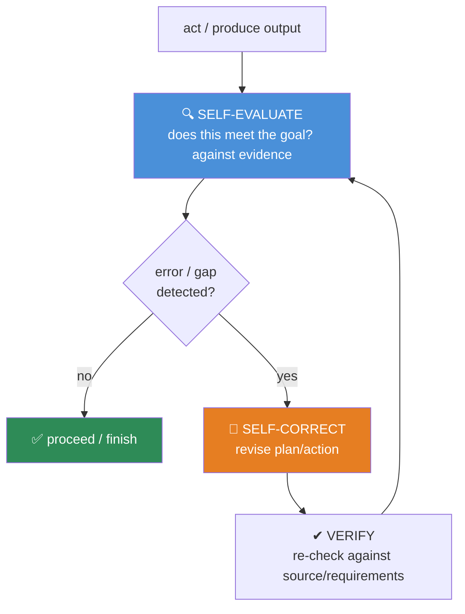
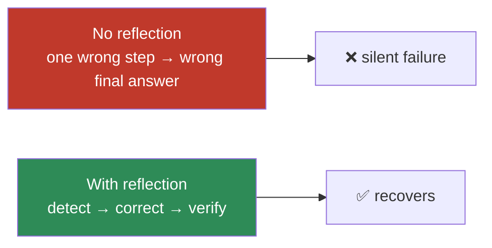

# 14.6 · Reflection

[⬅ 14.5 Agent Memory](14.5-memory.md) · [🏠 Module 14](../README.md) · [➡ 14.7 Agent Loops](14.7-agent-loops.md)

> **The lesson in one line:** Reflection is the agent looking at its own work and asking "did that actually succeed?" — a **self-evaluation → error-detection → correction → verification** loop that catches mistakes the agent would otherwise carry forward, turning a fragile one-shot actor into a system that recovers.

---

## 🎯 Learning objectives

- Understand reflection: **self-evaluation, error detection, self-correction, verification, iterative improvement**.
- Explain *why* reflection improves reliability (and when it doesn't).
- Add reflection to the agent loop without runaway cost.
- Distinguish **self-check** from **independent verification**.

## ✅ Prerequisites

- [14.2 agent loop](14.2-agent-architecture.md), [12.7 reasoning/verification](../../12-Prompt-Engineering/weeks/12.7-reasoning.md).

---

## 🧠 Mental model

> [!IMPORTANT]
> **Without reflection, an agent treats every tool result as success and every step as correct — so one wrong turn propagates to the end.** Reflection inserts a checkpoint: after acting (or before finishing), the agent evaluates *its own output against the goal and the evidence* — "Does this result actually answer the question? Did the tool do what I intended? Is there an error I should fix?" If not, it **corrects and retries** instead of forging ahead. This is the difference between an agent that fails silently and one that notices and recovers. **Reflection converts errors into another iteration of the loop.**



---

## The reflection components

| Component | Question | Example |
|---|---|---|
| **Self-evaluation** | Did my output meet the goal? | "Does this SQL answer the user's question?" |
| **Error detection** | What went wrong? | "The query returned 0 rows — wrong table?" |
| **Self-correction** | How do I fix it? | "Use `orders` not `order`; re-run." |
| **Verification** | Is the fix actually correct? | "Row count now matches expectation." |
| **Iterative improvement** | Repeat until good or budget hit | loop back |

---

## Why reflection improves reliability

An LLM's first attempt is a **single probabilistic sample** ([12.1](../../12-Prompt-Engineering/weeks/12.1-how-llms-interpret-prompts.md)) — often right, sometimes wrong, with no built-in error signal. Reflection adds that signal:

- **Errors become visible** — a tool error, an empty result, a failed test is *evidence* the agent can react to (this is why failures must be observations, [14.4](14.4-tool-calling.md)).
- **Second looks catch first-pass mistakes** — re-reading its own output against the goal surfaces gaps the agent rushed past.
- **Grounded checks beat confidence** — verifying against *the source/requirements/a test* (not "does it look right") catches real errors ([12.7](../../12-Prompt-Engineering/weeks/12.7-reasoning.md)).



> [!WARNING]
> **Reflection helps most when there's a *grounded* signal to reflect on — a test result, a tool error, a checkable constraint — and helps least when the agent only "grades its own homework."** Self-critique without external evidence can rationalize a wrong answer as fine, or reject a right one ([12.7](../../12-Prompt-Engineering/weeks/12.7-reasoning.md)). The strongest reflection is **verification against reality** (run the code, check the data, re-query the source), not vibes.

---

## Self-check vs verification

| | Self-check | Verification |
|---|---|---|
| **Method** | re-read own output vs goal | re-derive / test against external truth |
| **Strength** | catches obvious gaps, cheap | catches real errors, robust |
| **Example** | "did I answer all parts?" | run the generated code; check it passes |
| **Risk** | can rationalize | costs more (extra actions) |

Prefer **verification with a real signal** where one exists (code → run tests; data → check counts; retrieval → confirm the source supports the claim).

---

## Adding reflection to the loop (without runaway cost)

```python
def step_with_reflection(agent, state, max_retries=2):
    output = agent.act(state)
    for _ in range(max_retries):
        review = agent.reflect(output, goal=state.goal, evidence=state.observations)
        if review.ok:
            return output                       # verified good → proceed
        output = agent.correct(output, review.issues)   # fix using the critique
    return output                               # give up after bounded retries (don't loop forever)
```

> [!IMPORTANT]
> **Bound reflection like everything else in an agent.** Reflection is extra LLM calls (evaluate + correct + verify), so it **multiplies cost and latency** — cap the retries and reserve it for **high-stakes or failure-prone steps**, not every trivial action. A common pattern: act normally, but reflect at **decision points, before irreversible actions, and before finishing**.

---

## 🏭 Production examples

| Agent | Reflection use |
|---|---|
| Coding agent | run tests → read failures → fix → re-run (verification) |
| SQL agent | check query returns sane rows → correct table/joins |
| Research agent | "did I actually answer all sub-questions?" before finishing |
| Content agent | critique against a rubric → revise ([12.7](../../12-Prompt-Engineering/weeks/12.7-reasoning.md)) |
| Any agent | verify before an irreversible action ([14.12](14.12-human-in-the-loop.md)) |

## ⚡ Performance considerations

- **Reflection multiplies calls** (evaluate/correct/verify) — bound retries; apply selectively to risky steps.
- **Verification via tools** (run tests) adds tool latency but is the most reliable signal — worth it for correctness-critical agents.
- **Diminishing returns** — after 1–2 correction rounds, more reflection rarely helps; cap it.

## 🔒 Security considerations

> [!CAUTION]
> - **Reflect *before* irreversible or high-impact actions** — a verification/approval step before send/delete/pay is both a reliability and a safety control ([14.12](14.12-human-in-the-loop.md)).
> - **The critique reads the same untrusted observations** — an injected instruction can target the "reflector" too; keep evidence as data ([12.16](../../12-Prompt-Engineering/weeks/12.16-security.md)).
> - **Don't let reflection loop forever** — an unbounded correct/verify cycle is a runaway-cost/DoS risk.

## 🚫 Common mistakes

| Mistake | Consequence |
|---|---|
| No reflection at all | One wrong step → wrong final answer, silently |
| Self-critique with no grounded signal | Rationalized errors; false confidence |
| Reflecting on every trivial step | Runaway cost/latency |
| Unbounded correction loops | Never terminates |
| "Looks right" instead of verifying | Misses real errors |
| No reflection before irreversible actions | Unsafe, unrecoverable mistakes |

## ✅ Best practices

- **Prefer grounded verification** (tests, data checks, source confirmation) over pure self-critique.
- **Bound reflection** (max retries) and apply it **selectively** — decision points, risky/irreversible steps, before finishing.
- **Turn every failure into an observation** so the agent can reflect on it ([14.4](14.4-tool-calling.md)).
- **Reflect before high-impact actions** as a safety gate.

## 🏋️ Exercises

1. **Recover from error.** Build an agent that reflects on a failed tool call and corrects; compare success rate to a no-reflection version.
2. **Grounded vs self.** For a coding task, compare self-critique ("looks right") vs running tests; measure which catches real bugs.
3. **Bounded retries.** Add a correction cap; show it prevents an infinite correct/verify loop.
4. **Selective reflection.** Reflect only before finishing; compare cost and quality to reflecting every step.
5. **Pre-action gate.** Add a verification step before an irreversible action; show it blocks a wrong one.

## 🛠️ Mini project — "Reflective agent step"

**Goal:** a reusable reflection wrapper for agent steps.

**Requirements:** self-evaluation against goal+evidence; error detection; correction using the critique; verification (grounded where possible: run/check); bounded retries; selective application (risky/irreversible/finish steps).

**Folder structure**
```
reflection/
├── evaluate.py     # self-eval vs goal + evidence
├── correct.py      # revise using critique
├── verify.py       # grounded verification (tools)
└── wrap.py         # bounded, selective reflection wrapper
```

**Testing:** recovers from a seeded error; verification catches a wrong-but-plausible output; retries bounded; applied only to flagged steps.
**Evaluation:** success rate and cost with/without reflection ([14.14](14.14-evaluation.md)).
**Security:** pre-action gate; evidence-as-data; bounded loops.
**Future improvements:** learn which steps to reflect on; reflection-driven memory writes ([14.5](14.5-memory.md)).

## 📄 Cheat sheet

| Concept | One line |
|---|---|
| **Reflection** | self-evaluate → detect error → correct → verify → repeat |
| **Why it works** | adds an error signal to a single probabilistic attempt |
| **⭐ Grounded > self** | verify against tests/data/source, not "looks right" |
| **Self-check vs verify** | re-read own output vs re-derive against external truth |
| **⭐ Bound it** | cap retries; apply selectively (risky/irreversible/finish) |
| **Failures → observations** | so the agent can reflect on them |
| **Safety** | reflect/verify before irreversible actions |

## 🎴 Flashcards

- **What is agent reflection?** → A self-evaluation → error-detection → correction → verification loop where the agent checks its own work against the goal and evidence, and fixes mistakes instead of carrying them forward.
- **⭐ Why does reflection improve reliability?** → A first attempt is a single probabilistic sample with no error signal; reflection adds one (tool errors, failed tests, checks) so the agent can detect and recover.
- **⭐ When does reflection help most/least?** → Most with a grounded signal (test result, tool error, checkable constraint); least when it only "grades its own homework" and can rationalize.
- **Self-check vs verification?** → Self-check re-reads the output vs the goal; verification re-derives/tests against external truth — stronger.
- **Why must reflection be bounded?** → It's extra LLM calls; unbounded correct/verify loops run away in cost/latency and may never terminate.
- **Where is reflection also a safety control?** → Before irreversible/high-impact actions — verify (and often get human approval) first.

## 💬 Interview questions

1. What is reflection in an agent, and what are its components?
2. Why does reflection improve reliability, and when does it fail to?
3. Contrast self-check with grounded verification.
4. How do you add reflection without runaway cost?
5. Why is turning failures into observations a prerequisite for reflection?
6. How is reflection also a safety mechanism?

## 📝 Summary

- **Reflection** is the agent evaluating its own work — **self-evaluate → detect error → correct → verify** — so mistakes are caught and fixed instead of propagating to the final answer.
- It improves reliability by adding an **error signal** to a single probabilistic attempt; it works best with a **grounded** signal (a test, a tool error, a checkable constraint) and worst as pure self-critique.
- **Bound reflection** (capped retries) and apply it **selectively** — at decision points, before irreversible actions, and before finishing — because it multiplies cost.
- It depends on **failures being observations** ([14.4](14.4-tool-calling.md)) and doubles as a **safety gate** before high-impact actions ([14.12](14.12-human-in-the-loop.md)).

## 📚 References

1. **Shinn et al. (2023) — _Reflexion_.** ⭐ Verbal self-reflection to improve agents.
2. **Madaan et al. (2023) — _Self-Refine_.** Iterative critique-and-revise.
3. **Yao et al. (2022) — _ReAct_.** Observations enabling recovery.
4. **[12.7 Prompting for Reasoning](../../12-Prompt-Engineering/weeks/12.7-reasoning.md).** Verification vs rationalization.

---

## 🧭 Navigation

| Direction | Link |
|---|---|
| ⬅ Previous | [14.5 · Agent Memory](14.5-memory.md) |
| ➡ Next | [14.7 · Agent Loops](14.7-agent-loops.md) |
| 🏠 Module | [Module 14](../README.md) |
| 📖 Lessons | [Lesson index](README.md) |
