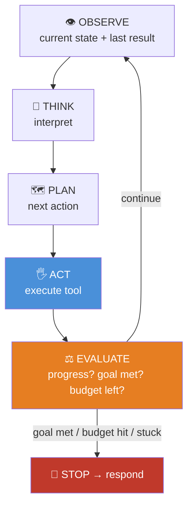
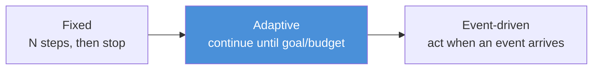

# 14.7 · Agent Loops

[⬅ 14.6 Reflection](14.6-reflection.md) · [🏠 Module 14](../README.md) · [➡ 14.8 Multi-Agent Systems](14.8-multi-agent.md)

> **The lesson in one line:** The loop is the agent's engine — **observe → think → plan → act → evaluate → repeat** — and the three design decisions that define an agent's behavior are *how it iterates* (fixed, adaptive, or event-driven) and, above all, *how it stops* (the termination condition and budget that keep autonomy from becoming a runaway).

---

## 🎯 Learning objectives

- Master the loop: **observe → think → plan → act → evaluate → repeat**.
- Compare **fixed, adaptive, and event-driven** loops.
- Design **termination conditions and budgets** (the most important safety control).
- Detect and break **degenerate loops** (no progress, oscillation).

## ✅ Prerequisites

- [14.2 agent architecture](14.2-agent-architecture.md), [14.6 reflection](14.6-reflection.md).

---

## 🧠 Mental model

> [!IMPORTANT]
> **An agent's autonomy is entirely defined by its loop: how it decides to keep going, and when it stops.** The stages (observe → think → plan → act → evaluate) are the "what it does each cycle"; the **loop control** — iterate again? stop now? — is the "how much autonomy it has." Get the control wrong and you have either a timid agent that quits too early or a runaway that loops forever burning money. **The termination condition is not an afterthought — it is the single most important design decision in the loop**, because a probabilistic decision-maker with no hard stop *will* eventually misbehave.



---

## Loop types

### Fixed loops
Run a **predetermined number of steps** (or a fixed sequence). Simple and predictable; you know the cost up front. But inflexible — wastes steps on easy tasks, quits early on hard ones.
**Use for:** well-bounded tasks where the step count is known.

### Adaptive loops
The agent **decides each iteration whether to continue** based on progress and whether the goal is met (ReAct-style, [14.2](14.2-agent-architecture.md)). Flexible — stops when done, continues when needed — but needs guardrails so "I'm not done yet" can't run forever.
**Use for:** open-ended tasks with unpredictable length. **The common default**, always paired with a hard budget.

### Event-driven loops
The agent **waits for external events** (a webhook, a message, a schedule, a human reply) and acts when they arrive, rather than looping continuously. The loop is *reactive*, not *busy*.
**Use for:** long-running agents, human-in-the-loop workflows ([14.12](14.12-human-in-the-loop.md)), monitoring, and multi-agent coordination ([14.8](14.8-multi-agent.md)).



| Loop | Iterates | Predictable cost | Best for |
|---|---|---|---|
| **Fixed** | N times | ✅ yes | bounded, known-length tasks |
| **Adaptive** | until goal/budget | ⚠️ bounded by budget | open-ended tasks (default) |
| **Event-driven** | on external events | depends on events | long-running, human-in-loop, reactive |

---

## Termination: the load-bearing control

An adaptive loop **must** stop for one of these reasons:

| Termination condition | Why |
|---|---|
| **Goal achieved** | the point — the agent decides it's done (verify it, [14.6](14.6-reflection.md)) |
| **Step budget hit** | `max_steps` — hard cap on iterations |
| **Cost/time budget hit** | token/dollar/wall-clock ceiling |
| **No progress** | N steps without advancing → stuck; stop or re-plan ([14.3](14.3-planning.md)) |
| **Repeated/oscillating actions** | same action twice, or A→B→A→B → break the cycle |
| **Fatal error** | unrecoverable failure → stop and report |

> [!IMPORTANT]
> **Never rely on the model alone to decide when to stop — enforce hard limits in code.** A probabilistic agent can convince itself it needs "just one more step" indefinitely, or oscillate between two actions forever. Your loop code must enforce `max_steps`, a cost budget, and **no-progress detection**, and stop even mid-task with a partial answer. **A good agent degrades gracefully at the budget, returning what it has, rather than running forever.**

### Detecting degenerate loops
```python
def is_stuck(history, window=3):
    recent = history[-window:]
    if len(set(map(action_key, recent))) == 1:      # same action repeated
        return True
    if oscillates(recent):                           # A,B,A,B pattern
        return True
    if no_new_information(recent):                   # observations add nothing
        return True
    return False
```

---

## 🏭 Production examples

| Agent | Loop design |
|---|---|
| Coding agent (edit→test→fix) | adaptive + `max_steps` + no-progress detection |
| Batch document processor | fixed (one pass per doc) |
| Monitoring/ops agent | event-driven (alerts trigger action) |
| Human-approval workflow | event-driven (waits for approval, [14.12](14.12-human-in-the-loop.md)) |
| Research agent | adaptive with a strict step + cost budget |

## ⚡ Performance considerations

- **Cost/latency scale with iterations** — the budget *is* your cost cap. Fewer, smarter steps (better planning, [14.3](14.3-planning.md)) beat many cheap ones.
- **Event-driven loops cost nothing while idle** — ideal for long-lived agents (no busy-waiting).
- **No-progress detection saves the most** — it kills expensive dead-end loops early.

## 🔒 Security considerations

> [!CAUTION]
> - **An unbounded loop is a DoS/cost-exhaustion vector** — hard budgets are a security control, not just a cost one ([14.13](14.13-safety.md)).
> - **Event-driven agents act on external triggers** — validate/authenticate events; a spoofed event could drive unwanted actions.
> - **Loop state is untrusted-input-influenced** — an injected observation could try to keep the loop going or steer termination; enforce limits in code regardless.

## 🚫 Common mistakes

| Mistake | Consequence |
|---|---|
| No hard step/cost budget | Runaway loops, huge bills |
| Trusting the model to stop | It doesn't, reliably |
| No no-progress/oscillation detection | Silent infinite loops |
| Fixed loop for open-ended tasks | Quits early or wastes steps |
| Busy-waiting instead of event-driven | Wasted cost while idle |
| Hard failure at budget (no partial answer) | Poor UX; loses work |

## ✅ Best practices

- **Adaptive loop + hard budget** is the default; always cap `max_steps` and cost.
- **Detect no-progress and oscillation**; stop or re-plan when stuck.
- **Degrade gracefully** — return the best partial result at the budget.
- **Use event-driven loops** for long-running / human-in-the-loop / reactive agents.
- **Verify goal-completion** ([14.6](14.6-reflection.md)) before declaring done.

## 🏋️ Exercises

1. **Budget enforcement.** Give an adaptive agent an impossible goal; confirm it stops at `max_steps` with a partial answer.
2. **Stuck detection.** Force an oscillation (A→B→A→B); implement detection that breaks it.
3. **Fixed vs adaptive.** Run an easy and a hard task under both; compare wasted vs insufficient steps.
4. **Event-driven.** Build an agent that waits for a webhook/message and acts on arrival; show zero cost while idle.
5. **Graceful degradation.** Make an agent return its best-so-far result when the cost budget is hit.

## 🛠️ Mini project — "Loop controller"

**Goal:** a reusable loop controller with pluggable iteration modes and robust termination.

**Requirements:** observe→think→plan→act→evaluate loop; fixed/adaptive/event-driven modes; termination on goal/step-budget/cost-budget/no-progress/oscillation; graceful partial-result return; per-iteration logging.

**Folder structure**
```
loop-controller/
├── loop.py         # the cycle + mode selection
├── terminate.py    # goal / budget / no-progress / oscillation
├── events.py       # event-driven mode
└── trace.py        # per-iteration log
```

**Testing:** budgets enforced; oscillation broken; partial result returned; event mode idles at zero cost.
**Evaluation:** steps-to-completion, budget-hit rate, stuck-detection rate ([14.14](14.14-evaluation.md)).
**Security:** hard limits; event authentication ([14.13](14.13-safety.md)).
**Monitoring:** iteration counts, termination reasons ([14.15](14.15-production-architecture.md)).
**Future improvements:** cost-aware early stopping; adaptive budgets by task difficulty.

## 📄 Cheat sheet

| Concept | One line |
|---|---|
| **Loop** | observe → think → plan → act → evaluate → repeat |
| **Fixed** | N steps; predictable; inflexible |
| **Adaptive** | continue until goal/budget (default); needs guardrails |
| **Event-driven** | act on external events; idle-cheap; reactive |
| **⭐ Termination** | goal · step budget · cost budget · no-progress · oscillation |
| **⭐ Rule** | enforce hard limits in **code**; never trust the model to stop |
| **Degrade gracefully** | return best partial result at the budget |
| **Stuck** | same/oscillating actions or no new info → stop/re-plan |

## 🎴 Flashcards

- **What are the agent loop stages?** → Observe → think → plan → act → evaluate → repeat.
- **⭐ Fixed vs adaptive vs event-driven loops?** → Fixed runs N steps (predictable, inflexible); adaptive continues until goal/budget (flexible, needs guardrails); event-driven acts on external events (reactive, idle-cheap).
- **⭐ What's the most important loop-control decision?** → The termination condition + budget — a probabilistic agent with no hard stop will eventually run away.
- **Why can't you trust the model to stop?** → It can rationalize "one more step" indefinitely or oscillate between actions; hard limits must live in code.
- **What termination conditions should an adaptive loop have?** → Goal achieved, step budget, cost/time budget, no-progress, oscillation, fatal error.
- **What does graceful degradation mean for an agent?** → Returning the best partial result when the budget is hit, rather than running forever or failing hard.
- **When are event-driven loops ideal?** → Long-running, human-in-the-loop, and reactive agents — they cost nothing while idle.

## 💬 Interview questions

1. Describe the agent loop and its stages.
2. Compare fixed, adaptive, and event-driven loops with use cases.
3. Why is the termination condition the most important loop decision?
4. How do you detect and break degenerate (no-progress/oscillating) loops?
5. Why must budgets be enforced in code rather than by the model?
6. How does an agent degrade gracefully at its budget?

## 📝 Summary

- The agent loop — **observe → think → plan → act → evaluate → repeat** — is the engine; its **iteration mode** (fixed / adaptive / event-driven) and **termination** define the agent's autonomy.
- **Adaptive + a hard budget is the default**; termination fires on goal, step budget, cost budget, **no-progress**, or **oscillation** — and must be enforced **in code**, never left to the model.
- **Event-driven loops** suit long-running, reactive, and human-in-the-loop agents (idle-cheap); **fixed loops** suit bounded tasks.
- **Unbounded loops are a cost and security hazard**; a good agent **degrades gracefully**, returning its best partial result at the budget.

## 📚 References

1. **Yao et al. (2022) — _ReAct_.** ⭐ The adaptive reason-act loop.
2. **Anthropic — _Building Effective Agents_.** Loop control and stopping.
3. **[14.2 Agent Architecture](14.2-agent-architecture.md).** The loop in code.
4. **[14.13 Agent Safety](14.13-safety.md).** Budgets as a safety control.

---

## 🧭 Navigation

| Direction | Link |
|---|---|
| ⬅ Previous | [14.6 · Reflection](14.6-reflection.md) |
| ➡ Next | [14.8 · Multi-Agent Systems](14.8-multi-agent.md) |
| 🏠 Module | [Module 14](../README.md) |
| 📖 Lessons | [Lesson index](README.md) |
