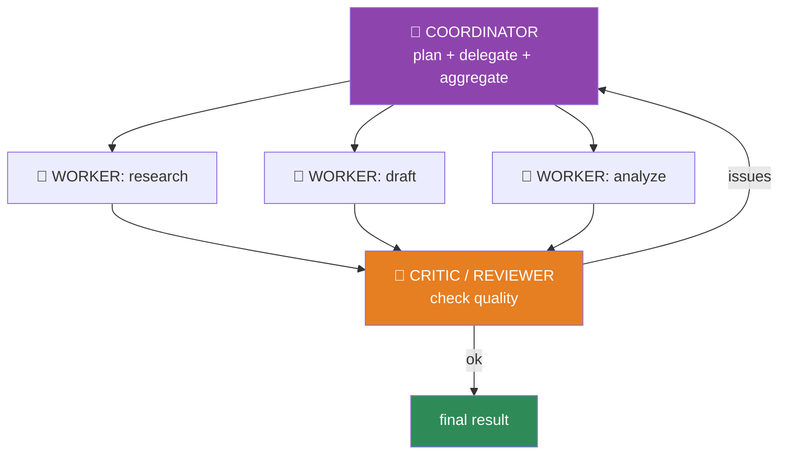
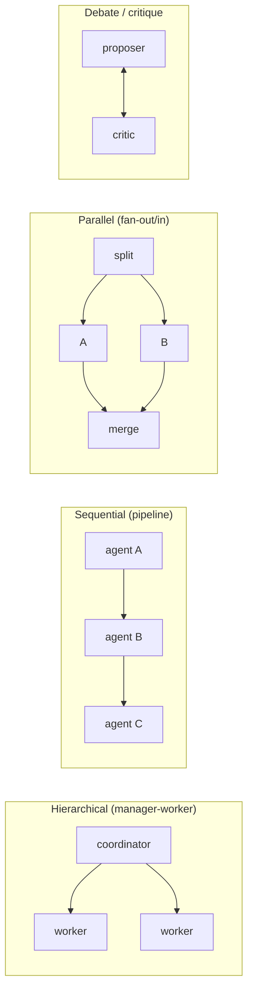
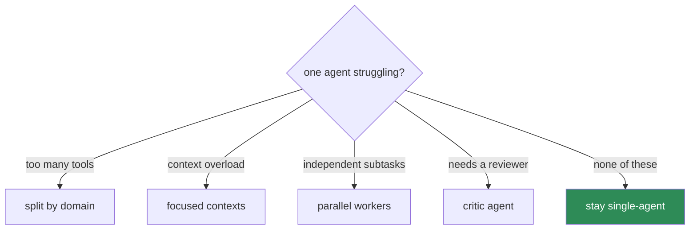
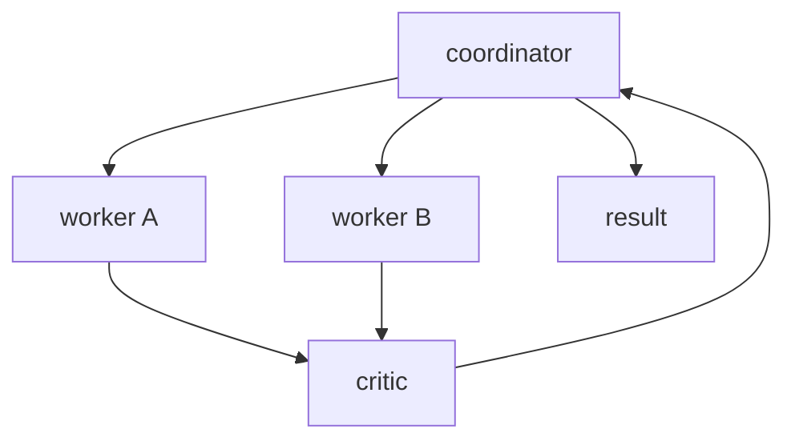

# 14.8 · Multi-Agent Systems

[⬅ 14.7 Agent Loops](14.7-agent-loops.md) · [🏠 Module 14](../README.md) · [➡ 14.9 Model Context Protocol (MCP)](14.9-mcp.md)

> **The lesson in one line:** A multi-agent system splits a big task across several specialized agents — a coordinator that plans and delegates, workers that execute, and a critic that reviews — which buys **specialization, parallelism, and separation of concerns**, at the cost of **coordination overhead, more failure modes, and higher cost**, so you use it only when one agent genuinely can't cope.

---

## 🎯 Learning objectives

- Understand the standard **roles**: coordinator, worker, reviewer, planner, executor, critic, researcher.
- Compare **communication/coordination patterns** (hierarchical, sequential, parallel, debate).
- Decide **when multi-agent beats single-agent** (and when it doesn't).
- Design a small multi-agent system with clear responsibilities.

## ✅ Prerequisites

- [14.2 agent architecture](14.2-agent-architecture.md), [14.3 hierarchical planning](14.3-planning.md), [14.11 communication](14.11-communication.md).

---

## 🧠 Mental model

> [!IMPORTANT]
> **A multi-agent system is an organization: a manager breaks a project into assignments, specialists do the work, and a reviewer checks it.** Each agent is a full agent loop ([14.2](14.2-agent-architecture.md)) with a **narrow role, its own tools, and its own context** — which is the point: a focused agent with a small toolset and a clear job outperforms one over-loaded generalist juggling everything in one context window. But an organization has overhead — communication, misunderstanding, coordination failures, and payroll (LLM cost). **Add agents when specialization and parallelism outweigh that overhead — not because "more agents" sounds powerful.**



---

## The roles

| Role | Job | Analogy |
|---|---|---|
| **Coordinator / orchestrator** | decompose the goal, delegate, aggregate results | manager |
| **Planner** | produce the plan/sub-goals ([14.3](14.3-planning.md)) | strategist |
| **Worker / executor** | do a specific sub-task with its tools | specialist |
| **Researcher** | gather information (retrieval, web) | analyst |
| **Reviewer / critic** | evaluate outputs, catch errors ([14.6](14.6-reflection.md)) | QA / editor |
| **Executor** | carry out actions (often gated, [14.12](14.12-human-in-the-loop.md)) | operator |

A role is just an agent with a **specialized system prompt, a scoped toolset, and a clear contract** for what it takes in and returns.

---

## Coordination patterns



| Pattern | Structure | Best for |
|---|---|---|
| **Hierarchical** | coordinator delegates to workers | complex tasks with sub-goals ([14.3](14.3-planning.md)) |
| **Sequential** | pipeline; each agent's output feeds the next | staged transformations ([12.8](../../12-Prompt-Engineering/weeks/12.8-prompt-chaining.md)) |
| **Parallel** | fan out independent subtasks, merge | breadth (research many topics at once) |
| **Debate / critique** | proposer + critic iterate | quality/correctness via adversarial review |

---

## When multi-agent beats single-agent

> [!IMPORTANT]
> **Default to a single agent. Reach for multi-agent only when you hit a concrete wall:** (1) **too many tools** for one agent to select well (split by domain); (2) **context overload** — one agent can't hold everything (give each a focused context); (3) **genuine parallelism** — independent subtasks that can run at once; (4) **separation of concerns** — a distinct reviewer/critic catches what the doer misses; (5) **distinct expertise/prompts** that conflict in one system prompt. If none of these apply, multi-agent just adds cost, latency, and coordination bugs.



> [!WARNING]
> **Multi-agent systems multiply failure modes.** More agents mean more LLM calls (cost/latency), more places for miscommunication (one agent misreads another's output), harder debugging (which agent failed?), and coordination deadlocks. Empirically, a well-built single agent with good tools and memory beats a poorly-coordinated swarm. **Complexity is a cost; justify it with a measured need.**

---

## 🏭 Production examples

| System | Structure |
|---|---|
| Research assistant | coordinator + parallel researcher workers + synthesizer |
| Code generation | planner → coder → reviewer (debate/critique) |
| Content pipeline | outline → draft → edit → fact-check (sequential) |
| Customer support | triage → specialist workers by domain (hierarchical) |
| Data analysis | planner + SQL worker + viz worker + critic |

## ⚡ Performance considerations

- **Cost/latency multiply** with agents and messages — each agent runs its own loop of LLM calls ([14.7](14.7-agent-loops.md)).
- **Parallelism is the main performance win** — fan out *independent* subtasks; a sequential "multi-agent" chain is just slower.
- **Communication overhead** (passing context between agents) adds tokens — pass **structured, minimal** hand-offs ([14.11](14.11-communication.md)).

## 🔒 Security considerations

> [!CAUTION]
> - **Least privilege per agent** — each worker gets only the tools its role needs; a compromised worker then has limited blast radius ([14.13](14.13-safety.md)).
> - **Inter-agent messages are untrusted input** — one agent's output (possibly influenced by injection) becomes another's input; validate hand-offs, keep them as data ([12.16](../../12-Prompt-Engineering/weeks/12.16-security.md)).
> - **Injection can propagate across agents** — a poisoned research result can steer the coordinator; contain it with structured contracts and validation.
> - **Bound the whole system** — total step/cost budget across all agents, not just per-agent.

## 🚫 Common mistakes

| Mistake | Consequence |
|---|---|
| Multi-agent for a single-agent task | Needless cost, latency, bugs |
| Vague role boundaries | Agents overlap/conflict |
| Sequential chain called "multi-agent" | No parallelism benefit, just slower |
| Passing huge unstructured context between agents | Cost blow-up, misreads |
| No global budget | Runaway across the swarm |
| Every agent has every tool | Large blast radius; poor selection |

## ✅ Best practices

- **Default single-agent; add agents for a concrete reason** (tools/context/parallelism/review/expertise).
- **Narrow roles**: specialized prompt + scoped tools + a clear I/O contract.
- **Parallelize independent subtasks**; keep hand-offs **structured and minimal** ([14.11](14.11-communication.md)).
- **Add a critic/reviewer** for quality-critical outputs ([14.6](14.6-reflection.md)).
- **Least privilege per agent; global budget; validate hand-offs.**

## 🏋️ Exercises

1. **Single vs multi.** Solve a research task with one agent vs coordinator+workers+critic; compare quality, cost, latency.
2. **Parallel win.** Fan out 4 independent subtasks to workers; measure the speedup vs sequential.
3. **Critic value.** Add a reviewer agent to a code task; measure error-catch rate.
4. **Role contracts.** Define strict I/O contracts for three roles; show it reduces miscommunication.
5. **Injection propagation.** Poison one worker's output; show validation of hand-offs contains it.

## 🛠️ Mini project — "Coordinator–worker–critic system"

**Goal:** a small multi-agent system with clear roles and structured communication.

**Requirements:** coordinator (decompose + delegate + aggregate); parallel workers (scoped tools); a critic (reviews, sends back issues); structured hand-off contracts; global step/cost budget; per-agent least privilege.

**Folder structure**
```
multi-agent/
├── coordinator.py  # plan, delegate, aggregate
├── worker.py       # role-scoped agent
├── critic.py       # review + feedback loop
├── contracts.py    # structured message schemas (14.11)
└── budget.py       # global step/cost cap
```

**Architecture diagram**


**Testing:** parallel workers speed up; critic catches seeded errors; global budget enforced; hand-offs validated.
**Evaluation:** task success, cost/latency vs single-agent ([14.14](14.14-evaluation.md)).
**Security:** per-agent least privilege; validated hand-offs; global budget ([14.13](14.13-safety.md)).
**Monitoring:** per-agent calls, message counts, failures.
**Future improvements:** dynamic role assignment; debate patterns; MCP-shared tools ([14.9](14.9-mcp.md)).

## 📄 Cheat sheet

| Concept | One line |
|---|---|
| **Multi-agent** | split a task across specialized agents (an org) |
| **Roles** | coordinator · planner · worker · researcher · reviewer/critic · executor |
| **Role =** | specialized prompt + scoped tools + I/O contract |
| **Patterns** | hierarchical · sequential · parallel · debate/critique |
| **⭐ When to use** | too many tools / context overload / parallelism / needs review / distinct expertise |
| **⭐ Default** | single agent — complexity is a cost |
| **Perf win** | parallelize **independent** subtasks |
| **Security** | least privilege per agent; validate hand-offs; global budget |

## 🎴 Flashcards

- **What is a multi-agent system?** → Several specialized agents (each its own loop, prompt, and tools) collaborating on a task — like an organization with a manager, specialists, and a reviewer.
- **What are the common roles?** → Coordinator, planner, worker/executor, researcher, and reviewer/critic.
- **⭐ When should you use multi-agent over single-agent?** → Only for a concrete reason: too many tools for one agent, context overload, genuine parallelism, need for an independent reviewer, or conflicting expertise.
- **What are the coordination patterns?** → Hierarchical (manager-worker), sequential (pipeline), parallel (fan-out/in), and debate/critique.
- **⭐ What's the main cost of multi-agent systems?** → Multiplied LLM cost/latency plus new failure modes (miscommunication, coordination bugs, harder debugging).
- **Where's the real performance win?** → Parallelizing independent subtasks; a sequential multi-agent chain is just slower.
- **How do you secure a multi-agent system?** → Least privilege per agent, validate inter-agent hand-offs (untrusted), and enforce a global budget.

## 💬 Interview questions

1. What roles make up a multi-agent system, and what does each do?
2. Compare hierarchical, sequential, parallel, and debate coordination patterns.
3. When does multi-agent beat single-agent, and when is it the wrong choice?
4. What new failure modes and costs do multi-agent systems introduce?
5. Where is the genuine performance benefit of multiple agents?
6. How do you secure inter-agent communication?

## 📝 Summary

- A **multi-agent system** is an organization of specialized agents — **coordinator** (plan/delegate/aggregate), **workers** (execute), **critic** (review) — each a full loop with a narrow role, scoped tools, and its own context.
- It buys **specialization, parallelism, and separation of concerns** but costs **coordination overhead, more failure modes, and multiplied LLM spend** — so **default to a single agent** and add agents only for a concrete need (tools/context/parallelism/review/expertise).
- **Coordination patterns** are hierarchical, sequential, parallel, and debate; the real performance win is **parallelizing independent subtasks**.
- **Secure it** with **least privilege per agent**, **validated hand-offs** (inter-agent messages are untrusted), and a **global budget** ([14.13](14.13-safety.md)).

## 📚 References

1. **Wu et al. (2023) — _AutoGen_.** ⭐ Multi-agent conversation framework.
2. **Hong et al. (2023) — _MetaGPT_.** Role-based multi-agent (SOP-driven).
3. **Anthropic — _Building Effective Agents_.** Orchestrator-worker; when to keep it simple.
4. **[14.11 Agent Communication](14.11-communication.md).** Structured hand-offs.

---

## 🧭 Navigation

| Direction | Link |
|---|---|
| ⬅ Previous | [14.7 · Agent Loops](14.7-agent-loops.md) |
| ➡ Next | [14.9 · Model Context Protocol (MCP)](14.9-mcp.md) |
| 🏠 Module | [Module 14](../README.md) |
| 📖 Lessons | [Lesson index](README.md) |
