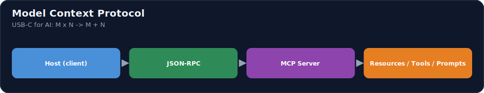
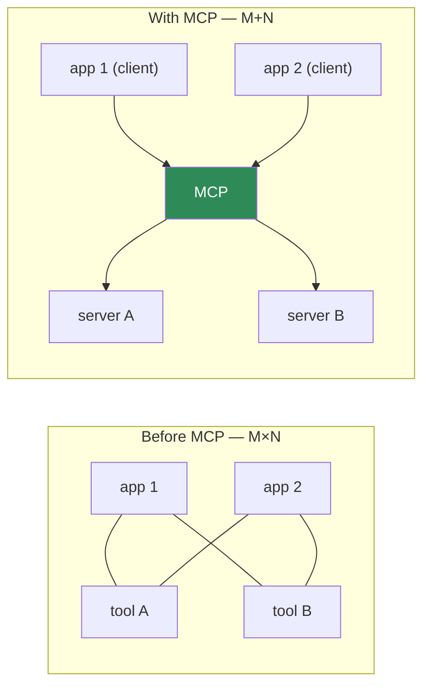
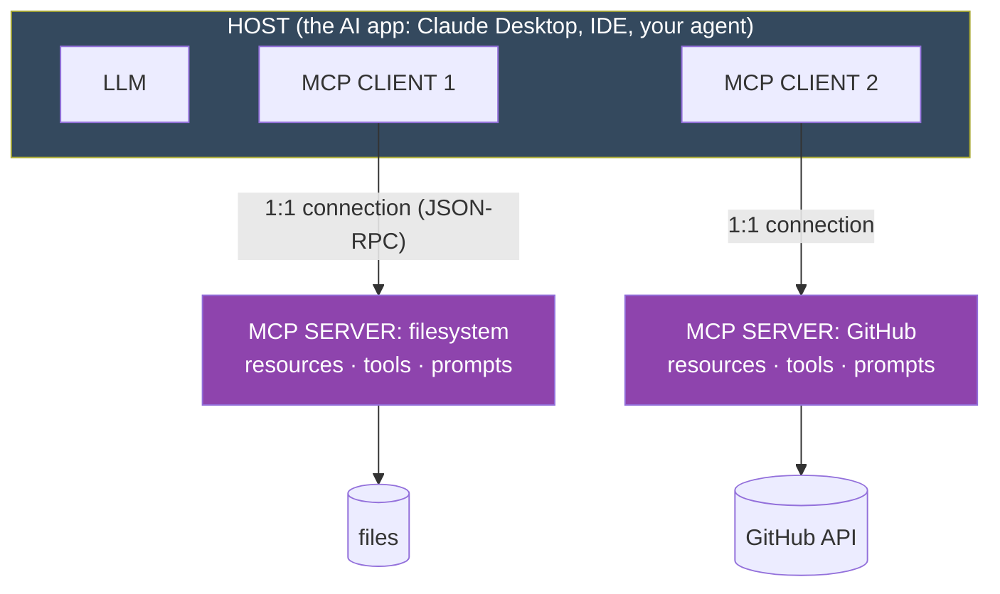
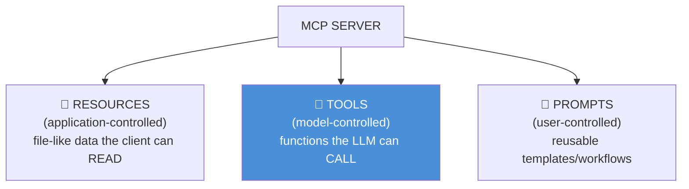
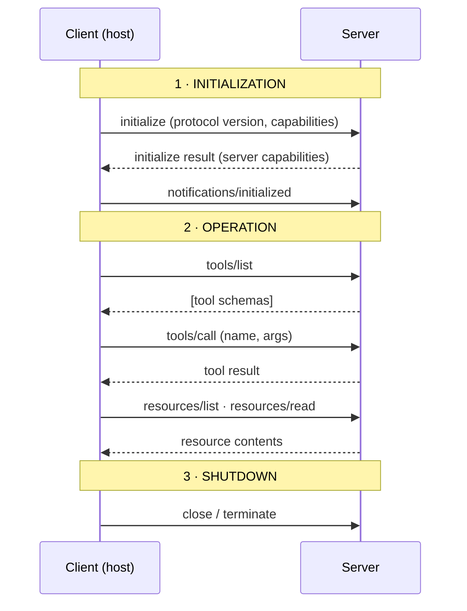
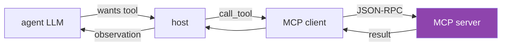
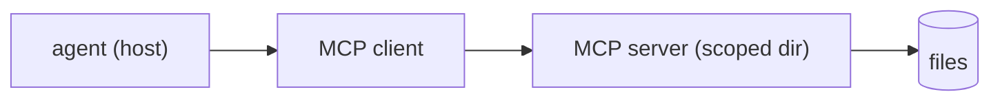

# 14.9 · Model Context Protocol (MCP) ⭐

[⬅ 14.8 Multi-Agent Systems](14.8-multi-agent.md) · [🏠 Module 14](../README.md) · [➡ 14.10 Context Engineering](14.10-context-engineering.md)

> **The lesson in one line:** MCP is an open protocol that standardizes how AI applications connect to tools and data — a **"USB-C port for AI"** — so instead of writing a custom integration for every (app × tool) pair, you build an **MCP server** once and any **MCP-compatible host** (Claude Desktop, an IDE, your agent) can use it.



---

## 🎯 Learning objectives

- Explain **why MCP exists** — the M×N integration problem it solves.
- Understand the **architecture**: host, client, server, and the three server primitives — **resources, tools, prompts**.
- Trace the **protocol lifecycle** and message flow (JSON-RPC).
- **Build a minimal MCP server and client**; know the **transports** (stdio, HTTP/SSE).

## ✅ Prerequisites

- [14.4 tool calling](14.4-tool-calling.md), [12.12 tool/function calling](../../12-Prompt-Engineering/weeks/12.12-tool-calling.md).

---

## 🧠 Mental model

> [!IMPORTANT]
> **Before MCP, every AI app integrated every tool with bespoke code — an M×N explosion: M apps × N tools = M·N custom integrations.** MCP turns that into **M+N**: each app implements an MCP *client* once, each tool is wrapped in an MCP *server* once, and any client talks to any server through the same protocol. It's exactly the USB-C analogy: one standard port, and every device that speaks it interoperates. **MCP doesn't make the model smarter — it makes tools and data plug-and-play**, so an agent can gain a capability by *connecting to a server* rather than by someone hand-coding an integration.



---

## Architecture: host, client, server


> 🖼️ **Image placeholder — MCP host with connected servers.** A screenshot of an MCP-compatible host (e.g., Claude Desktop or an IDE) showing several connected MCP servers in its settings and the tools/resources each exposes — the host-orchestrates-many-clients picture, concretely.
> _Suggested asset:_ `diagrams/mcp-host-screenshot.png` _(a real illustration to add; the Mermaid/SVG diagrams above cover the schematic view)._



| Component | Role |
|---|---|
| **Host** | the AI application the user interacts with (Claude Desktop, an IDE plugin, your agent). It contains the LLM and manages one or more clients. |
| **Client** | lives *inside* the host; maintains a **1:1 stateful connection** to one server; translates between the host and the protocol. |
| **Server** | a lightweight program that **exposes capabilities** (resources, tools, prompts) over MCP. Wraps a data source or service (files, a database, an API). Can run locally or remotely. |

> [!IMPORTANT]
> **One client ↔ one server, and the host orchestrates many clients.** This isolation matters: each server is a separate connection with its own capabilities and permissions, so the host can compose several servers (files + GitHub + database) while keeping them independent. **The server never sees the whole conversation — it only receives the specific requests the host/client sends it**, which is a security boundary ([14.13](14.13-safety.md)).

---

## The three server primitives

An MCP server exposes up to three kinds of capability, distinguished by **who controls them**:



| Primitive | Controlled by | What it is | Example |
|---|---|---|---|
| **Resources** | **application** | read-only, file-like context identified by a **URI**; the app decides what to load | a file's contents, a DB row, a doc |
| **Tools** | **model** | functions with a JSON-Schema the LLM can invoke ([14.4](14.4-tool-calling.md)) | `create_issue`, `run_query`, `search` |
| **Prompts** | **user** | reusable prompt templates / workflows the user triggers | a "/summarize" slash command |

- **Resources** provide *context* (data to read) — the app/user selects them; the model doesn't call them like functions.
- **Tools** provide *actions* — the model chooses to call them (same tool-calling you know, [12.12](../../12-Prompt-Engineering/weeks/12.12-tool-calling.md)).
- **Prompts** provide *pre-built interactions* — user-invoked templates (e.g., slash commands) that can pull in resources and tools.

Servers can also use **client-side primitives** (the server asks the host to do something): **sampling** (server requests an LLM completion from the host), **roots** (filesystem boundaries the client shares), and **elicitation** (server requests input from the user).

---

## The protocol lifecycle

MCP messages are **JSON-RPC 2.0** (requests, responses, notifications) over a transport. A connection has three phases:



1. **Initialization** — the client sends `initialize` with its protocol version and capabilities; the server replies with **its** capabilities (which primitives it supports); the client confirms with an `initialized` notification. This is **capability negotiation** — both sides learn what the other can do.
2. **Operation** — the client discovers and uses capabilities: `tools/list` → `tools/call`, `resources/list` → `resources/read`, `prompts/list` → `prompts/get`. The server can send notifications (e.g., "resource list changed").
3. **Shutdown** — the connection is closed cleanly.

---

## Transports

MCP separates the **protocol** (JSON-RPC messages) from the **transport** (how bytes move):

| Transport | How | Use for |
|---|---|---|
| **stdio** | server runs as a local subprocess; messages over stdin/stdout | **local** servers (filesystem, local tools) — simple, no network |
| **Streamable HTTP** (with SSE) | HTTP requests + Server-Sent Events for streaming/server→client messages | **remote** servers; multiple clients; cloud deployment |

**stdio** is the common default for local integrations (the host launches the server process). **HTTP** is for remote/hosted servers. The protocol messages are identical; only the pipe differs.

---

## 💻 Build a minimal MCP server

Using the MCP Python SDK (`FastMCP`), a server is just decorated functions:

```python
from mcp.server.fastmcp import FastMCP

mcp = FastMCP("demo-server")

# TOOL (model-controlled action) — schema is inferred from the type hints
@mcp.tool()
def add(a: int, b: int) -> int:
    """Add two numbers."""
    return a + b

# RESOURCE (application-controlled, read-only data) — addressed by URI
@mcp.resource("notes://{name}")
def get_note(name: str) -> str:
    """Return the contents of a note."""
    return load_note(name)          # your data access

# PROMPT (user-controlled reusable template)
@mcp.prompt()
def summarize(text: str) -> str:
    return f"Summarize the following in 3 bullets:\n\n{text}"

if __name__ == "__main__":
    mcp.run(transport="stdio")      # local subprocess transport
```

The SDK handles the JSON-RPC lifecycle, capability advertisement, and schema generation. You write the *capabilities*; MCP handles the *protocol*.

## 💻 Build a minimal MCP client

```python
from mcp import ClientSession, StdioServerParameters
from mcp.client.stdio import stdio_client

async def main():
    params = StdioServerParameters(command="python", args=["demo_server.py"])
    async with stdio_client(params) as (read, write):
        async with ClientSession(read, write) as session:
            await session.initialize()                 # 1 · handshake + capability negotiation
            tools = await session.list_tools()         # 2 · discover tools
            result = await session.call_tool("add", {"a": 2, "b": 3})  # call a tool
            note = await session.read_resource("notes://todo")          # read a resource
```

An **agent host** wires this in: it lists the server's tools, hands their schemas to the LLM ([14.4](14.4-tool-calling.md)), and when the LLM decides to call one, the client executes `call_tool` and returns the result as an observation. **MCP tools slot directly into the agent loop** — the only change is *where the tool lives* (a server) not *how the agent uses it*.



---

## 🏭 Production examples

| MCP server | Exposes |
|---|---|
| Filesystem | resources (files) + tools (read/write/search) |
| Database | tools (`run_query`) + resources (schema) |
| GitHub/GitLab | tools (create issue/PR, search) |
| Web/browser | tools (fetch, search) |
| Company knowledge base | resources (docs) + a RAG tool ([13](../../13-RAG/README.md)) |

## ⚡ Performance considerations

- **stdio is lowest-latency** (local, no network); **HTTP** adds network round-trips but enables remote/shared servers.
- **List capabilities once** at init and cache; don't re-list every step.
- **Servers can be reused across agents/hosts** — build once, amortize.
- **Streaming (SSE)** matters for long-running tools/large resources.

## 🔒 Security considerations

> [!CAUTION]
> - **An MCP server is a permission boundary — grant least privilege.** A filesystem server scoped to one directory can't touch the rest of the disk; scope every server tightly ([14.13](14.13-safety.md)).
> - **Third-party/remote servers are untrusted code and untrusted data** — a malicious server can return injected content or expose dangerous tools; vet servers, sandbox them, and treat their outputs as untrusted ([12.16](../../12-Prompt-Engineering/weeks/12.16-security.md)).
> - **Tool calls through MCP still need argument validation and approval gates** — MCP standardizes *transport*, not *safety*; the host enforces permissions and human-in-the-loop ([14.12](14.12-human-in-the-loop.md)).
> - **Resources can leak data** — the server controls what a URI returns; ensure access control on the data behind it.
> - **`sampling`** (server asks the host to run the LLM) must be user-approved — it lets a server spend your model budget and shape prompts.

## 🚫 Common mistakes

| Mistake | Consequence |
|---|---|
| Treating MCP as a safety layer | It's transport/standardization; you still enforce safety |
| Trusting third-party servers blindly | Malicious tools/injected data |
| Over-broad server scope (whole filesystem) | Large blast radius |
| Confusing resources with tools | Resources are read-context (app), tools are actions (model) |
| Re-listing capabilities every step | Needless latency |
| No validation on MCP tool args | Same injection risks as any tool ([14.4](14.4-tool-calling.md)) |

## ✅ Best practices

- **One server = one bounded capability**, tightly scoped (least privilege).
- **Vet and sandbox third-party servers**; treat their output as untrusted.
- **Validate tool args and gate high-impact tools** at the host, even via MCP.
- **Cache capability lists**; reuse servers across agents.
- **Use stdio for local, HTTP for remote**; stream long results.

## 🏋️ Exercises

1. **Build a server.** Write an MCP server exposing one tool, one resource, and one prompt; run it over stdio.
2. **Build a client.** Connect, initialize, list and call the tool, read the resource.
3. **Wire into an agent.** Hand the server's tools to your [14.2](14.2-agent-architecture.md) agent; have it call an MCP tool in the loop.
4. **Trace the lifecycle.** Log the JSON-RPC messages for initialize → list → call → close.
5. **Scope & sandbox.** Restrict a filesystem server to one directory; prove it can't read outside it.

## 🛠️ Mini project — "MCP file assistant"

**Goal:** an MCP server exposing safe file operations, plus a client/agent that uses it.

**Requirements:** server with resources (read files in a scoped dir) + tools (search, read; write behind approval) + a prompt (summarize file); scoped to one directory (least privilege); stdio transport; a client/agent that lists and calls tools; argument validation; audit logging.

**Folder structure**
```
mcp-file-assistant/
├── server.py       # FastMCP: resources + tools + prompts, scoped
├── client.py       # connect, list, call
├── agent.py        # host: LLM + MCP client in the loop (14.2)
└── audit.py        # log tool calls
```

**Architecture diagram**


**Testing:** tools/resources discoverable; server can't escape its directory; writes require approval; args validated.
**Evaluation:** task success on file tasks; unauthorized-access attempts blocked ([14.14](14.14-evaluation.md)).
**Security:** least-privilege scope, sandbox, approval gates, outputs-as-untrusted ([14.13](14.13-safety.md)).
**Monitoring:** audit log of every tool call.
**Future improvements:** HTTP transport for remote use; more servers (git, web); capability caching.

## 📄 Cheat sheet

| Concept | One line |
|---|---|
| **⭐ MCP** | open protocol standardizing app↔tool/data connections — "USB-C for AI" |
| **Problem solved** | M×N custom integrations → **M+N** |
| **Host** | the AI app (contains the LLM + clients) |
| **Client** | inside the host; 1:1 stateful link to a server |
| **Server** | exposes capabilities; wraps a data source/service |
| **Resources** | app-controlled, read-only data by **URI** |
| **Tools** | model-controlled actions (JSON-Schema) |
| **Prompts** | user-controlled reusable templates |
| **Transport** | JSON-RPC over **stdio** (local) or **HTTP/SSE** (remote) |
| **Lifecycle** | initialize (capability negotiation) → operate → shutdown |
| **⚠️ Security** | MCP = transport, **not** safety; scope, sandbox, validate, gate |

## 🎴 Flashcards

- **⭐ Why does MCP exist?** → To replace M×N bespoke app-tool integrations with M+N: each app implements a client once, each tool a server once, and any client talks to any server.
- **⭐ What are the host, client, and server?** → Host = the AI app (holds the LLM + clients); client = lives in the host with a 1:1 link to a server; server = exposes capabilities wrapping a data source/service.
- **⭐ What are the three server primitives and who controls each?** → Resources (application-controlled, read-only data by URI), tools (model-controlled actions), prompts (user-controlled templates).
- **How does an MCP connection start?** → An `initialize` handshake that negotiates protocol version and capabilities, confirmed by an `initialized` notification.
- **What are the MCP transports?** → stdio (local subprocess) and Streamable HTTP with SSE (remote); the JSON-RPC messages are identical.
- **Is MCP a security layer?** → No — it standardizes transport/discovery; the host still enforces validation, least privilege, sandboxing, and approvals.
- **How do MCP tools relate to the agent loop?** → They slot in unchanged: the host lists server tools, gives schemas to the LLM, and the client executes chosen calls as observations.

## 💬 Interview questions

1. What problem does MCP solve, and why is the "USB-C for AI" analogy apt?
2. Describe the host/client/server architecture and the 1:1 client-server rule.
3. What are resources, tools, and prompts, and who controls each?
4. Walk through the MCP connection lifecycle and capability negotiation.
5. What transports does MCP use, and when do you pick each?
6. Why is MCP not a safety layer, and what must the host still enforce?
7. How do MCP tools integrate into an existing agent loop?

## 📝 Summary

- **MCP is an open protocol** that standardizes how AI apps connect to tools and data, turning the **M×N** integration explosion into **M+N** — "USB-C for AI."
- Its architecture is **host** (the AI app + LLM), **clients** (1:1 links inside the host), and **servers** (expose capabilities). Servers offer three primitives by controller: **resources** (app, read-only data by URI), **tools** (model, actions), **prompts** (user, templates).
- Messages are **JSON-RPC** over **stdio** (local) or **HTTP/SSE** (remote); a connection does **initialize (capability negotiation) → operate → shutdown**. You build a server as decorated functions and a client that lists/calls — and **MCP tools slot straight into the agent loop**.
- **MCP standardizes transport, not safety** — the host still validates arguments, scopes servers to least privilege, sandboxes untrusted servers, and gates high-impact actions ([14.13](14.13-safety.md)).

## 📚 References

1. **Anthropic (2024) — _Model Context Protocol_ specification & docs.** ⭐ Architecture, primitives, lifecycle.
2. **MCP Python/TypeScript SDKs (`FastMCP`).** ⭐ Building servers and clients.
3. **JSON-RPC 2.0 specification.** The message format.
4. **[14.4 Tool Calling](14.4-tool-calling.md).** How tools plug into the loop.

---

## 🧭 Navigation

| Direction | Link |
|---|---|
| ⬅ Previous | [14.8 · Multi-Agent Systems](14.8-multi-agent.md) |
| ➡ Next | [14.10 · Context Engineering for Agents](14.10-context-engineering.md) |
| 🏠 Module | [Module 14](../README.md) |
| 📖 Lessons | [Lesson index](README.md) |
