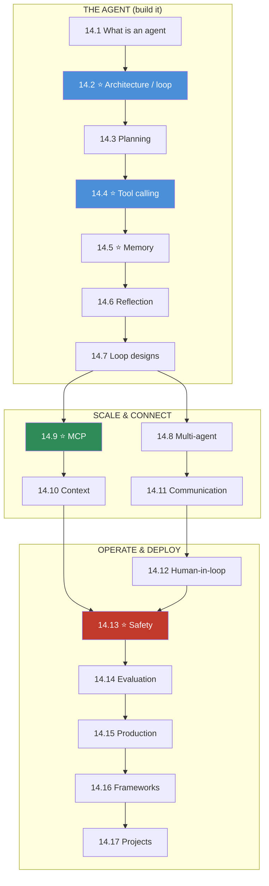

# Module 14 · AI Agents & MCP — Lessons

[⬅ Module home](../README.md) · [🗺 Roadmap](../../../ROADMAP.md) · [📚 Curriculum](../../../CURRICULUM.md)

> This is the map of Module 14. **An agent is an LLM running in a loop with tools, memory, and guardrails.** By the end you will have built an agent and an MCP server/client from scratch, and be able to design, evaluate, secure, and deploy multi-agent systems.

---

## The rule of this module

> [!IMPORTANT]
> **An agent is a loop, not a prompt.** A chatbot maps input → output once. An **agent** runs the LLM as a *reasoning engine* inside a control loop: **observe → think → plan → act (call a tool) → observe the result → reflect → repeat** until the goal is achieved or a budget is hit. The intelligence is the model; the **engineering is everything around it** — the loop, the tool layer, the memory, the permissions, and the evaluation.
>
> **The plan:** define what an agent is → build the architecture/loop → plan → call tools → remember → reflect → loop designs → coordinate multiple agents → standardize tools with **MCP** → engineer context and communication → add humans, safety, and evaluation → deploy → frameworks → projects. You **build the loop and an MCP server by hand** before any framework.

This module is the **capstone of the applied track**: it assembles **tool calling and context from [Module 12](../../12-Prompt-Engineering/README.md)**, **retrieval from [Module 13](../../13-RAG/README.md)** (RAG becomes one tool), and **the LLM, its safety, and its serving from [Module 11](../../11-LLMs/README.md)** into autonomous systems that act.

---

## The 17 lessons

| # | Lesson | The one thing | Build? |
|---|---|---|---|
| 14.1 | [What Are AI Agents?](14.1-what-are-agents.md) ⭐ | agent = LLM + **loop** + tools + memory (vs chatbot/workflow/RAG) | — |
| 14.2 | [Agent Architecture](14.2-agent-architecture.md) ⭐ | the control loop: input→plan→tool→execute→observe→respond | ✅ |
| 14.3 | [Planning](14.3-planning.md) | decompose a goal → sub-goals → tasks → actions | ✅ |
| 14.4 | [Tool Calling](14.4-tool-calling.md) ⭐ | schema → validate → execute → handle errors → retry | ✅ |
| 14.5 | [Agent Memory](14.5-memory.md) ⭐ | short/long/working/semantic/episodic/vector memory | ✅ |
| 14.6 | [Reflection](14.6-reflection.md) | self-evaluate → detect error → correct → verify | ✅ |
| 14.7 | [Agent Loops](14.7-agent-loops.md) | fixed vs adaptive vs event-driven; budgets & termination | ✅ |
| 14.8 | [Multi-Agent Systems](14.8-multi-agent.md) | coordinator/worker/reviewer; when (not) to use many agents | — |
| 14.9 | [Model Context Protocol (MCP)](14.9-mcp.md) ⭐ | host/client/server; resources/tools/prompts; the USB-C for tools | ✅ |
| 14.10 | [Context Engineering for Agents](14.10-context-engineering.md) | manage the window across long-running, multi-step tasks | — |
| 14.11 | [Agent Communication](14.11-communication.md) | structured messages, delegation, shared memory, aggregation | — |
| 14.12 | [Human-in-the-Loop](14.12-human-in-the-loop.md) | approval, checkpoints, override, escalation | — |
| 14.13 | [Agent Safety](14.13-safety.md) ⭐ | least privilege, sandboxing, permissions, audit — **defensive** | — |
| 14.14 | [Agent Evaluation](14.14-evaluation.md) | **task success**, tool/plan accuracy, cost, reliability | ✅ |
| 14.15 | [Production Agent Architecture](14.15-production-architecture.md) | gateway→planner→memory→tools→MCP→monitor | — |
| 14.16 | [Frameworks](14.16-frameworks.md) | LangGraph/CrewAI/AutoGen/… — build-by-hand first | ✅ |
| 14.17 | [Mini Projects & Summary](14.17-projects-summary.md) | 10 projects; the whole stack, connected | ✅ |

⭐ marks the load-bearing lessons. **14.2 (the loop)** and **14.4 (tools)** make agents concrete; **14.5 (memory)** and **14.9 (MCP)** are what make them capable and connectable; **14.13 (safety)** is what makes them deployable.

---

## The dependency graph

**Read it as three phases:** *build the agent* (loop → plan → tools → memory → reflect), *scale & connect* (multi-agent, MCP, context, communication), and *operate & deploy* (human-in-loop, safety, evaluation, production, frameworks).

---

## The recurring through-lines

- **An agent is a loop, not a prompt** — the engineering is the loop, not the model.
- **Tools are the agent's hands; memory is its notebook; permissions are its leash.**
- **Autonomy is a liability as much as a feature** — bound it with budgets, termination, and human checkpoints.
- **Least privilege is the load-bearing safety control** — assume the agent will be hijacked ([12.16](../../12-Prompt-Engineering/weeks/12.16-security.md), [11.18](../../11-LLMs/weeks/11.18-safety.md)).
- **Evaluate task success, not token accuracy** — an agent is judged by what it *accomplishes*.
- **MCP is the USB-C of tools** — write a tool once, use it from any agent.

---

## Navigation

| Direction | Link |
|---|---|
| 🏠 Module home | [Module 14](../README.md) |
| ➡ First lesson | [14.1 · What Are AI Agents?](14.1-what-are-agents.md) |
| 🗺 Roadmap | [ROADMAP.md](../../../ROADMAP.md) |
| 📚 Curriculum | [CURRICULUM.md](../../../CURRICULUM.md) |
