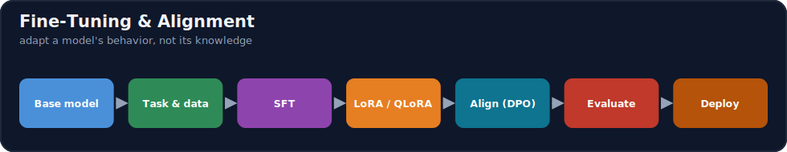

# Module 15 · Fine-Tuning & Alignment

[⬅ 14 · AI Agents](../14-AI-Agents/README.md) · [🏠 docs](../README.md) · [🗺 Roadmap](../../ROADMAP.md) · [16 · MLOps ➡](../16-MLOps/README.md)

> Adapting foundation models to your task, domain, style, and values — SFT, LoRA/QLoRA, RLHF, and DPO — as a full production lifecycle.

---

## Purpose

This module covers **fine-tuning and alignment**: how to adapt a pretrained model to a **specific task, domain, behavior, or set of values** — and, just as importantly, **when *not* to** (RAG or prompting is often the right answer). It teaches the **complete lifecycle** — base model → task → data → training strategy → fine-tune → evaluate → align → safety-test → deploy → monitor — not "dataset → trainer → model." It goes deep on **SFT, LoRA, QLoRA, RLHF, and DPO**, with the math, the PyTorch, and the GPU-memory reality. Builds directly on [Module 11's LLM/LoRA/alignment lessons](../11-LLMs/README.md).

## What you'll learn

- **When fine-tuning is the right tool** vs RAG ([13](../13-RAG/README.md)) vs prompting ([12](../12-Prompt-Engineering/README.md)) — a decision framework, not a reflex.
- **The base → instruct → chat → aligned** progression, and how to prepare **high-quality instruction and preference datasets** (data quality > data quantity).
- **Supervised Fine-Tuning** (loss masking, instruction tuning) from scratch in PyTorch; **full fine-tuning** and its memory cost.
- **LoRA deeply** (`W' = W + BA`, rank/alpha/dropout/target-modules) and **QLoRA** (4-bit NF4, double quantization, paged optimizers) — implemented and compared on memory/speed/quality.
- **Alignment**: RLHF (preference data → reward model → PPO) conceptually and technically, **DPO** (implemented), plus Constitutional AI, RLAIF, ORPO, KTO.
- **Evaluation, base-vs-fine-tuned comparison, catastrophic-forgetting detection, debugging, security, cost optimization, and production pipelines** (dataset/model versioning, registry, rollback, monitoring).

## 📖 Lessons (start here)

> ✅ **This module's content is written.** Work through the lessons in order via the [lesson index](weeks/README.md).

| # | Lesson | Build? |
|---|---|---|
| 15.1 | [Why Fine-Tuning Exists](weeks/15.1-why-fine-tuning.md) ⭐ | — |
| 15.2 | [Base Models](weeks/15.2-base-models.md) | — |
| 15.3 | [Fine-Tuning Strategy Selection](weeks/15.3-strategy-selection.md) ⭐ | — |
| 15.4 | [Dataset Preparation](weeks/15.4-dataset-preparation.md) | ✅ |
| 15.5 | [Instruction Dataset Design](weeks/15.5-instruction-datasets.md) | ✅ |
| 15.6 | [Supervised Fine-Tuning (SFT)](weeks/15.6-sft.md) ⭐ | ✅ |
| 15.7 | [Full Fine-Tuning](weeks/15.7-full-fine-tuning.md) | — |
| 15.8 | [LoRA](weeks/15.8-lora.md) ⭐ | ✅ |
| 15.9 | [QLoRA](weeks/15.9-qlora.md) ⭐ | ✅ |
| 15.10 | [Practical Fine-Tuning Stack](weeks/15.10-practical-stack.md) | ✅ |
| 15.11 | [Hyperparameters](weeks/15.11-hyperparameters.md) | — |
| 15.12 | [Training Optimization](weeks/15.12-training-optimization.md) | — |
| 15.13 | [Catastrophic Forgetting](weeks/15.13-catastrophic-forgetting.md) | — |
| 15.14 | [RLHF](weeks/15.14-rlhf.md) ⭐ | — |
| 15.15 | [DPO](weeks/15.15-dpo.md) ⭐ | ✅ |
| 15.16 | [Other Alignment Techniques](weeks/15.16-other-alignment.md) | — |
| 15.17 | [Model Evaluation](weeks/15.17-evaluation.md) ⭐ | ✅ |
| 15.18 | [Base vs Fine-Tuned Evaluation](weeks/15.18-base-vs-finetuned.md) | ✅ |
| 15.19 | [Fine-Tuning Debugging](weeks/15.19-debugging.md) | — |
| 15.20 | [Security & Privacy](weeks/15.20-security.md) | — |
| 15.21 | [Production Fine-Tuning Pipeline](weeks/15.21-production-pipeline.md) | — |
| 15.22 | [Mini Projects & Summary](weeks/15.22-projects-summary.md) | ✅ |

**Companion artifacts:** [Exercises](exercises/README.md) · [Quiz](quizzes/quiz-01.md) · [Flashcards](flashcards/deck.md) · [Cheat sheet](cheat-sheets/finetuning-cheatsheet.md)

> [!IMPORTANT]
> **⭐ The rule of this module: fine-tuning changes *behavior*, not *knowledge* — and it's the last resort, not the first.** Reach for it when the model needs to *act* a certain way (a format, a style, a skill, a domain's conventions) that prompting can't reliably produce and that RAG (which injects *facts*) doesn't address. **Facts → RAG. Framing → prompt. Behavior/style/skill → fine-tune.** Trying to teach facts by fine-tuning gives you a model that hallucinates the facts, un-citably and un-updatably.
>
> And fine-tuning is **mostly a data problem, not a training problem**: a few thousand *clean, well-formatted, diverse* examples beat a hundred thousand noisy ones. So this module spends its weight on **data ([15.4](weeks/15.4-dataset-preparation.md)–[15.5](weeks/15.5-instruction-datasets.md)), the right cheap method ([15.8](weeks/15.8-lora.md) LoRA / [15.9](weeks/15.9-qlora.md) QLoRA — fine-tune a large model on one GPU), alignment ([15.14](weeks/15.14-rlhf.md)–[15.15](weeks/15.15-dpo.md)), and rigorous evaluation ([15.17](weeks/15.17-evaluation.md)–[15.18](weeks/15.18-base-vs-finetuned.md))** — you will **implement SFT, a LoRA layer, and a DPO objective by hand** before relying on the frameworks.

## How this module is organized

Content is delivered week by week. Each module uses the same subfolders:

| Folder | Contents |
|---|---|
| [`weeks/`](weeks/) | Weekly lesson content, one file per lesson (`15.1-…`, `15.2-…`). |
| [`diagrams/`](diagrams/) | Mermaid sources and exported diagram assets for this module. |
| [`exercises/`](exercises/) | Hands-on practice problems with solutions. |
| [`projects/`](projects/) | Buildable projects that apply this module's skills. |
| [`quizzes/`](quizzes/) | Self-assessment question banks with answer keys. |
| [`flashcards/`](flashcards/) | Spaced-repetition Q/A decks for active recall. |
| [`cheat-sheets/`](cheat-sheets/) | One-page quick references for this module. |
| [`references/`](references/) | Paper summaries and deep-dive notes. |

## Suggested study flow

## Related modules

- [Module 09 · Deep Learning](../09-Deep-Learning/README.md) — the training loop, AdamW, mixed precision.
- [Module 11 · LLMs](../11-LLMs/README.md) — pretraining, fine-tuning, LoRA, alignment (the theory this applies).
- [Module 12 · Prompt Engineering](../12-Prompt-Engineering/README.md) & [Module 13 · RAG](../13-RAG/README.md) — the alternatives to fine-tuning.
- [Module 16 · MLOps](../16-MLOps/README.md) — deploying and monitoring the adapted models.

---

## Navigation

| Direction | Link |
|---|---|
| ⬆ Parent | [docs/](../README.md) |
| ⬅ Previous | [⬅ 14 · AI Agents](../14-AI-Agents/README.md) |
| ➡ Next | [16 · MLOps ➡](../16-MLOps/README.md) |
| 🗺 Roadmap | [ROADMAP.md](../../ROADMAP.md) |
| 📚 Curriculum | [CURRICULUM.md](../../CURRICULUM.md) |
| 🏠 Repo root | [README.md](../../README.md) |
