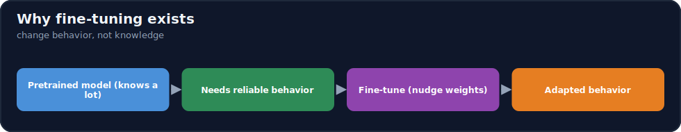
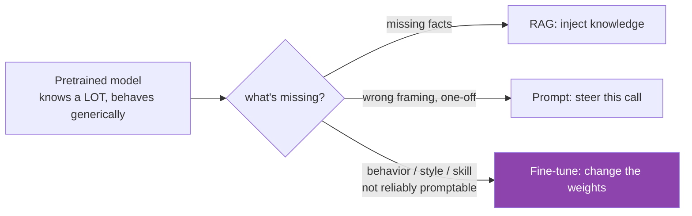
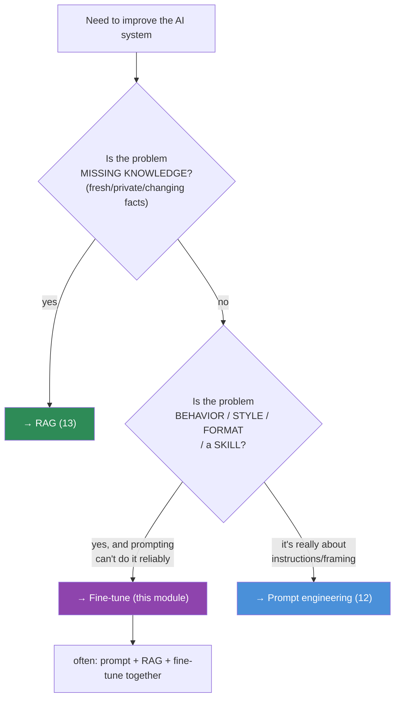

# 15.1 · Why Fine-Tuning Exists ⭐

[🏠 Module 15](../README.md) · [📖 Lessons](README.md) · [➡ 15.2 Base Models](15.2-base-models.md)

> **The lesson in one line:** A pretrained model already *knows* an enormous amount but doesn't reliably *behave* the way your application needs — fine-tuning adjusts the weights to change **behavior, style, format, and task skill**, which is exactly the thing prompting can't guarantee and RAG (which supplies *facts*) doesn't touch.



---

## 🎯 Learning objectives

- Distinguish what pretrained models **know** from how they **behave** — and which one fine-tuning changes.
- Classify adaptation into **knowledge, behavior, style, domain, task specialization**.
- Compare **prompting, RAG, fine-tuning, and pretraining** and choose correctly.
- Internalize: **fine-tuning is behavior adaptation, and usually the last resort.**

## ✅ Prerequisites

- [11.9 pretraining](../../11-LLMs/weeks/11.9-pretraining.md), [11.11 fine-tuning](../../11-LLMs/weeks/11.11-fine-tuning.md).
- [13.1 why RAG](../../13-RAG/weeks/13.1-why-rag-exists.md), [12.1 how LLMs interpret prompts](../../12-Prompt-Engineering/weeks/12.1-how-llms-interpret-prompts.md).

---

## 🧠 Mental model

> [!IMPORTANT]
> **Pretraining gave the model a vast, general capability; your app needs a narrow, reliable behavior — fine-tuning closes that gap by nudging the weights toward your task.** Think of a brilliant generalist graduate: they *know* enormous amounts (pretraining) but don't yet follow your team's conventions, format, tone, or specialized workflow. You could keep giving them detailed instructions every time (prompting), or hand them the reference docs to read (RAG) — but if the *behavior itself* needs to become second nature (always output this schema, always reason in this style, handle this domain's edge cases), you **train** them until it's internalized. **Fine-tuning bakes behavior into the weights so you don't have to specify it every call.**



---

## What pretrained models already know

A base model has absorbed grammar, facts, reasoning patterns, code, many languages, and broad world knowledge from its pretraining corpus ([11.9](../../11-LLMs/weeks/11.9-pretraining.md)). **You almost never need to teach it knowledge** — it's already there (and if it's *missing/fresh/private* knowledge, that's a **RAG** job, [13](../../13-RAG/README.md), not fine-tuning). What a base model *lacks* is **reliable, task-shaped behavior**: it doesn't consistently follow instructions, hold a format, adopt your tone, or handle your domain's conventions.

## What fine-tuning changes

| Adaptation type | What it does | Example |
|---|---|---|
| **Behavior** | how the model responds/acts | always follow a strict output protocol |
| **Style / tone** | the voice | your brand's terse, formal support voice |
| **Format** | output structure | always emit valid domain-specific JSON |
| **Task specialization** | a specific skill | classify support tickets; extract clauses |
| **Domain adaptation** | a field's conventions/vocabulary | legal, medical, or code in your stack |
| **Knowledge** ⚠️ | *possible but usually wrong* | teaching facts → hallucination, un-updatable |

> [!IMPORTANT]
> **Fine-tuning excels at behavior/style/format/skill and is a poor way to inject knowledge.** If you fine-tune facts in, the model learns them *fuzzily* — it will confidently paraphrase, misremember, and hallucinate them, with no citations and no way to update without retraining ([11.11](../../11-LLMs/weeks/11.11-fine-tuning.md)). **Facts belong in RAG** (fresh, private, citable, updatable). Reserve fine-tuning for the *how*, not the *what*.

## The four tools compared

| Technique | Best for | Changes | Freshness | Cost to update |
|---|---|---|---|---|
| **Prompt engineering** | instructions, framing, format (lightweight) | the input | instant | trivial |
| **RAG** | external, private, **changing knowledge** | retrieved context | live (re-index) | cheap |
| **Fine-tuning** | **behavior, style, task specialization** | the **weights** | frozen at train time | expensive (retrain) |
| **Pretraining** | learning broad knowledge from scratch | the weights (from zero) | frozen | enormous |

## The decision tree



> [!IMPORTANT]
> **Try prompting first, RAG second, fine-tuning last — and combine them.** Prompting and RAG are cheap, instant, and updatable; fine-tuning is a capital investment (data + compute + eval + a model to maintain). Reach for it only when **(a)** the behavior can't be reliably prompted, **(b)** you have or can build **high-quality data** for it, and **(c)** the volume/latency/quality gains justify the cost. Production systems frequently use **all three**: a fine-tuned model, prompted well, filled by RAG.

---

## When fine-tuning *is* the right call

- **Reliable format/behavior** prompting can't guarantee (e.g., always-valid structured output at scale).
- **Style/voice** consistency across every response.
- **A narrow, high-volume task** where a small fine-tuned model beats a big prompted one on cost/latency/quality.
- **Domain conventions** (vocabulary, reasoning patterns) the base model handles clumsily.
- **Distilling** a big model's behavior into a small, cheap one.
- **Latency/cost at scale** — a specialized small model can be far cheaper than a large prompted one.

## 🧮 Mathematical intuition

Pretraining minimizes next-token loss over a huge general corpus, landing weights `θ` in a broad, capable region. Fine-tuning continues gradient descent on the *same* objective but over a **small, task-specific distribution**, moving `θ → θ'` a short distance toward behavior that fits your data ([15.6](15.6-sft.md)). Because it's a *small* move on a *narrow* distribution, it reshapes **behavior** cheaply — but the same smallness is why it can't reliably install large new **factual knowledge**, and why it risks **forgetting** the general capability if you move too far ([15.13](15.13-catastrophic-forgetting.md)).

---

## 🏭 Production examples

| Goal | Right tool |
|---|---|
| Answer from our (changing) docs | RAG |
| Always output our JSON schema, reliably | fine-tune (+ prompt) |
| Adopt our brand voice everywhere | fine-tune |
| One-off: "reply in French" | prompt |
| Cheap high-volume ticket classifier | fine-tune a small model |
| Cite current pricing | RAG (never fine-tune) |

## ⚡ GPU memory & 💲 cost considerations

- Fine-tuning has **real upfront cost**: data creation/labeling (often the biggest), GPU compute, evaluation, and an ongoing model to version/monitor.
- **LoRA/QLoRA** ([15.8](15.8-lora.md)–[15.9](15.9-qlora.md)) collapse the compute cost — a large model on one consumer GPU — but the **data and evaluation cost remains**.
- A fine-tuned **small** model can *lower* inference cost at scale vs a prompted large model — the payoff that often justifies fine-tuning.

## 🔒 Security considerations

> [!CAUTION]
> - **Fine-tuning bakes your training data into the weights** — the model can **memorize and leak** PII/secrets from the dataset ([15.20](15.20-security.md)); it's not a safe place for sensitive facts (another reason facts → RAG, where access can be controlled).
> - **Un-updatable** — you can't "delete" a fact from fine-tuned weights without retraining; consider deletion/right-to-be-forgotten before baking data in.
> - **Dataset poisoning** — bad training data becomes bad behavior, invisibly ([15.20](15.20-security.md)).

## 🚫 Common mistakes

| Mistake | Consequence |
|---|---|
| Fine-tuning to inject facts | Hallucinated, un-citable, un-updatable "knowledge" |
| Reaching for fine-tuning first | Expensive; prompting/RAG often suffice |
| Fine-tuning without an eval plan | Can't tell if it helped (or hurt) ([15.17](15.17-evaluation.md)) |
| Ignoring data quality/quantity of work | Garbage data → garbage behavior |
| Baking sensitive data into weights | Memorization/leakage ([15.20](15.20-security.md)) |

## 🐛 Debugging workflow (preview)

Before fine-tuning, ask **in order**: (1) *Can a better prompt do this?* (2) *Is this actually a knowledge problem → RAG?* (3) *Do I have (or can I build) clean, sufficient data?* (4) *How will I evaluate base vs tuned?* If any answer is shaky, you're likely about to fine-tune the wrong thing. Full method in [15.19](15.19-debugging.md).

## 🏋️ Exercises

1. **Decision drill.** For 10 scenarios (e.g., "always output our schema", "answer from 2025 pricing", "adopt our voice", "reply in Spanish once"), pick prompt / RAG / fine-tune / pretrain and justify.
2. **Behavior vs knowledge.** Write three tasks that are clearly *behavior* and three that are clearly *knowledge*; explain the tool for each.
3. **Cost estimate.** Estimate the full cost of fine-tuning (data + compute + eval + maintenance) vs a RAG solution for one use case.
4. **Combine.** Design one system using prompt + RAG + fine-tune together; state what each contributes.
5. **Failure mode.** Find a case where fine-tuning facts would fail; predict how it hallucinates.

## 🛠️ Mini project — "Adapt-or-not advisor"

**Goal:** a rubric + script that recommends prompt / RAG / fine-tune (or a combination) from a problem description.

**Requirements:** encode the decision questions (knowledge vs behavior? promptable? data available? volume/latency justification?); output the recommendation + rationale + rough cost tier.

**Folder structure**
```
adapt-advisor/
├── rubric.py       # decision questions → recommendation
├── cost.py         # rough cost tiers per option
├── examples/       # labeled scenarios
└── explain.py
```

**Testing:** knowledge scenarios → RAG; behavior scenarios that resist prompting → fine-tune; simple framing → prompt.
**Evaluation:** agreement with hand-labeled scenarios.
**Security:** flag sensitive-data scenarios (prefer RAG/controls over baking in).
**Future improvements:** estimate break-even volume where a fine-tuned small model beats a prompted large one.

## 📄 Cheat sheet

| Concept | One line |
|---|---|
| **⭐ Fine-tuning changes** | behavior/style/format/skill — **not knowledge** |
| **Facts → RAG** | fresh/private/changing knowledge, citable, updatable |
| **Framing → prompt** | instructions, one-off steering (cheapest) |
| **Behavior → fine-tune** | when prompting can't reliably produce it |
| **Pretraining** | learn broad knowledge from scratch (enormous) |
| **⭐ Order** | prompt → RAG → fine-tune (last resort); combine them |
| **When to FT** | reliable format/style/skill, high-volume, domain, distillation |
| **⚠️ FT + facts** | hallucination, un-citable, un-updatable, leak risk |

## 🎴 Flashcards

- **⭐ What does fine-tuning change — knowledge or behavior?** → Behavior (style, format, skill, domain conventions); it's a poor, leaky way to inject knowledge.
- **Facts → ? Framing → ? Behavior → ?** → Facts → RAG; framing → prompt; behavior/style/skill → fine-tune.
- **Why is fine-tuning "the last resort"?** → It's expensive (data + compute + eval + a model to maintain) and un-updatable; prompting and RAG are cheap, instant, and updatable — try them first.
- **Why is fine-tuning facts a bad idea?** → The model learns them fuzzily → confident hallucination, no citations, and no way to update without retraining.
- **When IS fine-tuning the right call?** → Reliable format/style/skill prompting can't guarantee, high-volume tasks where a small tuned model wins on cost/latency, domain adaptation, and distillation.
- **What do production systems usually do?** → Combine all three: a fine-tuned model, prompted well, filled by RAG.

## 💬 Interview questions

1. What does fine-tuning change, and what does it *not* change well?
2. Give the decision framework for prompt vs RAG vs fine-tune vs pretrain.
3. Why is injecting factual knowledge via fine-tuning a mistake?
4. When does a fine-tuned small model beat a prompted large model?
5. What are the hidden costs and risks of fine-tuning?
6. How would you combine prompting, RAG, and fine-tuning in one system?

## 📝 Summary

- Pretrained models **know** a lot but don't reliably **behave** the way an app needs; **fine-tuning adjusts the weights to change behavior, style, format, skill, and domain conventions** — not knowledge.
- **Facts → RAG, framing → prompt, behavior → fine-tune** — and fine-tuning is the **last resort** (expensive, un-updatable) after cheaper, instant options.
- Fine-tuning facts yields **fuzzy, hallucinated, un-citable, un-updatable** "knowledge" and risks **memorization/leakage** — reserve it for the *how*.
- It's justified for **reliable format/style/skill, high-volume tasks (small tuned model), domain adaptation, and distillation** — and always paired with an **evaluation plan** ([15.17](15.17-evaluation.md)); production often combines all three tools.

## 📚 References

1. **[11.11 Fine-Tuning](../../11-LLMs/weeks/11.11-fine-tuning.md).** ⭐ SFT, fine-tune-vs-RAG.
2. **[13.1 Why RAG Exists](../../13-RAG/weeks/13.1-why-rag-exists.md).** Facts belong in RAG.
3. **[12.1 How LLMs Interpret Prompts](../../12-Prompt-Engineering/weeks/12.1-how-llms-interpret-prompts.md).** The prompting alternative.
4. **OpenAI/Anthropic fine-tuning guidance.** When to fine-tune vs prompt/RAG.

---

## 🧭 Navigation

| Direction | Link |
|---|---|
| ⬅ Previous | [Module home](../README.md) |
| ➡ Next | [15.2 · Base Models](15.2-base-models.md) |
| 🏠 Module | [Module 15](../README.md) |
| 📖 Lessons | [Lesson index](README.md) |
