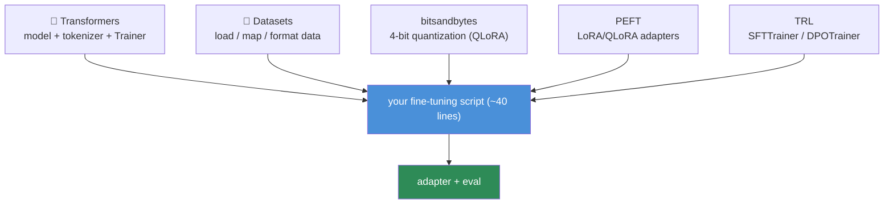
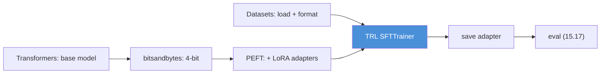

# 15.10 · Practical Fine-Tuning Stack

[⬅ 15.9 QLoRA](15.9-qlora.md) · [🏠 Module 15](../README.md) · [➡ 15.11 Hyperparameters](15.11-hyperparameters.md)

> **The lesson in one line:** The open-source fine-tuning ecosystem is five libraries that snap together — **Transformers** (models), **Datasets** (data), **PEFT** (LoRA/QLoRA adapters), **TRL** (SFT/DPO trainers), and **bitsandbytes** (4-bit quantization) — and knowing which library owns which job turns everything from 15.4–15.9 into ~40 lines of code.

---

## 🎯 Learning objectives

- Know what **Transformers, Datasets, PEFT, TRL, and bitsandbytes** each do and how they fit together.
- Assemble a **complete QLoRA fine-tuning pipeline** from these tools.
- Map each library back to the concepts (SFT, LoRA, quantization) it implements.

## ✅ Prerequisites

- [15.6 SFT](15.6-sft.md), [15.8 LoRA](15.8-lora.md), [15.9 QLoRA](15.9-qlora.md).

---

## 🧠 Mental model

> [!IMPORTANT]
> **Each library owns exactly one layer of the stack, so "fine-tuning code" is really just wiring the layers together.** Transformers loads the *model + tokenizer*; bitsandbytes *quantizes* the base to 4-bit; PEFT *attaches the LoRA adapters*; Datasets *streams and formats* your examples; TRL's `SFTTrainer`/`DPOTrainer` *runs the training loop* (masking, packing, logging) you'd otherwise hand-write ([15.6](15.6-sft.md)). You already understand what each does from first principles — this lesson is just learning **which import does the thing you already know**.



---

## The five libraries

| Library | Owns | Key objects |
|---|---|---|
| **Transformers** | models, tokenizers, generic `Trainer` | `AutoModelForCausalLM`, `AutoTokenizer`, `TrainingArguments` |
| **Datasets** | efficient data loading/mapping/streaming | `load_dataset`, `.map()`, `.train_test_split()` |
| **PEFT** | parameter-efficient adapters (LoRA, etc.) | `LoraConfig`, `get_peft_model`, `prepare_model_for_kbit_training` |
| **TRL** | RLHF-era trainers on top of Transformers | `SFTTrainer`, `DPOTrainer`, `RewardTrainer`, `PPOTrainer` |
| **bitsandbytes** | 4-bit/8-bit quantization + paged optimizers | `BitsAndBytesConfig`, `paged_adamw_8bit` |

- **Transformers ↔ TRL**: TRL trainers *wrap* the Transformers `Trainer`, adding SFT loss masking, DPO loss, packing, and chat-template handling.
- **PEFT ↔ bitsandbytes**: PEFT attaches adapters; bitsandbytes quantizes the frozen base underneath them → that combo *is* QLoRA ([15.9](15.9-qlora.md)).

---

## 💻 A complete QLoRA SFT pipeline

```python
from transformers import AutoModelForCausalLM, AutoTokenizer, BitsAndBytesConfig
from peft import LoraConfig, prepare_model_for_kbit_training
from datasets import load_dataset
from trl import SFTTrainer, SFTConfig

# 1 · tokenizer + 4-bit base (bitsandbytes → QLoRA)
tok = AutoTokenizer.from_pretrained(MODEL); tok.pad_token = tok.eos_token
bnb = BitsAndBytesConfig(load_in_4bit=True, bnb_4bit_quant_type="nf4",
                         bnb_4bit_use_double_quant=True, bnb_4bit_compute_dtype="bfloat16")
model = AutoModelForCausalLM.from_pretrained(MODEL, quantization_config=bnb, device_map="auto")
model = prepare_model_for_kbit_training(model)          # PEFT: kbit training prep

# 2 · data (Datasets) — expects a chat/text field rendered with the chat template (15.5)
ds = load_dataset("json", data_files="train.jsonl")["train"]

# 3 · LoRA config (PEFT)
lora = LoraConfig(r=16, lora_alpha=32, lora_dropout=0.05, task_type="CAUSAL_LM",
                  target_modules=["q_proj","k_proj","v_proj","o_proj"])

# 4 · SFT trainer (TRL) — handles masking, packing, template, logging
cfg = SFTConfig(output_dir="out", num_train_epochs=3, per_device_train_batch_size=4,
                gradient_accumulation_steps=4, learning_rate=2e-4, warmup_ratio=0.03,
                bf16=True, gradient_checkpointing=True, optim="paged_adamw_8bit",
                logging_steps=10, max_seq_length=1024)
trainer = SFTTrainer(model=model, args=cfg, train_dataset=ds, peft_config=lora,
                     processing_class=tok)
trainer.train()
trainer.model.save_pretrained("adapter")                # a few-MB LoRA adapter (15.8)
```

**That's the whole thing.** Every line maps to a concept: `BitsAndBytesConfig` = QLoRA's 4-bit base ([15.9](15.9-qlora.md)); `LoraConfig` = the adapters ([15.8](15.8-lora.md)); `SFTTrainer` = the masked loop ([15.6](15.6-sft.md)); `SFTConfig` = the hyperparameters ([15.11](15.11-hyperparameters.md)) and optimizations ([15.12](15.12-training-optimization.md)).

---

## How they fit together (the flow)



> [!IMPORTANT]
> **Reach for TRL's task-specific trainers (`SFTTrainer`, `DPOTrainer`, `RewardTrainer`) rather than the raw `Trainer` — they encode the fiddly details you'd otherwise get wrong.** `SFTTrainer` does chat-template rendering, completion-only loss masking, and sequence packing; `DPOTrainer` implements the DPO loss and reference model handling ([15.15](15.15-dpo.md)). Hand-rolling these (as you did once in [15.6](15.6-sft.md) to understand them) is educational but error-prone for production; the trainers are the battle-tested path.

---

## 🏭 Production examples

| Task | Stack |
|---|---|
| Single-GPU 7B SFT | Transformers + bitsandbytes(4-bit) + PEFT(LoRA) + TRL(SFTTrainer) |
| DPO alignment | + TRL `DPOTrainer` ([15.15](15.15-dpo.md)) |
| Reward model | TRL `RewardTrainer` ([15.14](15.14-rlhf.md)) |
| Large-scale distributed | + Accelerate / DeepSpeed ([15.12](15.12-training-optimization.md)) |
| Data at scale | Datasets streaming + `.map` with multiprocessing |

## ⚡ GPU memory & 💲 cost considerations

- **The stack defaults aren't tuned for you** — set `gradient_checkpointing`, `paged_adamw_8bit`, batch size, and `max_seq_length` deliberately for your GPU ([15.12](15.12-training-optimization.md)).
- **`device_map="auto"`** shards a big model across GPUs/CPU — convenient but check it's not silently offloading to slow CPU.
- **Version-pin the libraries** — this ecosystem moves fast; a minor bump can change defaults/behavior ([15.21](15.21-production-pipeline.md)).

## 🔒 Security considerations

> [!CAUTION]
> - **`trust_remote_code=True`** (some models require it) executes arbitrary code from the model repo — only for vetted sources ([15.2](15.2-base-models.md)).
> - **Datasets/models are downloaded from the Hub** — pin revisions and verify provenance to avoid supply-chain tampering ([15.20](15.20-security.md)).
> - **Your training data flows through these tools locally** — good for privacy (self-hosted), but secure caches/checkpoints containing it.

## 🚫 Common mistakes

| Mistake | Consequence |
|---|---|
| Raw `Trainer` instead of `SFTTrainer` | Missing masking/packing/template → bad results |
| No `pad_token` set | Batching/attention errors |
| Forgetting `prepare_model_for_kbit_training` | Gradient/casting issues with 4-bit |
| Unpinned library versions | Silent behavior changes between runs |
| `trust_remote_code` on untrusted repos | Arbitrary code execution |
| Wrong `target_modules` names for the arch | LoRA attaches to nothing / errors |

## 🐛 Debugging workflow

Pipeline errors? (1) **`pad_token` set?** Missing → batching errors. (2) **`target_modules` match the architecture's layer names?** (print `model` to see them). (3) **`prepare_model_for_kbit_training` called** before `get_peft_model`/trainer for 4-bit? (4) **Loss not decreasing / bad behavior** → check the trainer is masking (use `SFTTrainer`) and data is chat-templated ([15.5](15.5-instruction-datasets.md)). (5) **OOM** → checkpointing + paged optimizer + smaller batch/seq ([15.12](15.12-training-optimization.md)). Full method in [15.19](15.19-debugging.md).

## 🏋️ Exercises

1. **Map the stack.** For each of the 5 libraries, name the concept (from 15.4–15.9) it implements.
2. **Build the pipeline.** Run the QLoRA SFT script on a small dataset; produce a saved adapter.
3. **Trainer swap.** Do the same task with raw `Trainer` (manual masking) vs `SFTTrainer`; compare effort/results.
4. **Target modules.** Print a model and identify the correct `target_modules` for its attention/MLP.
5. **Load + infer.** Load the base + adapter and generate; then merge and generate; confirm equivalence.

## 🛠️ Mini project — "End-to-end QLoRA pipeline"

**Goal:** a parameterized, reproducible QLoRA SFT pipeline built from the standard stack.

**Requirements:** config-driven (model, data, LoRA, hyperparams); 4-bit load + PEFT + TRL `SFTTrainer`; dataset formatting via chat template; adapter save + merge + inference; library-version pinning; a run manifest (config + versions) for reproducibility ([15.21](15.21-production-pipeline.md)).

**Folder structure**
```
qlora-pipeline/
├── config.yaml     # model, data, lora, hparams
├── data.py         # Datasets load + template
├── train.py        # bnb + PEFT + SFTTrainer
├── serve.py        # load base+adapter / merge / generate
└── manifest.py     # config + pinned versions
```

**Testing:** produces a valid adapter; base+adapter and merged give same outputs; manifest reproduces the run.
**Evaluation:** downstream metric vs base ([15.18](15.18-base-vs-finetuned.md)).
**GPU:** report memory; fits the target GPU.
**Security:** pinned revisions; `trust_remote_code` gated; secured checkpoints.
**Future improvements:** DPO stage ([15.15](15.15-dpo.md)); distributed (Accelerate/DeepSpeed).

## 📄 Cheat sheet

| Library | Owns |
|---|---|
| **Transformers** | model + tokenizer + `Trainer` |
| **Datasets** | load / map / format data |
| **PEFT** | LoRA/QLoRA adapters (`LoraConfig`, `get_peft_model`) |
| **TRL** | `SFTTrainer` / `DPOTrainer` / `RewardTrainer` |
| **bitsandbytes** | 4-bit quantization + paged optimizers |
| **⭐ QLoRA =** | Transformers + bnb(4-bit) + PEFT(LoRA) + TRL |
| **⭐ Use** | task trainers (SFT/DPO), not raw `Trainer` |
| **⚠️** | set `pad_token`; pin versions; gate `trust_remote_code` |

## 🎴 Flashcards

- **What does each of the five libraries do?** → Transformers (models/tokenizer/Trainer), Datasets (data), PEFT (LoRA adapters), TRL (SFT/DPO trainers), bitsandbytes (4-bit quantization).
- **⭐ What combination is QLoRA in code?** → Transformers model + bitsandbytes 4-bit config + PEFT LoRA adapters + TRL SFTTrainer.
- **Why use TRL's `SFTTrainer` over the raw `Trainer`?** → It handles chat-template rendering, completion-only loss masking, and sequence packing that you'd otherwise get wrong.
- **What does `prepare_model_for_kbit_training` do?** → Prepares a 4-bit-loaded model for training (gradient checkpointing, casting) before adding adapters.
- **Which library provides the DPO trainer and paged optimizer?** → TRL provides `DPOTrainer`; bitsandbytes provides paged optimizers (`paged_adamw_8bit`).
- **What's a common batching bug and its fix?** → No `pad_token` set → set `tok.pad_token = tok.eos_token`.

## 💬 Interview questions

1. Name the five core fine-tuning libraries and what each owns.
2. How do PEFT and bitsandbytes combine to form QLoRA?
3. Why prefer TRL's task trainers over the generic `Trainer`?
4. Walk through a QLoRA SFT script line by line, mapping each to a concept.
5. What are the common setup bugs (pad token, target modules, kbit prep)?
6. What supply-chain risks does this stack introduce?

## 📝 Summary

- The fine-tuning stack is five composable libraries: **Transformers** (models), **Datasets** (data), **PEFT** (adapters), **TRL** (trainers), **bitsandbytes** (quantization) — each owning one layer.
- **QLoRA in code = Transformers model + bitsandbytes 4-bit + PEFT LoRA + TRL `SFTTrainer`** — ~40 lines wiring together everything from 15.4–15.9.
- **Use TRL's task-specific trainers** (`SFTTrainer`, `DPOTrainer`, `RewardTrainer`) — they encode masking, packing, templates, and losses correctly; the raw `Trainer` doesn't.
- **Set `pad_token`, pick correct `target_modules`, call `prepare_model_for_kbit_training`, pin versions, and gate `trust_remote_code`** — the recurring practical gotchas.

## 📚 References

1. **Hugging Face **Transformers / Datasets / PEFT / TRL** docs.** ⭐ The stack.
2. **`bitsandbytes` docs.** 4-bit quantization + paged optimizers.
3. **TRL `SFTTrainer` / `DPOTrainer` guides.** ⭐ Task trainers.
4. **[15.9 QLoRA](15.9-qlora.md).** The method this stack implements.

---

## 🧭 Navigation

| Direction | Link |
|---|---|
| ⬅ Previous | [15.9 · QLoRA](15.9-qlora.md) |
| ➡ Next | [15.11 · Hyperparameters](15.11-hyperparameters.md) |
| 🏠 Module | [Module 15](../README.md) |
| 📖 Lessons | [Lesson index](README.md) |
