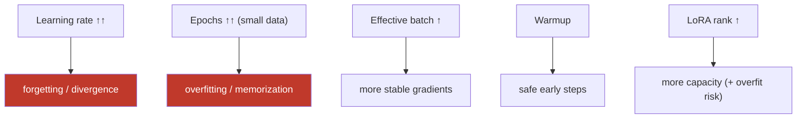

# 15.11 · Hyperparameters

[⬅ 15.10 Practical Stack](15.10-practical-stack.md) · [🏠 Module 15](../README.md) · [➡ 15.12 Training Optimization](15.12-training-optimization.md)

> **The lesson in one line:** A handful of knobs decide whether a fine-tune helps or ruins the model — **learning rate and epochs are the two that break things**, effective batch size stabilizes training, and LoRA's rank/alpha set adapter capacity — and good defaults plus watching validation loss get you most of the way.

---

## 🎯 Learning objectives

- Understand each hyperparameter: **LR, batch size, gradient accumulation, epochs, warmup, weight decay, sequence length, LoRA rank/alpha/dropout**.
- Know sensible **defaults** and how to **tune** them.
- Recognize which knobs cause **forgetting/overfitting** vs **instability**.

## ✅ Prerequisites

- [15.6 SFT](15.6-sft.md), [15.8 LoRA](15.8-lora.md), [09.5 optimization / LR](../../09-Deep-Learning/weeks/09.5-optimization.md).

---

## 🧠 Mental model

> [!IMPORTANT]
> **Fine-tuning is a *short, gentle* continuation of training — most hyperparameter mistakes come from being too aggressive and moving the weights too far from a model that already works.** The two dangerous knobs are **learning rate** (too high → the model forgets its pretraining / diverges) and **epochs** (too many → it memorizes your small dataset). Effective batch size (batch × gradient accumulation) controls gradient *stability*; warmup prevents an early destabilizing step; rank/alpha set how much the LoRA adapter *can* change. **Start from known-good defaults, watch validation loss, and stop early — don't over-tune.**



---

## The knobs

| Hyperparameter | What it does | Typical range | Notes |
|---|---|---|---|
| **⭐ Learning rate** | step size | full FT: 1e-5–5e-5; LoRA: 1e-4–3e-4 | LoRA tolerates higher LR (only adapters move); **the #1 knob** |
| **Batch size** | examples per step | as big as memory allows | larger = smoother gradients, more memory |
| **Gradient accumulation** | virtual batch = batch × accum | 2–16 | get a big *effective* batch on a small GPU ([15.12](15.12-training-optimization.md)) |
| **⭐ Epochs** | passes over the data | 1–3 (SFT) | more → overfitting on small sets |
| **Warmup** | ramp LR from 0 | 3–10% of steps | prevents an early destabilizing step |
| **Weight decay** | L2 regularization | 0–0.1 | mild; helps generalization |
| **Sequence length** | max tokens/example | task-dependent | longer = more memory ∝ length; cap to fit ([15.12](15.12-training-optimization.md)) |
| **LoRA rank `r`** | adapter capacity | 8–64 | higher = more params/quality, overfit risk ([15.8](15.8-lora.md)) |
| **LoRA alpha `α`** | adapter scale | often `2r` | `α/r` ≈ effective adapter LR |
| **LoRA dropout** | regularize adapter | 0.05–0.1 | higher for small data |

### Effective batch size
```
effective_batch = per_device_batch × grad_accumulation × num_devices
```
What matters for gradient stability is the **effective** batch, not the per-device one — so gradient accumulation lets a 24 GB GPU train at a large effective batch by trading steps for memory ([15.12](15.12-training-optimization.md)).

---

## Sensible starting defaults

| Setting | SFT (LoRA/QLoRA) default |
|---|---|
| Learning rate | **2e-4** (LoRA) / 2e-5 (full FT) |
| Epochs | **1–3** |
| Effective batch | 16–64 (via accumulation) |
| Warmup ratio | 0.03 |
| Weight decay | 0.0–0.01 |
| LR schedule | cosine decay |
| LoRA `r` / `α` | 16 / 32 |
| LoRA dropout | 0.05 |
| Max seq length | cover your data's p95, cap for memory |

> [!IMPORTANT]
> **Change one thing at a time and let validation loss be the judge.** The highest-leverage tuning is: (1) get the **learning rate** in the right order of magnitude (too high shows as loss spikes/NaN or forgetting; too low as barely-moving loss); (2) set **epochs** by early-stopping when validation loss stops improving; (3) raise **LoRA rank** only if quality is capacity-limited. Everything else is secondary. **A grid search over dozens of configs is usually wasted effort vs fixing data quality ([15.4](15.4-dataset-preparation.md)).**

---

## 🧮 Mathematical intuition

The update is `θ ← θ − η · ĝ`, where `ĝ` is the mini-batch gradient estimate. **Learning rate `η`** scales the step: fine-tuning wants small `η` because `θ` is already near a good optimum — a large step overshoots into forgetting. **Batch size** reduces the *variance* of `ĝ` (averaging more examples), so larger batches allow slightly larger stable steps but with diminishing returns. **Warmup** ramps `η` from 0 so the first (noisiest) steps don't destabilize. For **LoRA**, only `A,B` move, and `α/r` further scales their contribution — so LoRA can use a larger `η` safely (the frozen base can't be knocked off its optimum).

---

## 🏭 Production examples

| Symptom | Knob to adjust |
|---|---|
| Loss spikes / NaN | ↓ learning rate; add warmup; clip grads ([15.19](15.19-debugging.md)) |
| Loss barely moves | ↑ learning rate; check data/masking |
| Val loss rises after epoch 1 | ↓ epochs (early stop); more data |
| Underfitting a hard task | ↑ LoRA rank; + MLP targets; more epochs |
| Overfitting small data | ↓ rank; ↑ dropout; ↓ epochs; more/diverse data |
| OOM | ↓ batch (↑ accumulation); ↓ seq length ([15.12](15.12-training-optimization.md)) |

## ⚡ GPU memory & 💲 cost considerations

- **Batch size and sequence length are the memory knobs** — reduce them (and raise gradient accumulation to keep the effective batch) to fit ([15.12](15.12-training-optimization.md)).
- **Fewer epochs = cheaper** and usually *better* on small data — don't pay for overfitting.
- **Tuning runs cost money** — prefer good defaults + one LR sweep over exhaustive grids.

## 🔒 Security considerations

> [!CAUTION]
> - **Aggressive LR/epochs can erode safety alignment faster** (more weight movement) — re-run safety evals after tuning, especially with high LR/many epochs ([15.17](15.17-evaluation.md), [15.20](15.20-security.md)).
> - **More epochs increase memorization** of training data → higher PII-leakage risk; keep epochs low and scrub data ([15.4](15.4-dataset-preparation.md)).

## 🚫 Common mistakes

| Mistake | Consequence |
|---|---|
| Learning rate too high | Forgetting / divergence / NaN |
| Too many epochs on small data | Overfitting/memorization |
| No warmup | Early instability |
| Confusing per-device and effective batch | Wrong gradient stability |
| Grid-searching instead of fixing data | Wasted compute, same bad result |
| Sequence length way above data needs | Wasted memory/cost |

## 🐛 Debugging workflow

Training misbehaving? (1) **Loss NaN/spiking** → LR too high: lower it, add warmup, clip gradients. (2) **Loss flat** → LR too low *or* data/masking broken ([15.6](15.6-sft.md)). (3) **Val loss rising** → overfitting: fewer epochs (early stop), more data, lower rank, more dropout. (4) **Underfits** → higher rank/more targets/more epochs. (5) **OOM** → batch/seq down, accumulation up. Change **one** knob, re-check validation. Full method in [15.19](15.19-debugging.md).

## 🏋️ Exercises

1. **LR sweep.** Train at LR {1e-5, 5e-5, 2e-4, 1e-3}; plot loss curves; identify divergence and under-stepping.
2. **Epoch/early-stop.** Train 5 epochs logging val loss; find where overfitting begins.
3. **Effective batch.** Achieve effective batch 32 via {batch 8 × accum 4} and {batch 4 × accum 8}; confirm equivalence in gradients/memory.
4. **Rank vs data.** On a small vs large dataset, compare `r=8` vs `r=64`; show overfitting on small data at high rank.
5. **Warmup ablation.** Train with/without warmup at a borderline LR; observe early-step stability.

## 🛠️ Mini project — "Hyperparameter tuner"

**Goal:** a small tuner that sweeps the high-leverage knobs and picks by validation.

**Requirements:** config sweep over LR and epochs (+ optionally rank); effective-batch computation; early stopping on val loss; a results table (config → val loss/metric); memory guardrails (auto-adjust batch/seq to fit).

**Folder structure**
```
hparam-tuner/
├── sweep.py        # LR × epochs (× rank) grid
├── batch.py        # effective batch + memory fit
├── earlystop.py    # val-loss early stopping
└── report.py       # config → metric table
```

**Testing:** early stop triggers on rising val loss; effective-batch math correct; OOM auto-avoided.
**Evaluation:** best config vs default on the task metric ([15.18](15.18-base-vs-finetuned.md)).
**GPU:** memory-aware batch/seq selection.
**Security:** low epochs by default (less memorization); post-tune safety re-eval.
**Future improvements:** LR-finder; Bayesian search; cost-aware early stopping.

## 📄 Cheat sheet

| Knob | Default | Breaks when… |
|---|---|---|
| **⭐ Learning rate** | 2e-4 (LoRA) / 2e-5 (full) | too high → forget/NaN |
| **⭐ Epochs** | 1–3 | too many → overfit |
| **Effective batch** | 16–64 | (stability; via accumulation) |
| **Warmup** | 3% | none → early instability |
| **Weight decay** | 0–0.01 | (mild regularization) |
| **Seq length** | data p95 | too long → OOM |
| **LoRA r / α** | 16 / 32 | high r on small data → overfit |
| **LoRA dropout** | 0.05 | (raise for small data) |
| **⭐ Method** | change one knob → watch val loss → early stop |

## 🎴 Flashcards

- **⭐ Which two hyperparameters most often ruin a fine-tune?** → Learning rate (too high → forgetting/divergence) and epochs (too many → overfitting/memorization).
- **What learning rates are typical?** → ~2e-5 for full fine-tuning, ~1e-4–3e-4 for LoRA (LoRA tolerates higher LR since only adapters move).
- **What is effective batch size?** → per-device batch × gradient accumulation × devices — what actually governs gradient stability.
- **Why use warmup?** → To ramp the LR from 0 so the noisiest early steps don't destabilize the model.
- **How do you set the number of epochs?** → Early-stop when validation loss stops improving; 1–3 is typical for SFT.
- **How do LoRA rank/alpha affect tuning?** → Rank sets adapter capacity (higher = more params + overfit risk); α scales the update (α/r ≈ effective adapter LR).
- **Grid search vs data quality?** → Fixing data quality usually beats exhaustive hyperparameter search; prefer good defaults + one LR sweep.

## 💬 Interview questions

1. Which hyperparameters are most dangerous in fine-tuning, and why?
2. How do learning rate and epochs relate to forgetting and overfitting?
3. What is effective batch size, and how does gradient accumulation help?
4. Why can LoRA use a higher learning rate than full fine-tuning?
5. How do you decide the number of epochs?
6. How do LoRA rank/alpha/dropout interact with dataset size?

## 📝 Summary

- Fine-tuning is a **short, gentle** continuation of training; the two knobs that break it are **learning rate** (too high → forgetting/divergence) and **epochs** (too many → overfitting).
- **Effective batch** (batch × accumulation) governs gradient stability, **warmup** protects early steps, and **LoRA rank/alpha** set adapter capacity; sensible defaults (LR 2e-4 LoRA, 1–3 epochs, r/α 16/32) get you most of the way.
- **Tune by changing one knob and watching validation loss, then early-stop** — exhaustive grids usually lose to fixing **data quality** ([15.4](15.4-dataset-preparation.md)).
- Aggressive LR/epochs also **erode safety alignment and increase memorization** — keep them modest and re-evaluate safety ([15.17](15.17-evaluation.md), [15.20](15.20-security.md)).

## 📚 References

1. **[09.5 Optimization](../../09-Deep-Learning/weeks/09.5-optimization.md).** LR, batch, schedules.
2. **[15.8 LoRA](15.8-lora.md).** Rank/alpha/dropout.
3. **TRL `SFTConfig` / Transformers `TrainingArguments` docs.** The knobs in practice.
4. **[15.13 Catastrophic Forgetting](15.13-catastrophic-forgetting.md).** LR's role in forgetting.

---

## 🧭 Navigation

| Direction | Link |
|---|---|
| ⬅ Previous | [15.10 · Practical Fine-Tuning Stack](15.10-practical-stack.md) |
| ➡ Next | [15.12 · Training Optimization](15.12-training-optimization.md) |
| 🏠 Module | [Module 15](../README.md) |
| 📖 Lessons | [Lesson index](README.md) |
