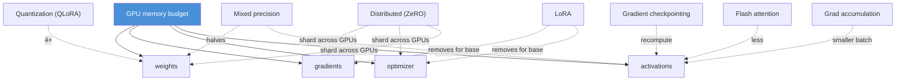
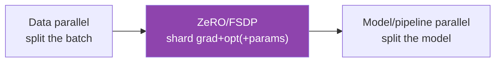

# 15.12 · Training Optimization

[⬅ 15.11 Hyperparameters](15.11-hyperparameters.md) · [🏠 Module 15](../README.md) · [➡ 15.13 Catastrophic Forgetting](15.13-catastrophic-forgetting.md)

> **The lesson in one line:** Fine-tuning is almost always **memory-bound**, so the craft is fitting training into your GPU — **mixed precision, gradient checkpointing, gradient accumulation, flash attention, quantization, and (at scale) distributed training** are the levers, each trading some compute or complexity for the memory that lets the run happen at all.

---

## 🎯 Learning objectives

- Apply **mixed precision, gradient checkpointing, gradient accumulation, flash attention, quantization** to fit training in memory.
- Understand the **memory vs compute trade-off** each makes.
- Know when **distributed training** (data/model parallel, ZeRO) is needed.

## ✅ Prerequisites

- [15.7 full-FT memory](15.7-full-fine-tuning.md), [15.9 QLoRA](15.9-qlora.md), [09.14 performance/memory](../../09-Deep-Learning/weeks/09.14-performance.md).

---

## 🧠 Mental model

> [!IMPORTANT]
> **Your GPU has a fixed memory budget, and training must fit: weights + gradients + optimizer states + activations. Every optimization trades something (compute, a little speed, or complexity) to shrink one of those four.** Mixed precision halves weight/activation bytes; gradient checkpointing recomputes activations instead of storing them; gradient accumulation shrinks the per-step batch; quantization (QLoRA) shrinks the base weights; flash attention shrinks attention's activation memory; distributed training spreads it across GPUs. **You stack these until the run fits — and LoRA/QLoRA already did most of the work by removing gradients/optimizer for 99% of params.**



---

## The optimization levers

### Mixed precision (bf16/fp16)
Store/compute in 16-bit instead of 32-bit → **halves** weight and activation memory and speeds matmuls on modern GPUs, with an fp32 master copy for stability ([15.7](15.7-full-fine-tuning.md)). **bf16** (wider range) is preferred where supported. Nearly free; use it always.

### Gradient checkpointing
Don't store every layer's activations for the backward pass — **recompute them** during backprop from saved checkpoints. Trades **~30% more compute for a large activation-memory reduction** — the go-to when activations (long sequences, big batches) blow the budget.

### Gradient accumulation
Run several small forward/backward passes, **accumulate their gradients**, then step once — giving a large **effective batch** ([15.11](15.11-hyperparameters.md)) without the memory of a large per-step batch. Trades **more steps (time)** for memory.

### Flash attention (conceptual)
An attention algorithm that computes exact attention **without materializing the full N×N attention matrix** in memory — it tiles the computation and recomputes on the fly ([11.4](../../11-LLMs/weeks/11.4-attention.md)). Reduces attention's memory from O(N²) to O(N) and speeds it up; enable it for long sequences.

### Quantization
Load the base in **4-bit (QLoRA, [15.9](15.9-qlora.md))** to cut base-weight memory 4×. The training-time memory optimization that makes large models fit at all.

### Distributed training (introduction)
When one GPU isn't enough:
- **Data parallel** — replicate the model on each GPU, split the batch, average gradients (simple; doesn't reduce per-GPU model memory).
- **ZeRO / FSDP** — **shard** optimizer states, gradients, and (optionally) parameters across GPUs, so each holds only a slice — the key to full-fine-tuning large models ([15.7](15.7-full-fine-tuning.md)).
- **Model/pipeline/tensor parallel** — split the model itself across GPUs for models too big for one card.



---

## The memory–compute trade-off

| Optimization | Shrinks | Costs |
|---|---|---|
| **Mixed precision** | weights + activations (½) | ~nothing (often faster) |
| **Gradient checkpointing** | activations (large) | ~30% more compute |
| **Gradient accumulation** | activation (smaller batch) | more steps (time) |
| **Flash attention** | attention activations (O(N²)→O(N)) | ~nothing (faster) |
| **Quantization (QLoRA)** | base weights (4×) | slight de-quant overhead |
| **Distributed (ZeRO)** | grad/opt/params per GPU | inter-GPU communication + complexity |

> [!IMPORTANT]
> **Stack in this order until it fits: mixed precision (always) → LoRA/QLoRA (removes the biggest costs) → gradient checkpointing → gradient accumulation → flash attention → distributed.** For most single-GPU fine-tuning, **QLoRA + mixed precision + gradient checkpointing + accumulation** is enough to train a 7B–13B on 24 GB. Reach for **distributed training only when a single GPU genuinely can't hold even the QLoRA setup** (very large models or full FT). Add complexity last.

---

## 🧮 Mathematical intuition

Activation memory scales roughly as **batch × seq_len × hidden × layers**; attention's naive term adds **batch × heads × seq_len²**. Gradient checkpointing turns the layer term from "store all" to "store √L checkpoints + recompute", cutting activation memory dramatically at the cost of one extra forward pass. Flash attention removes the seq_len² *materialization* by never writing the full score matrix. Gradient accumulation divides the batch factor. Each lever attacks a specific term in the memory equation — knowing which term dominates (long sequences → attention/activations; big model → weights/optimizer) tells you which lever to pull.

---

## 🏭 Production examples

| Situation | Stack |
|---|---|
| 7B QLoRA on 24 GB | bf16 + 4-bit + grad-checkpointing + accumulation |
| Long-context fine-tune | + flash attention |
| 13B full FT | ZeRO-3 / FSDP across GPUs |
| 70B full FT | model parallel + ZeRO |
| Fast iteration on ample GPUs | mixed precision + LoRA (skip checkpointing for speed) |

## ⚡ GPU memory & 💲 cost considerations

- **Gradient checkpointing trades ~30% compute (time/cost) for memory** — worth it to fit, skip it if you already fit and want speed.
- **Distributed training adds communication overhead and cost** — more GPUs isn't linearly faster; only scale out when necessary.
- **Flash attention and mixed precision are near-free speedups** — enable by default.
- **Profile first**: know whether activations or weights/optimizer dominate before choosing a lever.

## 🔒 Security considerations

> [!CAUTION]
> - **Distributed training spreads data/artifacts across nodes** — secure inter-node communication and multi-node checkpoint storage ([15.21](15.21-production-pipeline.md)).
> - **Checkpoints (full or sharded) contain the adapted model / data influence** — protect them ([15.20](15.20-security.md)).
> - Optimizations don't change *what* is learned — safety/privacy properties are unaffected by them (evaluate the *model*, not the training recipe).

## 🚫 Common mistakes

| Mistake | Consequence |
|---|---|
| No mixed precision | 2× memory for no reason |
| Jumping to distributed too early | Needless complexity/cost; QLoRA would've fit |
| Gradient checkpointing when you already fit | Slower for no benefit |
| Ignoring flash attention on long sequences | O(N²) attention OOM |
| Confusing per-device and effective batch | Wrong stability with accumulation ([15.11](15.11-hyperparameters.md)) |
| Not profiling which term dominates | Pulling the wrong lever |

## 🐛 Debugging workflow

OOM during training? (1) **Enable mixed precision** (if not). (2) **Use LoRA/QLoRA** — biggest single reduction ([15.8](15.8-lora.md)–[15.9](15.9-qlora.md)). (3) **Turn on gradient checkpointing**. (4) **Reduce per-device batch, raise accumulation** to keep effective batch. (5) **Reduce max sequence length**; enable **flash attention** for long context. (6) Only then consider **distributed**. Check *where* memory goes (weights vs activations) to pick the right lever. Full method in [15.19](15.19-debugging.md).

## 🏋️ Exercises

1. **Lever ablation.** Measure memory with/without mixed precision, checkpointing, and QLoRA; attribute each reduction.
2. **Effective batch.** Hit effective batch 32 on a small GPU via accumulation; confirm training matches a big-batch run.
3. **Checkpointing cost.** Measure the compute/time increase from gradient checkpointing and the memory it frees.
4. **Long context.** Fine-tune with long sequences with/without flash attention; observe the O(N²) OOM.
5. **Fit ladder.** Given a model that OOMs, apply levers in order until it fits; document each step's effect.

## 🛠️ Mini project — "Fit-it optimizer"

**Goal:** a tool that, given a model + GPU, applies the optimization ladder until training fits and reports the config.

**Requirements:** memory estimator (weights/grad/opt/activations, [15.7](15.7-full-fine-tuning.md)); toggle levers (mixed precision, LoRA/QLoRA, checkpointing, accumulation, flash attention); apply in order until fit; recommend distributed if single-GPU impossible; output the final recipe.

**Folder structure**
```
fit-it/
├── estimate.py     # per-term memory model
├── levers.py       # apply optimizations in order
├── distribute.py   # when/how to shard (ZeRO/FSDP)
└── recipe.py       # final config + expected memory
```

**Testing:** recommended recipe fits the target GPU; levers applied in sensible order; distributed only when needed.
**Evaluation:** predicted vs actual memory on real runs.
**GPU:** the whole point — a fitting recipe.
**Security:** note checkpoint/inter-node protection for distributed.
**Future improvements:** auto-profile the dominant memory term; ZeRO-stage recommender.

## 📄 Cheat sheet

| Lever | Shrinks / effect |
|---|---|
| **Mixed precision (bf16)** | ½ weights+activations; ~free — **always** |
| **LoRA/QLoRA** | removes base grad/opt (+4× weights); biggest win |
| **Gradient checkpointing** | activations ↓↓ for ~30% more compute |
| **Gradient accumulation** | smaller per-step batch → memory ↓; more steps |
| **Flash attention** | attention O(N²)→O(N) activations; faster |
| **Quantization** | 4-bit base weights (QLoRA) |
| **Distributed (ZeRO/FSDP)** | shard grad/opt/params across GPUs |
| **⭐ Order** | mixed-prec → LoRA/QLoRA → checkpoint → accum → flash → distributed |

## 🎴 Flashcards

- **⭐ What four things must fit in GPU memory during training?** → Weights, gradients, optimizer states, and activations.
- **What does mixed precision do, and is it worth it?** → Stores/computes in 16-bit (halving weight/activation memory, faster matmuls) with an fp32 master copy — nearly free; use always.
- **What does gradient checkpointing trade?** → ~30% more compute (recomputing activations in backward) for a large activation-memory reduction.
- **What does gradient accumulation achieve?** → A large effective batch without the memory of a large per-step batch, by accumulating gradients over several small passes.
- **What does flash attention save?** → Attention activation memory (O(N²)→O(N)) by never materializing the full score matrix — and it's faster.
- **⭐ In what order do you apply optimizations?** → Mixed precision → LoRA/QLoRA → gradient checkpointing → accumulation → flash attention → distributed (last).
- **When do you need distributed training?** → Only when a single GPU can't hold even the QLoRA setup — very large models or full fine-tuning.

## 💬 Interview questions

1. What must fit in memory during training, and how does each optimization shrink it?
2. What does gradient checkpointing trade, and when do you use it?
3. Explain gradient accumulation and effective batch size.
4. What is flash attention and what memory problem does it solve?
5. In what order would you apply optimizations to fit a training run?
6. When is distributed training (ZeRO/FSDP) necessary, and what does it shard?

## 📝 Summary

- Fine-tuning is **memory-bound**: weights + gradients + optimizer + activations must fit, and each optimization **trades compute/complexity for memory**.
- **Mixed precision (always) → LoRA/QLoRA (biggest win) → gradient checkpointing → gradient accumulation → flash attention → distributed (last)** is the stacking order.
- Each lever attacks a specific memory term — **profile which dominates** (activations for long sequences; weights/optimizer for big models) to pull the right one.
- **Distributed training (ZeRO/FSDP, model parallel)** is for when a single GPU truly can't fit even QLoRA — add its complexity/cost only then.

## 📚 References

1. **[09.14 Performance & Memory](../../09-Deep-Learning/weeks/09.14-performance.md).** Mixed precision, memory-bound training.
2. **Dao et al. (2022) — _FlashAttention_.** ⭐ O(N) attention memory.
3. **Rajbhandari et al. (2020) — _ZeRO_ / PyTorch FSDP.** Sharded distributed training.
4. **[15.9 QLoRA](15.9-qlora.md).** Quantization as the key memory optimization.

---

## 🧭 Navigation

| Direction | Link |
|---|---|
| ⬅ Previous | [15.11 · Hyperparameters](15.11-hyperparameters.md) |
| ➡ Next | [15.13 · Catastrophic Forgetting](15.13-catastrophic-forgetting.md) |
| 🏠 Module | [Module 15](../README.md) |
| 📖 Lessons | [Lesson index](README.md) |
