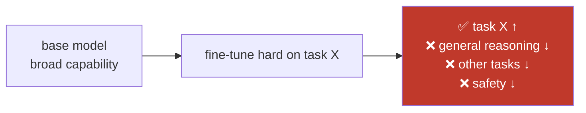
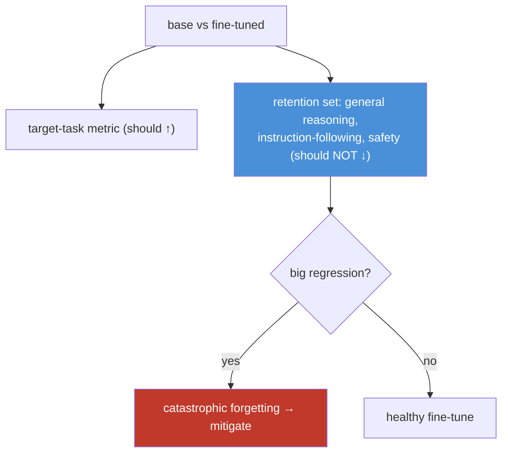

# 15.13 · Catastrophic Forgetting

[⬅ 15.12 Training Optimization](15.12-training-optimization.md) · [🏠 Module 15](../README.md) · [➡ 15.14 RLHF](15.14-rlhf.md)

> **The lesson in one line:** Fine-tuning can make a model *worse* — as it learns your task it can **overwrite the general capabilities** it learned in pretraining ("catastrophic forgetting"), so you detect it by evaluating on *held-out general tasks*, not just your task, and reduce it with a gentle learning rate, diverse data, and adapter-based methods like LoRA.

---

## 🎯 Learning objectives

- Understand **catastrophic forgetting** — what it is and why it occurs.
- **Detect** it by evaluating general capability, not just the target task.
- **Reduce** it: learning rate, dataset diversity, regularization, adapters (LoRA).

## ✅ Prerequisites

- [15.6 SFT](15.6-sft.md), [15.8 LoRA](15.8-lora.md), [15.11 hyperparameters](15.11-hyperparameters.md).

---

## 🧠 Mental model

> [!IMPORTANT]
> **A model's knowledge lives in shared weights, so training hard on a narrow task can *rewrite* the weights that also encoded everything else.** The model has limited capacity and no explicit memory of "keep these skills"; gradient descent on your data only cares about *your* loss, so it happily degrades unrelated abilities to fit your examples better. The result: your task metric goes up while **general reasoning, other languages, instruction-following, or safety quietly degrade** — a model that's better at the one thing and worse at everything else. **The danger is invisible if you only measure your task.**



---

## Why it occurs

- **Shared representations** — the same weights encode many capabilities; changing them for task X perturbs the others.
- **Objective myopia** — SFT loss only rewards fitting *your* data; it has no term for "preserve pretraining."
- **Aggressive training** — high learning rate, many epochs, or a small/narrow dataset push the weights far from the pretrained optimum ([15.11](15.11-hyperparameters.md)), amplifying overwrite.
- **Full fine-tuning** moves *all* weights, so it forgets more than adapter methods that touch few.

## Detecting it

> [!IMPORTANT]
> **You cannot detect forgetting by measuring your target task — you must evaluate the model on *general* capabilities it should have kept.** Build a **retention eval set**: a battery of held-out general tasks (reasoning, instruction-following, a few standard benchmarks, and — critically — **safety**) run on **both base and fine-tuned** models ([15.18](15.18-base-vs-finetuned.md)). If the fine-tuned model *regresses* on these while gaining on your task, that's forgetting. Track it every run; a task win that comes with broad regressions may be a net loss.



## Reducing it

| Lever | How it helps |
|---|---|
| **Lower learning rate** | smaller weight moves → less overwrite ([15.11](15.11-hyperparameters.md)) |
| **Fewer epochs / early stop** | stop before the model over-specializes |
| **Dataset diversity** | include varied/general examples so the model doesn't collapse onto one narrow pattern |
| **Mix in general data** | add a fraction of general instruction data (replay) to preserve broad ability |
| **Regularization** | weight decay; keeping weights near the base (e.g., L2-to-init) |
| **⭐ Adapter methods (LoRA)** | freeze the base, learn a small `ΔW` → the pretrained weights are literally untouched ([15.8](15.8-lora.md)) |

> [!IMPORTANT]
> **LoRA is the strongest structural defense against forgetting: because the base weights are frozen, the general capability physically can't be overwritten — the adapter only *adds* behavior.** You can even *remove* the adapter to recover the exact base model, or swap adapters per task. This is a major reason LoRA is the default ([15.3](15.3-strategy-selection.md)): it's not just cheaper, it's *safer* for capability retention. Full fine-tuning has no such guarantee and needs the other levers (low LR, replay, early stop) more.

---

## 🧮 Mathematical intuition

Pretraining leaves `θ*` at a point good for many tasks. SFT minimizes `L_task(θ)`, whose gradient points toward *your* task's optimum with **no term penalizing distance from `θ*`**. Each step `θ ← θ − η∇L_task` can decrease `L_task` while increasing loss on other tasks. Mitigations add pressure to stay near `θ*`: **low `η`** (small steps), **weight decay / L2-to-init** (an explicit `‖θ−θ*‖²` penalty), **replay** (add general data so the gradient includes general-task signal), and **LoRA** (constrain the move to a low-rank `BA` added to a frozen `θ*`, so `θ*` itself never changes).

---

## 🏭 Production examples

| Practice | Why |
|---|---|
| Retention eval (general + safety) every run | catch forgetting before shipping |
| LoRA over full FT for narrow tasks | base capability preserved |
| Replay ~5–20% general data | preserve broad ability in full FT |
| Low LR + early stop | gentle adaptation |
| Compare base vs tuned on both axes | ship only net improvements ([15.18](15.18-base-vs-finetuned.md)) |

## ⚡ GPU memory & 💲 cost considerations

- **Retention evaluation adds eval cost** (running general benchmarks) — budget for it; it's cheaper than shipping a regressed model.
- **Replay data increases dataset/compute size** modestly — worth it for full FT.
- **LoRA avoids forgetting *and* saves memory** — the retention benefit is essentially free with the method you'd pick anyway.

## 🔒 Security considerations

> [!CAUTION]
> - **Forgetting can erase safety alignment** — a fine-tune that improves your task can make the model *less safe* (more willing to produce harmful content) if safety behaviors are overwritten. **Always include safety in the retention eval** ([15.17](15.17-evaluation.md), [15.20](15.20-security.md)).
> - **Instruction-following / refusal behavior** can degrade too, weakening guardrails — re-test after tuning.

## 🚫 Common mistakes

| Mistake | Consequence |
|---|---|
| Measuring only the target task | Ship a model that regressed everywhere else |
| No safety in the retention eval | Silent alignment erosion |
| High LR / many epochs on narrow data | Severe forgetting |
| Full FT when LoRA would do | Unnecessary forgetting risk |
| No general/replay data in the mix | Model collapses onto the narrow task |
| Assuming a task win = a better model | Net regression hidden |

## 🐛 Debugging workflow

Fine-tuned model "worse in general"? (1) **Run the retention eval** (general + safety) on base vs tuned — confirm and quantify the regression. (2) **Switch to LoRA** if you were doing full FT (base frozen → no overwrite). (3) **Lower LR, fewer epochs, early-stop.** (4) **Add diversity / replay general data.** (5) Re-check both target and retention metrics — accept only a **net** improvement. Full method in [15.19](15.19-debugging.md).

## 🏋️ Exercises

1. **Induce it.** Fine-tune hard (high LR, many epochs) on a narrow task; measure regression on a general benchmark.
2. **Retention eval.** Build a small retention set (reasoning + instruction-following + safety); compare base vs tuned.
3. **LoRA vs full FT.** Fine-tune the same task both ways; show LoRA forgets less on the retention set.
4. **Replay.** Add 10% general data to a full-FT run; measure the reduction in forgetting.
5. **LR effect.** Sweep LR; plot target-task gain vs retention-set loss; find the sweet spot.

## 🛠️ Mini project — "Forgetting detector"

**Goal:** a harness that quantifies catastrophic forgetting and recommends mitigations.

**Requirements:** a retention eval set (general reasoning, instruction-following, safety); run base vs tuned on target + retention; a forgetting score (retention delta); mitigation suggestions (LoRA, LR, replay, early stop); a net-improvement gate ([15.18](15.18-base-vs-finetuned.md)).

**Folder structure**
```
forgetting/
├── retention.py    # general + safety eval set
├── measure.py      # base vs tuned on both axes
├── score.py        # forgetting metric + net gate
└── mitigate.py     # recommendations
```

**Testing:** detects induced forgetting; LoRA scores lower forgetting than full FT; safety regressions flagged.
**Evaluation:** target gain vs retention loss; net-improvement decision.
**GPU:** retention-eval cost reported.
**Security:** safety in the retention set is mandatory ([15.20](15.20-security.md)).
**Future improvements:** automatic replay-ratio tuning; per-capability forgetting breakdown.

## 📄 Cheat sheet

| Concept | One line |
|---|---|
| **⭐ Catastrophic forgetting** | fine-tuning overwrites general capabilities |
| **Why** | shared weights + objective only rewards *your* task |
| **⭐ Detect** | eval on held-out **general + safety** tasks (base vs tuned) |
| **Worsened by** | high LR · many epochs · narrow data · full FT |
| **Reduce: LR/epochs** | lower/fewer → smaller weight moves |
| **Reduce: diversity/replay** | mix general data to preserve breadth |
| **Reduce: regularization** | weight decay / L2-to-init |
| **⭐ Reduce: LoRA** | frozen base → can't be overwritten (strongest) |
| **Rule** | accept only a **net** improvement |

## 🎴 Flashcards

- **⭐ What is catastrophic forgetting?** → When fine-tuning on a narrow task overwrites the general capabilities the model learned in pretraining, making it worse at everything else.
- **Why does it happen?** → Capabilities share weights, and the SFT objective only rewards fitting your task — it has no term to preserve pretraining, so gradient descent degrades unrelated abilities.
- **⭐ How do you detect it?** → Evaluate the model on held-out *general* tasks (reasoning, instruction-following, safety) — not just your task — comparing base vs fine-tuned.
- **What worsens forgetting?** → High learning rate, too many epochs, narrow/small datasets, and full fine-tuning (all weights move).
- **⭐ Why does LoRA reduce forgetting?** → The base weights are frozen, so the general capability physically can't be overwritten; the adapter only adds behavior (and can be removed).
- **What else reduces it?** → Lower LR, early stopping, dataset diversity, replaying general data, and weight decay / staying near the base.
- **What's the shipping rule?** → Accept a fine-tune only if it's a *net* improvement (target gain outweighs any retention/safety regression).

## 💬 Interview questions

1. What is catastrophic forgetting, and why does fine-tuning cause it?
2. Why can't you detect it by measuring the target task, and what do you measure instead?
3. What training choices worsen forgetting?
4. Why does LoRA structurally reduce forgetting compared to full fine-tuning?
5. How does replaying general data help?
6. How does forgetting threaten safety, and how do you guard against it?

## 📝 Summary

- **Catastrophic forgetting**: fine-tuning on a narrow task can **overwrite general capabilities** (reasoning, other tasks, instruction-following, **safety**) because they share weights and the objective only rewards your task.
- **Detect it** with a **retention eval** on held-out general + safety tasks, base vs tuned — a task win with broad regressions can be a net loss.
- **Reduce it** with a **lower LR, fewer epochs/early stop, dataset diversity, replaying general data, regularization**, and above all **LoRA** (frozen base → general capability can't be overwritten).
- **Ship only net improvements**, and **always include safety** in the retention eval ([15.17](15.17-evaluation.md), [15.18](15.18-base-vs-finetuned.md)).

## 📚 References

1. **McCloskey & Cohen (1989) — _Catastrophic Interference_.** ⭐ The phenomenon.
2. **Kirkpatrick et al. (2017) — _Elastic Weight Consolidation_.** Regularizing toward prior weights.
3. **[11.11 Fine-Tuning](../../11-LLMs/weeks/11.11-fine-tuning.md).** Forgetting in LLM fine-tuning.
4. **[15.8 LoRA](15.8-lora.md).** Frozen base as a retention guarantee.

---

## 🧭 Navigation

| Direction | Link |
|---|---|
| ⬅ Previous | [15.12 · Training Optimization](15.12-training-optimization.md) |
| ➡ Next | [15.14 · RLHF](15.14-rlhf.md) |
| 🏠 Module | [Module 15](../README.md) |
| 📖 Lessons | [Lesson index](README.md) |
