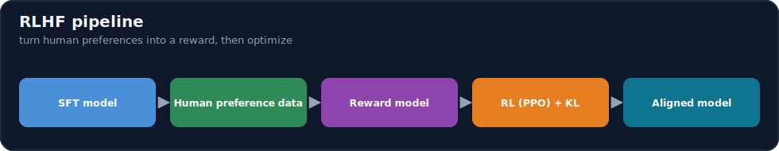
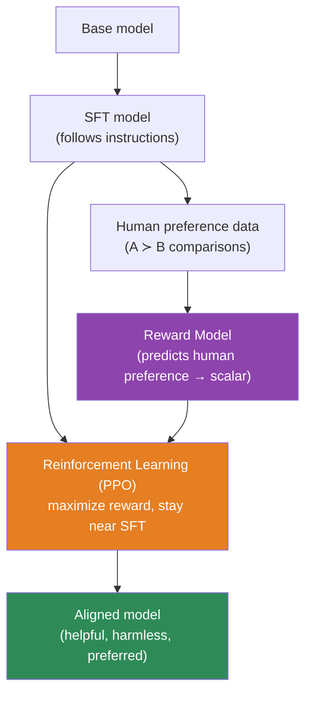
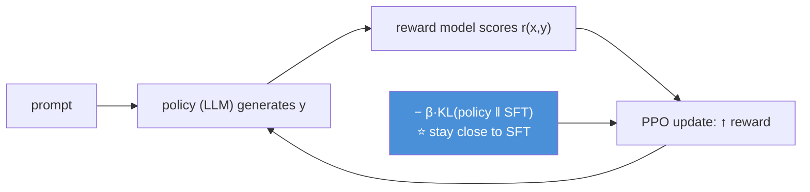

# 15.14 · RLHF ⭐

[⬅ 15.13 Catastrophic Forgetting](15.13-catastrophic-forgetting.md) · [🏠 Module 15](../README.md) · [➡ 15.15 DPO](15.15-dpo.md)

> **The lesson in one line:** SFT teaches the model to give *a* good answer; RLHF teaches it to give the answer humans *prefer* — by collecting human preference comparisons, training a **reward model** to predict them, and then using **reinforcement learning (PPO)** to optimize the model against that reward, which is how raw instruct models became genuinely helpful, harmless assistants.



---

## 🎯 Learning objectives

- Understand the **RLHF pipeline**: SFT → preference data → reward model → RL (PPO) → aligned model.
- Understand **preference datasets, reward models, human feedback, and PPO** conceptually and technically.
- Know **why RLHF works** and its practical difficulties (motivating DPO, [15.15](15.15-dpo.md)).

## ✅ Prerequisites

- [15.6 SFT](15.6-sft.md), [11.13 alignment (RLHF/DPO)](../../11-LLMs/weeks/11.13-alignment.md), [08 RL intuition](../../08-Machine-Learning/README.md).

---

## 🧠 Mental model

> [!IMPORTANT]
> **SFT can only imitate the answers in your dataset; RLHF can push *beyond* them toward what people actually prefer — because it's far easier for humans to *compare* two answers than to *write* the perfect one.** The trick: humans rank pairs of model outputs (A better than B), a **reward model** learns to predict those rankings (turning "human preference" into a number), and then **RL optimizes the LLM to produce high-reward outputs**. So RLHF converts cheap human *comparisons* into a differentiable signal that shapes behavior no SFT dataset could specify. This three-step dance — **preferences → reward model → RL** — is what turned instruction-tuned models into aligned assistants.



---

## The pipeline, step by step

### 1. Start from an SFT model
RLHF **refines** an instruction-tuned model ([15.6](15.6-sft.md)) — it needs a model that already produces reasonable answers to rank.

### 2. Collect preference data
For a prompt, sample **two (or more) responses** from the model; a human labels which is **better** (`chosen ≻ rejected`). Comparisons are cheaper and more reliable than absolute scores or writing ideal answers. This yields a dataset of **(prompt, chosen, rejected)** triples ([15.15](15.15-dpo.md) uses the same data).

### 3. Train a reward model
Train a model (usually the SFT model + a scalar head) to output a **reward** `r(prompt, response)` such that `r(chosen) > r(rejected)`. The loss is the **Bradley–Terry** pairwise objective:

$$\mathcal{L}_{RM} = -\log \sigma\big(r(\text{chosen}) - r(\text{rejected})\big)$$

The reward model has learned to **predict human preference** as a number — a differentiable proxy for "what people like."

### 4. Optimize with RL (PPO)
Now treat generation as an RL problem: the LLM is the **policy**, generating a response is an **action**, and the reward model scores it. **PPO** updates the policy to maximize expected reward — *plus a crucial KL penalty* keeping it close to the SFT model:

$$\text{objective} = \mathbb{E}\big[\, r(x,y)\, \big] - \beta\, \mathrm{KL}\big(\pi_\theta \,\|\, \pi_{\text{SFT}}\big)$$



> [!IMPORTANT]
> **The KL penalty is what keeps RLHF from breaking the model.** Without it, PPO would chase the reward model's quirks — producing degenerate, high-reward-but-nonsense text (**reward hacking**) and forgetting its language ability. The `β·KL(π ‖ π_SFT)` term anchors the policy near the trusted SFT model, so it improves *toward* preferences without wandering off. Tuning `β` (how much freedom to move) is central and finicky — one of RLHF's practical headaches.

---

## Why RLHF is powerful — and hard

| ✅ Power | ❌ Difficulty |
|---|---|
| Optimizes for *preference*, beyond imitation | **Four models in play** (policy, ref, reward, value) — heavy |
| Cheap human *comparisons* as signal | **Unstable** — PPO is finicky; reward hacking |
| Shapes helpfulness/harmlessness SFT can't | **Expensive** infra + compute |
| The method behind modern assistants | Reward model can be **gamed**/misspecified |

> [!IMPORTANT]
> **RLHF works, but its complexity — training a reward model, running PPO with a reference and value model, tuning KL, guarding against reward hacking — is exactly why DPO ([15.15](15.15-dpo.md)) was invented.** DPO gets most of RLHF's benefit from the *same preference data* with **no reward model and no RL loop** — a single stable supervised-style objective. For most practitioners, **DPO is the practical default; RLHF is the heavyweight you understand conceptually and reach for when you need its full power** (and have the infrastructure). This lesson is the *why* behind DPO.

---

## 🧮 Mathematical intuition

The reward model turns preference comparisons into a scalar via **Bradley–Terry**: the probability that `chosen` beats `rejected` is `σ(r_chosen − r_rejected)`, so minimizing `−log σ(Δr)` makes the reward gap match observed preferences. PPO then maximizes `E[r] − β·KL`, a **regularized policy-gradient** objective: the reward pulls toward preferred outputs, the KL term is a leash to the SFT policy. The deep result DPO later exploits: **the optimal RLHF policy has a closed form in terms of the reward and the reference policy**, which lets you skip the reward model and RL entirely and optimize the policy *directly* on preferences ([15.15](15.15-dpo.md)).

---

## 🏭 Production examples

| Use | Notes |
|---|---|
| Frontier assistant alignment | full RLHF (reward model + PPO) at scale |
| Helpfulness/harmlessness tuning | preference data on those axes |
| Most teams | **DPO** instead (simpler, [15.15](15.15-dpo.md)) |
| Reward model as a standalone judge | reuse the RM to score/rank outputs |

## ⚡ GPU memory & 💲 cost considerations

- **RLHF is the most resource-intensive alignment method** — you hold multiple models in memory (policy, reference, reward, and PPO's value/critic) and run generation + scoring + updates in a loop.
- **Reward-model training** is a separate (cheaper) run; **PPO** is the expensive, unstable part.
- **DPO removes most of this cost** — one model pair, no RL loop ([15.15](15.15-dpo.md)) — hence its popularity.

## 🔒 Security considerations

> [!CAUTION]
> - **Reward hacking is a safety issue** — a policy that games a misspecified reward can produce confidently wrong or subtly harmful outputs that *score* well; red-team the aligned model, don't trust the reward ([15.17](15.17-evaluation.md)).
> - **Preference data encodes the labelers' values/biases** — biased comparisons → biased alignment; curate and audit annotators ([15.20](15.20-security.md)).
> - **Alignment can be undone by later fine-tuning** — RLHF safety is not permanent; re-check after any further tuning ([15.13](15.13-catastrophic-forgetting.md)).

## 🚫 Common mistakes

| Mistake | Consequence |
|---|---|
| RLHF without a KL penalty | Reward hacking; degenerate text |
| Under-trained/misspecified reward model | Policy optimizes the wrong thing |
| Poor/biased preference data | Aligns to noise/bias |
| Reaching for RLHF when DPO suffices | Needless infrastructure/instability |
| Trusting reward scores as ground truth | Gamed metrics; unsafe outputs |
| Not re-evaluating after alignment | Miss regressions/hacking |

## 🐛 Debugging workflow

RLHF misbehaving? (1) **Reward model quality** — does it actually rank held-out preferences correctly? A weak RM dooms everything. (2) **Reward hacking** — outputs high-reward but degenerate? Increase KL `β`, improve the RM, add diversity. (3) **Instability/collapse** — PPO diverging? Lower LR, tune `β`, check the value model. (4) **Consider DPO** — if this is too fragile, the same data trains a DPO model far more stably ([15.15](15.15-dpo.md)). Full method in [15.19](15.19-debugging.md).

## 🏋️ Exercises

1. **Reward model.** Train a reward model on (prompt, chosen, rejected) with the Bradley–Terry loss; measure preference accuracy on held-out pairs.
2. **KL intuition.** Explain (or simulate) what happens to PPO outputs as `β → 0` (reward hacking) and `β → ∞` (no change).
3. **Pipeline map.** Diagram the four models involved in PPO-RLHF and their roles.
4. **Reward hacking hunt.** Construct an output that scores high on a naive reward but is bad; explain the failure.
5. **RLHF vs DPO plan.** For a given team/infra, argue whether to use RLHF or DPO.

## 🛠️ Mini project — "Reward model + RLHF concept demo"

**Goal:** train a reward model and demonstrate the RLHF signal (without full-scale PPO infra).

**Requirements:** reward model (SFT backbone + scalar head) trained with Bradley–Terry loss on preference triples; preference accuracy eval; a *conceptual* PPO step or best-of-N re-ranking using the RM as the reward; a comparison to just using the RM to rank outputs.

**Folder structure**
```
rlhf-demo/
├── reward_model.py # backbone + head + BT loss
├── train_rm.py     # train + preference accuracy
├── ppo_concept.py  # conceptual policy update / best-of-N
└── eval.py         # RM ranking vs human labels
```

**Testing:** RM ranks held-out preferences above chance; best-of-N with RM improves preferred-output rate.
**Evaluation:** preference accuracy; win-rate of RM-selected outputs.
**GPU:** note the multi-model cost of full PPO (motivating DPO).
**Security:** audit preference data for bias; red-team for reward hacking ([15.20](15.20-security.md)).
**Future improvements:** move to **DPO** for a full, stable training run ([15.15](15.15-dpo.md)).

## 📄 Cheat sheet

| Concept | One line |
|---|---|
| **⭐ RLHF pipeline** | SFT → preference data → reward model → RL (PPO) → aligned |
| **Preference data** | (prompt, **chosen ≻ rejected**) comparisons |
| **Reward model** | predicts human preference as a scalar (Bradley–Terry) |
| **RM loss** | `−log σ(r_chosen − r_rejected)` |
| **PPO objective** | `E[r] − β·KL(policy ‖ SFT)` |
| **⭐ KL penalty** | leash to SFT — prevents reward hacking |
| **Reward hacking** | gaming a misspecified reward → degenerate/unsafe |
| **⭐ Why hard** | 4 models, unstable, expensive → motivates **DPO** |

## 🎴 Flashcards

- **⭐ What are the four steps of RLHF?** → Start from an SFT model → collect human preference comparisons → train a reward model → optimize the policy with RL (PPO) against the reward.
- **Why use comparisons instead of writing ideal answers?** → It's far easier and more reliable for humans to judge which of two answers is better than to author the perfect one.
- **What does the reward model learn?** → To output a scalar such that preferred (chosen) responses score higher than rejected ones — a differentiable proxy for human preference (Bradley–Terry loss).
- **⭐ What does the KL penalty in PPO do?** → Keeps the policy close to the SFT model, preventing reward hacking (chasing the reward into degenerate high-score nonsense).
- **What is reward hacking?** → The policy exploits a misspecified reward model to get high scores with bad/degenerate/unsafe outputs.
- **⭐ Why is RLHF hard, and what replaced it for most teams?** → It needs four models, is unstable (PPO), and is expensive; DPO gets most of the benefit from the same data with no reward model and no RL loop.
- **What data does RLHF's reward model use?** → (prompt, chosen, rejected) preference triples — the same data DPO uses directly.

## 💬 Interview questions

1. Walk through the RLHF pipeline end to end.
2. Why are preference comparisons the signal, rather than absolute ratings?
3. How is a reward model trained, and what does its loss encode?
4. What is the role of the KL penalty in PPO, and what happens without it?
5. What is reward hacking, and how do you mitigate it?
6. Why is RLHF hard in practice, and how does DPO address that?
7. How does RLHF differ from SFT in what it can achieve?

## 📝 Summary

- **RLHF** aligns a model to human *preferences* (beyond SFT's imitation): **SFT → preference comparisons → reward model → RL (PPO) → aligned model**, turning cheap human *comparisons* into a differentiable reward.
- The **reward model** (Bradley–Terry loss) predicts preference as a scalar; **PPO** maximizes `E[r] − β·KL(π ‖ SFT)`, where the **KL penalty prevents reward hacking** by anchoring to the SFT policy.
- RLHF is **powerful but heavy and unstable** (four models, PPO tuning, reward hacking) — which is exactly why **DPO** ([15.15](15.15-dpo.md)) exists: same data, no reward model, no RL.
- Watch for **reward hacking, biased preference data, and alignment erosion** — red-team the aligned model rather than trusting reward scores ([15.17](15.17-evaluation.md), [15.20](15.20-security.md)).

## 📚 References

1. **Ouyang et al. (2022) — _InstructGPT_.** ⭐ The canonical RLHF pipeline.
2. **Christiano et al. (2017) — _Deep RL from Human Preferences_.** Preference-based reward learning.
3. **Schulman et al. (2017) — _PPO_.** The RL algorithm.
4. **[11.13 Alignment](../../11-LLMs/weeks/11.13-alignment.md).** RLHF/DPO in the LLM context.

---

## 🧭 Navigation

| Direction | Link |
|---|---|
| ⬅ Previous | [15.13 · Catastrophic Forgetting](15.13-catastrophic-forgetting.md) |
| ➡ Next | [15.15 · DPO](15.15-dpo.md) |
| 🏠 Module | [Module 15](../README.md) |
| 📖 Lessons | [Lesson index](README.md) |
