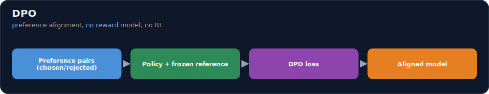
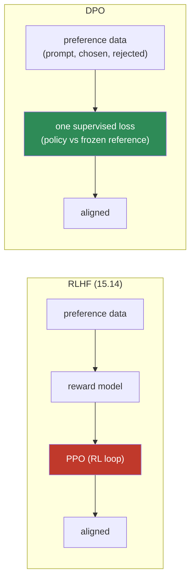
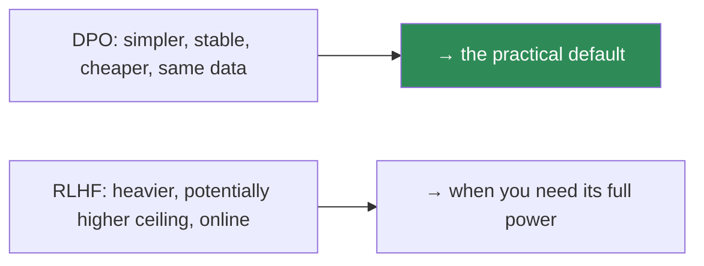

# 15.15 · DPO ⭐

[⬅ 15.14 RLHF](15.14-rlhf.md) · [🏠 Module 15](../README.md) · [➡ 15.16 Other Alignment](15.16-other-alignment.md)

> **The lesson in one line:** DPO gets RLHF's result — a model aligned to human preferences — from the *same* preference data, but with **no reward model and no reinforcement learning**: a single, stable, supervised-style loss that directly increases the probability of chosen responses and decreases rejected ones, relative to a frozen reference model.



---

## 🎯 Learning objectives

- Understand **why DPO was introduced** and how it replaces RLHF's reward model + PPO.
- Understand **preference pairs, chosen/rejected, the reference model**, and the DPO loss.
- **Implement the DPO objective** and compare DPO vs RLHF on complexity, stability, and infrastructure.

## ✅ Prerequisites

- [15.14 RLHF](15.14-rlhf.md), [15.6 SFT](15.6-sft.md), [06.8 log-probabilities](../../06-Mathematics/weeks/06.8-information-theory.md).

---

## 🧠 Mental model

> [!IMPORTANT]
> **DPO's insight: you don't need to train a reward model and run RL to optimize for preferences — the LLM *is* its own implicit reward model.** RLHF proved that the optimal preference-aligned policy has a closed-form relationship to the reward and a reference policy; DPO inverts that to get a loss you can optimize **directly on (prompt, chosen, rejected) triples with ordinary supervised training**. Intuitively: **make the chosen response more likely and the rejected response less likely — but measured *relative to a frozen reference model*** (the SFT model), so the policy improves preferences without drifting into nonsense. No reward model, no PPO, no four-model juggling — just a special loss over the same data.



---

## The pieces

| Piece | Role |
|---|---|
| **Preference pair** | for a prompt: a **chosen** (preferred) and **rejected** response — same data as RLHF ([15.14](15.14-rlhf.md)) |
| **Policy `π_θ`** | the model being trained (starts as the SFT model) |
| **Reference `π_ref`** | a **frozen copy** of the SFT model — the anchor (plays the KL role from RLHF) |
| **`β`** | how strongly to stay near the reference (like RLHF's KL weight) |

## The DPO loss

$$\mathcal{L}_{DPO} = -\log \sigma\!\Big(\beta\Big[\big(\log\pi_\theta(y_w|x) - \log\pi_{ref}(y_w|x)\big) - \big(\log\pi_\theta(y_l|x) - \log\pi_{ref}(y_l|x)\big)\Big]\Big)$$

Reading it: `y_w` = chosen (win), `y_l` = rejected (lose). The term `log π_θ − log π_ref` is how much the **policy shifted** the log-probability of a response *relative to the reference*. DPO maximizes the **gap** between that shift for the chosen vs the rejected — i.e., **"move the chosen up and the rejected down, more than the reference does."** The `σ` + `−log` make it a smooth classification-style loss; `β` controls the strength.

> [!IMPORTANT]
> **The frozen reference model is DPO's leash — it's the KL penalty from RLHF ([15.14](15.14-rlhf.md)), baked directly into the loss.** By measuring the policy's log-prob *changes relative to `π_ref`* (not absolute log-probs), DPO increases preference *without* letting the model collapse to degenerate high-probability text. This is why DPO is **stable**: it's a supervised loss with a built-in anchor, not a reinforcement-learning loop that can diverge. Two forward passes (policy + reference) per example, one loss — that's the whole method.

---

## 💻 A simplified DPO objective (PyTorch)

```python
import torch, torch.nn.functional as F

def dpo_loss(policy_logprobs, ref_logprobs, beta=0.1):
    """
    policy_logprobs / ref_logprobs: dicts with 'chosen' and 'rejected'
    = sum of log P(response tokens) under policy / frozen reference.
    """
    # how much the policy shifted each response relative to the reference
    chosen_shift   = policy_logprobs["chosen"]   - ref_logprobs["chosen"]
    rejected_shift = policy_logprobs["rejected"] - ref_logprobs["rejected"]
    # want chosen_shift > rejected_shift → maximize the margin
    margin = beta * (chosen_shift - rejected_shift)
    loss = -F.logsigmoid(margin).mean()                 # ⭐ the DPO loss
    # (optional) implicit reward for logging
    chosen_reward   = beta * chosen_shift.detach()
    rejected_reward = beta * rejected_shift.detach()
    return loss, (chosen_reward, rejected_reward)

def sequence_logprob(model, input_ids, response_mask):
    logits = model(input_ids).logits[:, :-1]            # predict next token
    logp = torch.log_softmax(logits, dim=-1)
    tok_logp = logp.gather(-1, input_ids[:, 1:, None]).squeeze(-1)
    return (tok_logp * response_mask[:, 1:]).sum(-1)     # sum over response tokens only
```

Per step: compute `sequence_logprob` for chosen and rejected under **both** the policy and the **frozen reference**, then `dpo_loss`. The reference model is inference-only (no gradients). In practice TRL's `DPOTrainer` ([15.10](15.10-practical-stack.md)) handles the reference, masking, and log-prob bookkeeping.

---

## RLHF vs DPO

| | RLHF ([15.14](15.14-rlhf.md)) | DPO |
|---|---|---|
| **Reward model** | yes (separate training) | **no** (implicit) |
| **RL loop (PPO)** | yes (unstable) | **no** (supervised) |
| **Models in memory** | policy + ref + reward + value | **policy + frozen reference** |
| **Stability** | finicky (reward hacking, KL tuning) | **stable** |
| **Infrastructure** | heavy | **light** (like SFT) |
| **Data** | (prompt, chosen, rejected) | **same** |
| **Ceiling** | potentially higher (online, explores) | slightly lower on hardest cases, usually close |



> [!IMPORTANT]
> **DPO is the practical default for preference alignment: same data, a fraction of the complexity, stable training, and quality close to RLHF on most tasks.** You keep a **frozen reference model** in memory and do two forward passes per example — that's the only overhead beyond SFT. Reach for **full RLHF** when you need its higher ceiling on the hardest alignment problems and have the infrastructure and expertise to tame PPO. For most engineers: **SFT then DPO.**

---

## 🧮 Mathematical intuition

RLHF's optimal policy is `π*(y|x) ∝ π_ref(y|x)·exp(r(x,y)/β)`. Solving for the reward gives `r(x,y) = β·log(π*/π_ref) + const`. Substituting this **implicit reward** into the Bradley–Terry preference likelihood ([15.14](15.14-rlhf.md)) eliminates the reward model entirely and yields the DPO loss above — a classification loss where the "logit" is `β·[(log π_θ/π_ref)_chosen − (log π_θ/π_ref)_rejected]`. So DPO **is** preference optimization; it just skips materializing the reward model and the RL loop by using the closed-form relationship. `β` plays the same regularization role as RLHF's KL weight.

---

## 🏭 Production examples

| Use | Notes |
|---|---|
| Align an SFT model to preferences | **SFT → DPO** (the common recipe) |
| Style/helpfulness/harmlessness tuning | DPO on axis-specific preference pairs |
| Limited infra / single-GPU team | DPO (fits like SFT) |
| Highest-ceiling frontier alignment | full RLHF (if you can run it) |
| Cheap preference data from an LLM judge | RLAIF-style pairs → DPO ([15.16](15.16-other-alignment.md)) |

## ⚡ GPU memory & 💲 cost considerations

- **DPO ≈ SFT cost + a frozen reference model** in memory (inference-only) + two forward passes/example — far cheaper than PPO's four models.
- Works with **LoRA/QLoRA** ([15.8](15.8-lora.md)–[15.9](15.9-qlora.md)) — DPO a large model on one GPU.
- **Reference-free variants** (ORPO, [15.16](15.16-other-alignment.md)) drop even the reference model.

## 🔒 Security considerations

> [!CAUTION]
> - **DPO aligns to whatever the preference data prefers** — biased/poisoned pairs teach biased/unsafe preferences; audit annotators and data ([15.20](15.20-security.md)).
> - **Preference alignment can be a *safety* lever** (train to prefer safe refusals) or a risk (train to prefer harmful compliance) — evaluate safety after DPO ([15.17](15.17-evaluation.md)).
> - **Alignment isn't permanent** — later fine-tuning can undo it ([15.13](15.13-catastrophic-forgetting.md)).

## 🚫 Common mistakes

| Mistake | Consequence |
|---|---|
| No/incorrect reference model | Loses the anchor; instability/collapse |
| Computing log-probs over the whole sequence (incl. prompt) | Wrong signal; mask to the response |
| `β` too high/low | Too rigid (no learning) / drifts too far |
| Using RLHF when DPO suffices | Needless complexity/instability |
| Low-quality/biased preference pairs | Aligns to noise/bias |
| Skipping post-DPO safety eval | Missed alignment regressions |

## 🐛 Debugging workflow

DPO not improving preferences? (1) **Log the implicit rewards** — is `chosen_reward` rising above `rejected_reward`? If not, check log-prob computation and masking (response-only). (2) **Reference model** correct and frozen? A wrong/trainable reference breaks the anchor. (3) **`β`** — too high blocks learning; too low drifts. (4) **Data quality** — are chosen truly better than rejected? (5) Compare **win-rate** vs the SFT model on held-out prompts ([15.17](15.17-evaluation.md)). Full method in [15.19](15.19-debugging.md).

## 🏋️ Exercises

1. **Implement DPO.** Build the `dpo_loss` + `sequence_logprob`; train on preference triples; log implicit rewards separating over steps.
2. **Masking matters.** Compute log-probs over the whole sequence vs response-only; show the wrong one fails.
3. **Reference role.** Train with a frozen vs (wrongly) trainable reference; observe instability.
4. **β sweep.** Vary `β`; show too-high (no change) and too-low (drift) behavior.
5. **DPO vs SFT.** Compare win-rate of a DPO model vs its SFT starting point on held-out prompts.

## 🛠️ Mini project — "DPO training"

**Goal:** align an SFT model with DPO end to end and measure the preference gain.

**Requirements:** (prompt, chosen, rejected) dataset ([15.14](15.14-rlhf.md)); frozen reference (= SFT model); response-masked log-probs under policy + reference; DPO loss; LoRA/QLoRA for memory; win-rate eval vs SFT; implicit-reward logging.

**Folder structure**
```
dpo/
├── data.py         # preference triples + response masks
├── logprob.py      # sequence_logprob (response-only)
├── loss.py         # dpo_loss + implicit rewards
├── train.py        # policy + frozen reference, LoRA
└── eval.py         # win-rate vs SFT (+ safety)
```

**Testing:** chosen implicit reward rises above rejected; masking correct; frozen reference; win-rate > 50% vs SFT.
**Evaluation:** preference win-rate; safety retention ([15.13](15.13-catastrophic-forgetting.md)).
**GPU:** DPO ≈ SFT + reference; fits on one GPU with QLoRA.
**Security:** audit preference data; post-DPO safety eval ([15.20](15.20-security.md)).
**Future improvements:** ORPO/KTO (reference-free / different signals, [15.16](15.16-other-alignment.md)); compare to RLHF.

## 📄 Cheat sheet

| Concept | One line |
|---|---|
| **⭐ DPO** | preference alignment with **no reward model, no RL** |
| **Insight** | the LLM is its own implicit reward model (closed form) |
| **Data** | (prompt, **chosen**, **rejected**) — same as RLHF |
| **Reference** | frozen SFT copy — the anchor (KL role) |
| **Loss** | `−log σ(β·[(logπ/π_ref)_chosen − (logπ/π_ref)_rejected])` |
| **Log-probs** | over **response tokens only** (mask the prompt) |
| **β** | stay-near-reference strength (like KL weight) |
| **⭐ vs RLHF** | stable, cheap, same data; RLHF = higher ceiling, heavier |
| **⭐ Recipe** | **SFT → DPO** (the practical default) |

## 🎴 Flashcards

- **⭐ What is DPO and why was it introduced?** → Direct Preference Optimization aligns a model to preferences using one supervised loss on (prompt, chosen, rejected) triples — no reward model and no RL — because RLHF's reward-model + PPO pipeline is heavy and unstable.
- **What's DPO's key insight?** → The optimal RLHF policy has a closed form in terms of the reward and reference, letting you optimize the policy directly on preferences (the LLM is its own implicit reward model).
- **⭐ What role does the frozen reference model play?** → It's the anchor (the KL penalty from RLHF baked into the loss); DPO measures the policy's log-prob shifts *relative to* the reference, keeping it stable.
- **What does the DPO loss do intuitively?** → Increases the chosen response's probability and decreases the rejected one's, more than the reference does, via a classification-style `−log σ(β·margin)` loss.
- **On which tokens are log-probs computed?** → The response tokens only (mask the prompt) — a common bug is including the prompt.
- **⭐ RLHF vs DPO?** → Same data; DPO has no reward model / no RL, is stable and cheap (policy + frozen reference), while RLHF is heavier with a potentially higher ceiling.
- **What is the common alignment recipe?** → SFT then DPO.

## 💬 Interview questions

1. What problem with RLHF does DPO solve, and how?
2. Explain the DPO loss and the role of the reference model.
3. Why is DPO stable while PPO-RLHF is finicky?
4. What data does DPO need, and how does it relate to RLHF's?
5. On which tokens are the log-probabilities computed, and why?
6. When would you still choose RLHF over DPO?
7. Derive (intuitively) why DPO can skip the reward model.

## 📝 Summary

- **DPO** achieves preference alignment from the **same (prompt, chosen, rejected) data as RLHF** but with **no reward model and no RL** — a single stable supervised loss.
- It works because the optimal RLHF policy has a **closed form** in the reward and reference; DPO optimizes the policy directly, treating the LLM as its **own implicit reward model**, with a **frozen reference** as the stability anchor (RLHF's KL role).
- The loss increases **chosen** and decreases **rejected** log-probs *relative to the reference* (`−log σ(β·margin)`), computed over **response tokens only**; DPO costs ≈ SFT + a frozen reference and works with **LoRA/QLoRA**.
- **DPO is the practical default (SFT → DPO)**; RLHF remains for the highest ceiling with the infrastructure to run it — and both need **post-alignment safety evaluation** ([15.17](15.17-evaluation.md)).

## 📚 References

1. **Rafailov et al. (2023) — _Direct Preference Optimization_.** ⭐ The method and derivation.
2. **[15.14 RLHF](15.14-rlhf.md).** The pipeline DPO simplifies.
3. **TRL `DPOTrainer` docs.** ⭐ Production DPO.
4. **[11.13 Alignment](../../11-LLMs/weeks/11.13-alignment.md).** RLHF vs DPO overview.

---

## 🧭 Navigation

| Direction | Link |
|---|---|
| ⬅ Previous | [15.14 · RLHF](15.14-rlhf.md) |
| ➡ Next | [15.16 · Other Alignment Techniques](15.16-other-alignment.md) |
| 🏠 Module | [Module 15](../README.md) |
| 📖 Lessons | [Lesson index](README.md) |
