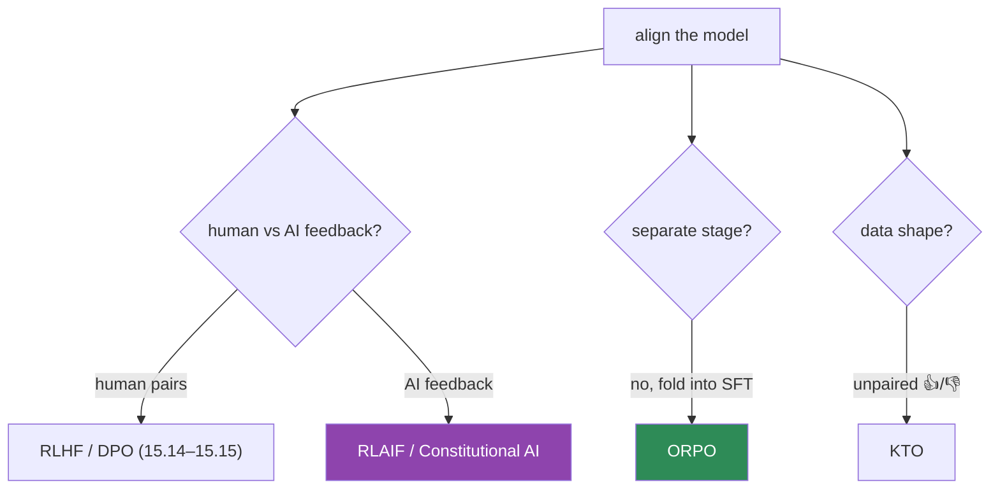

# 15.16 · Other Alignment Techniques

[⬅ 15.15 DPO](15.15-dpo.md) · [🏠 Module 15](../README.md) · [➡ 15.17 Model Evaluation](15.17-evaluation.md)

> **The lesson in one line:** Beyond RLHF and DPO there's a family of alignment methods that vary *where the preference signal comes from* (humans, AI, or a rubric) and *how much machinery they need* — **Constitutional AI / RLAIF** (AI-generated feedback), **ORPO** (align during SFT, no reference), and **KTO** (learn from thumbs-up/down, no pairs) — each trading data cost, simplicity, or signal type.

---

## 🎯 Learning objectives

- Understand **Constitutional AI, RLAIF, ORPO, KTO, and reward modeling** at a working level.
- Know **what preference signal each uses** and its trade-offs.
- Choose an alignment method by **data availability and infrastructure**.

## ✅ Prerequisites

- [15.14 RLHF](15.14-rlhf.md), [15.15 DPO](15.15-dpo.md).

---

## 🧠 Mental model

> [!IMPORTANT]
> **All alignment methods answer the same question — "how do we teach the model *which* good answer to prefer?" — and differ on two axes: where the preference signal comes from, and how heavy the training machinery is.** RLHF and DPO both use **human pairwise preferences** ([15.14](15.14-rlhf.md)–[15.15](15.15-dpo.md)). The methods here change one of those: **RLAIF/Constitutional AI** replace *human* feedback with *AI-generated* feedback (cheaper, scalable); **ORPO** folds alignment *into SFT* (no separate stage, no reference model); **KTO** learns from *unpaired* thumbs-up/down signals (no need to collect matched pairs). Pick by **what data you can get** and **how much complexity you can run**.



---

## The techniques

### Constitutional AI (CAI)
Instead of humans labeling every preference, the model **critiques and revises its own outputs against a written set of principles (a "constitution")**, and those AI-generated preferences train the aligned model. Humans write the *principles* once; the AI scales the *feedback*. Reduces human labeling and makes the values **explicit and auditable**.

### RLAIF (RL from AI Feedback)
Like RLHF, but the **preference labels come from an AI judge** (often a strong LLM) rather than humans — feeding a reward model or DPO. **Much cheaper and more scalable** than human labeling; the risk is the judge's biases/errors propagate into alignment. Often combined with a small human-labeled seed/validation set.

### ORPO (Odds Ratio Preference Optimization)
Folds preference alignment **into the SFT stage itself** — a single loss combines the SFT objective with a preference term (via an odds-ratio), so you get a model that's both instruction-tuned *and* preference-aligned in **one step, with no reference model**. Simpler and cheaper than SFT-then-DPO when you have preference data up front.

### KTO (Kahneman–Tversky Optimization)
Learns from **unpaired** binary feedback — each example is just "good" or "bad" (👍/👎), **no matched chosen/rejected pair required**. This matches how real feedback often arrives (thumbs on production outputs), making data collection far easier than assembling preference pairs.

### Reward modeling (standalone)
A reward model ([15.14](15.14-rlhf.md)) is useful **beyond RLHF**: as a **reranker** (best-of-N — generate several, pick the highest-reward), an **evaluation judge**, or a **filter** for data. You can get much of alignment's benefit at *inference* time by re-ranking with a reward model, no policy training at all.

| Method | Preference signal | Machinery | Reach for it when |
|---|---|---|---|
| **RLHF** | human pairs | reward model + PPO | max ceiling, have infra ([15.14](15.14-rlhf.md)) |
| **DPO** | human pairs | policy + reference | the default ([15.15](15.15-dpo.md)) |
| **Constitutional AI** | AI vs principles | critique/revise + train | scale feedback; explicit values |
| **RLAIF** | AI judge | RM/DPO on AI labels | cheap/scalable labels |
| **ORPO** | human pairs | one SFT-stage loss, no reference | simplify to one stage |
| **KTO** | unpaired 👍/👎 | like DPO, unpaired | you only have thumbs, not pairs |
| **Reward model (rerank)** | any | inference-time best-of-N | no training; cheap alignment |

> [!IMPORTANT]
> **The trend is toward simpler, cheaper alignment: fewer models, fewer stages, and AI-generated or unpaired feedback instead of expensive human pairs.** DPO removed the reward model and RL; ORPO removed the separate stage and reference; KTO removed the pairing requirement; RLAIF/CAI removed the human-labeling bottleneck. **Choose by your constraints:** have pairs and want simplicity → DPO or ORPO; only have thumbs → KTO; can't afford human labels → RLAIF/CAI; want zero training → reward-model reranking.

---

## 🧮 Mathematical intuition

These are variations on the same preference-likelihood theme as DPO ([15.15](15.15-dpo.md)). **ORPO** adds an **odds-ratio** penalty on the rejected response to the standard SFT NLL, so one loss both fits chosen responses (SFT) and disfavors rejected ones — no reference needed because the odds-ratio provides the relative signal. **KTO** borrows prospect-theory value functions to turn *unpaired* good/bad labels into gradients that raise good and lower bad relative to a reference point — recovering DPO-like behavior without explicit pairs. **RLAIF/CAI** don't change the optimizer; they change the *source* of the `(chosen, rejected)` labels feeding whatever objective (RM/DPO) you use.

---

## 🏭 Production examples

| Situation | Method |
|---|---|
| Standard alignment, have pairs | DPO (or ORPO to merge with SFT) |
| Only production thumbs-up/down | **KTO** |
| Human labeling too expensive | **RLAIF** / Constitutional AI |
| Explicit, auditable value set | **Constitutional AI** |
| No time/infra to train | reward-model **best-of-N** reranking |
| Frontier max quality | RLHF (+ AI feedback hybrids) |

## ⚡ GPU memory & 💲 cost considerations

- **ORPO** saves a stage (SFT and alignment in one) → cheaper than SFT-then-DPO.
- **RLAIF/CAI** trade **human-labeling cost** for **AI-inference cost** (generating feedback) — usually far cheaper at scale.
- **Reward-model reranking** shifts cost to **inference** (generate N, score N) — no training, but higher per-request cost.
- All work with **LoRA/QLoRA** ([15.8](15.8-lora.md)–[15.9](15.9-qlora.md)).

## 🔒 Security considerations

> [!CAUTION]
> - **AI feedback (RLAIF/CAI) inherits the judge model's biases and blind spots** — validate against a human-labeled set; a flawed judge silently misaligns ([15.20](15.20-security.md)).
> - **The "constitution" encodes your values explicitly** — a benefit (auditable) but also a single point to get wrong; review it carefully.
> - **KTO from production thumbs can be gamed** — adversarial 👎/👍 poison alignment; validate feedback provenance.
> - **Always safety-evaluate the aligned model** regardless of method ([15.17](15.17-evaluation.md)).

## 🚫 Common mistakes

| Mistake | Consequence |
|---|---|
| RLAIF without human validation | Judge bias propagates unchecked |
| Assuming AI feedback == human quality | Subtle misalignment |
| Using pairs methods when you only have thumbs | Wasted data-collection effort (use KTO) |
| Over-engineering (RLHF) when reranking suffices | Needless cost |
| Unaudited constitution | Encodes the wrong values |
| Skipping safety eval | Misalignment ships |

## 🐛 Debugging workflow

Alignment method underperforming? (1) **Match method to data** — pairs → DPO/ORPO; thumbs → KTO; no human labels → RLAIF. Using the wrong one wastes effort. (2) **AI feedback quality** — spot-check RLAIF/CAI labels against humans; a bad judge is the usual culprit. (3) **Compare to a DPO baseline** on the same data — many "novel method" gains vanish vs a solid DPO run. (4) **Safety/win-rate eval** ([15.17](15.17-evaluation.md)) to confirm net improvement. Full method in [15.19](15.19-debugging.md).

## 🏋️ Exercises

1. **Map methods.** For 5 data situations (pairs, thumbs, no human labels, principles, no-train), pick the right alignment method.
2. **RLAIF labels.** Use an LLM judge to label preference pairs; validate against a small human set; measure agreement.
3. **ORPO vs SFT→DPO.** Compare a one-stage ORPO run to two-stage SFT→DPO on the same data (quality, cost).
4. **KTO from thumbs.** Convert unpaired 👍/👎 data into a KTO run; compare to DPO on paired data.
5. **Reranking.** Use a reward model for best-of-N at inference; measure quality gain with no training.

## 🛠️ Mini project — "Alignment method selector + RLAIF labeler"

**Goal:** recommend an alignment method from constraints, and build an RLAIF preference labeler validated against humans.

**Requirements:** a selector (data shape/infra → method); an LLM-judge labeler producing (chosen, rejected) pairs; human-agreement validation; a hook to feed the labels into DPO ([15.15](15.15-dpo.md)); a best-of-N reranker using a reward model.

**Folder structure**
```
alignment-plus/
├── select.py       # constraints → method
├── rlaif.py        # LLM-judge preference labeling
├── validate.py     # AI vs human agreement
└── rerank.py       # reward-model best-of-N
```

**Testing:** selector matches expert choices; AI labels agree with humans above threshold; reranking improves win-rate.
**Evaluation:** alignment win-rate; AI–human label agreement.
**GPU:** note training vs inference cost split.
**Security:** validate AI feedback; audit the constitution; check provenance of thumbs ([15.20](15.20-security.md)).
**Future improvements:** hybrid human+AI feedback; ORPO/KTO training runs.

## 📄 Cheat sheet

| Method | Signal | Machinery |
|---|---|---|
| **RLHF** | human pairs | reward model + PPO |
| **DPO** | human pairs | policy + frozen reference |
| **Constitutional AI** | AI vs written principles | self-critique + train |
| **RLAIF** | AI judge labels | RM/DPO on AI labels |
| **ORPO** | human pairs | **one SFT-stage loss, no reference** |
| **KTO** | **unpaired 👍/👎** | DPO-like, no pairs |
| **Reward-model rerank** | any | inference-time best-of-N (no training) |
| **⭐ Trend** | fewer models/stages; AI/unpaired feedback |
| **⭐ Choose by** | data shape + infra you can run |

## 🎴 Flashcards

- **What is Constitutional AI?** → Aligning a model using AI-generated feedback where the model critiques/revises its own outputs against a written set of principles (a "constitution"), scaling feedback and making values explicit.
- **What is RLAIF?** → RLHF-style alignment where preference labels come from an AI judge instead of humans — cheaper and scalable, but the judge's biases propagate.
- **⭐ What does ORPO change vs SFT→DPO?** → It folds preference alignment into the SFT stage as one loss (odds-ratio), needing no separate stage and no reference model.
- **⭐ What does KTO uniquely enable?** → Learning from *unpaired* binary 👍/👎 feedback — no matched chosen/rejected pairs required (matches real production feedback).
- **How can a reward model align without training the policy?** → Best-of-N reranking at inference — generate several outputs and pick the highest-reward one.
- **What's the overall trend in alignment methods?** → Toward fewer models/stages and AI-generated or unpaired feedback instead of expensive human pairs.
- **How do you choose an alignment method?** → By your data shape (pairs / thumbs / none) and the infrastructure you can run.

## 💬 Interview questions

1. Compare Constitutional AI, RLAIF, ORPO, and KTO — signal and machinery of each.
2. How does ORPO differ from the standard SFT→DPO recipe?
3. When would you use KTO instead of DPO?
4. What are the risks of AI-generated feedback (RLAIF/CAI)?
5. How can a reward model provide alignment without policy training?
6. What's the trend across these methods, and why?

## 📝 Summary

- Alignment methods share one goal (teach *which* good answer to prefer) and differ in **where the preference signal comes from** and **how heavy the machinery is**.
- **Constitutional AI / RLAIF** replace human feedback with **AI feedback** (scalable, cheaper, judge-bias risk); **ORPO** folds alignment into **SFT** (one stage, no reference); **KTO** learns from **unpaired 👍/👎**; **reward models** enable **inference-time reranking** (no training).
- The **trend is simpler and cheaper** — fewer models, fewer stages, AI/unpaired feedback; **choose by your data shape and infrastructure**.
- Whatever the method, **validate AI feedback against humans and always safety-evaluate the aligned model** ([15.17](15.17-evaluation.md), [15.20](15.20-security.md)).

## 📚 References

1. **Bai et al. (2022) — _Constitutional AI_.** ⭐ AI feedback from principles.
2. **Lee et al. (2023) — _RLAIF_.** AI-labeled preferences.
3. **Hong et al. (2024) — _ORPO_** & **Ethayarajh et al. (2024) — _KTO_.** ⭐ Reference-free / unpaired alignment.
4. **[15.15 DPO](15.15-dpo.md).** The baseline these vary.

---

## 🧭 Navigation

| Direction | Link |
|---|---|
| ⬅ Previous | [15.15 · DPO](15.15-dpo.md) |
| ➡ Next | [15.17 · Model Evaluation](15.17-evaluation.md) |
| 🏠 Module | [Module 15](../README.md) |
| 📖 Lessons | [Lesson index](README.md) |
