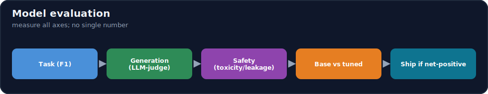
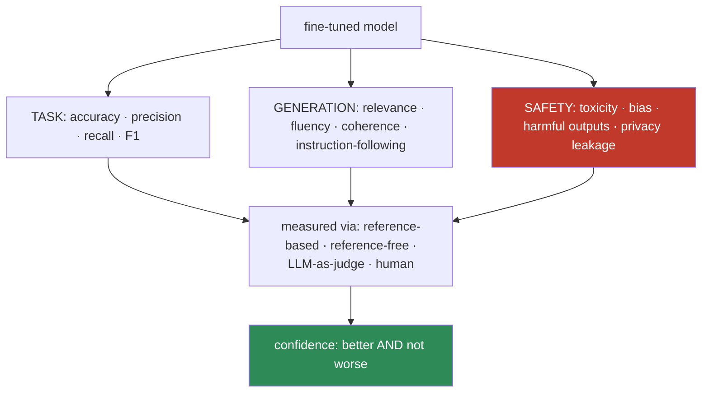
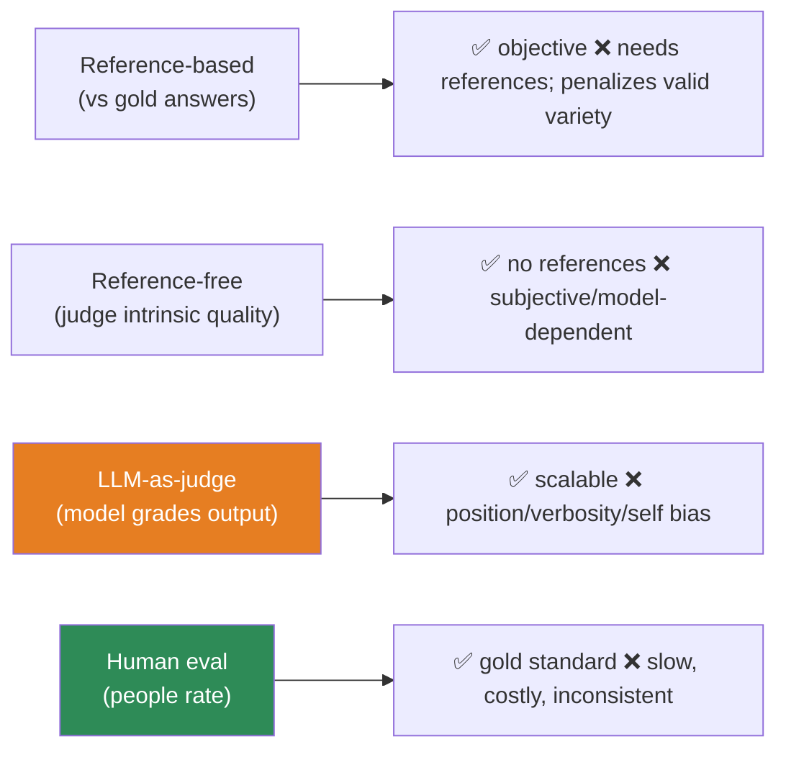

# 15.17 · Model Evaluation ⭐

[⬅ 15.16 Other Alignment](15.16-other-alignment.md) · [🏠 Module 15](../README.md) · [➡ 15.18 Base vs Fine-Tuned](15.18-base-vs-finetuned.md)

> **The lesson in one line:** A fine-tuned model must be evaluated on **four independent axes** — task performance (accuracy/F1), generation quality (relevance/fluency/instruction-following), safety (toxicity/bias/leakage), and via multiple methods (LLM-judge, human, reference-based/free) — because a model can ace one axis while failing another, and **every evaluation method has blind spots you must know**.



---

## 🎯 Learning objectives

- Evaluate **task performance, generation quality, and safety** as separate axes.
- Apply **LLM-as-judge, human, reference-based, and reference-free** methods — and their limits.
- Build a **comprehensive evaluation framework** for a fine-tuned model.

## ✅ Prerequisites

- [11.17 LLM evaluation](../../11-LLMs/weeks/11.17-evaluation.md), [12.13 prompt evaluation](../../12-Prompt-Engineering/weeks/12.13-evaluation.md), [08 metrics](../../08-Machine-Learning/README.md).

---

## 🧠 Mental model

> [!IMPORTANT]
> **"Is the fine-tuned model good?" has no single answer — it's good *at what*, *how*, and *is it safe*? — so evaluation is a battery, not a number.** A model can hit 95% task accuracy while being toxic, or follow instructions beautifully while hallucinating, or improve on your task while regressing on general ability ([15.13](15.13-catastrophic-forgetting.md)). So you measure **three axes** (task performance, generation quality, safety) with **multiple methods** (each with different blind spots), and you never trust one score. **The goal isn't a number — it's confidence that the model is better *and* not worse in ways that matter.**



---

## Axis 1 — Task performance
For classification/extraction/structured tasks, use standard metrics ([08](../../08-Machine-Learning/README.md)):

| Metric | Measures |
|---|---|
| **Accuracy** | fraction correct (careful with class imbalance) |
| **Precision** | of predicted-positive, how many correct |
| **Recall** | of actual-positive, how many found |
| **F1** | harmonic mean of precision/recall |

Deterministic, cheap, exact — use wherever the task has a ground-truth label.

## Axis 2 — Generation quality
For open-ended generation, there's no single "correct" output:

| Quality | Measures | How |
|---|---|---|
| **Relevance** | does it address the request | rubric / LLM-judge |
| **Fluency** | grammatical, natural | LLM-judge / human |
| **Coherence** | logically consistent | LLM-judge / human |
| **Instruction-following** | obeys the constraints | rubric / LLM-judge |

Reference-based metrics (BLEU/ROUGE) exist but correlate weakly with quality for open generation — prefer rubric/LLM-judge/human.

## Axis 3 — Safety
Non-negotiable, especially after alignment ([15.14](15.14-rlhf.md)–[15.16](15.16-other-alignment.md)):

| Safety check | Measures |
|---|---|
| **Toxicity** | harmful/abusive language |
| **Bias** | unfair treatment across groups |
| **Harmful outputs** | dangerous/policy-violating content (red-team prompts) |
| **Privacy leakage** | memorized PII from training data ([15.20](15.20-security.md)) |

> [!IMPORTANT]
> **Safety is a first-class axis, not an afterthought — fine-tuning and alignment can *both* degrade it, so it must be measured every time.** SFT on data lacking safe behaviors, aggressive training that causes forgetting ([15.13](15.13-catastrophic-forgetting.md)), or alignment to compliant-but-harmful preferences can all reduce safety. **Include a safety/red-team suite in every evaluation**, run it on base vs fine-tuned, and gate deployment on it.

---

## The evaluation methods (and their limits)



| Method | Strength | Blind spot |
|---|---|---|
| **Reference-based** (accuracy, BLEU/ROUGE, exact-match) | objective, cheap, reproducible | needs gold references; penalizes *valid* alternative phrasings |
| **Reference-free** (score intrinsic quality) | no references needed | subjective; depends on the scorer |
| **LLM-as-judge** | scalable, correlates with humans | position/verbosity/self-preference **bias**; can be gamed ([11.17](../../11-LLMs/weeks/11.17-evaluation.md)) |
| **Human evaluation** | the gold standard for quality/safety | slow, expensive, inter-rater inconsistency |

> [!IMPORTANT]
> **Every method has a blind spot, so triangulate — use deterministic metrics where you can, LLM-judge for scale, and human eval for the high-stakes final call.** Reference-based metrics miss valid variety; LLM-judges have systematic biases (calibrate against humans); humans are the gold standard but don't scale. **The strongest evaluation uses cheap deterministic checks broadly, a calibrated LLM-judge for generation quality, and human review on a sample and on safety.** No single method is trustworthy alone.

---

## 💻 An evaluation framework (sketch)

```python
def evaluate_model(model, suites):
    return {
        "task":       task_metrics(model, suites.labeled),          # accuracy/P/R/F1 (deterministic)
        "generation": judge_quality(model, suites.open_ended),      # relevance/fluency/IF (LLM-judge, calibrated)
        "safety":     safety_suite(model, suites.redteam),          # toxicity/bias/harm/leakage
        "human":      sample_for_human_review(model, suites.holdout)# a slice for people
    }
# run on BOTH base and fine-tuned; ship only a NET improvement (15.18)
```

Include **edge cases, adversarial/red-team prompts, and unanswerable inputs** (does it decline?), and **calibrate the LLM-judge** against a human-labeled sample before trusting it.

---

## 🏭 Production examples

| Axis | Practice |
|---|---|
| Task | labeled test set → accuracy/F1 in CI |
| Generation | calibrated LLM-judge on a rubric + human sample |
| Safety | red-team suite + toxicity/bias classifiers, gated |
| Method mix | deterministic broadly + LLM-judge + human high-stakes |
| Base vs tuned | same suites on both; net-improvement gate ([15.18](15.18-base-vs-finetuned.md)) |

## ⚡ GPU memory & 💲 cost considerations

- **LLM-judge and human eval cost money** (calls/time) — sample; use deterministic metrics where possible; cheaper judge for routine runs, stronger for releases.
- **Generation for eval is inference cost** — batch it.
- **Evaluation is cheaper than shipping a bad model** — budget for it as part of every fine-tune.

## 🔒 Security considerations

> [!CAUTION]
> - **Privacy-leakage testing is part of evaluation** — probe whether the model regurgitates training PII ([15.20](15.20-security.md)); memorization is a fine-tuning-specific risk.
> - **Safety/red-team evaluation must gate deployment** — a task win with a safety regression is not shippable.
> - **Eval data may contain sensitive content** — govern it like production data.

## 🚫 Common mistakes

| Mistake | Consequence |
|---|---|
| One metric / one method | Blind to the other axes and method biases |
| No safety axis | Ships toxic/biased/leaky behavior |
| Trusting an uncalibrated LLM-judge | Biased scores drive wrong decisions |
| BLEU/ROUGE for open generation | Weak correlation with real quality |
| No base-vs-tuned comparison | Can't prove net improvement ([15.18](15.18-base-vs-finetuned.md)) |
| Evaluating only the target task | Miss catastrophic forgetting ([15.13](15.13-catastrophic-forgetting.md)) |

## 🐛 Debugging workflow

Eval results confusing? (1) **Separate the axes** — is the issue task, generation, or safety? A blended score hides it. (2) **Check the method** — LLM-judge biased/uncalibrated? Validate against humans. (3) **Reference-based penalizing valid variety?** Switch to rubric/judge for open outputs. (4) **Run base vs tuned on identical suites** ([15.18](15.18-base-vs-finetuned.md)) — the delta, not the absolute, is what matters. (5) **Include safety + forgetting** in every run. Full method in [15.19](15.19-debugging.md).

## 🏋️ Exercises

1. **Three axes.** Evaluate a fine-tuned model on task/generation/safety; find a case strong on one, weak on another.
2. **Judge calibration.** Hand-label 30 generations; compare to an LLM-judge; report agreement and bias.
3. **Reference limits.** Show BLEU/ROUGE penalizing a correct-but-differently-worded answer.
4. **Safety suite.** Build a small red-team + toxicity + leakage suite; run on base vs tuned.
5. **Method triangulation.** Combine deterministic + judge + human-sample for one task; reconcile disagreements.

## 🛠️ Mini project — "Fine-tuned model evaluation framework"

**Goal:** a comprehensive harness scoring a model on all axes with multiple methods, gating on safety and net improvement.

**Requirements:** task metrics (accuracy/P/R/F1); generation quality via calibrated LLM-judge (rubric); safety suite (toxicity/bias/red-team/leakage); human-review sampling; base-vs-tuned comparison; a deployment gate (net improvement + no safety regression).

**Folder structure**
```
model-eval/
├── task.py         # deterministic metrics
├── generation.py   # LLM-judge (calibrated) + rubric
├── safety.py       # toxicity/bias/redteam/leakage
├── human.py        # sampling for review
└── gate.py         # net-improvement + safety gate (15.18)
```

**Testing:** each axis measured separately; judge calibrated; safety gate blocks regressions; leakage probe runs.
**Evaluation:** the framework itself — plus base-vs-tuned deltas.
**GPU:** eval inference/judge cost reported.
**Security:** leakage + safety mandatory; governed eval data ([15.20](15.20-security.md)).
**Future improvements:** online eval on prod traffic; per-segment slicing; automated red-teaming.

## 📄 Cheat sheet

| Axis / method | One line |
|---|---|
| **Task** | accuracy · precision · recall · F1 (deterministic) |
| **Generation** | relevance · fluency · coherence · instruction-following |
| **⭐ Safety** | toxicity · bias · harmful · **privacy leakage** — gate on it |
| **Reference-based** | vs gold; objective; penalizes valid variety |
| **Reference-free** | intrinsic quality; subjective |
| **LLM-as-judge** | scalable; **position/verbosity/self bias** — calibrate |
| **Human** | gold standard; slow/costly |
| **⭐ Rule** | triangulate methods; measure all axes; base vs tuned |
| **⭐ Include** | edge · adversarial/red-team · leakage · forgetting |

## 🎴 Flashcards

- **⭐ What are the axes of fine-tuned model evaluation?** → Task performance (accuracy/P/R/F1), generation quality (relevance/fluency/coherence/instruction-following), and safety (toxicity/bias/harm/privacy leakage).
- **⭐ Why is safety a first-class evaluation axis?** → Fine-tuning and alignment can both degrade it (unsafe data, forgetting, harmful preferences); it must be measured every time and gate deployment.
- **What are the four evaluation methods and their blind spots?** → Reference-based (needs gold, penalizes valid variety), reference-free (subjective), LLM-as-judge (position/verbosity/self bias), human (slow/costly).
- **Why not use BLEU/ROUGE for open-ended generation?** → They correlate weakly with real quality and penalize valid alternative phrasings.
- **Why calibrate an LLM-judge?** → It has systematic biases; validating against a human-labeled sample tells you whether to trust its scores.
- **⭐ What's the strongest evaluation strategy?** → Triangulate: deterministic metrics broadly, a calibrated LLM-judge for generation, and human review on a sample and on safety — no single method alone.
- **What must every fine-tuning evaluation include?** → All three axes, base-vs-tuned comparison, edge/red-team cases, a privacy-leakage probe, and a forgetting check.

## 💬 Interview questions

1. What are the axes of evaluating a fine-tuned model, and why separate them?
2. Compare reference-based, reference-free, LLM-judge, and human evaluation.
3. Why is safety evaluation essential after fine-tuning/alignment?
4. What are the biases of LLM-as-judge, and how do you mitigate them?
5. Why do BLEU/ROUGE fall short for open-ended generation?
6. How do you build confidence that a fine-tune is a net improvement?

## 📝 Summary

- Evaluate a fine-tuned model on **three axes** — **task performance** (accuracy/F1), **generation quality** (relevance/fluency/coherence/instruction-following), and **safety** (toxicity/bias/harm/**leakage**) — never one number.
- Use **multiple methods** (reference-based, reference-free, **calibrated LLM-judge**, human) and **triangulate**, because each has blind spots — deterministic broadly, judge for scale, human for high-stakes.
- **Safety is first-class and gates deployment** (fine-tuning/alignment can erode it); include **red-team, leakage, edge cases, and a forgetting check** every run.
- Always compare **base vs fine-tuned on identical suites** and ship only a **net improvement** ([15.18](15.18-base-vs-finetuned.md)).

## 📚 References

1. **[11.17 LLM Evaluation](../../11-LLMs/weeks/11.17-evaluation.md).** ⭐ LLM-judge bias, benchmarks.
2. **[12.13 Prompt Evaluation](../../12-Prompt-Engineering/weeks/12.13-evaluation.md).** Multi-dimension evaluation.
3. **Zheng et al. (2023) — _MT-Bench / LLM-as-a-judge_.** Judge reliability and bias.
4. **[15.20 Security & Privacy](15.20-security.md).** Leakage/memorization testing.

---

## 🧭 Navigation

| Direction | Link |
|---|---|
| ⬅ Previous | [15.16 · Other Alignment Techniques](15.16-other-alignment.md) |
| ➡ Next | [15.18 · Base vs Fine-Tuned Evaluation](15.18-base-vs-finetuned.md) |
| 🏠 Module | [Module 15](../README.md) |
| 📖 Lessons | [Lesson index](README.md) |
