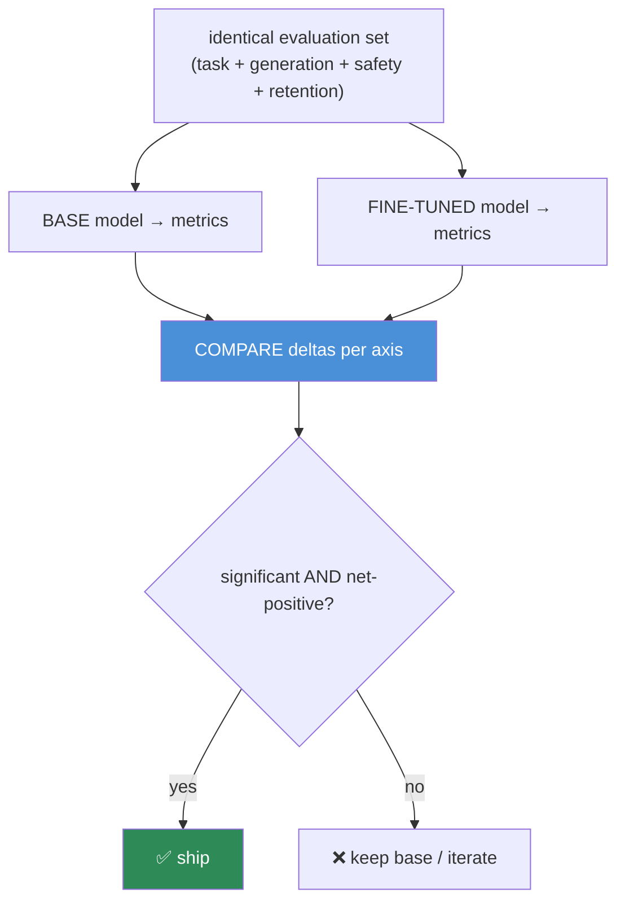
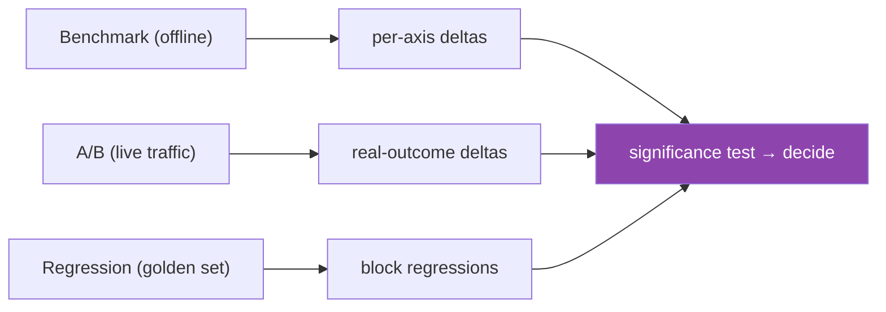

# 15.18 · Base vs Fine-Tuned Evaluation

[⬅ 15.17 Model Evaluation](15.17-evaluation.md) · [🏠 Module 15](../README.md) · [➡ 15.19 Debugging](15.19-debugging.md)

> **The lesson in one line:** The only question that matters after fine-tuning is *"is it actually better?"* — and answering it requires running **base and fine-tuned models on the identical evaluation set**, comparing with **A/B testing, regression testing, and benchmarks**, and checking **statistical significance** so you don't ship noise as improvement.

---

## 🎯 Learning objectives

- Build a **base-vs-fine-tuned comparison framework** on identical data.
- Apply **A/B testing, regression testing, benchmarking, and statistical significance**.
- Ship only a **net, significant improvement** — including no safety/general regressions.

## ✅ Prerequisites

- [15.17 evaluation](15.17-evaluation.md), [15.13 catastrophic forgetting](15.13-catastrophic-forgetting.md), [06.6 statistics / hypothesis testing](../../06-Mathematics/weeks/06.6-statistics.md).

---

## 🧠 Mental model

> [!IMPORTANT]
> **A fine-tuned model's absolute score is meaningless in isolation — what matters is the *delta* against the base model on the *same* evaluation, and whether that delta is *real* (significant) and *net-positive* (no regressions elsewhere).** "92% accuracy" tells you nothing unless the base was 80% (great) or 93% (you made it worse). So the discipline is: **hold the eval set constant, run both models through it, compute the difference on every axis ([15.17](15.17-evaluation.md)), and test whether the difference is statistically significant.** Fine-tuning that improves your task by 2% but is within noise, or that regresses safety/general ability, is not an improvement.



---

## The comparison methods

### Benchmarking
Run both models on a **fixed benchmark suite** (your task metrics + generation quality + safety + a **retention set** for forgetting, [15.13](15.13-catastrophic-forgetting.md)). Report **per-axis deltas**, not a single blended number — a task gain and a safety loss must both be visible.

### A/B testing
For production, route a fraction of **live traffic** to the fine-tuned model and compare **real outcomes** (user feedback, task success, engagement) against the base. The realest signal — actual users on the actual distribution — but needs traffic and careful experiment design.

### Regression testing
A **golden set** of cases the model must not get worse on ([12.14](../../12-Prompt-Engineering/weeks/12.14-testing.md)). Run it on every candidate; **block** any fine-tune that regresses protected behaviors (especially safety and key capabilities). Grows from real failures.

### Statistical significance
A 2% metric difference on 100 examples is likely **noise**; on 10,000 it may be real. Use a significance test (e.g., paired test / bootstrap confidence intervals) to decide whether the delta is distinguishable from zero before believing it.



> [!IMPORTANT]
> **Ship only a delta that is (1) statistically significant, (2) net-positive across all axes, and (3) free of regressions on protected behaviors — especially safety and general capability.** The three ways teams fool themselves: **comparing on different eval sets** (apples to oranges), **believing an insignificant delta** (noise), and **celebrating a task win while ignoring a safety/forgetting regression** ([15.13](15.13-catastrophic-forgetting.md)). Identical eval set + significance + net-positive is the guard against all three.

---

## 🧮 Mathematical intuition

If metric `m` has per-example variance, the standard error of the mean over `n` examples is `~σ/√n`, so the detectable difference shrinks with more data. A paired comparison (same prompts through both models) removes prompt-difficulty variance, giving more power than comparing two independent samples — hence **evaluate both models on the *same* prompts** and pair the results. A bootstrap over the eval set gives a confidence interval on the delta; if it straddles zero, the improvement isn't established. **More eval data and paired design = more confidence in the delta.**

---

## 🏭 Production examples

| Stage | Practice |
|---|---|
| Offline gate | benchmark base vs tuned on all axes + significance |
| Pre-ship | regression golden set (safety + key capabilities) must pass |
| Rollout | canary/A-B on live traffic; compare real outcomes |
| Decision | ship only significant, net-positive, regression-free |
| Rollback | keep the base as the fallback ([15.21](15.21-production-pipeline.md)) |

## ⚡ GPU memory & 💲 cost considerations

- **Running two models over a large eval set costs inference** — batch; reuse cached base results across candidates.
- **A/B testing spends on live traffic** — size the experiment for significance without overexposing users to a worse model.
- **Bigger eval sets cost more but give tighter confidence** — balance against the decision's stakes.

## 🔒 Security considerations

> [!CAUTION]
> - **Safety must be a *protected* regression check** — a fine-tune that improves the task but weakens safety is a *regression*, not a trade-off; block it ([15.17](15.17-evaluation.md), [15.20](15.20-security.md)).
> - **A/B on live traffic exposes real users to the candidate** — cap the blast radius and monitor for safety issues in the canary.
> - **Include a leakage-regression check** — does the fine-tune leak training PII the base didn't? ([15.20](15.20-security.md))

## 🚫 Common mistakes

| Mistake | Consequence |
|---|---|
| Different eval sets for base vs tuned | Apples-to-oranges; invalid comparison |
| No significance test | Shipping noise as improvement |
| Single blended score | Hides per-axis regressions |
| No retention/safety in the comparison | Ships forgetting/unsafe behavior |
| Independent (unpaired) samples | Less statistical power |
| No base fallback | Can't roll back a bad ship |

## 🐛 Debugging workflow

"Is the fine-tune better?" (1) **Same eval set, both models, paired** — compute per-axis deltas. (2) **Significance** — is the task delta beyond noise (paired test / bootstrap CI)? (3) **Regressions** — did safety, general capability ([15.13](15.13-catastrophic-forgetting.md)), or leakage get worse? Any protected regression = don't ship. (4) **A/B** on live traffic if offline is close. (5) **Net decision** — ship only significant + net-positive + regression-free. Full method in [15.19](15.19-debugging.md).

## 🏋️ Exercises

1. **Paired comparison.** Run base and tuned on identical prompts; compute paired deltas per axis.
2. **Significance.** Bootstrap a CI on the task delta at n=100 and n=5000; show how confidence changes.
3. **Regression gate.** Build a golden set (safety + key capabilities); make a fine-tune that regresses one; verify the gate blocks it.
4. **A/B design.** Design a live A/B for a fine-tuned model: metric, sample size for significance, safety guardrails.
5. **Net decision.** Given a task +3% but safety −5%, argue the ship/no-ship decision.

## 🛠️ Mini project — "Base-vs-tuned comparison framework"

**Goal:** a framework that decides ship/no-ship from a rigorous base-vs-tuned comparison.

**Requirements:** identical multi-axis eval set ([15.17](15.17-evaluation.md)) incl. retention/safety; paired evaluation of base + candidate; per-axis deltas + significance (bootstrap/paired test); a regression golden set with protected behaviors; an A/B harness for live traffic; a net-improvement gate.

**Folder structure**
```
compare/
├── run_pair.py     # both models, same prompts, paired
├── delta.py        # per-axis deltas + significance
├── regression.py   # golden set, protected behaviors
├── ab.py           # live-traffic A/B
└── gate.py         # ship / no-ship decision
```

**Testing:** identical eval set enforced; significance computed; a safety regression blocks the ship; base fallback preserved.
**Evaluation:** correct ship/no-ship on seeded better/worse candidates.
**GPU:** two-model eval cost + caching.
**Security:** safety + leakage as protected regressions ([15.20](15.20-security.md)).
**Future improvements:** sequential/early-stopping A/B; per-segment deltas.

## 📄 Cheat sheet

| Concept | One line |
|---|---|
| **⭐ Absolute score = meaningless** | it's the **delta vs base** on the same eval |
| **Benchmarking** | both models, identical multi-axis suite, per-axis deltas |
| **A/B testing** | live traffic, real outcomes, careful design |
| **Regression testing** | golden set; block protected regressions |
| **⭐ Significance** | paired test / bootstrap CI — is the delta real? |
| **Paired eval** | same prompts through both → more power |
| **⭐ Ship if** | significant **AND** net-positive **AND** no regressions |
| **Protected** | safety, general capability, leakage |

## 🎴 Flashcards

- **⭐ Why is a fine-tuned model's absolute score meaningless alone?** → Improvement is the *delta* vs the base on the *same* eval — 92% is good if base was 80%, bad if base was 93%.
- **What are the comparison methods?** → Benchmarking (offline, identical suite), A/B testing (live traffic), and regression testing (golden set of protected behaviors).
- **⭐ Why test statistical significance?** → A small metric delta on few examples is likely noise; a paired test / bootstrap CI tells you whether the improvement is real.
- **Why evaluate both models on the same prompts (paired)?** → It removes prompt-difficulty variance, giving more statistical power to detect the delta.
- **⭐ When should you ship a fine-tune?** → Only when the delta is statistically significant, net-positive across all axes, and free of regressions on protected behaviors (especially safety and general capability).
- **What are protected regressions?** → Safety, general capability (forgetting), and privacy leakage — a task win that regresses these is not shippable.
- **What must you keep for a bad ship?** → The base model as a fallback for rollback.

## 💬 Interview questions

1. How do you determine whether a fine-tune is actually an improvement?
2. Why must base and fine-tuned models be evaluated on the identical set, paired?
3. Compare benchmarking, A/B testing, and regression testing.
4. Why and how do you test statistical significance of a metric delta?
5. What are protected regressions, and why do they gate deployment?
6. Design an A/B test for a fine-tuned model, including safety guardrails.

## 📝 Summary

- After fine-tuning, the only question is **"is it better?"** — answered by the **delta vs the base on an identical, paired evaluation**, not an absolute score.
- Compare via **benchmarking** (offline multi-axis), **A/B testing** (live outcomes), and **regression testing** (protected-behavior golden set), and confirm the delta is **statistically significant** (paired test / bootstrap CI).
- **Ship only a significant, net-positive, regression-free** improvement — **safety, general capability, and leakage are protected**; a task win that regresses them is not shippable.
- Keep the **base as a fallback** for rollback ([15.21](15.21-production-pipeline.md)).

## 📚 References

1. **[15.17 Model Evaluation](15.17-evaluation.md).** The axes compared.
2. **[12.14 Prompt Testing](../../12-Prompt-Engineering/weeks/12.14-testing.md).** Golden sets, regression, A/B.
3. **[06.6 Statistics](../../06-Mathematics/weeks/06.6-statistics.md).** Significance, confidence intervals.
4. **[15.13 Catastrophic Forgetting](15.13-catastrophic-forgetting.md).** Retention as a protected axis.

---

## 🧭 Navigation

| Direction | Link |
|---|---|
| ⬅ Previous | [15.17 · Model Evaluation](15.17-evaluation.md) |
| ➡ Next | [15.19 · Fine-Tuning Debugging](15.19-debugging.md) |
| 🏠 Module | [Module 15](../README.md) |
| 📖 Lessons | [Lesson index](README.md) |
