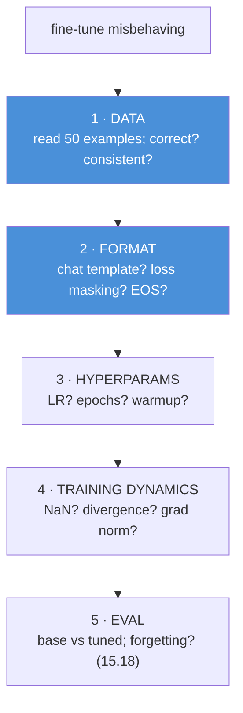
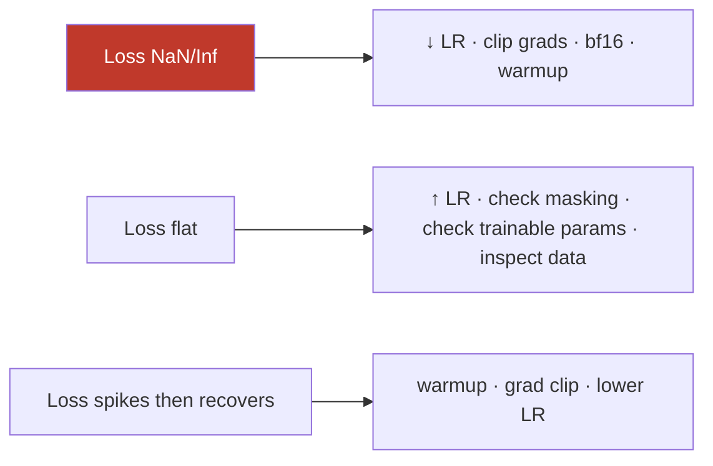

# 15.19 · Fine-Tuning Debugging

[⬅ 15.18 Base vs Fine-Tuned](15.18-base-vs-finetuned.md) · [🏠 Module 15](../README.md) · [➡ 15.20 Security & Privacy](15.20-security.md)

> **The lesson in one line:** Fine-tuning fails in a small set of recognizable ways — loss won't drop, loss goes NaN, the model repeats itself, gets *less* capable, over/underfits, ignores instructions, or was fed malformed data — and each symptom maps to a specific cause and fix, so debugging is a **systematic checklist**, not trial and error.

---

## 🎯 Learning objectives

- Diagnose the common fine-tuning failures and map each to its cause and fix.
- Apply a **systematic debugging workflow** (data → format → hyperparameters → training dynamics).
- Know the **first checks** that catch most bugs cheaply.

## ✅ Prerequisites

- [15.4 data](15.4-dataset-preparation.md), [15.5 format](15.5-instruction-datasets.md), [15.6 SFT](15.6-sft.md), [15.11 hyperparameters](15.11-hyperparameters.md), [15.13 forgetting](15.13-catastrophic-forgetting.md).

---

## 🧠 Mental model

> [!IMPORTANT]
> **Most fine-tuning bugs are *data or format* bugs wearing a *training* costume.** A loss that won't drop, a model that parrots or ignores instructions, or one that "trained fine but behaves wrong" — the root cause is usually a formatting/template mismatch ([15.5](15.5-instruction-datasets.md)), missing loss masking ([15.6](15.6-sft.md)), or bad data ([15.4](15.4-dataset-preparation.md)), not the optimizer. So debugging starts at the **data and the exact tokenized input**, not the learning rate. The few genuinely *training-dynamics* bugs (NaN loss, divergence) have their own quick fixes (lower LR, clip grads). **Read your data and the rendered input first — it catches most bugs before you touch a hyperparameter.**



---

## Symptom → cause → fix

| Symptom | Likely cause | Fix |
|---|---|---|
| **Loss not decreasing** | LR too low; broken masking; bad data; frozen everything | ↑ LR; check loss masking ([15.6](15.6-sft.md)); verify trainable params; inspect data |
| **Loss → NaN / Inf** | LR too high; no grad clipping; fp16 overflow | ↓ LR; clip grads; use **bf16**; add warmup |
| **Model repeats outputs** | missing EOS in labels; over-training; low diversity | add EOS ([15.6](15.6-sft.md)); fewer epochs; diversify data |
| **Model becomes less capable** | catastrophic forgetting | ↓ LR/epochs; LoRA; replay general data ([15.13](15.13-catastrophic-forgetting.md)) |
| **Overfitting** (val loss ↑) | too many epochs; small/narrow data; high rank | early stop; more/diverse data; ↓ rank; ↑ dropout |
| **Underfitting** | LR too low; too few epochs; rank too low | ↑ LR/epochs; ↑ LoRA rank + targets ([15.8](15.8-lora.md)) |
| **Poor instruction-following** | format ≠ chat template; wrong checkpoint | fix template ([15.5](15.5-instruction-datasets.md)); start from instruct ([15.2](15.2-base-models.md)) |
| **Dataset formatting errors** | schema/field mistakes; bad rendering | validate data ([15.4](15.4-dataset-preparation.md)); use `apply_chat_template` |
| **Tokenization errors** | no pad token; wrong tokenizer; truncation | set `pad_token`; match tokenizer to model; check max length |

> [!IMPORTANT]
> **Three checks catch the majority of fine-tuning bugs: (1) print the exact tokenized/rendered training example, (2) confirm loss is masked to the response with EOS included, and (3) read 50 random data examples.** Do these *before* touching hyperparameters. "Loss won't drop" is often broken masking or all-frozen params; "behaves wrong" is usually a template mismatch; "repeats forever" is usually a missing EOS. The optimizer is rarely the culprit.

---

## Training-dynamics bugs



- **NaN loss**: almost always **LR too high** or numerical overflow — lower LR, clip gradients (`max_norm=1.0`), prefer **bf16** over fp16 (wider range), add warmup.
- **Flat loss**: LR too low, or the model isn't actually learning your signal — **check that loss is masked correctly** and **that trainable params exist** (with LoRA, confirm only adapters train; with a fully frozen model, nothing learns).
- **Loss looks great but behavior is bad**: a **format/eval** problem, not a training one — the model learned the *wrong* thing (e.g., to reproduce prompts) perfectly.

---

## 🏭 Production examples

| Practice | Payoff |
|---|---|
| Log a rendered training example at startup | catch template/masking bugs immediately |
| Trainable-param count printed | catch "nothing is training" |
| Val loss + sample generations each epoch | catch overfitting/forgetting early |
| Grad-norm logging | spot instability before NaN |
| Data validation gate before training | reject malformed data upfront ([15.4](15.4-dataset-preparation.md)) |

## ⚡ GPU memory & 💲 cost considerations

- **OOM is a "bug" with a known ladder** ([15.12](15.12-training-optimization.md)): mixed precision → LoRA/QLoRA → checkpointing → accumulation → smaller seq/batch.
- **Cheap checks (reading data, printing the rendered input) save expensive re-runs** — do them before launching a long job.
- **Fail fast**: validate data and print one batch before committing GPU-hours.

## 🔒 Security considerations

> [!CAUTION]
> - **"Model became less safe" is a debugging symptom** — treat safety regressions as forgetting/alignment bugs and fix (LoRA, replay, lower LR), then re-evaluate ([15.13](15.13-catastrophic-forgetting.md), [15.17](15.17-evaluation.md)).
> - **Debugging logs may contain training data / PII** — govern them ([15.20](15.20-security.md)).
> - **Unexpected memorization** (model regurgitates training text) is a bug *and* a privacy issue — check leakage during debugging ([15.20](15.20-security.md)).

## 🚫 Common mistakes

| Mistake | Consequence |
|---|---|
| Tweaking LR before checking data/format | Chasing the wrong cause |
| Not printing the rendered training input | Miss template/masking bugs |
| Ignoring trainable-param count | "Nothing learns" goes undiagnosed |
| fp16 with a high LR | NaN loss |
| No EOS → then blaming the model | Endless generation |
| Debugging without base-vs-tuned eval | Can't tell better from worse ([15.18](15.18-base-vs-finetuned.md)) |

## 🐛 Debugging workflow (the checklist)

1. **Read the data** — 50 random examples: correct, consistent, on-format?
2. **Print the rendered/tokenized training example** — matches `apply_chat_template`? EOS present?
3. **Confirm loss masking** — response-only; and **trainable params exist** (adapters).
4. **Check hyperparameters** — LR order of magnitude; epochs; warmup.
5. **Watch training dynamics** — loss curve, grad norm; NaN → lower LR/clip/bf16.
6. **Evaluate base vs tuned** — target + retention + safety ([15.18](15.18-base-vs-finetuned.md)); is it a net improvement?
7. **Map symptom → fix** using the table.

## 🏋️ Exercises

1. **Plant bugs.** Introduce each symptom (no masking, no EOS, high LR, too many epochs, wrong template); confirm the mapped fix resolves it.
2. **NaN hunt.** Trigger NaN loss with a high LR; fix with lower LR + grad clip + bf16.
3. **Flat loss.** Freeze all params by mistake; show flat loss; fix by enabling adapters.
4. **Template mismatch.** Train with hand-concatenated vs `apply_chat_template`; show the behavior difference.
5. **Repetition.** Omit EOS; show endless generation; add EOS; fix.

## 🛠️ Mini project — "Fine-tuning debugger"

**Goal:** a preflight + monitoring tool that catches the common bugs early.

**Requirements:** data validator (schema/format/consistency, [15.4](15.4-dataset-preparation.md)); rendered-example printer + masking/EOS checker; trainable-param reporter; training-dynamics monitor (loss/grad-norm, NaN alerts); a symptom→fix advisor; base-vs-tuned eval hook ([15.18](15.18-base-vs-finetuned.md)).

**Folder structure**
```
ft-debugger/
├── preflight.py    # data + rendered input + masking + params
├── monitor.py      # loss/grad-norm/NaN alerts
├── advise.py       # symptom → cause → fix
└── eval_hook.py    # base vs tuned
```

**Testing:** each planted symptom is detected and correctly advised; preflight blocks malformed data; NaN alerts fire.
**Evaluation:** time-to-diagnosis on seeded bugs.
**GPU:** preflight avoids wasted GPU-hours.
**Security:** governed logs; leakage check ([15.20](15.20-security.md)).
**Future improvements:** auto-suggest hyperparameter fixes; integrate with the trainer callbacks.

## 📄 Cheat sheet

| Symptom | Fix |
|---|---|
| Loss won't drop | ↑ LR · **check masking** · trainable params · data |
| Loss NaN | ↓ LR · clip grads · **bf16** · warmup |
| Repeats output | add **EOS** · fewer epochs · diversify |
| Less capable | forgetting → LoRA · ↓ LR/epochs · replay |
| Overfitting | early stop · ↓ rank · ↑ dropout · more data |
| Underfitting | ↑ LR/epochs · ↑ rank + targets |
| Ignores instructions | fix **chat template** · right checkpoint |
| Format/token errors | validate data · `apply_chat_template` · set `pad_token` |
| **⭐ First 3 checks** | render input · confirm masking+EOS · read 50 examples |

## 🎴 Flashcards

- **⭐ Where do most fine-tuning bugs actually live?** → In the data or the format (template/masking), not the optimizer — read your data and the rendered tokenized input first.
- **Loss won't decrease — likely causes?** → LR too low, broken loss masking, no trainable params (all frozen), or bad data.
- **Loss goes NaN — fix?** → Lower the learning rate, clip gradients, use bf16 instead of fp16, add warmup.
- **Model repeats/never stops — cause?** → Missing EOS token in the labels (it never learned to stop); also over-training/low diversity.
- **Model got less capable — what is it and the fix?** → Catastrophic forgetting; use LoRA, lower LR/epochs, and replay general data.
- **Model ignores instructions after training — cause?** → Format mismatch (didn't use the model's chat template) or the wrong starting checkpoint.
- **⭐ What three checks catch most bugs?** → Print the rendered training example, confirm loss is masked to the response with EOS, and read 50 random data examples.

## 💬 Interview questions

1. Why are most fine-tuning bugs data/format bugs, and how do you check?
2. Map five symptoms (flat loss, NaN, repetition, forgetting, poor instruction-following) to causes and fixes.
3. What are your first three debugging checks and why?
4. How do you diagnose "loss looks great but behavior is bad"?
5. How do you fix NaN loss and instability?
6. How does evaluation fit into debugging a fine-tune?

## 📝 Summary

- Fine-tuning fails in a **small set of recognizable ways**, and most are **data/format bugs** (template mismatch, missing masking/EOS, bad data) — not optimizer problems.
- **Debug systematically**: data → rendered format/masking → hyperparameters → training dynamics → base-vs-tuned eval; **the first three checks** (render the input, confirm masking+EOS, read 50 examples) catch the majority.
- **Training-dynamics bugs** have quick fixes: **NaN → lower LR/clip/bf16/warmup**, **flat loss → check masking and trainable params**, **repetition → add EOS**.
- **Safety/capability regressions are debugging symptoms too** — fix via LoRA/replay/lower-LR and re-evaluate ([15.13](15.13-catastrophic-forgetting.md), [15.17](15.17-evaluation.md)).

## 📚 References

1. **[15.6 SFT](15.6-sft.md).** Loss masking and EOS.
2. **[15.5 Instruction Datasets](15.5-instruction-datasets.md).** Chat-template correctness.
3. **[15.11 Hyperparameters](15.11-hyperparameters.md) & [15.13 Forgetting](15.13-catastrophic-forgetting.md).** LR/epoch and regression fixes.
4. **[15.12 Training Optimization](15.12-training-optimization.md).** The OOM ladder.

---

## 🧭 Navigation

| Direction | Link |
|---|---|
| ⬅ Previous | [15.18 · Base vs Fine-Tuned Evaluation](15.18-base-vs-finetuned.md) |
| ➡ Next | [15.20 · Security & Privacy](15.20-security.md) |
| 🏠 Module | [Module 15](../README.md) |
| 📖 Lessons | [Lesson index](README.md) |
