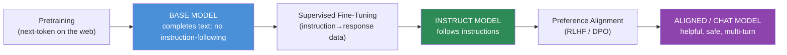

# 15.2 · Base Models

[⬅ 15.1 Why Fine-Tuning Exists](15.1-why-fine-tuning.md) · [🏠 Module 15](../README.md) · [➡ 15.3 Strategy Selection](15.3-strategy-selection.md)

> **The lesson in one line:** The model you start from decides half your outcome — a **base** model is a raw next-token predictor, an **instruct** model already follows instructions, and a **chat** model is tuned for multi-turn dialogue with a chat template, so you must pick the right starting point *and* match its expected input format or fine-tuning goes sideways.

---

## 🎯 Learning objectives

- Distinguish **pretrained / foundation / base**, **instruction-tuned**, and **chat** models.
- Understand the **base → SFT → instruct → aligned → chat** progression.
- Choose the right **starting checkpoint** for a fine-tuning task and match its format.

## ✅ Prerequisites

- [15.1 why fine-tune](15.1-why-fine-tuning.md), [11.9 pretraining](../../11-LLMs/weeks/11.9-pretraining.md), [11.13 alignment](../../11-LLMs/weeks/11.13-alignment.md).

---

## 🧠 Mental model

> [!IMPORTANT]
> **"A model" isn't one thing — it's a checkpoint at some stage of a pipeline, and which stage you start from changes everything downstream.** A **base** model has only been pretrained: it completes text but doesn't "answer questions" or follow instructions — prompt it with a question and it might continue with *more questions*. An **instruct** model has been fine-tuned on instruction→response data, so it follows directions. A **chat** model adds multi-turn dialogue behavior and a **chat template** (special tokens marking user/assistant turns). **Starting from the wrong stage, or ignoring a model's expected input format, is one of the most common fine-tuning failures.**



---

## The stages

| Stage | Trained on | Behavior | Also called |
|---|---|---|---|
| **Base / pretrained / foundation** | huge web corpus (next-token) | completes text; no instruction-following | "base", "pt" |
| **Instruct** | instruction→response pairs (SFT, [15.6](15.6-sft.md)) | follows single-turn instructions | "instruct", "sft", "it" |
| **Aligned / Chat** | + preferences (RLHF/DPO, [15.14](15.14-rlhf.md)–[15.15](15.15-dpo.md)) | helpful, safe, multi-turn dialogue | "chat", "aligned" |

- **Foundation model** = a large pretrained model meant to be adapted (base is a foundation checkpoint).
- **Instruct vs chat**: instruct handles single instructions; chat is optimized for **conversations** and ships with a **chat template** (the exact special-token format wrapping each turn).

## Base vs Instruct vs Chat — how they respond

```
Prompt: "What is the capital of France?"

BASE   → " What is the capital of Germany? What is the capital of..."   (continues the pattern)
INSTRUCT → "The capital of France is Paris."                            (answers)
CHAT   → "The capital of France is Paris. Anything else you'd like to know?"  (converses)
```

> [!IMPORTANT]
> **Match the checkpoint to your fine-tuning goal — and always use the model's expected input format.** Fine-tuning **from base** gives maximum control (you install *all* behavior, including the chat format) and avoids inheriting an instruct model's baked-in style — good for heavy domain/behavior changes with lots of data. Fine-tuning **from instruct/chat** starts with instruction-following already learned, so you need **far less data** to nudge style/format/skill — the common choice. **Whichever you pick, format your training data with that model's chat template**; a format mismatch is a top cause of a fine-tune that "trained fine but behaves badly" ([15.5](15.5-instruction-datasets.md), [15.19](15.19-debugging.md)).

---

## Choosing a starting checkpoint

| You want to… | Start from | Why |
|---|---|---|
| Add a skill/style with limited data | **instruct/chat** | instruction-following already there; less data needed |
| Heavy domain/behavior change, lots of data | **base** | full control; no inherited style to fight |
| A pure single-task classifier | **base or small instruct** | small model, cheap, task-shaped |
| Keep general chat ability + specialize | **chat** | preserve conversational behavior; adapt lightly |
| Continued pretraining on a domain corpus | **base** | unlabeled domain text, next-token ([15.3](15.3-strategy-selection.md)) |

Also weigh: **size** (bigger = more capable but costlier to tune/serve), **license** (can you use it commercially?), **context length**, **tokenizer/language coverage**, and **community support / available quantizations**.

---

## 🏭 Production examples

| Task | Typical base |
|---|---|
| Domain assistant (limited data) | an instruct/chat model, LoRA |
| Strict-format extractor (lots of data) | a base or small instruct model |
| Multilingual support bot | a chat model with good language coverage |
| On-device/cheap classifier | a small base model, full FT or LoRA |
| Continued pretraining on legal corpus | a base model |

## ⚡ GPU memory & 💲 cost considerations

- **Bigger checkpoints cost more** to fine-tune (memory, [15.7](15.7-full-fine-tuning.md)) and to serve — pick the smallest model that meets quality.
- **Starting from instruct/chat needs less data/compute** to reach a target behavior (instruction-following is pre-installed).
- **Quantized base weights** (for QLoRA, [15.9](15.9-qlora.md)) let you tune large checkpoints on one GPU.

## 🔒 Security considerations

> [!CAUTION]
> - **Check the license** — some open weights forbid commercial use or certain applications; a fine-tune inherits the base license.
> - **Provenance/supply chain** — a base model from an untrusted source could carry embedded backdoors/biases; prefer reputable, widely-audited checkpoints.
> - **Chat/instruct models carry baked-in safety alignment** — heavy fine-tuning can **weaken** it ([15.13](15.13-catastrophic-forgetting.md), [15.20](15.20-security.md)); re-test safety after tuning.

## 🚫 Common mistakes

| Mistake | Consequence |
|---|---|
| Fine-tuning a base model but expecting chat behavior | It completes text, doesn't answer |
| Ignoring the model's chat template | Format mismatch → bad behavior ([15.5](15.5-instruction-datasets.md)) |
| Starting from a huge model when a small one suffices | Needless tuning/serving cost |
| Overlooking the license | Legal/deployment blocker |
| Assuming instruct == chat | Single-turn vs multi-turn mismatch |

## 🐛 Debugging workflow

Model "trained fine but behaves oddly"? (1) **Did you use the right checkpoint** for the goal (base vs instruct/chat)? (2) **Does your data use the model's exact chat template** (special tokens, roles)? A mismatch here explains most "it answers weirdly" cases. (3) Is the base model's tokenizer the one you formatted with? Full method in [15.19](15.19-debugging.md).

## 🏋️ Exercises

1. **Base vs instruct.** Prompt a base and an instruct model with the same question; document the behavioral difference.
2. **Template inspection.** Print a chat model's chat template; format one example correctly and incorrectly; note the difference.
3. **Checkpoint choice.** For three tasks (limited-data style change, heavy domain change, single-task classifier), pick a starting checkpoint and justify.
4. **License audit.** For two open models, determine commercial-use rights and any restrictions.
5. **Size trade-off.** Estimate tuning + serving cost for a small vs large base for the same task.

## 🛠️ Mini project — "Checkpoint selector"

**Goal:** a helper that recommends a base checkpoint (base/instruct/chat + size) from task constraints and prints the model's chat template.

**Requirements:** inputs = data volume, goal (style/skill/domain), multi-turn?, license needs, GPU; output = recommended stage + size class + a note to match the chat template; a utility that loads a model's `chat_template` and formats a sample.

**Folder structure**
```
checkpoint-selector/
├── recommend.py    # stage + size from constraints
├── template.py     # load & apply chat template
└── examples/
```

**Testing:** limited-data style → instruct/chat; heavy-domain → base; template applied correctly.
**Evaluation:** recommendations match expert labels on sample tasks.
**Security:** surface license + provenance warnings.
**Future improvements:** auto-detect if a checkpoint is base vs instruct from behavior probes.

## 📄 Cheat sheet

| Concept | One line |
|---|---|
| **Base / foundation** | pretrained next-token predictor; completes, doesn't answer |
| **Instruct** | SFT'd on instruction→response; follows directions |
| **Chat / aligned** | + RLHF/DPO; multi-turn, safe; has a **chat template** |
| **⭐ Progression** | base → SFT → instruct → align → chat |
| **From base** | max control, more data, full behavior install |
| **From instruct/chat** | less data; instruction-following pre-installed (common) |
| **⭐ Always** | format data with the model's exact chat template |
| **Also check** | size · license · context · tokenizer/languages |

## 🎴 Flashcards

- **⭐ Base vs instruct vs chat model?** → Base completes text (no instruction-following); instruct follows single instructions (after SFT); chat is aligned for multi-turn dialogue with a chat template.
- **What is the model progression?** → Pretraining → base → SFT → instruct → preference alignment (RLHF/DPO) → aligned/chat.
- **⭐ From base vs from instruct — when each?** → From base for heavy domain/behavior changes with lots of data (full control); from instruct/chat for style/skill/format with limited data (instruction-following pre-installed).
- **What is a chat template?** → The exact special-token format wrapping user/assistant turns; you must format training data with the model's own template.
- **What's a top "trained fine but behaves badly" cause?** → Format mismatch — not using the model's chat template — or starting from the wrong checkpoint.
- **What should you check besides stage?** → Size, license (commercial use?), context length, tokenizer/language coverage, and available quantizations.

## 💬 Interview questions

1. Distinguish base, instruct, and chat models. How does each respond to a question?
2. Walk through the base → aligned progression.
3. When would you fine-tune from a base model vs an instruct model?
4. What is a chat template and why must training data match it?
5. What factors beyond capability decide your starting checkpoint?
6. How can heavy fine-tuning affect a chat model's built-in safety?

## 📝 Summary

- A "model" is a **checkpoint at a stage**: **base** (completes text), **instruct** (follows instructions after SFT), **chat/aligned** (multi-turn, safe, with a **chat template**) — via **base → SFT → instruct → align → chat**.
- **Start from base** for heavy domain/behavior changes with lots of data (full control); **from instruct/chat** for style/skill/format with limited data (instruction-following pre-installed) — the common choice.
- **Always format training data with the model's exact chat template**; a mismatch is a top cause of a fine-tune that trains cleanly but behaves badly.
- Also weigh **size, license, context length, tokenizer coverage**, and remember heavy tuning can **weaken baked-in safety** ([15.13](15.13-catastrophic-forgetting.md)).

## 📚 References

1. **[11.9 Pretraining](../../11-LLMs/weeks/11.9-pretraining.md) & [11.13 Alignment](../../11-LLMs/weeks/11.13-alignment.md).** ⭐ How stages are produced.
2. **Hugging Face docs — chat templates.** Applying a model's template correctly.
3. **[15.5 Instruction Dataset Design](15.5-instruction-datasets.md).** Formatting for a checkpoint.
4. **Model cards (Llama/Mistral/Qwen, etc.).** Base vs instruct variants and licenses.

---

## 🧭 Navigation

| Direction | Link |
|---|---|
| ⬅ Previous | [15.1 · Why Fine-Tuning Exists](15.1-why-fine-tuning.md) |
| ➡ Next | [15.3 · Fine-Tuning Strategy Selection](15.3-strategy-selection.md) |
| 🏠 Module | [Module 15](../README.md) |
| 📖 Lessons | [Lesson index](README.md) |
