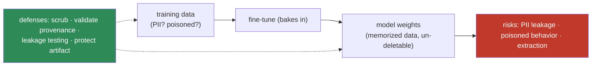
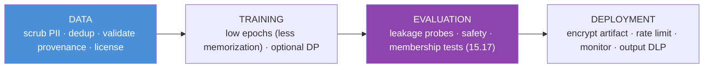

# 15.20 · Security & Privacy

[⬅ 15.19 Debugging](15.19-debugging.md) · [🏠 Module 15](../README.md) · [➡ 15.21 Production Pipeline](15.21-production-pipeline.md)

> **The lesson in one line:** Fine-tuning **bakes your training data into the weights**, which creates fine-tuning-specific risks a prompted/RAG model doesn't have — the model can **memorize and leak PII**, be **poisoned** by malicious training data, and be **extracted** by attackers — so security here is defensive data engineering: scrub, control, validate, and test for leakage.

> [!NOTE]
> This lesson is **strictly defensive** — protecting models and data. It extends [12.16 prompt security](../../12-Prompt-Engineering/weeks/12.16-security.md) and [11.18 LLM safety](../../11-LLMs/weeks/11.18-safety.md).

---

## 🎯 Learning objectives

- Understand fine-tuning-specific risks: **PII handling, memorization, data leakage, dataset poisoning, model extraction**.
- Apply defensive controls across the data → training → deployment lifecycle.
- Test for **memorization/leakage** as part of evaluation.

## ✅ Prerequisites

- [15.4 dataset preparation](15.4-dataset-preparation.md), [15.17 evaluation](15.17-evaluation.md), [12.16 prompt security](../../12-Prompt-Engineering/weeks/12.16-security.md).

---

## 🧠 Mental model

> [!IMPORTANT]
> **The core fine-tuning risk is that training data becomes *part of the model* — irreversibly and often un-auditably.** A RAG system keeps knowledge in an external store you can access-control, update, and delete; fine-tuning **bakes it into billions of weights** where it can be **memorized** (and later regurgitated), can't be selectively **deleted** without retraining, and can be **poisoned** by whoever supplied the data. So the security work is upstream and defensive: **control what goes into the weights** (scrub PII, validate provenance), **test what came out** (leakage probes), and **protect the artifact** (the fine-tuned model is sensitive). The threat model is different from prompting because the data and the model are now fused.



---

## The risks

### Memorization & PII leakage
LLMs **memorize** rare/repeated training examples and can **regurgitate** them verbatim when prompted ([15.4](15.4-dataset-preparation.md)). If training data contained PII/secrets, the model can leak them — a privacy breach baked into the weights. **Deduplication reduces memorization** (repeated data is memorized more); **redaction removes the risk at the source**.

### Sensitive training data & the deletion problem
You **can't easily "delete" a fact** from fine-tuned weights — right-to-be-forgotten means **retraining without that data**. So decide *before* baking in: sensitive/regulated data is often better in **RAG** (access-controlled, deletable) than in weights ([15.1](15.1-why-fine-tuning.md)).

### Dataset poisoning
An attacker who can inject training examples can install **backdoors** or biased/harmful behavior that's **invisible** until triggered ([15.4](15.4-dataset-preparation.md)). A handful of poisoned examples can suffice. Defenses: **control who can contribute data**, **validate provenance**, and **anomaly-detect** the dataset.

### Model extraction
An exposed model (or its API) can be **queried to reconstruct** its behavior/weights, or **membership-inference** attacks can determine whether a specific record was in the training set. Defenses: **rate limiting, output filtering, monitoring**, and (for strong guarantees) **differential privacy** in training.

| Risk | Defense |
|---|---|
| **Memorization / PII leakage** | scrub/redact PII · deduplicate · leakage testing · (DP training) |
| **Un-deletable sensitive data** | keep in RAG, not weights · plan retraining for deletion |
| **Dataset poisoning / backdoors** | provenance control · data validation · anomaly detection |
| **Model extraction / membership inference** | rate limit · monitor · output filtering · differential privacy |
| **Sensitive model artifact** | encrypt · access-control · audit ([15.21](15.21-production-pipeline.md)) |

---

## Defensive engineering across the lifecycle



> [!IMPORTANT]
> **The highest-leverage defense is not baking sensitive data into weights in the first place — prefer RAG for anything private, deletable, or regulated.** When you *must* fine-tune on sensitive data: **redact PII at the source, deduplicate (less memorization), keep epochs low, self-host (data never leaves), test for leakage, and protect the model artifact.** Security here is mostly **data governance done before training**, because after training the data is fused into the weights and your options shrink to retraining.

---

## 🧮 Mathematical intuition

Memorization scales with **how often** an example appears and **how many epochs** you train: a datum seen `k` times over `E` epochs gets `k·E` gradient nudges toward reproducing it, so **duplication and high epoch counts amplify memorization** — hence dedup ([15.4](15.4-dataset-preparation.md)) and low epochs ([15.11](15.11-hyperparameters.md)) reduce leakage. **Differential privacy** adds calibrated noise to gradients so no single example measurably changes the model, bounding what any one record can leak — at a cost to utility. The trade-off: less memorization (safer) vs more fit (better task performance).

---

## 🏭 Production examples

| Scenario | Controls |
|---|---|
| Fine-tune on customer support logs | redact PII, dedup, self-host, leakage test |
| Regulated (health/finance) data | prefer RAG; if FT, DP + strict governance |
| Community-contributed training data | provenance control + validation + anomaly detection (poisoning) |
| Exposed fine-tuned API | rate limit + monitoring + output DLP (extraction) |
| Shared base with per-tenant adapters | isolate adapters; the base carries no tenant data ([15.8](15.8-lora.md)) |

## ⚡ GPU memory & 💲 cost considerations

- **Differential privacy costs utility and some compute** (per-example gradient clipping + noise) — use when the privacy requirement justifies it.
- **Dedup + low epochs reduce leakage *and* cost** — a rare win-win ([15.4](15.4-dataset-preparation.md), [15.11](15.11-hyperparameters.md)).
- **Leakage/extraction testing is inference cost** — budget it into evaluation ([15.17](15.17-evaluation.md)).

## 🔒 Security considerations (this is the lesson)

> [!CAUTION]
> - **Redact PII before training; deduplicate; keep epochs low** — the memorization triad.
> - **Prefer RAG for sensitive/deletable/regulated knowledge** — weights can't be selectively deleted.
> - **Control data provenance and validate** to prevent poisoning/backdoors.
> - **Test for leakage and membership inference** as part of evaluation; **red-team** the model.
> - **Protect the model artifact** (encrypt, access-control, audit) — it's sensitive; and **rate-limit/monitor** exposed endpoints against extraction.

## 🚫 Common mistakes

| Mistake | Consequence |
|---|---|
| Fine-tuning on un-redacted PII | Memorized, leakable private data |
| Assuming you can "delete" a fact later | Un-deletable without retraining |
| No provenance control on training data | Poisoning/backdoors |
| No leakage/membership testing | Undetected privacy breach |
| Sending sensitive data to a hosted FT API | Data leaves your boundary |
| High epochs on sensitive data | More memorization/leakage |
| Unprotected model checkpoints | Artifact theft/extraction |

## 🐛 Debugging workflow

Suspected security/privacy issue: (1) **Leakage** — prompt the model with prefixes of known training examples; does it complete them verbatim? Dedup + redact + fewer epochs. (2) **Poisoning** — unexpected/triggered behavior? Audit data provenance; anomaly-scan the dataset; retrain from clean data. (3) **Membership** — can an attacker tell if a record was trained on? Consider DP + reduce overfitting ([15.13](15.13-catastrophic-forgetting.md)). (4) **Artifact** — is the checkpoint access-controlled/encrypted? Fix governance ([15.21](15.21-production-pipeline.md)). Full method in [15.19](15.19-debugging.md).

## 🏋️ Exercises

1. **Memorization probe.** Train with a duplicated unique string; prompt its prefix; show verbatim leakage; then dedup + fewer epochs and show it drops.
2. **PII redaction.** Build a redaction pass; verify no PII remains in the training set; re-test leakage.
3. **Poisoning demo (defensive).** Add a few "backdoor" examples; show the triggered behavior; then detect them via provenance/anomaly checks.
4. **Membership intuition.** Explain how overfitting increases membership-inference risk; relate to epochs/rank.
5. **RAG vs FT decision.** For a sensitive-data use case, argue RAG over fine-tuning on security grounds.

## 🛠️ Mini project — "Secure fine-tuning layer"

**Goal:** a governance layer that makes a fine-tune privacy-safe end to end.

**Requirements:** PII detection + redaction ([15.4](15.4-dataset-preparation.md)); deduplication (memorization); provenance/validation (poisoning); low-epoch/optional-DP training config; a leakage-probe + membership-inference test suite ([15.17](15.17-evaluation.md)); encrypted, access-controlled artifact storage; a RAG-vs-FT advisor for sensitive data.

**Folder structure**
```
secure-ft/
├── pii.py          # detect + redact
├── provenance.py   # source validation + anomaly scan
├── train_dp.py     # low-epoch / optional differential privacy
├── leakage.py      # memorization + membership tests
└── artifact.py     # encrypt + access-control + audit
```

**Testing:** no PII in training set; leakage probes fail to extract; poisoned examples flagged; artifact access-controlled.
**Evaluation:** leakage rate (target ~0); poisoning detection rate.
**GPU:** DP overhead noted.
**Security:** the whole project — defensive lifecycle.
**Monitoring:** endpoint rate-limit/anomaly for extraction ([15.21](15.21-production-pipeline.md)).
**Future improvements:** formal DP budgets; unlearning research; canary strings to detect leakage.

## 📄 Cheat sheet

| Risk | Defense |
|---|---|
| **⭐ Memorization / PII leakage** | scrub/redact · **dedup** · low epochs · leakage test |
| **Un-deletable data** | prefer **RAG** for sensitive/deletable knowledge |
| **⭐ Dataset poisoning** | provenance control · validation · anomaly detection |
| **Model extraction / membership** | rate limit · monitor · output DLP · **differential privacy** |
| **Sensitive artifact** | encrypt · access-control · audit |
| **⭐ Memorization triad** | redact + dedup + low epochs |
| **⭐ Principle** | govern data **before** training — weights fuse the data |

## 🎴 Flashcards

- **⭐ What's the core fine-tuning-specific risk?** → Training data becomes part of the weights — irreversibly and un-auditably — so it can be memorized/leaked and can't be selectively deleted.
- **What is memorization, and what amplifies it?** → LLMs memorize rare/repeated examples and can regurgitate them; duplication and high epoch counts amplify it — so dedup and low epochs reduce leakage.
- **⭐ Why prefer RAG for sensitive data?** → Weights can't be selectively deleted (right-to-be-forgotten needs retraining); RAG keeps knowledge access-controlled, updatable, and deletable.
- **What is dataset poisoning?** → Injecting malicious training examples to install backdoors or harmful behavior, invisible until triggered; defend with provenance control, validation, and anomaly detection.
- **What is model extraction / membership inference?** → Reconstructing a model's behavior via queries, or determining whether a record was in the training set; defend with rate limiting, monitoring, and differential privacy.
- **What is the memorization triad?** → Redact PII + deduplicate + keep epochs low.
- **How does differential privacy help?** → It adds calibrated noise to gradients so no single example measurably changes the model, bounding leakage — at some cost to task utility.

## 💬 Interview questions

1. Why does fine-tuning create privacy risks that prompting/RAG don't?
2. What is memorization, and how do you reduce it?
3. Why can't you "delete" data from a fine-tuned model, and what follows?
4. What is dataset poisoning, and how do you defend against it?
5. What are model extraction and membership inference, and their defenses?
6. When would you choose RAG over fine-tuning purely on security grounds?
7. What does differential privacy buy and cost in fine-tuning?

## 📝 Summary

- Fine-tuning **fuses training data into the weights**, creating risks a prompted/RAG model avoids: **memorization/PII leakage, un-deletable sensitive data, dataset poisoning/backdoors, and model extraction/membership inference**.
- The defense is **data governance before training**: **redact PII, deduplicate, keep epochs low** (the memorization triad), **control provenance and validate** (poisoning), and **prefer RAG for sensitive/deletable knowledge**.
- **Test for leakage and membership** as part of evaluation ([15.17](15.17-evaluation.md)), **protect the model artifact** (encrypt/access-control/audit), and **rate-limit/monitor** exposed endpoints; use **differential privacy** when the requirement justifies the utility cost.
- The strictly-defensive throughline: **control what goes into the weights, test what comes out, and protect the model** ([12.16](../../12-Prompt-Engineering/weeks/12.16-security.md), [11.18](../../11-LLMs/weeks/11.18-safety.md)).

## 📚 References

1. **Carlini et al. (2021) — _Extracting Training Data from LLMs_.** ⭐ Memorization/leakage.
2. **Lee et al. (2021) — _Deduplicating Training Data_.** Dedup reduces memorization.
3. **Abadi et al. (2016) — _Deep Learning with Differential Privacy_.** DP-SGD.
4. **[12.16 Prompt Security](../../12-Prompt-Engineering/weeks/12.16-security.md) & [11.18 LLM Safety](../../11-LLMs/weeks/11.18-safety.md).** Broader defensive framing.

---

## 🧭 Navigation

| Direction | Link |
|---|---|
| ⬅ Previous | [15.19 · Fine-Tuning Debugging](15.19-debugging.md) |
| ➡ Next | [15.21 · Production Fine-Tuning Pipeline](15.21-production-pipeline.md) |
| 🏠 Module | [Module 15](../README.md) |
| 📖 Lessons | [Lesson index](README.md) |
