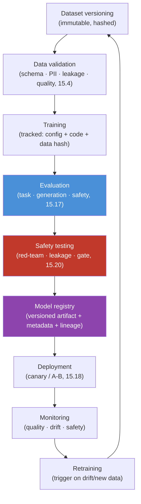

# 15.21 · Production Fine-Tuning Pipeline

[⬅ 15.20 Security & Privacy](15.20-security.md) · [🏠 Module 15](../README.md) · [➡ 15.22 Projects & Summary](15.22-projects-summary.md)

> **The lesson in one line:** A one-off fine-tune in a notebook isn't a product — a production pipeline **versions the data and the model, validates and evaluates before shipping, gates on safety, registers artifacts, deploys with rollback, monitors in the wild, and retrains on a loop** — so every model is reproducible, comparable, and recoverable.

---

## 🎯 Learning objectives

- Design the **production fine-tuning pipeline**: versioned data → validate → train → evaluate → safety-test → registry → deploy → monitor → retrain.
- Apply **experiment tracking, model/dataset versioning, reproducibility, and rollback**.
- Understand what makes a fine-tune **operable**, not just trained.

## ✅ Prerequisites

- [15.4 data](15.4-dataset-preparation.md), [15.17 evaluation](15.17-evaluation.md), [15.18 base vs tuned](15.18-base-vs-finetuned.md), [16 MLOps](../../16-MLOps/README.md).

---

## 🧠 Mental model

> [!IMPORTANT]
> **The training run is the *easy, small* part; the pipeline around it — versioning, validation, evaluation, gating, registry, deployment, monitoring, retraining — is what makes fine-tuning a repeatable capability instead of a one-time science experiment.** The two things you must be able to answer at any time: **"exactly what data + code + config produced this model?"** (reproducibility) and **"is this model better than what's in production, and can I roll back?"** (safety of change). A production pipeline is the machinery that guarantees both — turning "I fine-tuned a model" into "we can reliably ship, compare, and recover fine-tuned models."

---

## The production pipeline



| Stage | Job |
|---|---|
| **Dataset versioning** | immutable, hashed dataset snapshots — know exactly what trained the model |
| **Data validation** | schema/format, PII, leakage, quality gate ([15.4](15.4-dataset-preparation.md), [15.20](15.20-security.md)) |
| **Training** | tracked run: config + code version + data hash + metrics |
| **Evaluation** | task + generation + safety, base vs tuned ([15.17](15.17-evaluation.md)–[15.18](15.18-base-vs-finetuned.md)) |
| **Safety testing** | red-team + leakage; **deployment gate** ([15.20](15.20-security.md)) |
| **Model registry** | versioned artifacts + metadata + lineage + stage (dev/staging/prod) |
| **Deployment** | canary/A-B rollout; the base as fallback |
| **Monitoring** | quality, drift, safety, cost in production |
| **Retraining** | triggered by drift, new data, or a schedule → back to the top |

---

## The four operational pillars

### Experiment tracking
Log **every run's config, code version, data hash, metrics, and artifacts** (e.g., MLflow / Weights & Biases). Without it you can't compare runs or reproduce a good one — fine-tuning has many knobs ([15.11](15.11-hyperparameters.md)) and non-determinism.

### Dataset & model versioning
- **Dataset versioning**: immutable snapshots (hash/DVC) so a model always points to the exact data that made it ([15.4](15.4-dataset-preparation.md)).
- **Model versioning**: each fine-tune (or adapter, [15.8](15.8-lora.md)) is a registered, versioned artifact with **lineage** (which base + which data + which config).

### Reproducibility
Pin **everything**: base model revision, library versions ([15.10](15.10-practical-stack.md)), seeds, data hash, config. A model you can't reproduce is a model you can't trust, debug, or defend.

### Rollback
Because you version data and models and keep the base/previous model in the registry, a bad ship is reverted by **re-pointing serving to the last-good version** — fast, no retraining. This is what makes shipping fine-tunes *safe*.

> [!IMPORTANT]
> **Two invariants define a production fine-tuning pipeline: full lineage (data hash + config + code + base → this exact model) and safe change (evaluate/gate before ship, roll back instantly after).** Everything else — tracking, versioning, registry — exists to serve those two. If you can reproduce any model and roll back any deployment, you can fine-tune continuously without fear. **LoRA adapters make this especially clean**: tiny, versioned, swappable artifacts you can register, A/B, and roll back per task.

---

## 🏭 Production examples

| Practice | Payoff |
|---|---|
| Data hash → model lineage | reproduce/audit any model |
| Eval + safety gate in CI | no regression/unsafe model ships ([15.18](15.18-base-vs-finetuned.md)) |
| Model registry with stages | promote dev→staging→prod deliberately |
| Canary/A-B rollout | validate on real traffic before full ship |
| Monitoring + drift-triggered retrain | model stays current |
| Adapter registry (LoRA) | swap/rollback per-task cheaply |

## ⚡ GPU memory & 💲 cost considerations

- **Training is periodic; the pipeline runs continuously** — most ongoing cost is evaluation, monitoring, and re-training triggers, not the single train job.
- **LoRA adapters are cheap to store/version/serve** (few MB) → many versions/tenants without heavy storage ([15.8](15.8-lora.md)).
- **Automated retraining can run away in cost** — gate triggers (only on real drift/new data), don't retrain blindly.

## 🔒 Security considerations

> [!CAUTION]
> - **The registry holds sensitive artifacts** (models that memorized data) — encrypt, access-control, audit ([15.20](15.20-security.md)).
> - **Safety testing must be a hard deployment gate** — never auto-promote a model past it ([15.17](15.17-evaluation.md)).
> - **Data-version lineage supports compliance** — you can prove what a model was trained on (and retrain to delete data, [15.20](15.20-security.md)).
> - **Pin base-model + dependency revisions** to prevent supply-chain drift ([15.10](15.10-practical-stack.md)).

## 🚫 Common mistakes

| Mistake | Consequence |
|---|---|
| No dataset versioning | Can't reproduce/audit; no lineage |
| Training without experiment tracking | Can't compare or reproduce runs |
| No eval/safety gate | Regressed/unsafe models ship |
| No rollback path | Stuck with a bad model |
| Unpinned dependencies/base revision | Irreproducible; silent drift |
| Blind automated retraining | Runaway cost; possible regressions |
| No production monitoring | Silent quality/safety decay |

## 🐛 Debugging workflow

Production model issue: (1) **Which version is live, and what's its lineage?** (registry: base + data hash + config). (2) **Reproduce** the run from the pinned lineage. (3) **Regression?** Compare to the previous version on the eval suite ([15.18](15.18-base-vs-finetuned.md)); **roll back** to last-good while fixing forward. (4) **Drift?** Monitoring shows quality/distribution change → trigger retraining on fresh data. (5) **Safety incident?** The gate should have caught it — add the case to the safety suite. Versioning + lineage turn "mystery model" into "diff, reproduce, roll back."

## 🏋️ Exercises

1. **Lineage.** Set up dataset hashing + experiment tracking; from a model, recover the exact data/config/code that made it.
2. **Gate.** Build an eval+safety CI gate; make a regressing candidate; verify it's blocked ([15.18](15.18-base-vs-finetuned.md)).
3. **Registry + rollback.** Register two model versions; deploy one; roll back to the other by re-pointing serving.
4. **Reproduce.** Re-run a tracked fine-tune from pinned config/seed/data; confirm matching metrics.
5. **Retrain trigger.** Simulate drift in monitoring; trigger a gated retraining run.

## 🛠️ Mini project — "Production fine-tuning pipeline"

**Goal:** an end-to-end pipeline: versioned data → validate → train (tracked) → evaluate → safety-gate → registry → deploy → monitor → retrain.

**Requirements:** dataset versioning (hash/DVC); data validation gate ([15.4](15.4-dataset-preparation.md)); tracked training (config+code+data hash+metrics); base-vs-tuned eval + safety gate ([15.17](15.17-evaluation.md)–[15.18](15.18-base-vs-finetuned.md)); model registry with lineage + stages; canary/A-B deploy; monitoring (quality/drift/safety); drift-triggered, gated retraining; rollback.

**Folder structure**
```
ft-pipeline/
├── data/           # versioning + validation
├── train/          # tracked runs (config + lineage)
├── eval/           # base-vs-tuned + safety gate
├── registry/       # versioned artifacts + lineage + stages
├── deploy/         # canary/A-B + rollback
└── monitor/        # quality/drift/safety + retrain trigger
```

**Testing:** any model reproducible from lineage; regressing/unsafe candidate blocked; rollback restores last-good; retrain triggers on drift.
**Evaluation:** MTTR for a bad model; reproducibility rate.
**GPU:** periodic training vs continuous pipeline cost.
**Security:** encrypted registry; safety gate; data lineage for compliance ([15.20](15.20-security.md)).
**Monitoring:** production quality/safety/drift dashboards.
**Future improvements:** automated red-teaming; multi-tenant adapter registry; unlearning for deletion.

## 📄 Cheat sheet

| Concept | One line |
|---|---|
| **⭐ Pipeline** | version data → validate → train → eval → safety-gate → registry → deploy → monitor → retrain |
| **Experiment tracking** | config + code + data hash + metrics per run |
| **Dataset versioning** | immutable hashed snapshots → lineage |
| **Model versioning** | registered artifact + lineage + stage |
| **Reproducibility** | pin base rev, libs, seed, data hash, config |
| **⭐ Rollback** | re-point serving to last-good (no retrain) |
| **Safety gate** | hard deployment gate; never auto-past |
| **⭐ Two invariants** | full lineage + safe change (gate + rollback) |
| **LoRA bonus** | cheap versioned/swappable adapter artifacts |

## 🎴 Flashcards

- **⭐ What does a production fine-tuning pipeline add over a training run?** → Versioning (data + model), validation, evaluation + safety gating, a registry, deployment with rollback, monitoring, and retraining — making models reproducible, comparable, and recoverable.
- **⭐ What two invariants define the pipeline?** → Full lineage (data hash + config + code + base → this model) and safe change (evaluate/gate before ship, roll back instantly after).
- **What are the four operational pillars?** → Experiment tracking, dataset+model versioning, reproducibility, and rollback.
- **Why version the dataset?** → So every model points to the exact immutable data that produced it — for reproducibility, auditing, and compliance.
- **How does rollback work for fine-tunes?** → Re-point serving to the last-good registered version — fast, no retraining — enabled by model versioning.
- **Why must safety testing be a hard gate?** → A model that regresses safety must never auto-promote to production regardless of task gains.
- **Why are LoRA adapters convenient in production?** → They're tiny, versioned, swappable artifacts — easy to register, A/B, and roll back per task/tenant.

## 💬 Interview questions

1. Design a production fine-tuning pipeline end to end.
2. What are the two invariants a production pipeline must guarantee?
3. Why are dataset and model versioning essential, and how do they relate?
4. How does rollback work, and what makes it possible?
5. Where does the safety gate sit, and why is it non-negotiable?
6. How do monitoring and retraining close the loop?
7. What makes a fine-tune reproducible?

## 📝 Summary

- A production pipeline turns a one-off fine-tune into a **repeatable, operable capability**: **version data → validate → train (tracked) → evaluate → safety-gate → registry → deploy → monitor → retrain**.
- It's built on four pillars — **experiment tracking, dataset+model versioning, reproducibility, and rollback** — serving two invariants: **full lineage** (reproduce any model) and **safe change** (gate before ship, roll back after).
- **Safety testing is a hard deployment gate**, the **registry** carries versioned artifacts + lineage, **monitoring** catches drift/decay, and **retraining** closes the loop — with **LoRA adapters** making versioning/rollback especially cheap.
- The artifacts are sensitive (memorized data) — **encrypt, access-control, audit, and pin revisions** ([15.20](15.20-security.md), [15.10](15.10-practical-stack.md)).

## 📚 References

1. **[16 · MLOps](../../16-MLOps/README.md).** ⭐ Pipelines, versioning, monitoring, deployment.
2. **[13.15 Production RAG](../../13-RAG/weeks/13.15-production-architecture.md) & [11.20 Production LLM](../../11-LLMs/weeks/11.20-production-architecture.md).** Sibling production architectures.
3. **MLflow / Weights & Biases / DVC docs.** Experiment + data/model versioning.
4. **[15.18 Base vs Fine-Tuned](15.18-base-vs-finetuned.md).** The gating comparison.

---

## 🧭 Navigation

| Direction | Link |
|---|---|
| ⬅ Previous | [15.20 · Security & Privacy](15.20-security.md) |
| ➡ Next | [15.22 · Mini Projects & Summary](15.22-projects-summary.md) |
| 🏠 Module | [Module 15](../README.md) |
| 📖 Lessons | [Lesson index](README.md) |
