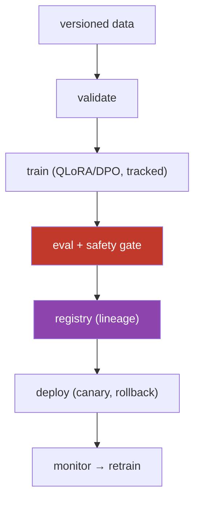
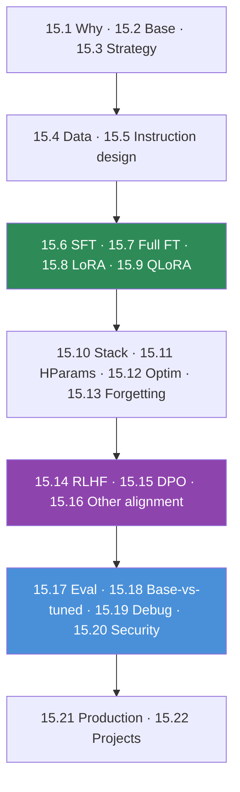

# 15.22 · Mini Projects & Summary

[⬅ 15.21 Production Pipeline](15.21-production-pipeline.md) · [🏠 Module 15](../README.md) · [➡ Module 16 · MLOps](../../16-MLOps/README.md)

> **The lesson in one line:** Eight projects — from an SFT classifier to a full production pipeline — assemble every method in this module (SFT, LoRA, QLoRA, DPO, evaluation) into working systems, and together they turn "I understand fine-tuning" into "I can decide, build, align, evaluate, secure, and deploy adapted models."

---

## 🎯 Learning objectives

- Consolidate the module into **eight buildable projects**, from SFT to production.
- For each: **requirements, folder structure, architecture, dataset design, training strategy, evaluation, testing, security, monitoring, future improvements**.
- See how the methods **stack** into a full model-adaptation lifecycle.
- Leave with the module's through-lines internalized.

## ✅ Prerequisites

- All of Module 15. The projects are the payoff.

---

## 🧠 Mental model

> [!IMPORTANT]
> **These eight projects walk the same lifecycle you learned — decide → data → train → align → evaluate → ship — with increasing scope, so building them in order internalizes the discipline.** Project 1 is a bare SFT run; each subsequent project adds a method (LoRA, QLoRA, preferences, DPO) or a concern (evaluation, production) until Project 8 is the whole pipeline. The constant across all eight: **it's a data problem, memory is the constraint, and you always compare base vs tuned.** The methods vary; the engineering discipline is fixed.

---

## The eight projects

For each: **dataset → strategy → training → evaluation → security → monitoring.**

### 1. SFT Text Classifier
Fine-tune a small model for a classification task.
- **Dataset:** labeled examples → instruction/output format ([15.5](15.5-instruction-datasets.md)); clean, deduped, split ([15.4](15.4-dataset-preparation.md)). **Strategy:** SFT (full or LoRA) on a small base ([15.6](15.6-sft.md)). **Eval:** accuracy/precision/recall/F1 vs base ([15.17](15.17-evaluation.md)–[15.18](15.18-base-vs-finetuned.md)). **Security:** scrub PII; no leakage. **Monitoring:** per-class accuracy drift.

### 2. Domain-Specific Assistant
Fine-tune with instruction–response data for a domain.
- **Dataset:** domain instruction/response pairs, chat-templated ([15.5](15.5-instruction-datasets.md)). **Strategy:** LoRA on an instruct/chat base ([15.2](15.2-base-models.md), [15.8](15.8-lora.md)). **Eval:** generation quality (LLM-judge) + retention/safety ([15.17](15.17-evaluation.md), [15.13](15.13-catastrophic-forgetting.md)). **Security:** domain data scrubbed; safety re-tested. **Monitoring:** refusal/quality online.

### 3. LoRA Fine-Tuning
Fine-tune a language model with LoRA (from scratch + PEFT).
- **Dataset:** any SFT set. **Strategy:** `LoRALinear` then PEFT ([15.8](15.8-lora.md)); rank/alpha/target sweeps. **Eval:** quality + trainable-param % + memory vs full FT. **Security:** vet adapters. **Monitoring:** adapter version served. **Deliverable:** merge vs swap demo.

### 4. QLoRA Fine-Tuning
Fine-tune a quantized model on limited GPU memory.
- **Dataset:** as above. **Strategy:** 4-bit NF4 base + LoRA + paged optimizer ([15.9](15.9-qlora.md), [15.10](15.10-practical-stack.md)). **Eval:** quality ≈ LoRA; memory report (fits one GPU). **Security:** local/private fine-tune; re-eval quantized safety. **Monitoring:** memory/throughput. **Deliverable:** a model that didn't fit now trains on one GPU.

### 5. Preference Dataset Creation
Build chosen/rejected response pairs.
- **Dataset:** prompts → sampled responses → preference labels (human or RLAIF, [15.16](15.16-other-alignment.md)); validated triples ([15.14](15.14-rlhf.md)). **Strategy:** collection + quality control + annotator audit. **Eval:** label agreement/consistency. **Security:** audit for bias/poisoning ([15.20](15.20-security.md)). **Monitoring:** label quality. **Deliverable:** a clean preference dataset feeding Project 6.

### 6. DPO Training
Align a model with preference optimization.
- **Dataset:** Project 5's triples. **Strategy:** SFT model + frozen reference + DPO loss ([15.15](15.15-dpo.md)), LoRA/QLoRA. **Eval:** win-rate vs SFT + safety retention. **Security:** post-DPO safety eval. **Monitoring:** implicit-reward gap; win-rate. **Deliverable:** an aligned model beating its SFT start.

### 7. Model Evaluation Framework
Compare **Base vs SFT vs LoRA vs DPO** models.
- **Dataset:** shared multi-axis eval suite ([15.17](15.17-evaluation.md)). **Strategy:** paired base-vs-candidate on identical data ([15.18](15.18-base-vs-finetuned.md)); task + generation + safety; significance. **Eval:** per-model, per-axis deltas + net decision. **Security:** safety/leakage as protected regressions. **Monitoring:** dashboards. **Deliverable:** a defensible "which model to ship" verdict.

### 8. Production Fine-Tuning Pipeline ⭐
End-to-end: **data → validation → training → evaluation → registry → deployment**.
- **Dataset:** versioned + validated ([15.4](15.4-dataset-preparation.md), [15.21](15.21-production-pipeline.md)). **Strategy:** tracked QLoRA/DPO training with full lineage. **Eval:** base-vs-tuned + safety gate. **Security:** encrypted registry; leakage tests; compliance lineage ([15.20](15.20-security.md)). **Monitoring:** quality/drift/safety + drift-triggered retraining. **Deliverable:** a reproducible, gated, rollback-able model-adaptation platform.

---

## Each project's checklist

Every project should specify: **Requirements · Folder structure · Architecture diagram · Dataset design · Training strategy · Evaluation strategy · Testing strategy · Security considerations · Monitoring · Future improvements** — the same discipline, eight times.

---

## The module, connected

> [!IMPORTANT]
> **The one thing to remember: fine-tuning changes behavior, not knowledge — it's a data problem, memory is the constraint, and a fine-tune isn't done until you've proven it's better (base vs tuned) and not worse (safety, forgetting).** LoRA/QLoRA made the *training* cheap; the enduring work is **good data, the right method for your constraints, alignment to preferences, rigorous evaluation, and a production pipeline with lineage and rollback.** Do those, and fine-tuning is a reliable capability instead of a risky experiment.

---

## The through-lines (memorize)

| # | Through-line |
|---|---|
| 1 | Fine-tuning changes **behavior, not knowledge** (facts → RAG). |
| 2 | It's the **last resort** — try prompt, then RAG, then fine-tune. |
| 3 | **Data quality > quantity** — a fine-tune mirrors its data. |
| 4 | **Memory is the constraint** — LoRA/QLoRA exist because of it. |
| 5 | **LoRA is the default** — `W' = W + BA`, ~1% of params, swappable. |
| 6 | **DPO ≈ RLHF outcome** with far less machinery (SFT → DPO). |
| 7 | **Fine-tuning can make a model worse** — catastrophic forgetting. |
| 8 | **Always compare base vs tuned** — significant, net-positive, safe. |
| 9 | **Weights fuse the data** — memorization/leakage/poisoning risks. |
| 10 | **Production = lineage + safe change** (gate + rollback). |

## 🏋️ Capstone challenge

Build **Project 8 end-to-end**: versioned + validated data, a tracked **QLoRA SFT** run, a **DPO** alignment stage on a preference set, a **base-vs-all** evaluation with safety gating and significance, a model registry with lineage, canary deployment with rollback, and monitoring with a drift-triggered retrain. **Success criteria:** any model reproducible from lineage; a regressing/unsafe candidate blocked by the gate; a demonstrated rollback; and a defensible verdict that the shipped model is significantly better than base with no safety/forgetting regression.

## 📄 Cheat sheet

| Project | Method / focus |
|---|---|
| **1 SFT classifier** | SFT + task metrics |
| **2 Domain assistant** | LoRA + generation eval |
| **3 LoRA** | adapters, rank/alpha, merge/swap |
| **4 QLoRA** | 4-bit, one GPU |
| **5 Preference data** | chosen/rejected pairs |
| **6 DPO** | preference alignment |
| **7 Eval framework** | base vs SFT vs LoRA vs DPO |
| **8 Production pipeline** ⭐ | lineage · gate · registry · rollback |

## 🎴 Flashcards

- **⭐ The one thing to remember from fine-tuning?** → It changes behavior not knowledge, it's a data problem, memory is the constraint, and it isn't done until you've proven it's better (base vs tuned) and not worse (safety/forgetting).
- **Why build the eight projects in order?** → They walk the lifecycle (decide → data → train → align → evaluate → ship) with growing scope, each adding one method or concern.
- **What's the minimal project?** → An SFT classifier: clean labeled data, a small base, task-metric evaluation vs base.
- **What makes Project 8 the flagship?** → It's the full pipeline: versioned data, tracked training, safety-gated evaluation, a registry with lineage, canary deployment with rollback, and monitoring/retraining.
- **What's constant across all projects?** → It's a data problem, memory is the constraint, and you always compare base vs tuned.

## 💬 Interview questions

1. Design a production fine-tuning pipeline end to end (Project 8).
2. How would you incrementally build from an SFT classifier to a DPO-aligned, production-deployed model?
3. Contrast the dataset and evaluation design of a classifier (P1) vs a DPO model (P6).
4. Where would you invest to make a fine-tune reliable and safe?
5. Defend "fine-tuning changes behavior, not knowledge."
6. What would you evaluate and monitor for a deployed fine-tuned model?

## 📝 Summary

- **Eight stacked projects** — SFT classifier, domain assistant, LoRA, QLoRA, preference dataset, DPO, evaluation framework, and the flagship **production pipeline** — assemble every method into working systems.
- They walk one **lifecycle** (decide → data → train → align → evaluate → ship) with growing scope; the constants are **it's a data problem, memory is the constraint, and always compare base vs tuned**.
- The module's spine, proven: **fine-tuning changes behavior not knowledge; LoRA/QLoRA make training cheap; DPO makes alignment practical; evaluation and a lineage-and-rollback pipeline make it safe.**
- Onward to **[Module 16 · MLOps](../../16-MLOps/README.md)**, where these adapted models get deployed, monitored, and operated at scale.

## 📚 References

1. **All Module 15 lessons ([15.1](15.1-why-fine-tuning.md)–[15.21](15.21-production-pipeline.md)).** Each project's methods.
2. **[15.9 QLoRA](15.9-qlora.md), [15.15 DPO](15.15-dpo.md), [15.18 Base vs Fine-Tuned](15.18-base-vs-finetuned.md), [15.21 Production](15.21-production-pipeline.md).** Project 8's pillars.
3. **[11.11–11.13 Fine-Tuning / PEFT / Alignment](../../11-LLMs/weeks/11.11-fine-tuning.md).** The theory.
4. **[Module 16 · MLOps](../../16-MLOps/README.md).** Next in the program.

---

## 🧭 Navigation

| Direction | Link |
|---|---|
| ⬅ Previous | [15.21 · Production Fine-Tuning Pipeline](15.21-production-pipeline.md) |
| ➡ Next | [Module 16 · MLOps](../../16-MLOps/README.md) |
| 🏠 Module | [Module 15](../README.md) |
| 📖 Lessons | [Lesson index](README.md) |
