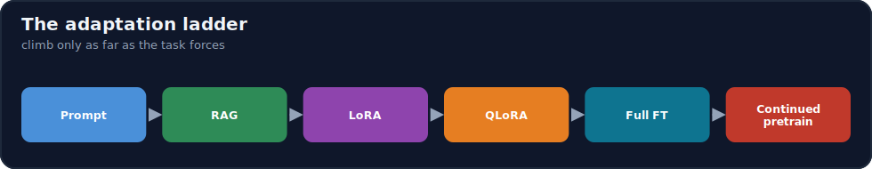
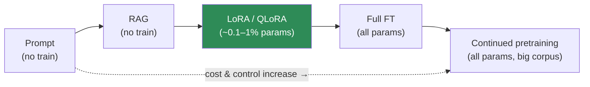
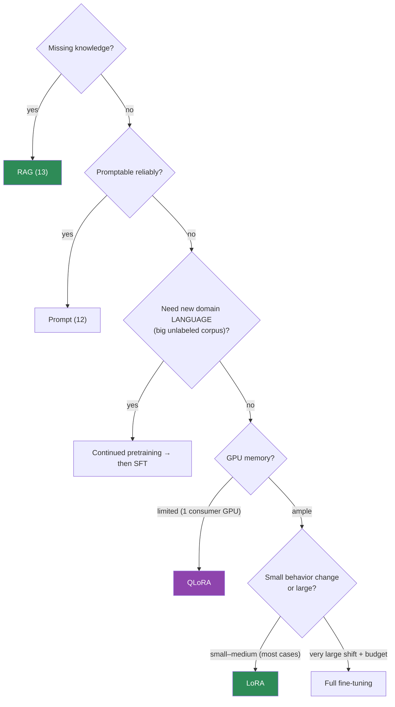

# 15.3 · Fine-Tuning Strategy Selection ⭐

[⬅ 15.2 Base Models](15.2-base-models.md) · [🏠 Module 15](../README.md) · [➡ 15.4 Dataset Preparation](15.4-dataset-preparation.md)

> **The lesson in one line:** Once you've decided adaptation is needed, you still have six options — prompting, RAG, **full fine-tuning, LoRA, QLoRA, continued pretraining** — and the right choice falls out of concrete constraints: dataset size, GPU memory, budget, how much you need to change, domain specificity, privacy, and latency.



---

## 🎯 Learning objectives

- Compare **prompting, RAG, full FT, LoRA, QLoRA, continued pretraining**.
- Build a **decision framework** on dataset size, GPU, budget, behavior scope, domain, privacy, latency.
- Default correctly: **LoRA/QLoRA for most fine-tuning**, full FT rarely, continued pretraining for domain corpora.

## ✅ Prerequisites

- [15.1 why fine-tune](15.1-why-fine-tuning.md), [15.2 base models](15.2-base-models.md), [11.12 PEFT/LoRA](../../11-LLMs/weeks/11.12-peft-lora.md).

---

## 🧠 Mental model

> [!IMPORTANT]
> **The strategy question isn't "which is best?" — it's "which is the cheapest option that meets the requirement?"** Each method sits on a cost/control ladder: prompting (no training) < RAG (no training) < **LoRA/QLoRA** (train ~0.1–1% of params) < **full fine-tuning** (train all params) < **continued pretraining** (train all params on a big corpus). You climb the ladder only as far as the task forces you. **For the vast majority of fine-tuning, LoRA (or QLoRA on limited GPUs) is the answer** — it reaches full-fine-tuning quality on most tasks at a fraction of the memory and cost, and produces swappable adapters. Full FT and continued pretraining are the heavy tools you reach for deliberately.



---

## The six options

| Option | Trains | Best for | Cost |
|---|---|---|---|
| **Prompt engineering** | nothing | framing/format, one-offs | ~free |
| **RAG** | nothing (index build) | fresh/private/changing **knowledge** | low |
| **LoRA** | tiny adapters (~0.1–1%) | most behavior/style/skill fine-tuning | low–med |
| **QLoRA** | tiny adapters + 4-bit base | LoRA on limited GPU memory | low |
| **Full fine-tuning** | all parameters | max quality/large behavior shifts, ample GPU | high |
| **Continued pretraining** | all parameters | new **domain/language** from a big unlabeled corpus | very high |

- **LoRA vs QLoRA**: same idea (train low-rank adapters, [15.8](15.8-lora.md)); QLoRA additionally **quantizes the frozen base to 4-bit** ([15.9](15.9-qlora.md)) so it fits on a small GPU — pick QLoRA when memory-constrained, LoRA when you have the VRAM (slightly faster/higher-fidelity).
- **Continued (further) pretraining**: keep doing *next-token on unlabeled domain text* (no instructions) to teach the base a new domain's language before SFT — different from instruction fine-tuning.

---

## The decision framework



### The seven constraints that drive the choice

| Constraint | Pushes you toward |
|---|---|
| **Dataset size** | tiny → prompt/RAG or light LoRA; large labeled → LoRA/full; huge unlabeled → continued pretraining |
| **GPU memory** | limited → **QLoRA**; ample → LoRA or full |
| **Budget** | low → LoRA/QLoRA; high → full/continued pretrain |
| **Desired behavior scope** | small nudge → LoRA; deep change → full/continued |
| **Domain specificity** | new domain *language* → continued pretraining first |
| **Privacy** | can't send data out → **self-host** open model + LoRA/QLoRA (not a hosted fine-tune API) |
| **Latency** | tight → a fine-tuned **small** model (LoRA merged) beats a big prompted one |

> [!IMPORTANT]
> **Default to LoRA; drop to QLoRA when memory-bound; escalate to full fine-tuning only for large behavior shifts with budget and GPUs; use continued pretraining only for genuinely new domain language.** LoRA matches full-FT quality on most adaptation tasks, uses a fraction of the memory, trains faster, and yields **swappable adapters** (one base, many tasks) — reasons it's the production default ([11.12](../../11-LLMs/weeks/11.12-peft-lora.md)). **Privacy** is often the deciding factor for open-model + LoRA over a hosted fine-tuning API: your sensitive data never leaves your infrastructure.

---

## 🧮 Mathematical intuition (why LoRA is usually enough)

Fine-tuning's weight update `ΔW` empirically has **low intrinsic rank** — the behavior change lives in a small subspace ([15.8](15.8-lora.md)). So representing `ΔW = BA` with tiny `B, A` captures most of the benefit while training `r·(d_in+d_out)` params instead of `d_in·d_out` — often **<1%**. Full fine-tuning only wins when the required change is genuinely high-rank (large domain/behavior shift), which is the minority of cases.

---

## 🏭 Production examples

| Situation | Choice |
|---|---|
| Style/format on a chat model, one GPU | **QLoRA** |
| Same, with A100s available | **LoRA** |
| Private medical data, must self-host | open model + **QLoRA/LoRA** |
| Legal-domain assistant from scratch | **continued pretraining → SFT (LoRA)** |
| Distill a 70B's behavior into a 7B | LoRA/full FT on 7B with 70B-generated data |
| Just need current facts | **RAG** (no fine-tune) |

## ⚡ GPU memory & 💲 cost considerations

- **Rough memory**: full FT ≈ model + gradients + optimizer states (Adam ≈ **~16 bytes/param** in mixed precision, [15.7](15.7-full-fine-tuning.md)); LoRA ≈ model (frozen) + tiny adapter states; QLoRA ≈ **4-bit** model + tiny adapter states ([15.9](15.9-qlora.md)).
- **Order-of-magnitude**: a 7B full FT needs multiple high-end GPUs; 7B **QLoRA** fits on a single ~24 GB consumer GPU. This gap is *why* the ladder exists.
- **Continued pretraining is the priciest** (all params, huge corpus) — justify it with a real domain-language gap.

## 🔒 Security considerations

> [!CAUTION]
> - **Privacy often forces the choice**: sensitive data → **self-hosted open model + LoRA/QLoRA**, not a third-party fine-tuning API that ingests your data.
> - **Swappable adapters aid governance** — you can delete/replace a LoRA adapter without touching the base, and keep per-tenant adapters isolated.
> - **Hosted fine-tuning APIs** may retain/train on your data — read terms; prefer self-host for regulated data ([15.20](15.20-security.md)).

## 🚫 Common mistakes

| Mistake | Consequence |
|---|---|
| Full fine-tuning by default | 10–100× the memory/cost for no quality gain |
| Fine-tuning when RAG/prompt would do | Expensive, un-updatable |
| Ignoring GPU memory before choosing | OOM mid-project; wrong method |
| Continued pretraining for a small skill | Massive overkill |
| Sending private data to a hosted FT API | Privacy/compliance breach |
| Not considering latency payoff | Missed the "small tuned model" win |

## 🐛 Debugging workflow

Picked a strategy that isn't working/affordable? (1) **Re-check the ladder** — is a cheaper rung (prompt/RAG/LoRA) actually sufficient? (2) **OOM?** Drop full FT → LoRA → QLoRA; reduce batch/seq-len ([15.12](15.12-training-optimization.md)). (3) **Quality gap after LoRA?** Raise rank, improve data, or (rarely) escalate to full FT. (4) **Domain still weak?** You may need **continued pretraining** before SFT. Full method in [15.19](15.19-debugging.md).

## 🏋️ Exercises

1. **Framework drill.** For 8 scenarios varying data size/GPU/privacy/latency, pick a strategy and justify from the constraints.
2. **Memory estimate.** Estimate GPU memory for full FT vs LoRA vs QLoRA of a 7B model; identify which fits a 24 GB GPU.
3. **LoRA vs full.** Argue when full FT genuinely beats LoRA (high-rank change) with an example.
4. **Privacy path.** Design a compliant strategy for fine-tuning on regulated medical data.
5. **Continued pretraining.** Identify a task that needs continued pretraining before SFT, and one that doesn't.

## 🛠️ Mini project — "Strategy & memory planner"

**Goal:** a planner that recommends a fine-tuning strategy and estimates GPU memory from constraints.

**Requirements:** inputs = model size, dataset size/type, GPU VRAM, budget, privacy, latency; outputs = recommended method (prompt/RAG/LoRA/QLoRA/full/continued) + a memory estimate + rationale; the memory model for full/LoRA/QLoRA.

**Folder structure**
```
strategy-planner/
├── decide.py       # constraint → method
├── memory.py       # full / LoRA / QLoRA memory estimates
├── privacy.py      # self-host vs hosted flags
└── examples/
```

**Testing:** limited GPU → QLoRA; ample GPU + small change → LoRA; private data → self-host; memory estimates match rules of thumb.
**Evaluation:** recommendations + estimates vs expert labels.
**Security:** privacy routing to self-host; adapter-isolation note.
**Future improvements:** break-even calculator (fine-tuned small vs prompted large at volume).

## 📄 Cheat sheet

| Option | Trains | Reach for it when |
|---|---|---|
| **Prompt** | nothing | framing/format; one-offs |
| **RAG** | nothing | fresh/private/changing knowledge |
| **⭐ LoRA** | ~0.1–1% | most fine-tuning (default) |
| **⭐ QLoRA** | adapters + 4-bit base | LoRA on limited GPU |
| **Full FT** | all params | large behavior shift + budget/GPUs |
| **Continued pretraining** | all params | new domain **language** (big corpus) |
| **⭐ Drivers** | data size · GPU · budget · behavior scope · domain · **privacy** · latency |
| **⭐ Privacy** | sensitive data → self-host + LoRA/QLoRA |

## 🎴 Flashcards

- **⭐ What's the default fine-tuning method and why?** → LoRA (or QLoRA when memory-bound): matches full-FT quality on most tasks at a fraction of memory/cost, trains faster, and yields swappable adapters.
- **LoRA vs QLoRA — when each?** → Both train low-rank adapters; QLoRA also quantizes the frozen base to 4-bit to fit limited GPU memory — use it when memory-constrained, LoRA when you have the VRAM.
- **When is full fine-tuning justified?** → Large, high-rank behavior shifts with ample budget and GPUs — the minority of cases.
- **What is continued pretraining, and when?** → Next-token on unlabeled *domain* text (no instructions) to teach new domain language before SFT — for genuine domain/language gaps only.
- **⭐ Which constraint often decides the strategy?** → Privacy: sensitive data forces self-hosted open model + LoRA/QLoRA over a hosted fine-tuning API; GPU memory decides LoRA vs QLoRA.
- **Why does LoRA usually suffice?** → Fine-tuning's weight update has low intrinsic rank, so a tiny `BA` captures most of the change with <1% of params trained.

## 💬 Interview questions

1. Compare the six adaptation options on cost, control, and use case.
2. Give a decision framework for choosing among them from concrete constraints.
3. When is LoRA insufficient and full fine-tuning warranted?
4. What is continued pretraining, and when do you need it before SFT?
5. How does privacy influence the strategy choice?
6. How do you estimate whether a method fits your GPU memory budget?

## 📝 Summary

- Adaptation is a **cost/control ladder**: prompt < RAG < **LoRA/QLoRA** < full FT < continued pretraining — climb only as far as the requirement forces.
- **LoRA is the fine-tuning default** (full-FT quality at a fraction of memory/cost, swappable adapters); **QLoRA** when GPU-memory-bound (4-bit base); **full FT** only for large behavior shifts with budget; **continued pretraining** only for new domain language.
- The choice falls out of **dataset size, GPU memory, budget, behavior scope, domain specificity, privacy, and latency** — with **privacy** and **GPU memory** often decisive.
- Escalate deliberately (LoRA → full FT) only when quality/data prove LoRA insufficient; a fine-tuned **small** model is the latency/cost win.

## 📚 References

1. **[11.12 PEFT / LoRA](../../11-LLMs/weeks/11.12-peft-lora.md).** ⭐ Why LoRA matches full FT cheaply.
2. **Hu et al. (2021) — _LoRA_.** Low intrinsic rank of updates.
3. **Dettmers et al. (2023) — _QLoRA_.** 4-bit base + adapters on one GPU.
4. **Gururangan et al. (2020) — _Don't Stop Pretraining_.** Continued/domain-adaptive pretraining.

---

## 🧭 Navigation

| Direction | Link |
|---|---|
| ⬅ Previous | [15.2 · Base Models](15.2-base-models.md) |
| ➡ Next | [15.4 · Dataset Preparation](15.4-dataset-preparation.md) |
| 🏠 Module | [Module 15](../README.md) |
| 📖 Lessons | [Lesson index](README.md) |
