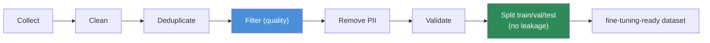
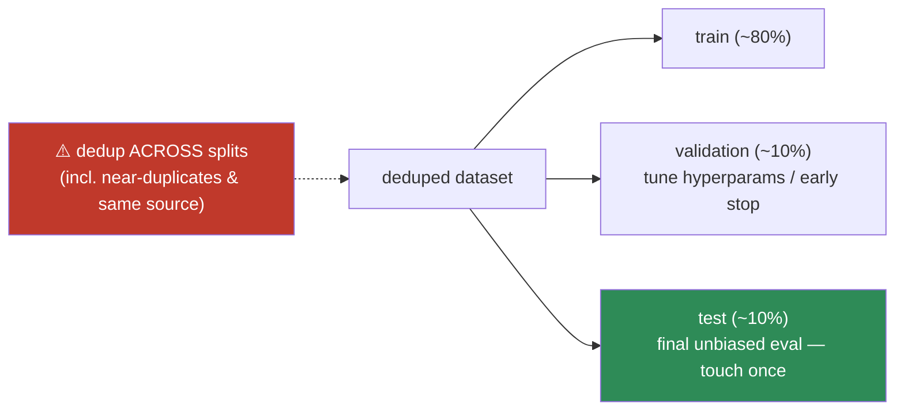

# 15.4 · Dataset Preparation

[⬅ 15.3 Strategy Selection](15.3-strategy-selection.md) · [🏠 Module 15](../README.md) · [➡ 15.5 Instruction Dataset Design](15.5-instruction-datasets.md)

> **The lesson in one line:** Fine-tuning is mostly a data-engineering job — the model becomes exactly what your examples demonstrate, so **collecting, cleaning, deduplicating, filtering, de-PII-ing, validating, and splitting** the data (without leakage) matters far more than the training code, and **a few thousand clean examples beat a hundred thousand noisy ones.**

---

## 🎯 Learning objectives

- Run the data pipeline: **collect → clean → dedup → filter → remove PII → validate → split**.
- Prevent **data leakage** between train/validation/test.
- Internalize **quality > quantity** for fine-tuning data.

## ✅ Prerequisites

- [15.1 why fine-tune](15.1-why-fine-tuning.md), [11.9 pretraining data pipeline](../../11-LLMs/weeks/11.9-pretraining.md), [07 data analysis](../../07-Data-Analysis/README.md).

---

## 🧠 Mental model

> [!IMPORTANT]
> **A fine-tuned model is a mirror of its training data — every quirk, error, bias, and inconsistency in your examples gets learned and amplified.** The model can't tell a typo from a convention or a mislabeled example from a real one; it just imitates the distribution you show it. So the leverage is overwhelmingly in the **data**, not the trainer: garbage examples → a model that reliably produces garbage. **Fine-tuning is 80% data engineering.** And the counterintuitive truth: **quality dominates quantity** — a small, clean, diverse, correctly-formatted set outperforms a large noisy one, because the model learns the *noise* too.



---

## The pipeline

### 1. Collection
Sources: **human-written** (highest quality, slow), **production logs** (real distribution — most valuable), **synthetic** (LLM-generated, fast — must verify), **existing datasets** (check license + relevance). Aim for examples that **match your real input distribution** and cover the behaviors/edge-cases you need.

### 2. Cleaning
Fix encoding, strip boilerplate/artifacts, normalize whitespace, correct obvious formatting errors, standardize the label/answer convention. Inconsistent cleaning teaches inconsistent behavior.

### 3. Deduplication
Remove exact and **near-duplicate** examples (fuzzy/embedding-based). Duplicates over-weight some patterns, waste compute, and — critically — can **leak across splits** (a train example nearly identical to a test one inflates your metrics, [step 7]).

### 4. Filtering (quality)
Drop low-quality examples: wrong answers, off-task, too short/long, toxic, malformed. **Curate hard** — it's better to have 2,000 excellent examples than 20,000 mixed. Optionally score examples (heuristics or an LLM judge) and keep the top tier.

### 5. PII removal
Detect and **redact/remove** personal data (names, emails, phones, IDs) before it's baked into weights ([15.20](15.20-security.md)). The model **memorizes** training data, so PII in → PII potentially leaked out.

### 6. Validation
Programmatically check every example: correct **format/schema** ([15.5](15.5-instruction-datasets.md)), non-empty fields, valid labels/enums, length within limits, and that the **output actually follows the instruction**. Reject or fix violations before training.

### 7. Splitting (no leakage)
Split into **train / validation / test** and **guarantee no overlap** — including *near*-duplicates and same-source items. Leakage (a train example appearing, even paraphrased, in test) inflates evaluation and hides overfitting.



> [!IMPORTANT]
> **Data leakage is the silent killer of fine-tuning evaluation.** If a test example (or a paraphrase, or another item from the same document/user) is also in training, the model has effectively *seen the answer* — your test score looks great and production performance disappoints. Deduplicate **before** splitting, split by **group** (document/user/entity) when examples share a source, and treat the **test set as sacred** — evaluate on it once, at the end ([15.18](15.18-base-vs-finetuned.md)).

---

## Why quality beats quantity

| | Small + clean | Large + noisy |
|---|---|---|
| **What the model learns** | the right behavior, sharply | the behavior *plus* the noise/errors |
| **Format consistency** | high | learns the inconsistencies |
| **Overfitting risk** | manageable | memorizes noise |
| **Cost** | low | high (and worse results) |

A few **thousand** excellent, diverse, correctly-formatted examples is a strong SFT set for many tasks; more helps only if it's *also* clean and diverse. **Diversity** matters as much as cleanliness — cover the range of inputs/edge cases, don't repeat the easy case.

---

## 💻 A validation pass (sketch)

```python
def validate_example(ex, schema, max_tokens, count_tokens):
    errs = []
    if not ex.get("instruction") and not ex.get("messages"): errs.append("missing instruction/messages")
    if not ex.get("output") and not has_assistant_turn(ex):   errs.append("missing output")
    if not matches_schema(ex, schema):                         errs.append("schema mismatch")
    if count_tokens(render(ex)) > max_tokens:                  errs.append("too long")
    if contains_pii(ex):                                       errs.append("PII present")
    if not output_follows_instruction(ex):                     errs.append("output off-instruction")
    return errs

clean = [ex for ex in dataset if not validate_example(ex, SCHEMA, MAXLEN, tok)]
report = summarize_rejections(dataset)   # know WHY examples were dropped
```

**Log why examples are rejected** — the rejection reasons are a data-quality dashboard and often reveal upstream collection bugs.

---

## 🏭 Production examples

| Practice | Payoff |
|---|---|
| Dedup (exact + near) before splitting | Trustworthy eval; no leakage |
| Group-split by document/user | Prevents same-source leakage |
| LLM-judge quality scoring → keep top tier | Small, high-quality set |
| PII redaction at ingestion | No memorized secrets ([15.20](15.20-security.md)) |
| Rejection-reason logging | Data-quality visibility |
| Versioned datasets | Reproducibility ([15.21](15.21-production-pipeline.md)) |

## ⚡ GPU memory & 💲 cost considerations

- **Data work is CPU/human cost, not GPU** — but it's usually the **largest** cost of a fine-tune and the biggest determinant of success.
- **Smaller, cleaner datasets train faster and cheaper** *and* better — quality curation is a cost win, not a trade-off.
- **Sequence-length filtering** caps training memory/cost (long examples inflate both, [15.12](15.12-training-optimization.md)).

## 🔒 Security considerations

> [!CAUTION]
> - **Remove PII before training** — the model memorizes and can leak it ([15.20](15.20-security.md)); redaction is a hard requirement for sensitive data.
> - **Dataset poisoning** — a few malicious examples can install bad/backdoored behavior; control who can add data and validate provenance ([15.20](15.20-security.md)).
> - **License compliance** — scraped/third-party data may forbid training use; verify rights.
> - **Test-set contamination** — leakage isn't just a metric bug; it can mask unsafe behavior that only shows in production.

## 🚫 Common mistakes

| Mistake | Consequence |
|---|---|
| Maximizing quantity over quality | Model learns the noise |
| No deduplication before splitting | Leakage → inflated eval |
| Random split when examples share a source | Group leakage |
| Inconsistent cleaning/label conventions | Inconsistent behavior |
| Skipping PII removal | Memorization/leakage |
| No schema/format validation | Training on malformed data ([15.5](15.5-instruction-datasets.md)) |
| Touching the test set during development | Biased "final" number |

## 🐛 Debugging workflow

Fine-tune underperforming or eval "too good"? (1) **Check for leakage** — dedup train vs test (incl. near-duplicates/same source); a suspiciously high score is often leakage. (2) **Read 50 random examples** — are they correct, consistent, on-format? Most quality issues are visible by eye. (3) **Check the rejection log** — what got dropped and why? (4) **Verify format** matches the model's chat template ([15.2](15.2-base-models.md), [15.5](15.5-instruction-datasets.md)). Full method in [15.19](15.19-debugging.md).

## 🏋️ Exercises

1. **Dedup + split.** Build a pipeline that dedups (exact + embedding-near) then group-splits; prove no train/test overlap.
2. **Quality vs quantity.** Fine-tune (or simulate) on 2k clean vs 20k noisy examples; compare eval.
3. **Leakage demo.** Deliberately leak test into train; show the inflated score, then fix.
4. **PII scan.** Detect and redact PII in a sample; verify none remains.
5. **Validation report.** Validate a messy dataset; produce a rejection-reason breakdown.

## 🛠️ Mini project — "Fine-tuning data pipeline"

**Goal:** a reusable pipeline producing a clean, validated, leak-free, split dataset.

**Requirements:** collectors (files/logs/synthetic); cleaning; exact + near dedup; quality filter (heuristics or LLM-judge); PII redaction; schema/format validation; group-aware train/val/test split; a data-quality report (counts, rejection reasons, dedup stats); dataset versioning.

**Folder structure**
```
data-pipeline/
├── collect.py      # sources → raw
├── clean.py        # normalize, dedup (exact + near)
├── filter.py       # quality scoring/keep-top
├── pii.py          # detect + redact
├── validate.py     # schema/format/instruction-following
├── split.py        # group-aware, leakage-free
└── report.py       # quality dashboard
```

**Testing:** no train/test overlap (incl. near-dupes/groups); PII removed; malformed examples rejected; report accurate.
**Evaluation:** downstream fine-tune quality vs a naive (unclean) dataset.
**Security:** PII redaction, provenance checks, license flags ([15.20](15.20-security.md)).
**Monitoring:** dataset stats over versions ([15.21](15.21-production-pipeline.md)).
**Future improvements:** active-learning to add hard cases; automated quality scoring.

## 📄 Cheat sheet

| Concept | One line |
|---|---|
| **⭐ FT is 80% data** | the model mirrors its data — quirks and all |
| **⭐ Quality > quantity** | few thousand clean/diverse > many noisy |
| **Pipeline** | collect → clean → dedup → filter → de-PII → validate → split |
| **Dedup** | exact **and near**; before splitting |
| **⭐ No leakage** | dedup across splits; group-split; test set is sacred |
| **PII** | redact before training (memorization) |
| **Validate** | schema, non-empty, on-instruction, length |
| **Diversity** | cover the range/edge cases, not the easy case |

## 🎴 Flashcards

- **⭐ Why is data the leverage in fine-tuning?** → The model mirrors its training data — errors, quirks, and inconsistencies are all learned and amplified; fine-tuning is ~80% data engineering.
- **⭐ Quality vs quantity for fine-tuning data?** → Quality dominates — a few thousand clean, diverse, correctly-formatted examples beat a hundred thousand noisy ones (the model learns the noise too).
- **What is data leakage and why is it fatal?** → A test example (or paraphrase/same-source item) also in training → the model has seen the answer → inflated eval, disappointing production; dedup before splitting and split by group.
- **What are the data-pipeline stages?** → Collect → clean → deduplicate → filter (quality) → remove PII → validate → split (leakage-free).
- **Why remove PII before training?** → The model memorizes training data and can leak PII in its outputs.
- **Why does diversity matter?** → Covering the range of inputs/edge cases teaches robust behavior; repeating the easy case doesn't.

## 💬 Interview questions

1. Why is data quality more important than quantity in fine-tuning?
2. Walk through a fine-tuning data pipeline end to end.
3. What is data leakage, how does it happen, and how do you prevent it?
4. How do you deduplicate, and why must it happen before splitting?
5. How do you handle PII in training data, and why?
6. What's a group-aware split and when is it required?

## 📝 Summary

- A fine-tuned model **mirrors its training data**, so preparation — **collect → clean → dedup → filter → de-PII → validate → split** — matters more than the trainer; **fine-tuning is ~80% data engineering**.
- **Quality beats quantity**: a small, clean, diverse, correctly-formatted set outperforms a large noisy one, which teaches the model its own noise.
- **Prevent leakage**: deduplicate (exact *and* near) before splitting, **group-split** when examples share a source, and treat the **test set as sacred** ([15.18](15.18-base-vs-finetuned.md)).
- **Remove PII** (memorization risk), **validate format/instruction-following**, guard against **poisoning**, and **version** datasets for reproducibility ([15.20](15.20-security.md), [15.21](15.21-production-pipeline.md)).

## 📚 References

1. **Zhou et al. (2023) — _LIMA: Less Is More for Alignment_.** ⭐ ~1k high-quality examples suffice.
2. **[11.9 Pretraining](../../11-LLMs/weeks/11.9-pretraining.md).** Clean → dedup → filter at scale.
3. **Lee et al. (2021) — _Deduplicating Training Data_.** Dedup and memorization/leakage.
4. **[15.20 Security & Privacy](15.20-security.md).** PII, memorization, poisoning.

---

## 🧭 Navigation

| Direction | Link |
|---|---|
| ⬅ Previous | [15.3 · Fine-Tuning Strategy Selection](15.3-strategy-selection.md) |
| ➡ Next | [15.5 · Instruction Dataset Design](15.5-instruction-datasets.md) |
| 🏠 Module | [Module 15](../README.md) |
| 📖 Lessons | [Lesson index](README.md) |
