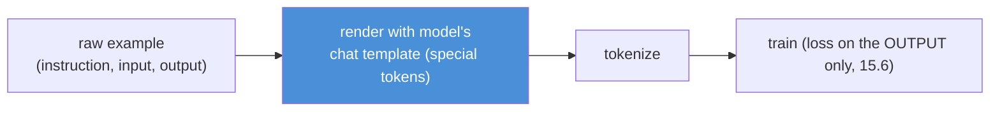

# 15.5 · Instruction Dataset Design

[⬅ 15.4 Dataset Preparation](15.4-dataset-preparation.md) · [🏠 Module 15](../README.md) · [➡ 15.6 Supervised Fine-Tuning](15.6-sft.md)

> **The lesson in one line:** The *shape* of each training example — instruction / input / output, or a `messages` conversation — plus the exact **chat template** you render it with, is what teaches the model the interaction pattern, so getting the format right (and consistent) is as important as getting the content right.

---

## 🎯 Learning objectives

- Structure examples with **instruction, input, context, output**, and **conversation** formats.
- Choose between the **alpaca-style** and **messages/chat** formats.
- Render examples with the model's **chat template** and understand what the model actually trains on.

## ✅ Prerequisites

- [15.4 dataset preparation](15.4-dataset-preparation.md), [15.2 base models / chat templates](15.2-base-models.md).

---

## 🧠 Mental model

> [!IMPORTANT]
> **You're not just giving the model answers — you're teaching it a *conversation shape*: "when the input looks like THIS, the response looks like THAT."** The format is the template of that shape. If every example is `{instruction, input, output}` rendered with the model's chat template, the model learns "given an instruction (and optional input), produce this kind of output." Inconsistent formatting teaches an inconsistent shape; a format that doesn't match the model's chat template at *inference* time means the model sees an input it was never trained on. **Content teaches *what* to say; format teaches *when and how* to say it.**



---

## The building blocks

| Field | Role | Example |
|---|---|---|
| **Instruction** | the task/directive | "Classify the sentiment." |
| **Input** | the data to operate on (optional) | "The food was cold." |
| **Context** | background/retrieved info (optional) | policy text, a document |
| **Output** | the target response the model learns to produce | `{"sentiment":"negative"}` |

## Two dominant formats

### Alpaca-style (instruction / input / output)
```json
{
  "instruction": "Classify the sentiment as positive, negative, or neutral.",
  "input": "The food was cold but the staff were lovely.",
  "output": "mixed"
}
```
Simple, great for **single-turn task data** (classification, extraction, transformation). You render it into the model's chat template before training.

### Conversational (messages / chat)
```json
{
  "messages": [
    {"role": "system", "content": "You are a terse support assistant."},
    {"role": "user", "content": "How do I reset my password?"},
    {"role": "assistant", "content": "Go to Settings → Security → Reset password."}
  ]
}
```
The native shape for **chat models** and **multi-turn** data; maps directly onto the chat template. Supports a **system** message (persona/rules) and multiple turns.

> [!IMPORTANT]
> **Use the `messages`/chat format for chat models and multi-turn tasks; alpaca-style is a convenient single-turn source you convert into the chat template anyway.** Whatever the source shape, the model trains on the **rendered chat-template string** — so the decision that actually matters is *"does my rendered example look exactly like what the model will see at inference?"* Match the template's special tokens (e.g., turn markers), roles, and system-message handling precisely ([15.2](15.2-base-models.md)).

---

## Rendering with the chat template

```python
from transformers import AutoTokenizer
tok = AutoTokenizer.from_pretrained(model_id)

# messages → the exact string the model trains/infers on
def render(example):
    return tok.apply_chat_template(
        example["messages"],
        tokenize=False,
        add_generation_prompt=False,   # training: full turn present; inference: True
    )

# alpaca → messages → template
def alpaca_to_messages(ex):
    user = ex["instruction"] + (f"\n\n{ex['input']}" if ex.get("input") else "")
    return {"messages": [{"role":"user","content":user},
                         {"role":"assistant","content":ex["output"]}]}
```

`apply_chat_template` inserts the model's exact special tokens — **always use it** rather than hand-concatenating strings (a top source of format bugs, [15.19](15.19-debugging.md)).

---

## Dataset design decisions

| Decision | Guidance |
|---|---|
| **System prompt** | include one if inference will use one; keep it consistent (or vary deliberately to teach robustness) |
| **Single vs multi-turn** | match production usage; include multi-turn if the model must hold context |
| **Instruction diversity** | vary phrasings of the same task so the model generalizes beyond one wording |
| **Output consistency** | keep the target format identical across examples (esp. structured outputs) |
| **Length balance** | avoid all-short or all-long; match production distribution |
| **Negative/edge cases** | include "I don't know" / refusal / edge examples so behavior is robust ([15.4](15.4-dataset-preparation.md)) |
| **Loss on output only** | mask the prompt so the model learns to *produce* answers, not *parrot* instructions ([15.6](15.6-sft.md)) |

> [!IMPORTANT]
> **Teach the behavior you want at inference, including the hard cases.** If the model should sometimes say "I don't have that information," some examples must demonstrate that. If it should follow a system prompt, include system prompts. If inputs vary in wording, vary your instruction phrasings. The model generalizes from the *distribution* of shapes you show — an all-easy, all-one-phrasing dataset yields a brittle model.

---

## 🏭 Production examples

| Task | Format |
|---|---|
| Classifier / extractor | alpaca-style → chat template; identical output schema |
| Domain chat assistant | `messages` with a consistent system prompt, multi-turn |
| Tool-use / structured output | `messages` with assistant turns containing the exact JSON |
| Style transfer / rewriting | instruction + input(source) → output(target style) |
| Refusal/safety behavior | examples that demonstrate declining out-of-scope requests |

## ⚡ GPU memory & 💲 cost considerations

- **Long system prompts/contexts on every example inflate sequence length** → more memory/cost per step ([15.12](15.12-training-optimization.md)); keep them as short as the behavior needs.
- **Consistent, compact formats** reduce token count and speed training.
- **Loss masking** ([15.6](15.6-sft.md)) doesn't save memory but focuses learning (better quality per token).

## 🔒 Security considerations

> [!CAUTION]
> - **Whatever you put in the assistant turns becomes learned behavior** — including any leaked secrets or unsafe patterns; scrub outputs ([15.4](15.4-dataset-preparation.md), [15.20](15.20-security.md)).
> - **System prompts in data can encode policy** — if you train the model to obey a system prompt, an attacker who can set the system prompt at inference gains influence; combine with runtime guardrails.
> - **Don't train on raw untrusted user text as instructions** — poisoned examples install poisoned behavior ([15.20](15.20-security.md)).

## 🚫 Common mistakes

| Mistake | Consequence |
|---|---|
| Hand-concatenating instead of `apply_chat_template` | Format mismatch → bad behavior |
| Inconsistent output format across examples | Model produces inconsistent outputs |
| Training format ≠ inference format | Model sees unfamiliar input in prod |
| No system prompt in data but used at inference (or vice-versa) | Behavior drift |
| One instruction phrasing only | Brittle; fails on rephrasings |
| No edge/refusal examples | Model can't decline/handle edge cases |

## 🐛 Debugging workflow

Model behaves oddly after training? (1) **Print the exact rendered training string** for a few examples — does it match `apply_chat_template(..., add_generation_prompt=True)` at inference? (2) **Check output-format consistency** across examples. (3) **Verify the system-prompt convention** matches inference. (4) **Confirm loss is masked to the output** ([15.6](15.6-sft.md)). Most "trained but behaves wrong" bugs are format/template issues. Full method in [15.19](15.19-debugging.md).

## 🏋️ Exercises

1. **Two formats.** Convert 10 tasks into both alpaca-style and `messages`; render both with a real chat template; diff the strings.
2. **Template correctness.** Render an example with `apply_chat_template` vs hand-concatenation; show where they differ and why it matters.
3. **Instruction diversity.** Write 5 phrasings of one task; argue how this improves generalization.
4. **Edge cases.** Add "I don't know"/refusal examples for a task; predict the behavioral effect.
5. **Multi-turn.** Build a 3-turn conversation example with a system prompt; verify it renders correctly.

## 🛠️ Mini project — "Instruction dataset builder"

**Goal:** a builder that converts raw task data into correctly-templated, validated instruction/chat examples.

**Requirements:** alpaca-style and `messages` schemas; conversion between them; `apply_chat_template` rendering (train vs inference variants); consistency checks (output format, system-prompt convention); diversity utilities (paraphrase instructions); edge-case injection; validation ([15.4](15.4-dataset-preparation.md)).

**Folder structure**
```
instruction-builder/
├── schemas.py      # alpaca + messages
├── convert.py      # alpaca <-> messages
├── render.py       # apply_chat_template (train/infer)
├── consistency.py  # format + system-prompt checks
└── augment.py      # instruction paraphrase, edge cases
```

**Testing:** rendered train string == inference string (minus generation prompt); output formats identical; template special tokens present.
**Evaluation:** downstream behavior consistency vs a hand-concatenated baseline.
**Security:** scrub assistant turns; flag untrusted instructions ([15.20](15.20-security.md)).
**Future improvements:** auto-diversify instructions; balance length distribution.

## 📄 Cheat sheet

| Concept | One line |
|---|---|
| **Alpaca format** | `{instruction, input, output}` — single-turn source |
| **Messages format** | `{messages:[{role,content}...]}` — chat/multi-turn (native) |
| **Fields** | instruction · input · context · output |
| **⭐ Chat template** | render with `apply_chat_template` — never hand-concatenate |
| **⭐ Train == infer format** | rendered training string must match inference input |
| **Consistency** | identical output format across examples |
| **Diversity** | vary instruction phrasings; include edge/refusal cases |
| **Loss** | on the **output only** (mask the prompt, [15.6](15.6-sft.md)) |

## 🎴 Flashcards

- **What are the two dominant instruction formats?** → Alpaca-style `{instruction, input, output}` (single-turn source) and `messages` chat format (native for chat/multi-turn).
- **⭐ Why must training format match inference format?** → The model trains on the rendered chat-template string; if inference input differs, the model sees an unfamiliar shape and behaves badly.
- **Why use `apply_chat_template` instead of string concatenation?** → It inserts the model's exact special tokens/roles; hand-concatenation is a top source of format bugs.
- **What dataset-design choices teach robust behavior?** → Instruction-phrasing diversity, consistent output format, matching the system-prompt convention, and including edge/refusal examples.
- **On what tokens is the loss computed?** → The output/assistant turn only — the prompt is masked so the model learns to produce answers, not parrot instructions.
- **When do you use the messages format over alpaca?** → For chat models and multi-turn tasks; alpaca is a convenient single-turn source you convert into the template anyway.

## 💬 Interview questions

1. Compare the alpaca and messages instruction formats. When do you use each?
2. Why is matching the model's chat template critical, and how do you do it?
3. What dataset-design decisions affect generalization and robustness?
4. Why must training and inference formats match exactly?
5. Why include edge-case and refusal examples?
6. On which tokens is the SFT loss computed, and why?

## 📝 Summary

- Each example teaches an **interaction shape** ("input like THIS → output like THAT"); the two formats are **alpaca-style** `{instruction, input, output}` (single-turn source) and **`messages`** (native chat/multi-turn).
- The decision that matters is **rendering with the model's exact chat template** (`apply_chat_template`) so the **training string matches the inference input** — hand-concatenation and format mismatch are top failure causes.
- Design for **generalization and robustness**: consistent output format, diverse instruction phrasings, a matching system-prompt convention, and **edge/refusal examples**; compute **loss on the output only** ([15.6](15.6-sft.md)).
- Everything in the assistant turns becomes **learned behavior** — scrub secrets and guard against poisoned examples ([15.20](15.20-security.md)).

## 📚 References

1. **Taori et al. (2023) — _Alpaca_.** ⭐ The instruction/input/output format.
2. **Hugging Face — chat templates & `apply_chat_template`.** ⭐ Correct rendering.
3. **[15.2 Base Models](15.2-base-models.md).** Chat templates per checkpoint.
4. **[15.6 Supervised Fine-Tuning](15.6-sft.md).** Loss masking on the output.

---

## 🧭 Navigation

| Direction | Link |
|---|---|
| ⬅ Previous | [15.4 · Dataset Preparation](15.4-dataset-preparation.md) |
| ➡ Next | [15.6 · Supervised Fine-Tuning (SFT)](15.6-sft.md) |
| 🏠 Module | [Module 15](../README.md) |
| 📖 Lessons | [Lesson index](README.md) |
