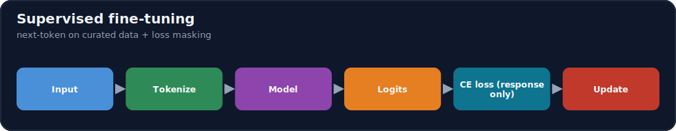
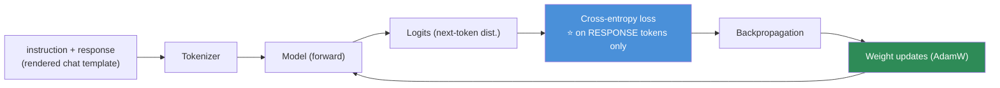
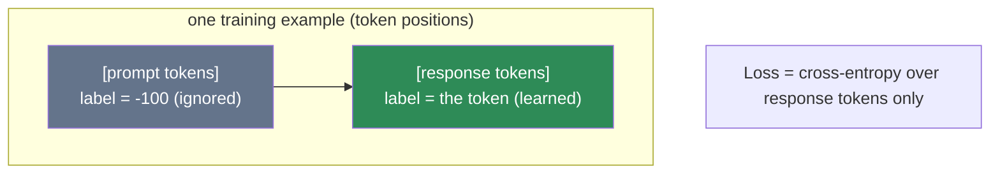

# 15.6 · Supervised Fine-Tuning (SFT) ⭐

[⬅ 15.5 Instruction Dataset Design](15.5-instruction-datasets.md) · [🏠 Module 15](../README.md) · [➡ 15.7 Full Fine-Tuning](15.7-full-fine-tuning.md)

> **The lesson in one line:** SFT is nothing exotic — it's the **same next-token / cross-entropy training the model was pretrained with** ([11.9](../../11-LLMs/weeks/11.9-pretraining.md)), just on your curated instruction→response examples, with one crucial twist: you **mask the loss on the prompt** so the model learns to *produce* the answer, not memorize the question.



---

## 🎯 Learning objectives

- Understand SFT: the **training objective, cross-entropy loss, labels, and loss masking**.
- Trace the pipeline **input → tokenizer → model → logits → loss → backprop → update**.
- Implement a **simplified SFT loop** in PyTorch with prompt masking.

## ✅ Prerequisites

- [11.1 next-token prediction](../../11-LLMs/weeks/11.1-what-is-a-language-model.md), [09.10 training loop](../../09-Deep-Learning/weeks/09.10-training-loop.md), [06.8 cross-entropy](../../06-Mathematics/weeks/06.8-information-theory.md).

---

## 🧠 Mental model

> [!IMPORTANT]
> **SFT is pretraining, narrowed.** Pretraining teaches "predict the next token" over the whole internet; SFT teaches the *same objective* over a small set of **instruction→response** examples, so the model's next-token behavior shifts toward *answering the way your data does*. The single idea that makes it "supervised instruction tuning" rather than plain continued pretraining is **loss masking**: you compute the cross-entropy loss **only on the response tokens**, not the prompt. Otherwise the model spends capacity learning to generate *your prompts* (pointless — the user supplies those) instead of learning to generate *good responses*. **Train on the answer, condition on the question.**



---

## The objective and loss

SFT minimizes the **cross-entropy** of the true next token given all previous tokens — identical to the language-modeling objective ([11.1](../../11-LLMs/weeks/11.1-what-is-a-language-model.md)):

$$\mathcal{L} = -\sum_{t \in \text{response}} \log P_\theta(x_t \mid x_{<t})$$

The sum runs over **response tokens only** (the prompt is masked). Concretely, models predict token `t` from tokens `< t`, so labels are the input shifted by one; you then set label = `-100` (PyTorch's ignore index) for every **prompt** position so it contributes zero loss.

### Labels and loss masking



> [!IMPORTANT]
> **Loss masking is the difference between an instruction-tuned model and a parrot.** Without it, the model is rewarded for reproducing prompts — wasting capacity and often producing a model that echoes instructions. With it, gradients flow only from "did you predict the *response* correctly?", which is exactly the behavior you want. Set prompt-position labels to `-100`; keep response-position labels as the real tokens (including the EOS token, so the model learns *when to stop*).

---

## 💻 A simplified SFT loop (PyTorch)

```python
import torch, torch.nn.functional as F
from torch.optim import AdamW

def build_example(prompt_ids, response_ids, eos_id):
    input_ids = prompt_ids + response_ids + [eos_id]
    # labels: ignore prompt (-100), learn response + eos
    labels = [-100]*len(prompt_ids) + response_ids + [eos_id]
    return torch.tensor(input_ids), torch.tensor(labels)

def sft_step(model, input_ids, labels, opt):
    logits = model(input_ids.unsqueeze(0)).logits        # (1, T, V)
    # shift: predict token t from < t
    shift_logits = logits[:, :-1, :].reshape(-1, logits.size(-1))
    shift_labels = labels[1:].reshape(-1)                 # aligned targets
    loss = F.cross_entropy(shift_logits, shift_labels, ignore_index=-100)  # ⭐ masking
    loss.backward()
    torch.nn.utils.clip_grad_norm_(model.parameters(), 1.0)   # stability
    opt.step(); opt.zero_grad()
    return loss.item()

opt = AdamW(model.parameters(), lr=2e-5)                  # small LR — don't wreck pretraining
for input_ids, labels in dataloader:                     # examples rendered via chat template (15.5)
    loss = sft_step(model, input_ids, labels, opt)
```

The whole thing is the [09.10 training loop](../../09-Deep-Learning/weeks/09.10-training-loop.md) with two specifics: **loss masking** (`ignore_index=-100` on prompt tokens) and a **small learning rate** (SFT nudges pretrained weights; too large a step destroys the general capability, [15.13](15.13-catastrophic-forgetting.md)). In practice `TRL`'s `SFTTrainer` does this for you ([15.10](15.10-practical-stack.md)), but this is what it runs.

---

## 🧮 Mathematical intuition

Each step follows the gradient of the response's negative log-likelihood, `θ ← θ − η ∇_θ L`. Because SFT data is small and the LR is small, `θ` moves a **short distance** from the pretrained optimum toward a nearby point where responses match your data — reshaping *behavior* while (mostly) preserving general capability. Move too far (high LR, too many epochs, tiny dataset) and you overfit / forget ([15.13](15.13-catastrophic-forgetting.md)); that's why LR and epoch count are the most sensitive SFT knobs ([15.11](15.11-hyperparameters.md)).

---

## 🏭 Production examples

| Practice | Why |
|---|---|
| `TRL SFTTrainer` (+ PEFT/LoRA) | handles masking, packing, template ([15.10](15.10-practical-stack.md)) |
| Loss on completion only | instruction tuning, not parroting |
| Small LR (1e-5–2e-4 range) | preserve pretrained capability |
| 1–3 epochs typical | avoid overfitting small sets |
| Validation loss + eval each epoch | early stop before forgetting ([15.13](15.13-catastrophic-forgetting.md)) |

## ⚡ GPU memory & 💲 cost considerations

- **SFT memory = full-FT memory unless you use LoRA** — weights + gradients + optimizer states (Adam ≈ ~16 bytes/param mixed precision, [15.7](15.7-full-fine-tuning.md)). Pair SFT with **LoRA/QLoRA** ([15.8](15.8-lora.md)–[15.9](15.9-qlora.md)) to make it fit.
- **Sequence packing** (concatenate short examples to fill the context) improves GPU utilization ([15.12](15.12-training-optimization.md)).
- **Few epochs, small clean data** → cheap; more epochs mostly buys overfitting.

## 🔒 Security considerations

> [!CAUTION]
> - **The model learns whatever the response tokens contain** — leaked secrets/PII in outputs get memorized ([15.20](15.20-security.md)); scrub the data ([15.4](15.4-dataset-preparation.md)).
> - **SFT can weaken safety alignment** of an instruct/chat base if your data lacks safe behaviors — re-test safety after SFT ([15.17](15.17-evaluation.md), [15.20](15.20-security.md)).
> - **Poisoned examples install poisoned behavior** — validate provenance.

## 🚫 Common mistakes

| Mistake | Consequence |
|---|---|
| No loss masking | Model parrots prompts; wasted capacity |
| Forgetting the EOS token in labels | Model never learns to stop |
| Learning rate too high | Catastrophic forgetting / instability ([15.13](15.13-catastrophic-forgetting.md)) |
| Too many epochs on small data | Overfitting ([15.19](15.19-debugging.md)) |
| Training format ≠ chat template | Bad behavior ([15.5](15.5-instruction-datasets.md)) |
| Full-precision full FT by habit | OOM; use LoRA/QLoRA + mixed precision |

## 🐛 Debugging workflow

Loss looks fine but behavior is bad? (1) **Is loss masked to the response** (prompt labels = -100)? Unmasked → parroting. (2) **Is EOS learned**? Runs on forever → missing EOS in labels. (3) **Format matches the chat template**? ([15.5](15.5-instruction-datasets.md)) (4) **LR too high / too many epochs** → forgetting/overfitting; lower LR, fewer epochs, watch val loss. Loss NaN → lower LR, clip grads, check data ([15.19](15.19-debugging.md)).

## 🏋️ Exercises

1. **Implement SFT.** Build the masked loop above on a tiny instruct dataset; confirm loss decreases and the model answers (not parrots).
2. **Masking ablation.** Train with and without prompt masking; compare behavior (parroting vs answering).
3. **EOS test.** Omit EOS from labels; show the model doesn't stop; add it; show it does.
4. **LR sweep.** Train at LR {1e-5, 2e-4, 1e-3}; observe forgetting/instability at high LR.
5. **Epoch sweep.** Train 1/3/10 epochs on a small set; find where overfitting starts (val loss rises).

## 🛠️ Mini project — "SFT from scratch"

**Goal:** a minimal, correct SFT trainer with masking, packing, and validation — no high-level trainer.

**Requirements:** chat-template rendering ([15.5](15.5-instruction-datasets.md)); label construction with prompt masking + EOS; the masked cross-entropy loop; grad clipping; small LR + warmup; validation-loss tracking + early stop; optional LoRA hook ([15.8](15.8-lora.md)).

**Folder structure**
```
sft-scratch/
├── data.py         # render + tokenize + mask labels (+ EOS)
├── loss.py         # masked cross-entropy
├── train.py        # loop, clip, warmup, early stop
└── eval.py         # val loss + sample generations
```

**Testing:** masked-vs-unmasked behavior differs (answering vs parroting); model learns EOS; loss decreases; val early-stop works.
**Evaluation:** downstream task metric vs base ([15.18](15.18-base-vs-finetuned.md)).
**GPU:** report memory; add LoRA to fit a larger model.
**Security:** scrubbed data; post-SFT safety check.
**Future improvements:** sequence packing; LoRA/QLoRA integration.

## 📄 Cheat sheet

| Concept | One line |
|---|---|
| **⭐ SFT** | next-token/cross-entropy training on instruction→response data |
| **Objective** | `−Σ log P(x_t | x_<t)` over **response tokens only** |
| **Labels** | input shifted by 1; **prompt positions = -100** (ignored) |
| **⭐ Loss masking** | learn the answer, condition on the question (not parrot) |
| **EOS** | keep EOS in labels → model learns to stop |
| **Pipeline** | input → tokenize → model → logits → CE loss → backprop → update |
| **LR** | small (1e-5–2e-4) — preserve pretrained capability |
| **Epochs** | 1–3 typical; more → overfitting |

## 🎴 Flashcards

- **⭐ What is SFT, fundamentally?** → The same next-token/cross-entropy objective as pretraining, applied to curated instruction→response examples.
- **⭐ What is loss masking and why does it matter?** → Computing the loss only on response tokens (prompt labels = -100), so the model learns to produce answers rather than parrot prompts.
- **How are labels constructed?** → Input shifted by one (predict token t from <t), with prompt positions set to the ignore index and the EOS token kept in the response labels.
- **Why keep EOS in the labels?** → So the model learns when to stop generating.
- **Why a small learning rate for SFT?** → SFT nudges pretrained weights; too large a step destroys general capability (catastrophic forgetting).
- **How many epochs typically?** → 1–3 on a small clean set; more mostly causes overfitting.
- **How does SFT relate to full FT / LoRA?** → SFT is the *objective*; it can be done via full fine-tuning (all params) or PEFT/LoRA (adapters) — the loss is the same.

## 💬 Interview questions

1. What is SFT, and how does it relate to pretraining?
2. Explain loss masking and why it's essential for instruction tuning.
3. How are labels constructed for SFT, and why include EOS?
4. Why use a small learning rate and few epochs?
5. Walk through the SFT pipeline from input to weight update.
6. How does SFT differ from full fine-tuning and from LoRA?

## 📝 Summary

- **SFT is the pretraining objective (next-token cross-entropy) applied to curated instruction→response data** — same math, narrower distribution.
- The defining twist is **loss masking**: compute loss on **response tokens only** (prompt labels = `-100`), so the model learns to *produce* answers, not parrot prompts — and keep **EOS** so it learns to stop.
- Use a **small learning rate** and **few epochs** to reshape behavior without **forgetting** the general capability ([15.13](15.13-catastrophic-forgetting.md)); the loop is the standard [09.10 training loop](../../09-Deep-Learning/weeks/09.10-training-loop.md) plus masking.
- SFT is the *objective*; realize it via **full FT** ([15.7](15.7-full-fine-tuning.md)) or **LoRA/QLoRA** ([15.8](15.8-lora.md)–[15.9](15.9-qlora.md)) — and always **evaluate base vs tuned** and **re-check safety**.

## 📚 References

1. **Ouyang et al. (2022) — _InstructGPT_.** ⭐ SFT as step one of instruction tuning.
2. **[11.11 Fine-Tuning](../../11-LLMs/weeks/11.11-fine-tuning.md).** SFT, loss masking, catastrophic forgetting.
3. **[09.10 Training Loop](../../09-Deep-Learning/weeks/09.10-training-loop.md).** The loop SFT reuses.
4. **TRL `SFTTrainer` docs.** Masking, packing, templates in practice.

---

## 🧭 Navigation

| Direction | Link |
|---|---|
| ⬅ Previous | [15.5 · Instruction Dataset Design](15.5-instruction-datasets.md) |
| ➡ Next | [15.7 · Full Fine-Tuning](15.7-full-fine-tuning.md) |
| 🏠 Module | [Module 15](../README.md) |
| 📖 Lessons | [Lesson index](README.md) |
