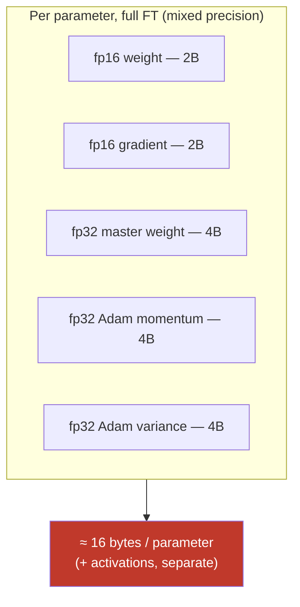

# 15.7 · Full Fine-Tuning

[⬅ 15.6 Supervised Fine-Tuning](15.6-sft.md) · [🏠 Module 15](../README.md) · [➡ 15.8 LoRA](15.8-lora.md)

> **The lesson in one line:** Full fine-tuning updates **every** parameter, which gives maximum capacity to change behavior but demands memory for the weights *plus their gradients plus optimizer states* — roughly **16 bytes per parameter** in mixed precision — which is exactly the wall that makes LoRA/QLoRA necessary.

---

## 🎯 Learning objectives

- Understand full fine-tuning and its **GPU memory breakdown**: weights, gradients, optimizer, activations.
- Do the **memory math** (~16 bytes/param) and see why it's the constraint.
- Know **when full FT is worth it** vs LoRA.

## ✅ Prerequisites

- [15.6 SFT](15.6-sft.md), [09.5 optimizers (Adam)](../../09-Deep-Learning/weeks/09.5-optimization.md), [09.14 performance/memory](../../09-Deep-Learning/weeks/09.14-performance.md).

---

## 🧠 Mental model

> [!IMPORTANT]
> **The reason full fine-tuning is expensive isn't the model weights — it's everything training *drags along with them*.** To update a parameter with Adam you must store: the **weight**, its **gradient**, and **two optimizer moments** (momentum + variance). In mixed-precision training that's roughly **fp16 weight (2) + fp16 grad (2) + fp32 master weight (4) + fp32 momentum (4) + fp32 variance (4) ≈ 16 bytes *per parameter***, before activations. So a 7B model needs **~112 GB** just for weights+grads+optimizer — several high-end GPUs. **LoRA exists to avoid paying this on all parameters** ([15.8](15.8-lora.md)); full FT means paying it on *every* one.



---

## The memory breakdown

| Component | Size (mixed precision) | Notes |
|---|---|---|
| **Weights** | 2 bytes/param (fp16/bf16) | + a 4-byte fp32 master copy for the optimizer |
| **Gradients** | 2 bytes/param | one per weight |
| **Optimizer (Adam)** | 8 bytes/param | momentum (4) + variance (4), fp32 |
| **Activations** | varies | ∝ batch × seq_len × layers; reduced by gradient checkpointing ([15.12](15.12-training-optimization.md)) |
| **Total (weights+grad+opt)** | **≈ 16 bytes/param** | the headline number |

**Rule of thumb:** full-FT memory ≈ **16 × params** (bytes) + activations.

| Model | Weights (fp16) | Full-FT (weights+grad+opt) |
|---|---|---|
| 1B | ~2 GB | ~16 GB |
| 7B | ~14 GB | ~112 GB |
| 13B | ~26 GB | ~208 GB |
| 70B | ~140 GB | ~1.1 TB |

> [!IMPORTANT]
> **This table is the whole motivation for the module's LoRA/QLoRA focus.** A 7B *inference* fits on one 24 GB GPU, but 7B *full fine-tuning* needs ~112 GB — multiple A100/H100s. **LoRA** keeps the base frozen (no grad/optimizer for it) and trains tiny adapters, cutting the trainable-parameter memory by ~99% ([15.8](15.8-lora.md)); **QLoRA** further 4-bit-quantizes the frozen base so even the *weights* shrink 4× ([15.9](15.9-qlora.md)). Full FT is the thing they're an alternative to.

---

## Checkpoints

Full FT produces **large checkpoints** (the entire model, ~2 bytes/param) each save — a 7B checkpoint is ~14 GB. You save periodically for resumability and to keep the best-by-validation model. (Contrast: a LoRA adapter is a few MB, [15.8](15.8-lora.md).) Plan disk and versioning accordingly ([15.21](15.21-production-pipeline.md)).

---

## When full fine-tuning is appropriate

| Full FT wins when… | Because |
|---|---|
| The behavior change is **large / high-rank** | LoRA's low-rank `ΔW` can't capture it |
| You have **ample GPUs and budget** | you can afford ~16 bytes/param |
| You need the **absolute best quality** and LoRA leaves a gap | all params are free to move |
| **Continued pretraining** on a big corpus | teaching broad new capability, not a nudge ([15.3](15.3-strategy-selection.md)) |
| You'll **serve the merged model** as the only variant | no need for swappable adapters |

Otherwise — **most of the time — LoRA matches full-FT quality at a fraction of the cost** ([15.8](15.8-lora.md)), which is why full FT is the exception, not the default.

### Advantages vs disadvantages

| ✅ Advantages | ❌ Disadvantages |
|---|---|
| Maximum capacity to change behavior | ~16 bytes/param memory (huge) |
| Highest quality ceiling | Multiple high-end GPUs; high cost |
| One self-contained model to serve | Large checkpoints; slow to save/load |
| No adapter machinery | No swappable adapters; retrain per task |
| | Higher catastrophic-forgetting risk ([15.13](15.13-catastrophic-forgetting.md)) |

---

## 🧮 Mathematical intuition

Adam maintains, per parameter, a first moment `m` and second moment `v` (both fp32), plus a fp32 master weight for numerical stability in mixed precision — hence the 8+4 = 12 bytes on top of the 2-byte fp16 weight and 2-byte grad ≈ 16. LoRA changes the *count* of trainable parameters (from `N` to `~0.5% N`), so gradients/optimizer states exist only for the adapters — the base contributes only its (optionally quantized) weights, no grad/optimizer. **The memory saving is entirely about which parameters have gradients and optimizer states.**

---

## 🏭 Production examples

| Scenario | Full FT? |
|---|---|
| Startup adapting a 7B on 1–2 GPUs | ❌ → LoRA/QLoRA |
| Lab with H100 cluster, best-quality domain model | ✅ possible |
| Continued pretraining on a domain corpus | ✅ (all params) |
| Many per-customer variants of one base | ❌ → LoRA adapters (swappable) |
| Distilling a large model into a small one | ✅ often full FT the small model |

## ⚡ GPU memory & 💲 cost considerations

- **Reduce full-FT memory** with: mixed precision (already assumed), **gradient checkpointing** (trade compute for activation memory), **gradient accumulation** (smaller batch, [15.12](15.12-training-optimization.md)), **optimizer sharding/offload** (ZeRO/DeepSpeed, [15.12](15.12-training-optimization.md)), and 8-bit optimizers.
- **Still, the ~16 bytes/param floor for weights+grad+opt dominates** — distributed training across GPUs is usually required for ≥7B ([15.12](15.12-training-optimization.md)).
- **Cost**: multiple high-end GPU-hours + large checkpoint storage — often 10–100× a LoRA run.

## 🔒 Security considerations

> [!CAUTION]
> - **Full FT moves all weights**, so it can **erode safety alignment** more than LoRA — re-run safety evals after ([15.17](15.17-evaluation.md), [15.20](15.20-security.md)).
> - **Higher memorization capacity** across all params → greater PII-leakage risk if data isn't scrubbed ([15.20](15.20-security.md)).
> - **Large checkpoints are sensitive artifacts** — the full adapted model; secure storage and access ([15.21](15.21-production-pipeline.md)).

## 🚫 Common mistakes

| Mistake | Consequence |
|---|---|
| Full FT by default | 10–100× cost for no quality gain over LoRA |
| Forgetting optimizer/gradient memory in planning | OOM (weights alone ≠ the requirement) |
| Full FT on one small GPU | Impossible for ≥~1–3B; need LoRA/QLoRA |
| No mixed precision / checkpointing | Even more memory |
| Ignoring forgetting after full FT | Degraded general capability |

## 🐛 Debugging workflow

Planning/OOM issues: (1) **Compute the memory budget**: ~16 × params + activations; does it fit? (2) If not: **switch to LoRA/QLoRA** ([15.8](15.8-lora.md)–[15.9](15.9-qlora.md)) or add **gradient checkpointing / accumulation / optimizer offload** ([15.12](15.12-training-optimization.md)). (3) **OOM only during backward/step** → gradients+optimizer are the culprit (confirms the 16-byte model). (4) **Quality gap vs LoRA?** rare — full FT should be ≥ LoRA; if worse, suspect LR/data. Full method in [15.19](15.19-debugging.md).

## 🏋️ Exercises

1. **Memory math.** Compute full-FT memory for 1B/7B/13B and identify the minimum GPU setup for each.
2. **Component breakdown.** For a 7B model, split the ~112 GB into weights/grad/optimizer; show optimizer dominates.
3. **Reduction stack.** Apply gradient checkpointing + accumulation (conceptually); estimate the new footprint.
4. **Full vs LoRA.** Argue a concrete case where full FT is justified over LoRA and one where it isn't.
5. **Checkpoint size.** Compute checkpoint size for full FT vs a LoRA adapter; note the operational difference.

## 🛠️ Mini project — "Full-FT memory planner"

**Goal:** a calculator that reports full-FT memory and the minimum hardware, and contrasts with LoRA/QLoRA.

**Requirements:** inputs = params, precision, batch, seq_len, layers; outputs = weights/grad/optimizer/activation estimates, total, GPUs needed; a comparison row for LoRA and QLoRA; toggles for checkpointing/accumulation/8-bit optimizer.

**Folder structure**
```
fullft-planner/
├── memory.py       # per-component estimates
├── hardware.py     # GPUs needed given VRAM
├── compare.py      # full vs LoRA vs QLoRA
└── examples/
```

**Testing:** matches the ~16 bytes/param rule; LoRA/QLoRA rows show the expected reductions; checkpointing reduces activations.
**Evaluation:** estimates within range of real runs.
**Security:** note checkpoint sensitivity + post-FT safety re-eval.
**Future improvements:** ZeRO/offload modeling; multi-GPU sharding math.

## 📄 Cheat sheet

| Concept | One line |
|---|---|
| **Full FT** | update **all** parameters |
| **⭐ Memory** | ≈ **16 bytes/param** (weights+grad+Adam) + activations |
| **Breakdown** | fp16 weight 2 + grad 2 + fp32 master 4 + momentum 4 + variance 4 |
| **7B full FT** | ~112 GB → multiple high-end GPUs |
| **Checkpoints** | full model (~2B/param) — large; LoRA adapter = MBs |
| **⭐ When** | large/high-rank change, ample GPUs, continued pretraining, distillation |
| **Reduce with** | grad checkpointing · accumulation · optimizer offload · 8-bit optim |
| **Default instead** | **LoRA/QLoRA** (this is what they replace) |

## 🎴 Flashcards

- **⭐ Why is full fine-tuning so memory-hungry?** → You store, per parameter, the weight + gradient + Adam's two moments (+ fp32 master) ≈ 16 bytes, on *every* parameter — not just the weights.
- **What's the memory rule of thumb?** → ~16 bytes/param for weights+gradients+optimizer (mixed precision), plus activations.
- **How much to full-fine-tune a 7B model?** → ~112 GB for weights+grad+optimizer — several high-end GPUs.
- **What dominates the per-parameter memory?** → The optimizer states (Adam momentum + variance, fp32) plus the fp32 master weight.
- **⭐ When is full FT worth it over LoRA?** → Large/high-rank behavior changes, ample GPUs/budget, continued pretraining, or when LoRA leaves a quality gap — otherwise LoRA matches it far cheaper.
- **How big is a full-FT checkpoint vs a LoRA adapter?** → Full checkpoint ≈ the whole model (~2 bytes/param); a LoRA adapter is a few MB.
- **How do you reduce full-FT memory?** → Mixed precision, gradient checkpointing, gradient accumulation, optimizer sharding/offload (ZeRO), 8-bit optimizers.

## 💬 Interview questions

1. Break down full-FT memory per parameter. Why is it ~16 bytes, not 2?
2. Why can you *infer* a 7B model on one GPU but not full-fine-tune it there?
3. What dominates training memory, and how does LoRA avoid it?
4. When is full fine-tuning justified over LoRA?
5. What techniques reduce full-FT memory, and what do they trade?
6. How do checkpoint sizes differ between full FT and LoRA, and why does it matter operationally?

## 📝 Summary

- Full fine-tuning updates **all parameters** and costs **~16 bytes/param** (fp16 weight + grad + fp32 master + Adam momentum/variance) plus activations — so a 7B needs ~112 GB and multiple high-end GPUs.
- The cost is dominated by **gradients and optimizer states on every parameter** — which is precisely what **LoRA** (frozen base, tiny adapters) and **QLoRA** (4-bit base) eliminate.
- Full FT is justified for **large/high-rank changes, continued pretraining, distillation, or a last-mile quality gap** with ample GPUs — otherwise **LoRA is the default** ([15.8](15.8-lora.md)).
- Reduce its footprint with **checkpointing, accumulation, optimizer offload, and 8-bit optimizers**, and **re-check safety** afterward (full FT can erode alignment).

## 📚 References

1. **[09.5 Optimization](../../09-Deep-Learning/weeks/09.5-optimization.md).** Adam's per-parameter state.
2. **[11.12 PEFT / LoRA](../../11-LLMs/weeks/11.12-peft-lora.md).** ⭐ Why the memory motivates LoRA.
3. **Rajbhandari et al. (2020) — _ZeRO_.** Sharding optimizer/gradient/parameter memory.
4. **[15.12 Training Optimization](15.12-training-optimization.md).** Reducing the footprint.

---

## 🧭 Navigation

| Direction | Link |
|---|---|
| ⬅ Previous | [15.6 · Supervised Fine-Tuning (SFT)](15.6-sft.md) |
| ➡ Next | [15.8 · LoRA](15.8-lora.md) |
| 🏠 Module | [Module 15](../README.md) |
| 📖 Lessons | [Lesson index](README.md) |
