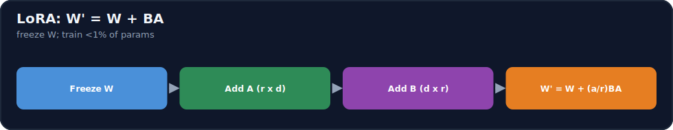
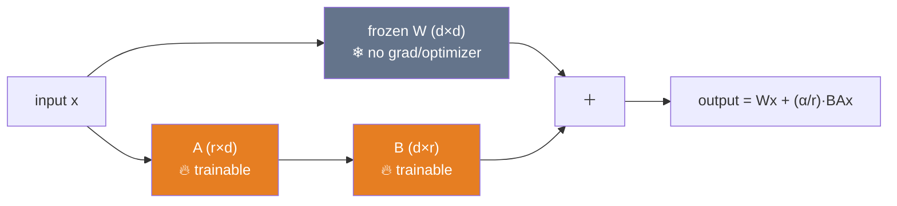

# 15.8 · LoRA ⭐

[⬅ 15.7 Full Fine-Tuning](15.7-full-fine-tuning.md) · [🏠 Module 15](../README.md) · [➡ 15.9 QLoRA](15.9-qlora.md)

> **The lesson in one line:** LoRA freezes the pretrained weights and learns the *update* as a product of two tiny matrices — `ΔW = BA` — so instead of training billions of parameters you train ~0.1–1% of them, cutting fine-tuning memory ~10× while matching full-fine-tuning quality on most tasks, and producing a few-MB **swappable adapter**.



---

## 🎯 Learning objectives

- Understand **low-rank adaptation**: frozen `W`, trainable `B, A`, and `W' = W + BA`.
- Understand the **math and the memory win** (why <1% trainable params suffices).
- Implement a **LoRA layer** in PyTorch and tune **rank, alpha, dropout, target modules**.

## ✅ Prerequisites

- [15.7 full fine-tuning memory](15.7-full-fine-tuning.md), [11.12 PEFT/LoRA](../../11-LLMs/weeks/11.12-peft-lora.md), [06.3 low-rank/matrix rank](../../06-Mathematics/weeks/06.3-linear-algebra-decomposition.md).

---

## 🧠 Mental model

> [!IMPORTANT]
> **Fine-tuning changes the weights by some amount `ΔW`; LoRA's insight is that this change is "low rank" — it lives in a tiny subspace — so you don't need a full `d×d` matrix to represent it, just two skinny ones.** Keep the pretrained `W` **frozen** (no gradients, no optimizer state — the expensive part of [15.7](15.7-full-fine-tuning.md) vanishes) and learn the update as `ΔW = BA`, where `B` is `d×r` and `A` is `r×d` with a small **rank** `r` (e.g., 8–64). At inference the layer computes `W'x = Wx + BAx`. You train only `B` and `A` — a few million parameters instead of billions — and can **swap adapters** on the same frozen base like interchangeable skills.



---

## The math

$$W' = W + \Delta W, \qquad \Delta W = BA$$

- `W ∈ ℝ^{d×k}` — the **frozen** pretrained weight.
- `B ∈ ℝ^{d×r}`, `A ∈ ℝ^{r×k}` — **trainable**, with rank `r ≪ min(d,k)`.
- Forward: `h = Wx + (α/r)·BAx`, where **α** (alpha) scales the update.

**Parameter count:** full `ΔW` has `d·k` params; LoRA has `r·(d+k)`. For `d=k=4096, r=8`: full = 16.7M vs LoRA = 65.5K — a **~256× reduction** on that matrix. Across a model, LoRA typically trains **0.1–1%** of parameters.

**Initialization:** `A` ~ small random (Gaussian), `B` = **zeros** — so `BA = 0` at the start and `W' = W`: training begins exactly at the pretrained model and *adds* to it. That's why LoRA doesn't destabilize a good base.

> [!IMPORTANT]
> **The memory win comes entirely from freezing `W`.** Because `W` has no gradient and no optimizer state, the ~16 bytes/param cost of full FT ([15.7](15.7-full-fine-tuning.md)) applies only to the tiny `B, A`. The frozen base still occupies memory as *weights* (2 bytes/param, or 0.5 with QLoRA's 4-bit, [15.9](15.9-qlora.md)) — but the expensive gradient + optimizer states now exist for <1% of parameters. That's how a 7B fine-tune drops from ~112 GB toward fitting on one GPU.

---

## 💻 A LoRA layer in PyTorch

```python
import torch, torch.nn as nn, math

class LoRALinear(nn.Module):
    def __init__(self, base: nn.Linear, r=8, alpha=16, dropout=0.05):
        super().__init__()
        self.base = base
        for p in self.base.parameters():          # ❄ freeze W (and bias)
            p.requires_grad = False
        d_out, d_in = base.weight.shape
        self.A = nn.Parameter(torch.randn(r, d_in) * (1/math.sqrt(r)))  # small init
        self.B = nn.Parameter(torch.zeros(d_out, r))                    # ⭐ zero → ΔW=0 at start
        self.scaling = alpha / r                    # α/r scale
        self.dropout = nn.Dropout(dropout)

    def forward(self, x):
        return self.base(x) + self.scaling * (self.dropout(x) @ self.A.t() @ self.B.t())

# apply to target modules (e.g., attention q/k/v/o projections)
def add_lora(model, targets=("q_proj","k_proj","v_proj","o_proj"), **kw):
    for name, module in model.named_modules():
        for child_name, child in module.named_children():
            if isinstance(child, nn.Linear) and child_name in targets:
                setattr(module, child_name, LoRALinear(child, **kw))
    return model
```

Only `A` and `B` have `requires_grad=True`, so the optimizer tracks only them. In practice **PEFT** ([15.10](15.10-practical-stack.md)) does this robustly (`get_peft_model(model, LoraConfig(...))`), but this is the mechanism.

### Merging for inference
After training you can **merge** `W ← W + (α/r)BA` into the base so inference has **zero added latency** (it's just a normal `Linear` again). Or keep the adapter separate to **swap** it — one base, many task adapters.

---

## The knobs

| Hyperparameter | What it does | Guidance |
|---|---|---|
| **Rank `r`** | capacity of the update (subspace size) | 8–16 for most tasks; 32–64 for bigger changes; higher = more params/quality but risk of overfit |
| **Alpha `α`** | scales `ΔW` (effective LR of the adapter) | common `α = 2r` (so `α/r = 2`); tune with `r` |
| **Dropout** | regularizes the adapter | 0.05–0.1; higher for small data |
| **Target modules** | which layers get adapters | attention projections (`q,k,v,o`); adding MLP (`gate,up,down`) increases capacity/params |

> [!IMPORTANT]
> **Rank and target modules are the two levers that matter most.** Start small (`r=8–16`, attention projections only) — it's usually enough and cheapest. If quality lags, **raise rank** and **add MLP target modules** before considering full FT. `α` is typically set so `α/r ≈ 2`; think of `α/r` as the adapter's effective learning-rate multiplier. **More rank is not free** — it adds parameters and overfitting risk on small data.

---

## 🧮 Mathematical intuition

Empirically, the fine-tuning update `ΔW` has **low intrinsic rank**: a rank-`r` approximation captures most of its effect. This is the SVD/low-rank idea ([06.3](../../06-Mathematics/weeks/06.3-linear-algebra-decomposition.md)) — a matrix well-approximated by its top-`r` singular components. So `BA` (rank ≤ `r`) suffices to represent the behavior change, and the "wasted" directions full FT would also touch aren't needed. When the required change *is* high-rank (large domain shift), LoRA underfits and full FT wins ([15.7](15.7-full-fine-tuning.md)) — the exception that proves the rule.

---

## 🏭 Production examples

| Use | LoRA config |
|---|---|
| Style/format on a chat model | `r=8–16`, attention targets, 1–3 epochs |
| Harder domain/skill | `r=32–64`, + MLP targets |
| Many per-tenant variants | one base + per-tenant adapters (swap) |
| Serve with zero latency overhead | **merge** the winning adapter |
| Fit on one consumer GPU | LoRA + 4-bit base = **QLoRA** ([15.9](15.9-qlora.md)) |

## ⚡ GPU memory & 💲 cost considerations

- **Trainable params drop ~99%** → gradients + optimizer states shrink proportionally; the frozen base still costs its weight memory (2 bytes/param, or 0.5 with QLoRA).
- **Adapters are a few MB** → cheap to store, version, and ship many.
- **Merging removes inference overhead**; keeping adapters separate adds a tiny compute cost but enables swapping.
- **Faster training** (fewer params to update) and cheaper checkpoints than full FT ([15.7](15.7-full-fine-tuning.md)).

## 🔒 Security considerations

> [!CAUTION]
> - **Adapters are behavior modifiers** — a malicious/poisoned adapter on a shared base can install bad behavior; treat adapters as code, vet and sign them ([15.20](15.20-security.md)).
> - **LoRA still memorizes** training data into the adapter — scrub PII ([15.4](15.4-dataset-preparation.md)).
> - **Per-tenant adapters aid isolation** (delete/replace without touching the base), but ensure the right adapter is loaded per request (no cross-tenant mix-up).

## 🚫 Common mistakes

| Mistake | Consequence |
|---|---|
| Initializing `B` non-zero | Training doesn't start at the base; instability |
| Rank too high on small data | Overfitting; needless params |
| Wrong/too-few target modules | Underfitting (not enough capacity) |
| Forgetting to freeze the base | You're doing full FT (OOM) |
| Mismatched `α`/`r` intuition | Effective LR too high/low |
| Not merging when latency matters | Small avoidable inference overhead |

## 🐛 Debugging workflow

LoRA underperforming? (1) **Confirm the base is frozen** and only `A,B` train (check `requires_grad` / trainable-param count). (2) **`B` initialized to zero?** Non-zero → unstable start. (3) **Quality gap?** Raise `r`, add MLP targets, improve data — *then* consider full FT. (4) **Overfitting?** Lower `r`, add dropout, fewer epochs, more data. (5) **Behaves wrong at inference?** Check the merge/scale (`α/r`) is applied. Full method in [15.19](15.19-debugging.md).

## 🏋️ Exercises

1. **Implement LoRA.** Build `LoRALinear`; confirm only `A,B` are trainable and `ΔW=0` at init (output == base).
2. **Param count.** Compute trainable % for `r∈{4,8,32}` on a model; verify it's <1–2%.
3. **Rank sweep.** Fine-tune (or simulate) at `r∈{4,8,16,32}`; plot quality vs params; find the knee.
4. **Target modules.** Compare attention-only vs attention+MLP targets on a hard task.
5. **Merge.** Merge an adapter into the base; verify identical outputs and zero added latency.

## 🛠️ Mini project — "LoRA fine-tuning (from scratch + PEFT)"

**Goal:** fine-tune a model with a hand-built LoRA layer, then reproduce it with PEFT, and compare to full FT.

**Requirements:** `LoRALinear` with r/alpha/dropout/targets; freeze base; train (SFT loss, [15.6](15.6-sft.md)); trainable-param report; adapter save/load + merge; a PEFT (`LoraConfig`) equivalent; eval vs base and (if feasible) vs full FT.

**Folder structure**
```
lora/
├── layer.py        # LoRALinear + add_lora
├── train.py        # SFT with LoRA
├── merge.py        # merge / swap adapters
├── peft_version.py # get_peft_model equivalent
└── eval.py         # base vs LoRA (vs full FT)
```

**Testing:** ΔW=0 at init; only A,B trainable; merge preserves outputs; adapter is a few MB.
**Evaluation:** quality vs base/full FT; trainable-param % and memory ([15.18](15.18-base-vs-finetuned.md)).
**GPU:** report the memory drop vs full FT.
**Security:** treat adapters as vetted artifacts; scrub data ([15.20](15.20-security.md)).
**Future improvements:** QLoRA (4-bit base, [15.9](15.9-qlora.md)); rank/target sweeps.

## 📄 Cheat sheet

| Concept | One line |
|---|---|
| **⭐ LoRA** | freeze `W`; learn `ΔW = BA` (low rank) |
| **Forward** | `Wx + (α/r)·BAx` |
| **Shapes** | `B: d×r`, `A: r×k`, rank `r ≪ d,k` |
| **Init** | `A` small random, **`B = 0`** → starts at base |
| **⭐ Memory win** | frozen `W` = no grad/optimizer → train <1% params |
| **Rank `r`** | 8–16 default; 32–64 for bigger changes |
| **Alpha `α`** | scale; often `α = 2r` (α/r ≈ 2) |
| **Targets** | attention q/k/v/o (+ MLP for more capacity) |
| **Adapter** | few MB; **merge** for zero latency, or **swap** |

## 🎴 Flashcards

- **⭐ What is LoRA in one equation?** → `W' = W + BA`: freeze the pretrained `W`, train two low-rank matrices `B (d×r)` and `A (r×k)`.
- **⭐ Where does LoRA's memory saving come from?** → Freezing `W` — it has no gradient or optimizer state, so the ~16 bytes/param cost applies only to the tiny `B, A` (<1% of params).
- **Why initialize `B` to zero?** → So `BA = 0` at the start; training begins exactly at the pretrained model and adds to it (stable).
- **What do rank and alpha do?** → Rank `r` sets the update's capacity (subspace size); alpha `α` scales `ΔW` (α/r is the adapter's effective LR multiplier).
- **Which target modules and why?** → Attention projections (q/k/v/o) by default; add MLP (gate/up/down) for more capacity — rank and targets are the main levers.
- **⭐ Why does low rank suffice?** → The fine-tuning update `ΔW` has low intrinsic rank — a rank-`r` `BA` captures most of the behavior change.
- **Merge vs swap?** → Merge `W←W+(α/r)BA` for zero inference latency; keep adapters separate to swap many tasks on one base.

## 💬 Interview questions

1. Explain LoRA: the equation, what's frozen, what's trained.
2. Why does freezing `W` produce the memory saving? Relate it to full-FT's ~16 bytes/param.
3. Why initialize `B` to zero, and what would break otherwise?
4. What do rank, alpha, dropout, and target modules control?
5. Why does a low-rank update suffice for most fine-tuning?
6. When does LoRA underfit and full FT win?
7. Explain merging vs swapping adapters and their trade-offs.

## 📝 Summary

- **LoRA** freezes the pretrained `W` and learns the update as `ΔW = BA` with a small rank `r`, training **~0.1–1%** of parameters — because fine-tuning's update has **low intrinsic rank**.
- The **memory win is from freezing `W`** (no gradient/optimizer state on the base), dropping a 7B fine-tune from ~112 GB toward one GPU; `B` inits to **zero** so training starts at the base.
- **Rank and target modules** are the main levers (start `r=8–16`, attention projections; escalate before full FT); `α/r` is the adapter's effective LR; adapters are **a few MB** and can be **merged** (zero latency) or **swapped** (one base, many tasks).
- Pair with **4-bit quantization → QLoRA** ([15.9](15.9-qlora.md)) to fit even larger models; adapters still **memorize** data (scrub PII) and should be **vetted like code** ([15.20](15.20-security.md)).

## 📚 References

1. **Hu et al. (2021) — _LoRA: Low-Rank Adaptation of LLMs_.** ⭐ The method and low-rank argument.
2. **[11.12 PEFT / LoRA](../../11-LLMs/weeks/11.12-peft-lora.md).** LoRA in the LLM context.
3. **Hugging Face **PEFT** docs (`LoraConfig`).** ⭐ Production LoRA.
4. **[06.3 Linear Algebra — Decomposition](../../06-Mathematics/weeks/06.3-linear-algebra-decomposition.md).** Low-rank / SVD intuition.

---

## 🧭 Navigation

| Direction | Link |
|---|---|
| ⬅ Previous | [15.7 · Full Fine-Tuning](15.7-full-fine-tuning.md) |
| ➡ Next | [15.9 · QLoRA](15.9-qlora.md) |
| 🏠 Module | [Module 15](../README.md) |
| 📖 Lessons | [Lesson index](README.md) |
