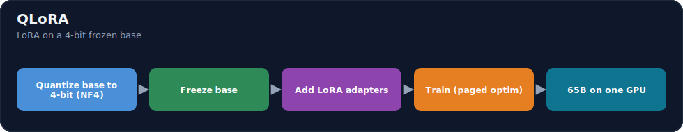
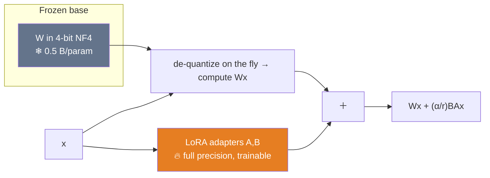
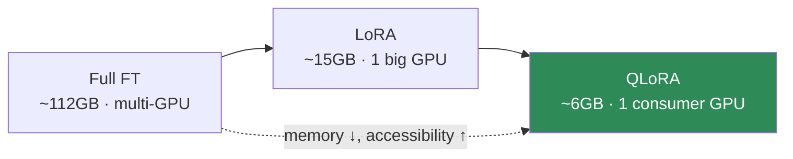

# 15.9 · QLoRA ⭐

[⬅ 15.8 LoRA](15.8-lora.md) · [🏠 Module 15](../README.md) · [➡ 15.10 Practical Stack](15.10-practical-stack.md)

> **The lesson in one line:** QLoRA = LoRA on top of a **4-bit quantized frozen base** — since the base isn't trained, you can store it in 4-bit (NF4) to cut its memory ~4×, and train full-precision LoRA adapters through it, which is what lets you fine-tune a 65B model on a **single 48 GB GPU** (or a 7B on a 24 GB one).



---

## 🎯 Learning objectives

- Understand **quantization, 4-bit NF4, double quantization, and paged optimizers**.
- See how QLoRA slashes memory by quantizing the **frozen** base while keeping adapters trainable.
- Compare **full FT vs LoRA vs QLoRA** on memory, speed, quality, and hardware.

## ✅ Prerequisites

- [15.8 LoRA](15.8-lora.md), [15.7 full-FT memory](15.7-full-fine-tuning.md), [11.16 quantization](../../11-LLMs/weeks/11.16-inference-optimization.md).

---

## 🧠 Mental model

> [!IMPORTANT]
> **LoRA already froze the base — QLoRA's insight is that a *frozen* thing doesn't need full precision, so store it in 4 bits.** In LoRA the base weights `W` still sit in memory at 2 bytes/param (fp16); but since `W` never gets gradient updates, you can **quantize it to 4-bit (0.5 bytes/param)** and only *de-quantize on the fly* during the forward pass to compute `Wx`. The **LoRA adapters stay full precision** (they're what you train, and they're tiny). Result: the biggest memory consumer — the base weights — shrinks **4×**, while gradients/optimizer still only exist for the small adapters. That combination is what puts giant-model fine-tuning on one consumer/prosumer GPU.



---

## The three QLoRA innovations

### 1. 4-bit NormalFloat (NF4)
A 4-bit datatype **information-theoretically optimal for normally-distributed weights** (which pretrained weights approximately are). Instead of uniform 4-bit levels, NF4's levels are placed to match a normal distribution, so it preserves more signal than plain int4 — quantizing the frozen base to **0.5 bytes/param** with minimal quality loss.

### 2. Double quantization
The quantization itself needs metadata (**scaling constants** per block). Double quantization **quantizes those constants too**, saving a further ~0.3–0.5 bits/param — small but free memory on top of NF4.

### 3. Paged optimizers
Uses NVIDIA unified memory to **page optimizer states between GPU and CPU** during memory spikes (e.g., a long sequence), preventing OOM crashes — like OS virtual memory for the optimizer. Keeps training stable at the memory edge.

> [!IMPORTANT]
> **QLoRA's headline result: fine-tune a 65B model on a single 48 GB GPU with negligible quality loss vs 16-bit LoRA.** The base drops to ~0.5 bytes/param (from 2), the adapters are tiny and full-precision, gradients/optimizer exist only for the adapters, and paged optimizers absorb spikes. Crucially, **quality is essentially preserved** — 4-bit NF4 for the *frozen* base plus full-precision adapters recovers 16-bit fine-tuning performance on their benchmarks. **QLoRA made large-model fine-tuning accessible to anyone with a single good GPU.**

---

## How QLoRA reduces memory

| Consumer | LoRA (fp16 base) | QLoRA (4-bit base) |
|---|---|---|
| **Base weights** | 2 bytes/param | **0.5 bytes/param** (NF4 + double-quant) |
| **Adapter weights** | tiny (fp16) | tiny (fp16) |
| **Gradients** | adapters only | adapters only |
| **Optimizer** | adapters only | adapters only (+ paged) |

For a 7B model: base drops from **~14 GB → ~3.5 GB**, so QLoRA fits comfortably on a 24 GB GPU (with room for activations); 13B fits too, and 65B on a 48 GB card.

---

## 💻 QLoRA in practice

```python
from transformers import AutoModelForCausalLM, BitsAndBytesConfig
from peft import LoraConfig, get_peft_model, prepare_model_for_kbit_training

bnb = BitsAndBytesConfig(
    load_in_4bit=True,
    bnb_4bit_quant_type="nf4",            # ⭐ NormalFloat4
    bnb_4bit_use_double_quant=True,       # ⭐ double quantization
    bnb_4bit_compute_dtype="bfloat16",    # de-quantize to bf16 for matmul
)
model = AutoModelForCausalLM.from_pretrained(model_id, quantization_config=bnb, device_map="auto")
model = prepare_model_for_kbit_training(model)          # gradient checkpointing, casts

lora = LoraConfig(r=16, lora_alpha=32, lora_dropout=0.05,
                  target_modules=["q_proj","k_proj","v_proj","o_proj"], task_type="CAUSAL_LM")
model = get_peft_model(model, lora)                      # 4-bit base + trainable fp16 adapters
model.print_trainable_parameters()                       # ~0.1–1% trainable
```

The base is loaded **once in 4-bit**; PEFT attaches full-precision adapters; training proceeds as normal SFT ([15.6](15.6-sft.md)) with **paged optimizer** (`optim="paged_adamw_8bit"` in the trainer). This is the standard single-GPU fine-tuning recipe ([15.10](15.10-practical-stack.md)).

---

## Full FT vs LoRA vs QLoRA

| | Full FT | LoRA | QLoRA |
|---|---|---|---|
| **Trainable params** | 100% | ~0.1–1% | ~0.1–1% |
| **Base precision** | 16-bit | 16-bit | **4-bit (NF4)** |
| **Memory (7B)** | ~112 GB | ~15–20 GB | **~6–10 GB** |
| **Hardware** | multi high-end GPU | one high-end GPU | **one consumer/prosumer GPU** |
| **Speed** | fastest/step (no dequant) but huge | fast | slightly slower (de-quant overhead) |
| **Quality** | ceiling (high-rank changes) | ≈ full FT (most tasks) | ≈ LoRA (small loss from 4-bit) |
| **Adapters** | none | swappable | swappable |



> [!IMPORTANT]
> **The trade-off ladder: full FT (max quality, max cost) → LoRA (≈quality, ~10× less memory) → QLoRA (≈LoRA quality, ~another 4× less base memory, slight speed cost).** QLoRA's only real downside vs LoRA is a **small per-step slowdown** from on-the-fly de-quantization and a *tiny* quality gap from 4-bit — usually well worth it to fit the model at all. **Default to QLoRA when memory-bound, LoRA when you have the VRAM to spare, full FT only for high-rank changes.**

---

## 🧮 Mathematical intuition

Quantization maps a continuous weight to one of `2^b` discrete levels. Plain int4 spaces levels uniformly; **NF4** spaces them by the **quantiles of a normal distribution**, so more levels sit where weights are dense (near 0) — minimizing expected quantization error for normally-distributed weights. Since the base is **frozen**, this error is *fixed* (not compounded by training), and the **full-precision adapters** learn to compensate for it — which is why QLoRA recovers 16-bit performance despite a 4-bit base. Gradients flow through the de-quantized `W` to the adapters, never updating `W` itself.

---

## 🏭 Production examples

| Situation | Choice |
|---|---|
| Fine-tune 7B–13B on one 24 GB GPU | **QLoRA** |
| Fine-tune 65B on a 48 GB GPU | **QLoRA** |
| A100/H100 available, want speed | LoRA (16-bit base) |
| Private data, single self-hosted GPU | QLoRA (open model) |
| Merge for serving | merge adapter into a de-quantized/16-bit base |

## ⚡ GPU memory & 💲 cost considerations

- **QLoRA's base = ~0.5 bytes/param** (NF4 + double-quant) vs 2 (fp16) → **~4× base reduction**; adapters + their grad/optimizer stay tiny.
- **Paged optimizers** prevent OOM on sequence-length spikes.
- **Slight compute overhead** from de-quantization each forward → a bit slower per step than LoRA; usually acceptable.
- **Serving**: you can keep the model 4-bit for cheap inference, or merge + serve at higher precision.

## 🔒 Security considerations

> [!CAUTION]
> - Same as LoRA: **adapters memorize data** (scrub PII, [15.4](15.4-dataset-preparation.md)) and are **behavior-modifying artifacts** to vet ([15.20](15.20-security.md)).
> - **Quantization can slightly shift behavior/safety** — re-run safety evals on the quantized+adapted model, not just the fp16 one ([15.17](15.17-evaluation.md)).
> - **QLoRA enables local fine-tuning of sensitive data** on one owned GPU — a *privacy win* (no data leaves your box).

## 🚫 Common mistakes

| Mistake | Consequence |
|---|---|
| Expecting QLoRA to speed up training | It's about **memory**; it's slightly slower/step than LoRA |
| Using int4 instead of NF4 | More quality loss than necessary |
| Skipping `prepare_model_for_kbit_training` | Gradient/casting issues |
| Forgetting paged optimizer on long sequences | OOM spikes |
| Evaluating only the fp16 model | Missed quantization's behavior shift |
| Assuming 4-bit ruins quality | NF4 + adapters ≈ 16-bit on most tasks |

## 🐛 Debugging workflow

QLoRA OOM or poor quality? (1) **OOM?** Enable paged optimizer, gradient checkpointing, reduce batch/seq-len ([15.12](15.12-training-optimization.md)); confirm base is actually 4-bit (`load_in_4bit`). (2) **Quality gap vs LoRA?** Ensure **NF4** (not int4) + double-quant + bf16 compute dtype; raise rank ([15.8](15.8-lora.md)); check data. (3) **Unstable/NaN?** Lower LR, clip grads, verify `prepare_model_for_kbit_training`. (4) **Behaves oddly only quantized?** Re-eval the 4-bit+adapter model directly. Full method in [15.19](15.19-debugging.md).

## 🏋️ Exercises

1. **Memory math.** Compute QLoRA vs LoRA vs full-FT memory for 7B/13B/65B; find the GPU each fits.
2. **NF4 vs int4.** Compare quality (or perplexity) of a base quantized with NF4 vs int4.
3. **Fit a big model.** Load a 7B in 4-bit; add LoRA; confirm it trains on a 24 GB GPU; report memory.
4. **Speed cost.** Measure per-step time for LoRA vs QLoRA; quantify the de-quantization overhead.
5. **Paged optimizer.** Trigger a memory spike (long sequence); show paged optimizer avoids OOM.

## 🛠️ Mini project — "QLoRA on one GPU"

**Goal:** fine-tune a model that wouldn't fit in fp16, using QLoRA on a single GPU.

**Requirements:** 4-bit NF4 + double-quant load (`BitsAndBytesConfig`); `prepare_model_for_kbit_training`; LoRA adapters ([15.8](15.8-lora.md)); paged 8-bit optimizer; SFT ([15.6](15.6-sft.md)); memory report; eval vs base and vs 16-bit LoRA (if feasible); merge/serve path.

**Folder structure**
```
qlora/
├── load.py         # 4-bit NF4 + double-quant + kbit prep
├── adapters.py     # LoraConfig / get_peft_model
├── train.py        # SFT + paged optimizer
├── memory.py       # footprint report
└── eval.py         # base vs QLoRA (vs LoRA)
```

**Testing:** trains within the target VRAM; NF4 in use; paged optimizer avoids spikes; quality ≈ 16-bit LoRA.
**Evaluation:** task metric vs base; memory + speed vs LoRA/full ([15.18](15.18-base-vs-finetuned.md)).
**GPU:** the headline — a model that didn't fit now trains on one GPU.
**Security:** local/private fine-tune; re-eval safety on the quantized model ([15.20](15.20-security.md)).
**Future improvements:** merge + quantized serving; rank/target sweeps.

## 📄 Cheat sheet

| Concept | One line |
|---|---|
| **⭐ QLoRA** | LoRA on a **4-bit (NF4) frozen base** |
| **Why it works** | frozen base doesn't need full precision; adapters compensate |
| **NF4** | 4-bit datatype optimal for normal-distributed weights |
| **Double quant** | quantize the quantization constants too (extra saving) |
| **Paged optimizer** | page optimizer states GPU↔CPU to avoid OOM spikes |
| **Base memory** | ~0.5 bytes/param (vs 2 fp16) → ~4× smaller |
| **⭐ Result** | 65B on one 48GB GPU; 7B on 24GB; ≈16-bit quality |
| **Cost** | slightly slower/step (de-quant); tiny quality gap |
| **Default** | QLoRA when memory-bound; LoRA when VRAM to spare |

## 🎴 Flashcards

- **⭐ What is QLoRA?** → LoRA fine-tuning on top of a 4-bit (NF4) quantized, frozen base — the base shrinks ~4× while full-precision adapters are trained through it.
- **Why can you quantize the base to 4-bit?** → It's frozen (never gets gradients), so lower precision is fine; you de-quantize on the fly to compute `Wx`, and the trainable adapters compensate for quantization error.
- **What is NF4?** → 4-bit NormalFloat — quantization levels placed by the quantiles of a normal distribution, optimal for normally-distributed pretrained weights.
- **What is double quantization?** → Quantizing the quantization metadata (scaling constants) too, for a small extra memory saving.
- **What are paged optimizers?** → Paging optimizer states between GPU and CPU (unified memory) to survive memory spikes without OOM.
- **⭐ QLoRA's headline result?** → Fine-tune a 65B model on a single 48 GB GPU (7B on 24 GB) with ≈16-bit-LoRA quality.
- **QLoRA's downside vs LoRA?** → Slightly slower per step (on-the-fly de-quantization) and a tiny quality gap — usually worth it to fit the model.

## 💬 Interview questions

1. What is QLoRA, and how does it differ from LoRA?
2. Why can the base be quantized to 4-bit while the adapters stay full precision?
3. Explain NF4, double quantization, and paged optimizers.
4. How much memory does QLoRA save, and what does it enable hardware-wise?
5. What's the quality/speed trade-off of QLoRA vs LoRA?
6. When would you choose LoRA over QLoRA?
7. Why is QLoRA a privacy enabler for sensitive-data fine-tuning?

## 📝 Summary

- **QLoRA = LoRA on a 4-bit (NF4) quantized, frozen base**: since the base isn't trained, storing it in 4 bits (~0.5 bytes/param) cuts the dominant memory consumer ~4×, while **full-precision adapters** are trained through the de-quantized weights.
- Its three innovations — **NF4** (weight-distribution-optimal 4-bit), **double quantization** (quantize the constants), and **paged optimizers** (survive spikes) — together let you **fine-tune a 65B on one 48 GB GPU with ≈16-bit quality**.
- The ladder: **full FT → LoRA (~10× less) → QLoRA (~4× less base memory, slight speed cost)** — default to **QLoRA when memory-bound**, LoRA with spare VRAM, full FT for high-rank changes.
- It's also a **privacy enabler** (fine-tune sensitive data on one owned GPU); re-check **safety on the quantized+adapted model** ([15.17](15.17-evaluation.md)).

## 📚 References

1. **Dettmers et al. (2023) — _QLoRA: Efficient Finetuning of Quantized LLMs_.** ⭐ NF4, double-quant, paged optimizers.
2. **[15.8 LoRA](15.8-lora.md).** The adapters QLoRA quantizes the base under.
3. **`bitsandbytes` + PEFT docs.** 4-bit loading and paged optimizers.
4. **[11.16 Inference Optimization](../../11-LLMs/weeks/11.16-inference-optimization.md).** Quantization fundamentals.

---

## 🧭 Navigation

| Direction | Link |
|---|---|
| ⬅ Previous | [15.8 · LoRA](15.8-lora.md) |
| ➡ Next | [15.10 · Practical Fine-Tuning Stack](15.10-practical-stack.md) |
| 🏠 Module | [Module 15](../README.md) |
| 📖 Lessons | [Lesson index](README.md) |
