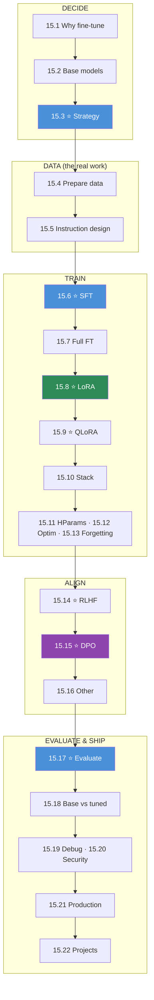

# Module 15 · Fine-Tuning & Alignment — Lessons

[⬅ Module home](../README.md) · [🗺 Roadmap](../../../ROADMAP.md) · [📚 Curriculum](../../../CURRICULUM.md)

> This is the map of Module 15. **Fine-tuning changes behavior, not knowledge — and it's mostly a data problem.** By the end you will decide when to fine-tune, prepare high-quality datasets, implement SFT / LoRA / DPO by hand, run QLoRA on one GPU, understand RLHF, and evaluate, secure, and deploy adapted models.

---

## The rule of this module

> [!IMPORTANT]
> **Fine-tuning teaches a model *how to behave*, not *what is true*.** Use it for behavior, style, format adherence, a skill, or a domain's conventions that prompting can't reliably produce — **not** to inject facts (that's RAG) or steer a single call (that's prompting). And treat it as a **data problem first**: quality, formatting, and diversity of a few thousand examples beat raw volume. The training itself, thanks to **LoRA/QLoRA**, is now cheap enough to run a large model on a single GPU.
>
> **The plan:** why & when to fine-tune → base models → pick a strategy → build the dataset → SFT → full FT → **LoRA → QLoRA** → the stack → hyperparameters & optimization → catastrophic forgetting → **RLHF → DPO** → other alignment → evaluate → base-vs-tuned → debug → secure → productionize → projects. You **implement SFT, a LoRA layer, and a DPO loss by hand** before the frameworks.

This module **cashes in Module 09 and 11**: the [training loop](../../09-Deep-Learning/weeks/09.10-training-loop.md), [AdamW](../../09-Deep-Learning/weeks/09.5-optimization.md), and [mixed precision](../../09-Deep-Learning/weeks/09.14-performance.md) are the machinery; [fine-tuning (11.11)](../../11-LLMs/weeks/11.11-fine-tuning.md), [PEFT/LoRA (11.12)](../../11-LLMs/weeks/11.12-peft-lora.md), and [alignment (11.13)](../../11-LLMs/weeks/11.13-alignment.md) are the theory this module makes concrete and production-ready.

---

## The 22 lessons

| # | Lesson | The one thing | Build? |
|---|---|---|---|
| 15.1 | [Why Fine-Tuning Exists](15.1-why-fine-tuning.md) ⭐ | behavior not knowledge — **last** resort | — |
| 15.2 | [Base Models](15.2-base-models.md) | base → SFT → instruct → aligned → chat | — |
| 15.3 | [Strategy Selection](15.3-strategy-selection.md) ⭐ | prompt / RAG / LoRA / QLoRA / full / continued-pretrain | — |
| 15.4 | [Dataset Preparation](15.4-dataset-preparation.md) | clean · dedup · filter · PII · splits · **no leakage** | ✅ |
| 15.5 | [Instruction Dataset Design](15.5-instruction-datasets.md) | instruction/input/output & chat formats | ✅ |
| 15.6 | [Supervised Fine-Tuning](15.6-sft.md) ⭐ | next-token on curated data + **loss masking** | ✅ |
| 15.7 | [Full Fine-Tuning](15.7-full-fine-tuning.md) | update all weights; the **memory** math | — |
| 15.8 | [LoRA](15.8-lora.md) ⭐ | **W' = W + BA**; rank/alpha/dropout/targets | ✅ |
| 15.9 | [QLoRA](15.9-qlora.md) ⭐ | 4-bit **NF4** + double-quant + paged optimizer | ✅ |
| 15.10 | [Practical Stack](15.10-practical-stack.md) | Transformers · Datasets · PEFT · TRL · bitsandbytes | ✅ |
| 15.11 | [Hyperparameters](15.11-hyperparameters.md) | LR, batch, accum, epochs, warmup, rank, alpha | — |
| 15.12 | [Training Optimization](15.12-training-optimization.md) | mixed precision · grad ckpt · accum · flash-attn | — |
| 15.13 | [Catastrophic Forgetting](15.13-catastrophic-forgetting.md) | it forgets — detect & reduce | — |
| 15.14 | [RLHF](15.14-rlhf.md) ⭐ | preference → reward model → PPO | — |
| 15.15 | [DPO](15.15-dpo.md) ⭐ | preference pairs, **no reward model / no RL** | ✅ |
| 15.16 | [Other Alignment](15.16-other-alignment.md) | Constitutional AI · RLAIF · ORPO · KTO | — |
| 15.17 | [Model Evaluation](15.17-evaluation.md) ⭐ | task · generation · safety · LLM-judge | ✅ |
| 15.18 | [Base vs Fine-Tuned](15.18-base-vs-finetuned.md) | same eval set · A/B · significance | ✅ |
| 15.19 | [Debugging](15.19-debugging.md) | loss NaN / flat / forgetting / format errors | — |
| 15.20 | [Security & Privacy](15.20-security.md) | PII · memorization · poisoning — defensive | — |
| 15.21 | [Production Pipeline](15.21-production-pipeline.md) | version data+model · registry · rollback | — |
| 15.22 | [Projects & Summary](15.22-projects-summary.md) | 8 projects; the whole lifecycle | ✅ |

⭐ marks the load-bearing lessons. **15.6 (SFT)**, **15.8 (LoRA)**, and **15.15 (DPO)** make the methods concrete; **15.1/15.3 (when & which)** and **15.17 (evaluation)** keep you from fine-tuning the wrong thing or shipping a regression.

---

## The dependency graph

**Read it as five phases:** *decide* (when/which), *data* (where the quality is won), *train* (SFT → LoRA → QLoRA), *align* (RLHF → DPO), and *evaluate & ship*.

---

## The recurring through-lines

- **Behavior, not knowledge** — fine-tune for *how*, RAG for *what*, prompt for *framing*.
- **Data quality > data quantity** — a clean, diverse, well-formatted small set wins.
- **Memory is the constraint** — LoRA/QLoRA exist because full fine-tuning's optimizer + gradient memory is huge ([11.12](../../11-LLMs/weeks/11.12-peft-lora.md)).
- **Fine-tuning can make a model *worse*** — catastrophic forgetting; always evaluate base vs tuned.
- **DPO ≈ RLHF's outcome with far less machinery** — no reward model, no RL loop.
- **Alignment is behavior too** — preferences teach the model *which* good answer to prefer.

---

## Navigation

| Direction | Link |
|---|---|
| 🏠 Module home | [Module 15](../README.md) |
| ➡ First lesson | [15.1 · Why Fine-Tuning Exists](15.1-why-fine-tuning.md) |
| 🗺 Roadmap | [ROADMAP.md](../../../ROADMAP.md) |
| 📚 Curriculum | [CURRICULUM.md](../../../CURRICULUM.md) |
