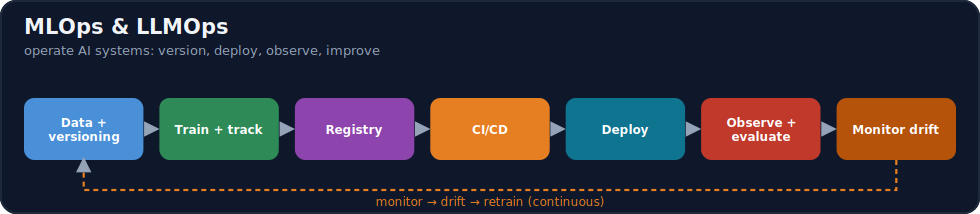

# Module 16 · MLOps & LLMOps

[⬅ 15 · Fine Tuning](../15-Fine-Tuning/README.md) · [🏠 docs](../README.md) · [🗺 Roadmap](../../ROADMAP.md) · [17 · Cloud ➡](../17-Cloud/README.md)

> Building, deploying, monitoring, scaling, and continuously improving ML, LLM, RAG, and Agent systems in production.

---

## Purpose

This module bridges the gap between **AI model development** and **production AI engineering**. It teaches the **full production lifecycle** — problem → data → versioning → experimentation → training → evaluation → registry → CI/CD → deployment → monitoring → drift → retraining → continuous improvement — *not* "train model → deploy model." It then adds the **LLMOps** layer (prompts, RAG, agents, evaluation, observability, cost) that traditional MLOps doesn't cover. Everything you built in Modules 8–15 becomes a **reliable, observable, cost-controlled system** here.

## What you'll learn

- **Reproducibility** (seeds, environments, dependency locking, config), **data & model versioning**, and **experiment tracking**.
- **ML pipelines & orchestration**, **CI/CD for AI** (testing code, data, models, prompts, RAG, agents), and **model serving** (batch/online/async).
- **LLMOps**: prompt/RAG/agent versioning, **AI observability** (logs/metrics/traces, tokens/cost/tool-calls), and **LLM evaluation in production**.
- **Monitoring & drift** (data/concept/model drift), **deployment strategies** (blue-green/canary/rolling/shadow), and **model optimization** (quantization/distillation/caching/KV-cache/continuous batching).
- **GPU infrastructure, Kubernetes for AI, reliability** (retries/timeouts/circuit-breakers/backpressure), **cost optimization**, and **production security**.
- **Infrastructure as code, cloud MLOps concepts**, and **two end-to-end capstones** (MLOps + LLMOps) plus 10 mini-projects.

## 📖 Lessons (start here)

> ✅ **This module's content is written.** Work through the lessons in order via the [lesson index](weeks/README.md).

| # | Lesson | Build? |
|---|---|---|
| 16.1 | [What Is MLOps & LLMOps?](weeks/16.1-what-is-mlops.md) ⭐ | — |
| 16.2 | [Reproducibility](weeks/16.2-reproducibility.md) | ✅ |
| 16.3 | [Data Versioning](weeks/16.3-data-versioning.md) | ✅ |
| 16.4 | [Experiment Tracking](weeks/16.4-experiment-tracking.md) ⭐ | ✅ |
| 16.5 | [Model Registry](weeks/16.5-model-registry.md) ⭐ | ✅ |
| 16.6 | [ML Pipelines & Orchestration](weeks/16.6-ml-pipelines.md) | ✅ |
| 16.7 | [CI/CD for AI](weeks/16.7-cicd.md) ⭐ | ✅ |
| 16.8 | [Model Serving](weeks/16.8-model-serving.md) ⭐ | ✅ |
| 16.9 | [LLMOps](weeks/16.9-llmops.md) ⭐ | — |
| 16.10 | [AI Observability](weeks/16.10-observability.md) ⭐ | ✅ |
| 16.11 | [Model Monitoring & Drift](weeks/16.11-monitoring-drift.md) ⭐ | ✅ |
| 16.12 | [LLM Evaluation in Production](weeks/16.12-llm-evaluation.md) | ✅ |
| 16.13 | [Deployment Strategies](weeks/16.13-deployment-strategies.md) | — |
| 16.14 | [Model Optimization](weeks/16.14-model-optimization.md) | — |
| 16.15 | [GPU Infrastructure](weeks/16.15-gpu-infrastructure.md) | — |
| 16.16 | [Kubernetes for AI](weeks/16.16-kubernetes.md) | — |
| 16.17 | [Reliability](weeks/16.17-reliability.md) ⭐ | ✅ |
| 16.18 | [Cost Optimization](weeks/16.18-cost-optimization.md) ⭐ | — |
| 16.19 | [AI Security in Production](weeks/16.19-security.md) | — |
| 16.20 | [Production Architecture](weeks/16.20-production-architecture.md) | — |
| 16.21 | [Infrastructure as Code](weeks/16.21-iac.md) | ✅ |
| 16.22 | [Cloud MLOps](weeks/16.22-cloud.md) | — |
| 16.23 | [End-to-End MLOps & LLMOps Projects](weeks/16.23-end-to-end-projects.md) | ✅ |
| 16.24 | [Mini Projects & Summary](weeks/16.24-projects-summary.md) | ✅ |

**Companion artifacts:** [Exercises](exercises/README.md) · [Quiz](quizzes/quiz-01.md) · [Flashcards](flashcards/deck.md) · [Cheat sheet](cheat-sheets/mlops-cheatsheet.md)

> [!IMPORTANT]
> **⭐ The rule of this module: an AI system in production has more moving parts than any traditional software — code *plus* data, models, prompts, and evaluation — and any one of them can silently break the whole thing while every server stays green.** Traditional software fails loudly (a crash, an error); an ML/LLM system fails *quietly*: the model still returns an answer, the API still returns 200, but the answer is now wrong because the data drifted, a prompt regressed, or a dependency changed. So MLOps is the discipline of making AI systems **reproducible, versioned, tested, deployed safely, observed deeply, and continuously improved** — treating **data, models, and prompts as first-class versioned artifacts**, not just the code.
>
> And for **LLM systems the failure modes multiply**: cost can spike 10× overnight, latency can balloon, quality can drift with no code change, and a prompt-injected agent can take real actions. So LLMOps adds **prompt/RAG/agent versioning, token/cost/latency observability, and production LLM evaluation** on top of classic MLOps. **You will build an experiment tracker, a model registry, a CI/CD pipeline, a serving API, an observability layer, and a drift detector** — then assemble them into end-to-end MLOps and LLMOps platforms.

## How this module is organized

Content is delivered week by week. Each module uses the same subfolders:

| Folder | Contents |
|---|---|
| [`weeks/`](weeks/) | Weekly lesson content, one file per lesson (`16.1-…`, `16.2-…`). |
| [`diagrams/`](diagrams/) | Mermaid sources and exported diagram assets for this module. |
| [`exercises/`](exercises/) | Hands-on practice problems with solutions. |
| [`projects/`](projects/) | Buildable projects that apply this module's skills. |
| [`quizzes/`](quizzes/) | Self-assessment question banks with answer keys. |
| [`flashcards/`](flashcards/) | Spaced-repetition Q/A decks for active recall. |
| [`cheat-sheets/`](cheat-sheets/) | One-page quick references for this module. |
| [`references/`](references/) | Paper summaries and deep-dive notes. |

## Suggested study flow

## Related modules

- [Module 08 · Machine Learning](../08-Machine-Learning/README.md) & [Module 09 · Deep Learning](../09-Deep-Learning/README.md) — the models this operationalizes.
- [Module 11 · LLMs](../11-LLMs/README.md) — inference optimization, KV cache, serving.
- [Module 13 · RAG](../13-RAG/README.md), [Module 14 · Agents](../14-AI-Agents/README.md), [Module 15 · Fine-Tuning](../15-Fine-Tuning/README.md) — the LLM systems this deploys and monitors.
- [Module 17 · Cloud](../17-Cloud/README.md), [Module 18 · System Design](../18-System-Design/README.md), [Module 19 · Production AI](../19-Production-AI/README.md) — where this scales.

---

## Navigation

| Direction | Link |
|---|---|
| ⬆ Parent | [docs/](../README.md) |
| ⬅ Previous | [⬅ 15 · Fine Tuning](../15-Fine-Tuning/README.md) |
| ➡ Next | [17 · Cloud ➡](../17-Cloud/README.md) |
| 🗺 Roadmap | [ROADMAP.md](../../ROADMAP.md) |
| 📚 Curriculum | [CURRICULUM.md](../../CURRICULUM.md) |
| 🏠 Repo root | [README.md](../../README.md) |
