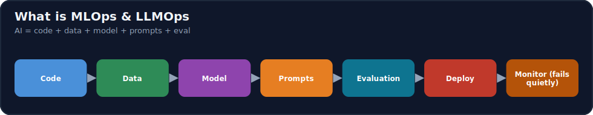
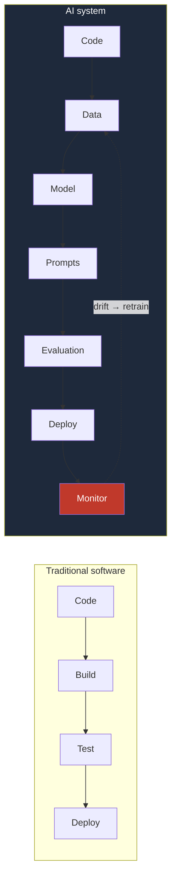
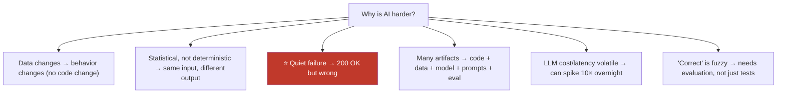

# 16.1 · What Is MLOps & LLMOps? ⭐

[🏠 Module 16](../README.md) · [📖 Lessons](README.md) · [➡ 16.2 Reproducibility](16.2-reproducibility.md)

> **The lesson in one line:** Traditional software is *code that you build, test, and deploy*; an AI system is **code plus data, a model, prompts, and an evaluation** — four extra things that each change independently and can silently make the whole system wrong while every server stays green — which is exactly why AI needs its own operational discipline: **MLOps** (for models) and **LLMOps** (for LLM systems).



---

## 🎯 Learning objectives

- Distinguish **software engineering, DevOps, MLOps, and LLMOps**.
- Explain why AI systems are **harder to operate** than traditional software.
- Understand the AI lifecycle: code → data → model → prompts → evaluation → deploy → monitor.
- Recognize the **quiet failure** problem that motivates the whole module.

## ✅ Prerequisites

- [08.17 production ML](../../08-Machine-Learning/weeks/08.17-production-ml.md), [11.20 production LLM](../../11-LLMs/weeks/11.20-production-architecture.md).

---

## 🧠 Mental model

> [!IMPORTANT]
> **A traditional program is deterministic: same code + same input → same output, and it fails *loudly* (a crash, a 500). An AI system is statistical: its behavior depends on *data* it was trained on and *inputs* it has never seen, and it fails *quietly* — the model still returns a confident answer, the API still returns 200, but the answer is now wrong.** That single difference is the reason DevOps isn't enough. In software, the artifact is the *code*. In AI, the artifacts are **code + data + model + (for LLMs) prompts + an evaluation** — and any of them can change under you: data drifts, a model degrades, a prompt is edited, a dependency bumps a default. **MLOps/LLMOps is the discipline of versioning, testing, deploying, and observing all of them so failures become visible and recoverable.**



---

## The four disciplines

| Discipline | Manages | Artifact | Fails |
|---|---|---|---|
| **Software engineering** | building correct programs | code | loudly (bug/crash) |
| **DevOps** | shipping & running software reliably | code + infra | loudly (outage) |
| **MLOps** | the ML lifecycle end to end | code + **data + model** | **quietly** (drift/degradation) |
| **LLMOps** | operating LLM systems | + **prompts + RAG + agents + eval + cost** | quietly *and* expensively |

- **DevOps → MLOps**: DevOps assumes the deployed artifact is fixed code; MLOps adds **data and models as versioned artifacts** whose behavior can change without a code change, plus **retraining** as a first-class loop.
- **MLOps → LLMOps**: LLMOps adds the LLM-specific surface — **prompts, RAG pipelines, agents, evaluation datasets, token/cost/latency observability** — because an LLM system's quality and cost can drift with no code, data, *or* model change (e.g., a provider updates the model, [15.14](../../15-Fine-Tuning/weeks/15.14-rlhf.md)).

---

## Why AI systems are harder to operate



> [!IMPORTANT]
> **The core operational challenge is that in AI, "it works" is not a property you can test once and forget — it's a property you must *continuously measure*, because the world the model sees keeps changing.** A unit test proves code is correct forever (until the code changes). An ML model that passed evaluation last month can be silently wrong today because production data drifted ([16.11](16.11-monitoring-drift.md)). An LLM app can regress because a prompt was edited or the hosted model was updated. **So the whole module is about making the invisible visible: version everything, observe everything, evaluate continuously, and close the loop with retraining.**

---

## 🏭 Production examples

| Quiet failure | What MLOps adds to catch it |
|---|---|
| Fraud model accuracy quietly drops | drift detection + monitoring ([16.11](16.11-monitoring-drift.md)) |
| A prompt edit tanks answer quality | prompt versioning + eval gate ([16.9](16.9-llmops.md), [16.12](16.12-llm-evaluation.md)) |
| LLM cost triples after a change | token/cost observability ([16.10](16.10-observability.md), [16.18](16.18-cost-optimization.md)) |
| Can't reproduce last quarter's model | data + model + experiment versioning ([16.2](16.2-reproducibility.md)–[16.5](16.5-model-registry.md)) |
| Bad model reaches all users at once | canary/shadow deploy + rollback ([16.13](16.13-deployment-strategies.md)) |

## ⚡ Performance & 💲 cost considerations

- **AI ops cost is ongoing, not one-time** — training is periodic, but serving, monitoring, evaluation, and retraining run continuously ([16.18](16.18-cost-optimization.md)).
- **LLM cost is a first-class operational metric** — unlike classic software, per-request cost varies with tokens and can dominate the bill ([16.10](16.10-observability.md)).

## 🔒 Security considerations

> [!CAUTION]
> - **AI adds attack surface classic software doesn't have** — data/model poisoning, prompt injection, model extraction ([15.20](../../15-Fine-Tuning/weeks/15.20-security.md), [12.16](../../12-Prompt-Engineering/weeks/12.16-security.md)); production security ([16.19](16.19-security.md)) must cover all of it.
> - **Quiet failures include quiet *security* failures** — a poisoned model behaves normally until triggered; observability and evaluation are also security tools.

## 🚫 Common mistakes

| Mistake | Consequence |
|---|---|
| "Train model → deploy" as the whole picture | No versioning/monitoring/retraining → silent decay |
| Treating AI like traditional software | Miss data/model/prompt drift |
| Only monitoring uptime | 200 OK while answers are wrong |
| Versioning code but not data/models/prompts | Can't reproduce or roll back |
| No production evaluation | "It works" assumed, never measured |
| Ignoring LLM cost/latency | Bill/latency spikes go unnoticed |

## 🐛 Debugging workflow

"The AI system is misbehaving in production" — ask in order: (1) **Did the code change?** (traditional deploy diff). (2) **Did the data change?** (drift, [16.11](16.11-monitoring-drift.md)). (3) **Did the model change?** (registry version, [16.5](16.5-model-registry.md)). (4) **Did a prompt/RAG/agent config change?** ([16.9](16.9-llmops.md)). (5) **Did a dependency or the hosted model change?** ([16.2](16.2-reproducibility.md)). The extra artifacts are the extra suspects — which is why you version and observe all of them.

## 🏋️ Exercises

1. **Loud vs quiet.** List 5 failures for a traditional web app and 5 for an ML/LLM system; classify each as loud or quiet.
2. **Artifact map.** For a RAG chatbot, enumerate every versioned artifact (code, data, model, prompts, retriever config, eval set) and how each could break.
3. **DevOps gap.** Explain three things DevOps handles that MLOps must *extend*, and why.
4. **LLMOps delta.** Name three failure modes an LLM system has that a classic ML model doesn't.
5. **Incident.** "Accuracy dropped 10% with no deploy" — write the diagnosis steps.

## 🛠️ Mini project — "AI system artifact & failure map"

**Goal:** a document + diagram mapping every artifact and failure mode of an AI system, with the MLOps control that catches each.

**Requirements:** enumerate artifacts (code/data/model/prompts/config/eval); for each, list failure modes (drift, edit, dependency bump, provider change) and the control (versioning/monitoring/eval/canary); a mermaid lifecycle diagram.

**Folder structure**
```
artifact-map/
├── artifacts.md    # every versioned artifact
├── failures.md     # failure modes + controls
└── lifecycle.mmd   # the AI lifecycle diagram
```

**Testing:** every artifact has a failure mode and a control; quiet failures identified.
**Evaluation:** completeness vs a reference checklist.
**Security:** include poisoning/injection/extraction as failure modes.
**Future improvements:** map controls to the module's lessons.

## 📄 Cheat sheet

| Concept | One line |
|---|---|
| **Software eng.** | build correct code; fails loudly |
| **DevOps** | ship/run code reliably; fails loudly |
| **⭐ MLOps** | operate code + **data + model**; fails **quietly** |
| **⭐ LLMOps** | + prompts + RAG + agents + eval + **cost** |
| **⭐ AI artifacts** | code + data + model + prompts + evaluation |
| **⭐ Quiet failure** | 200 OK but wrong (drift/prompt/dependency) |
| **Why harder** | statistical · data-dependent · many artifacts · fuzzy "correct" |
| **The answer** | version everything · observe everything · evaluate continuously · retrain |

## 🎴 Flashcards

- **⭐ Why do AI systems need their own ops discipline beyond DevOps?** → Their behavior depends on data/models/prompts that change independently of the code, and they fail *quietly* (still 200 OK but wrong) — DevOps assumes a fixed code artifact that fails loudly.
- **What are the artifacts of an AI system?** → Code + data + model + (for LLMs) prompts + RAG/agent configs + an evaluation dataset — all first-class versioned artifacts.
- **⭐ MLOps vs LLMOps?** → MLOps operates the ML lifecycle (code + data + model + retraining); LLMOps adds LLM-specific concerns (prompt/RAG/agent versioning, token/cost/latency observability, production evaluation).
- **What is a "quiet failure"?** → The system returns a confident, well-formed, 200-OK response that is *wrong* — from data drift, a prompt regression, or a dependency/provider change — invisible to uptime monitoring.
- **Why is "it works" not a one-time property for AI?** → The data distribution the model sees keeps changing, so correctness must be continuously measured (evaluation + drift monitoring), not tested once.
- **What extra suspects does an AI incident have?** → Data change, model change, prompt/config change, and dependency/provider change — not just a code deploy.

## 💬 Interview questions

1. Contrast software engineering, DevOps, MLOps, and LLMOps.
2. Why are AI systems harder to operate than traditional software?
3. What is a quiet failure, and why does uptime monitoring miss it?
4. What are the versioned artifacts of an AI system, and how can each break?
5. How does LLMOps extend MLOps, and why is it needed?
6. Walk through diagnosing "accuracy dropped with no code deploy."

## 📝 Summary

- Traditional software is **code you build/test/deploy**; an AI system is **code + data + model + prompts + evaluation**, and it **fails quietly** (200 OK but wrong) when any of those change.
- **MLOps** extends DevOps to treat **data and models as versioned artifacts** with **retraining** as a loop; **LLMOps** further adds **prompt/RAG/agent versioning, token/cost/latency observability, and production evaluation**.
- AI is harder to operate because it's **statistical, data-dependent, multi-artifact, and "correct" is fuzzy** — so "it works" must be **continuously measured**, not tested once.
- The whole module answers this with one strategy: **version everything, observe everything, evaluate continuously, deploy safely, and close the loop with retraining.**

## 📚 References

1. **Sculley et al. (2015) — _Hidden Technical Debt in ML Systems_.** ⭐ Why ML is hard to operate.
2. **Google — _MLOps: Continuous delivery and automation pipelines in ML_.** ⭐ MLOps maturity.
3. **[08.17 Production ML](../../08-Machine-Learning/weeks/08.17-production-ml.md) & [11.20 Production LLM](../../11-LLMs/weeks/11.20-production-architecture.md).** The systems this operates.
4. **Huyen (2022) — _Designing Machine Learning Systems_.** End-to-end ML in production.

---

## 🧭 Navigation

| Direction | Link |
|---|---|
| ⬅ Previous | [Module home](../README.md) |
| ➡ Next | [16.2 · Reproducibility](16.2-reproducibility.md) |
| 🏠 Module | [Module 16](../README.md) |
| 📖 Lessons | [Lesson index](README.md) |
