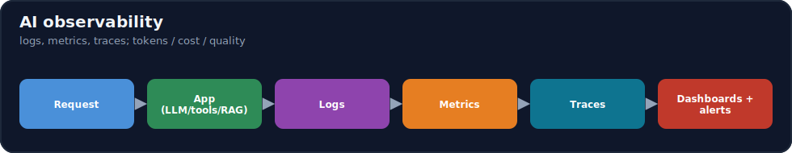
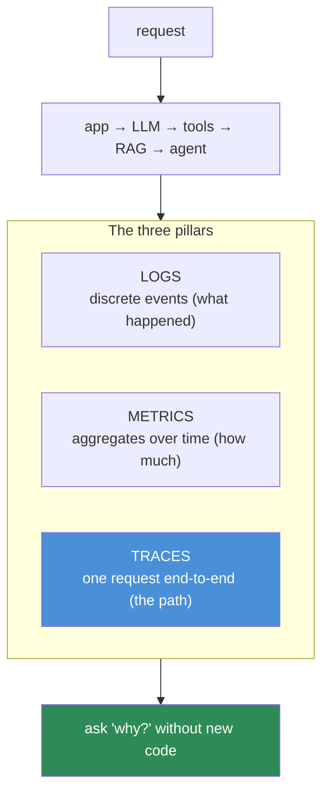
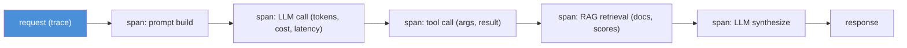
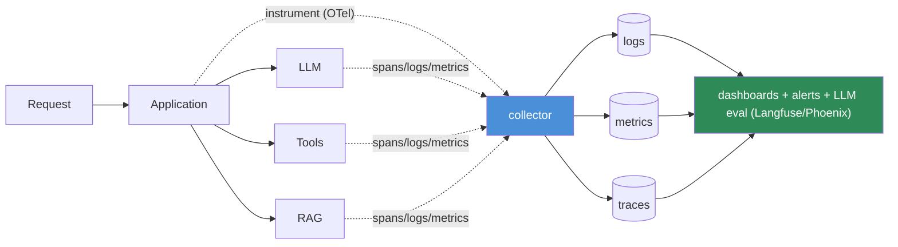

# 16.10 · AI Observability ⭐

[⬅ 16.9 LLMOps](16.9-llmops.md) · [🏠 Module 16](../README.md) · [➡ 16.11 Model Monitoring & Drift](16.11-monitoring-drift.md)

> **The lesson in one line:** You can't fix what you can't see, and AI systems fail *quietly* — so observability is the practice of instrumenting them with **logs, metrics, and traces**, and for LLM systems specifically capturing **tokens, cost, latency, tool calls, retrieval quality, errors, and user feedback**, so a silent regression becomes a visible signal.



---

## 🎯 Learning objectives

- Understand the **three pillars**: logs, metrics, traces (+ distributed tracing).
- Know the **LLM-specific signals** to capture (tokens/cost/latency/tool-calls/retrieval/feedback).
- Design an **observability architecture**; use Langfuse / Phoenix / OpenTelemetry conceptually.

## ✅ Prerequisites

- [16.9 LLMOps](16.9-llmops.md), [16.8 serving](16.8-model-serving.md), [14.15 production agents](../../14-AI-Agents/weeks/14.15-production-architecture.md).

---

## 🧠 Mental model

> [!IMPORTANT]
> **Monitoring tells you *that* something is wrong (a metric crossed a threshold); observability lets you ask *why* without shipping new code — by having recorded enough about each request to reconstruct what happened.** For a normal web service, the three pillars — **logs** (what happened), **metrics** (aggregate numbers over time), **traces** (the path of one request through the system) — suffice. AI systems need all three *plus* an extra layer, because a request flows through **prompt → LLM → tools → RAG → agent steps**, and when the answer is wrong you must see the *whole chain*: which prompt, how many tokens, which tools were called, what the retriever returned, how much it cost. **Observability is what makes the quiet failure ([16.1](16.1-what-is-mlops.md)) loud enough to debug.**



---

## The three pillars

| Pillar | What | AI use |
|---|---|---|
| **Logs** | timestamped discrete events | the prompt sent, the response, errors, tool inputs/outputs |
| **Metrics** | numeric aggregates over time | latency p50/p95/p99, throughput, error rate, **tokens/cost**, quality scores |
| **Traces** | the full path of one request across components | prompt → LLM call → tool call → RAG retrieval → agent step, with timing per span |

### Distributed tracing (the key one for AI)
A **trace** is a tree of **spans** — each span is one operation (an LLM call, a tool call, a retrieval) with start/end time and metadata. For an LLM/agent system, the trace shows the **entire chain of a single request**: which prompt version, tokens in/out, which tools ran and their results, what RAG retrieved, and where the time/cost went ([14.15](../../14-AI-Agents/weeks/14.15-production-architecture.md)). **This is the single most valuable AI observability tool** — most "why did the agent do that?" questions are answered by reading one trace.



---

## What to monitor for LLM systems

Beyond standard latency/errors, capture the **LLM-specific signals**:

| Signal | Why |
|---|---|
| **Input / output tokens** | drives cost + latency; the core LLM metric ([16.18](16.18-cost-optimization.md)) |
| **Cost** (per request/user/model/workflow) | volatile; can spike 10× ([16.18](16.18-cost-optimization.md)) |
| **Latency** (p50/p95/p99, TTFT) | user-facing; varies with tokens ([16.8](16.8-model-serving.md)) |
| **Model usage** | which model/version, per-call | 
| **Tool calls** | which tools, success/failure, args ([14.4](../../14-AI-Agents/weeks/14.4-tool-calling.md)) |
| **Retrieval quality** | recall/relevance of RAG results ([13.12](../../13-RAG/weeks/13.12-evaluation.md)) |
| **Errors** | failures, retries, timeouts, refusals |
| **User feedback** | 👍/👎, edits, escalations — the real quality signal ([16.12](16.12-llm-evaluation.md)) |

> [!IMPORTANT]
> **The three LLM signals classic APM tools miss — and that you must add — are tokens/cost, retrieval/tool quality, and user feedback.** A generic monitoring stack shows latency and error rate; it has no concept of "this request cost $0.40 because the agent looped 12 times" or "the RAG retriever returned junk." So AI observability instruments the *AI-specific* dimensions and ties them to **traces** so you can drill from "cost is up 3×" down to the exact requests and spans causing it. **Capture per-request tokens/cost and quality signals from day one — retrofitting them after a cost incident is painful.**

---

## The tools (conceptually)

| Tool | Character |
|---|---|
| **OpenTelemetry** | vendor-neutral **standard** for logs/metrics/traces; instrument once, export anywhere |
| **Langfuse** | LLM-focused observability: traces, prompt management, evals, cost — open-source |
| **Arize Phoenix** | LLM/ML observability: tracing, evals, drift, embeddings analysis |

Use **OpenTelemetry** as the instrumentation standard (portable), and an **LLM-native tool** (Langfuse/Phoenix) for the LLM-specific views (per-call tokens/cost, prompt-linked traces, eval integration). Classic APM (Datadog/Grafana) covers infra metrics.

---

## Observability architecture



Instrument the app once (OpenTelemetry), emit **logs + metrics + traces** to a collector, store them, and surface **dashboards, alerts, and LLM-eval views**. Every request gets a **trace ID** so a user complaint maps to the exact trace.

---

## 🏭 Production examples

| Question | Answered by |
|---|---|
| "Why did cost triple?" | token/cost metrics → drill to expensive traces |
| "Why did the agent do that?" | read the request's trace (spans) |
| "Is RAG degrading?" | retrieval-quality metric over time ([13.12](../../13-RAG/weeks/13.12-evaluation.md)) |
| "What's the p99 latency?" | latency metrics (percentiles) |
| "Are users unhappy?" | feedback signal trend ([16.12](16.12-llm-evaluation.md)) |
| "Which requests error?" | error logs + traces |

## ⚡ Performance & 💲 cost considerations

- **Observability has overhead + storage cost** — sample high-volume traces (keep all errors/slow/expensive ones); aggregate metrics.
- **Cost observability *saves* money** — it's how you find the 3× spike ([16.18](16.18-cost-optimization.md)); the instrumentation pays for itself.
- **Trace sampling** — 100% for low volume; head/tail sampling at scale (always keep anomalous traces).

## 🔒 Security considerations

> [!CAUTION]
> - **Traces/logs contain prompts, responses, and retrieved content — often PII** ([15.20](../../15-Fine-Tuning/weeks/15.20-security.md)); redact, access-control, and set retention.
> - **Observability is a security tool** — anomalous token/tool patterns can signal prompt injection or abuse ([12.16](../../12-Prompt-Engineering/weeks/12.16-security.md)); alert on them.
> - **Don't log secrets** that pass through prompts/tool args ([16.19](16.19-security.md)).

## 🚫 Common mistakes

| Mistake | Consequence |
|---|---|
| Only infra metrics (CPU/uptime) | Miss cost/quality/tool failures |
| No tracing | Can't answer "why did this request go wrong?" |
| Not capturing tokens/cost | Blind to cost spikes ([16.18](16.18-cost-optimization.md)) |
| No user-feedback signal | No real quality gauge ([16.12](16.12-llm-evaluation.md)) |
| Logging PII/secrets unredacted | Privacy/security leak |
| 100% trace retention at scale | Runaway storage cost |

## 🐛 Debugging workflow

Production LLM incident: (1) **Alert fires** (metric: cost/latency/error/quality). (2) **Drill from the metric to the traces** it's aggregating — find the anomalous requests. (3) **Read one trace** end-to-end: which prompt version, tokens, tool calls, RAG results, where time/cost went. (4) **Correlate** with recent artifact changes ([16.9](16.9-llmops.md)) — prompt/model/RAG/agent version. (5) **Fix and verify** the metric recovers. Traces turn "the agent is weird" into "span 4 called the wrong tool with bad args."

## 🏋️ Exercises

1. **Trace it.** Instrument an LLM/agent request with spans (prompt/LLM/tool/RAG); read the trace end-to-end.
2. **Token/cost.** Log input/output tokens and cost per request; build a cost-over-time metric; find the priciest request type.
3. **Feedback.** Capture 👍/👎 per response; correlate with a quality trend.
4. **Alert.** Set an alert on a cost/latency threshold; trigger it; drill from metric to trace.
5. **Sampling.** Implement tail sampling (keep errors/slow/expensive traces); measure storage saved.

## 🛠️ Mini project — "LLM observability dashboard"

**Goal:** an observability layer with traces, LLM metrics, and dashboards/alerts.

**Requirements:** OpenTelemetry instrumentation (logs/metrics/traces); per-request token/cost/latency + tool-call + retrieval-quality capture; distributed traces (prompt→LLM→tools→RAG→agent); a dashboard (cost/latency/error/quality) + alerts; trace ID on every request; sampling + PII redaction.

**Folder structure**
```
observability/
├── instrument.py   # OTel spans/metrics/logs
├── llm_signals.py  # tokens/cost/tool/retrieval capture
├── dashboard/      # metrics + trace views (Langfuse/Phoenix-style)
└── alerts.py       # thresholds → notify
```

**Testing:** a request produces a full trace; cost/latency metrics accurate; alert fires and drills to traces; PII redacted.
**Evaluation:** MTTR on seeded incidents; % requests traced.
**Security:** redaction, access control, injection-pattern alerts ([16.19](16.19-security.md)).
**Monitoring:** the project *is* the monitoring; add drift ([16.11](16.11-monitoring-drift.md)).
**Future improvements:** eval-in-the-loop scoring ([16.12](16.12-llm-evaluation.md)); anomaly detection.

## 📄 Cheat sheet

| Concept | One line |
|---|---|
| **⭐ Three pillars** | logs (events) · metrics (aggregates) · **traces** (one request's path) |
| **Observability vs monitoring** | *why* (drill in) vs *that* (threshold) |
| **⭐ Traces** | spans for prompt→LLM→tools→RAG→agent; the top AI tool |
| **LLM signals** | **tokens · cost · latency · tool calls · retrieval quality · feedback · errors** |
| **Miss classically** | tokens/cost · retrieval/tool quality · user feedback |
| **Tools** | OpenTelemetry (standard) · Langfuse/Phoenix (LLM-native) |
| **⭐ Capture early** | per-request tokens/cost + quality from day one |
| **⚠️** | redact PII; sample (keep anomalous traces) |

## 🎴 Flashcards

- **⭐ What are the three pillars of observability?** → Logs (discrete events), metrics (aggregates over time), and traces (the end-to-end path of one request).
- **Observability vs monitoring?** → Monitoring tells you *that* something is wrong (a threshold crossed); observability lets you ask *why* by having recorded enough to reconstruct the request.
- **⭐ Why are traces the key AI observability tool?** → An LLM/agent request flows through prompt→LLM→tools→RAG→agent steps; a trace's spans show the whole chain (tokens, tool calls, retrieval, timing/cost) — answering "why did it do that?" from one record.
- **What LLM signals do classic APM tools miss?** → Tokens/cost, retrieval/tool quality, and user feedback — you must instrument these specifically.
- **What is OpenTelemetry's role?** → A vendor-neutral standard for logs/metrics/traces — instrument once, export to any backend (Langfuse/Phoenix/Datadog).
- **How does observability double as a security tool?** → Anomalous token/tool patterns can signal prompt injection or abuse; alerting on them catches attacks.
- **Why sample traces at scale?** → Full retention is costly; sample high-volume traces but always keep errors, slow, and expensive ones.

## 💬 Interview questions

1. What are the three pillars of observability, and how do they differ?
2. Why are distributed traces especially valuable for LLM/agent systems?
3. What LLM-specific signals must you capture beyond standard APM?
4. How do you drill from a metric alert to a root cause?
5. What's the role of OpenTelemetry vs an LLM-native tool like Langfuse?
6. How does observability serve both debugging and security?

## 📝 Summary

- Observability instruments AI systems with **logs, metrics, and traces** so **quiet failures become visible and debuggable** — monitoring says *that* something's wrong, observability says *why*.
- **Distributed traces are the key AI tool**: spans for **prompt → LLM → tools → RAG → agent** reveal the whole chain of one request (tokens, cost, tool calls, retrieval, timing).
- **Capture the LLM-specific signals** classic APM misses — **tokens, cost, latency, tool calls, retrieval quality, errors, user feedback** — using **OpenTelemetry** (standard) + an **LLM-native tool** (Langfuse/Phoenix).
- **Instrument cost/quality from day one**, **sample** (keep anomalous traces), **redact PII**, and use anomaly signals as **security** alerts — observability is the foundation for **monitoring/drift** ([16.11](16.11-monitoring-drift.md)) and **cost** ([16.18](16.18-cost-optimization.md)).

## 📚 References

1. **OpenTelemetry documentation.** ⭐ The observability standard.
2. **Langfuse / Arize Phoenix docs.** ⭐ LLM-native observability.
3. **[14.15 Production Agent Architecture](../../14-AI-Agents/weeks/14.15-production-architecture.md).** Trajectory tracing.
4. **Google SRE Book — _Monitoring Distributed Systems_.** The pillars.

---

## 🧭 Navigation

| Direction | Link |
|---|---|
| ⬅ Previous | [16.9 · LLMOps](16.9-llmops.md) |
| ➡ Next | [16.11 · Model Monitoring & Drift](16.11-monitoring-drift.md) |
| 🏠 Module | [Module 16](../README.md) |
| 📖 Lessons | [Lesson index](README.md) |
