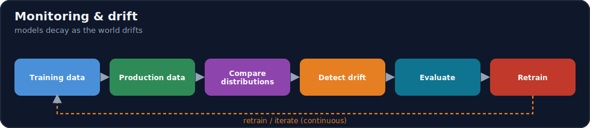
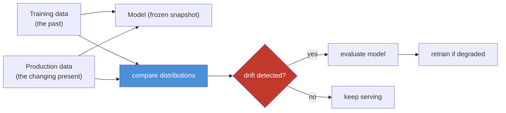
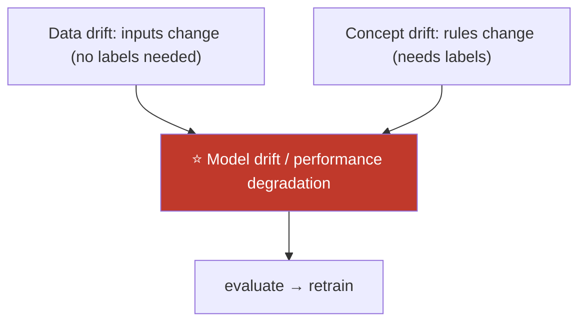
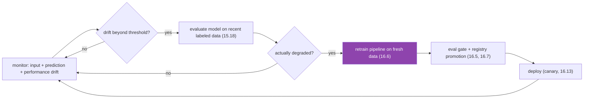

# 16.11 · Model Monitoring & Drift ⭐

[⬅ 16.10 AI Observability](16.10-observability.md) · [🏠 Module 16](../README.md) · [➡ 16.12 LLM Evaluation in Production](16.12-llm-evaluation.md)

> **The lesson in one line:** A model is trained on the past but serves the future, and the world keeps changing — so a model that was accurate at launch **decays silently** as production data **drifts** away from training data; monitoring detects this (data drift, concept drift, performance degradation) and triggers **retraining** before users notice.



---

## 🎯 Learning objectives

- Distinguish **data drift, concept drift, model drift, and performance degradation**.
- Detect drift by comparing **training vs production distributions**.
- Close the loop: **detect → evaluate → retrain**.

## ✅ Prerequisites

- [16.10 observability](16.10-observability.md), [16.3 data versioning](16.3-data-versioning.md), [15.18 base vs tuned](../../15-Fine-Tuning/weeks/15.18-base-vs-finetuned.md).

---

## 🧠 Mental model

> [!IMPORTANT]
> **A model learns a snapshot of the world at training time; the moment it's deployed, the world starts moving away from that snapshot — and the model can't tell.** Customer behavior shifts, new fraud patterns emerge, language evolves, a new product launches. The model keeps confidently predicting based on stale patterns, so its accuracy **decays silently** — the archetypal quiet failure ([16.1](16.1-what-is-mlops.md)): no error, no crash, just gradually-wrong answers. **Drift monitoring is how you make that decay visible: continuously compare what the model sees in production against what it was trained on, and when they diverge enough, retrain.** You can't stop the world from changing — you can only detect the change and adapt.



---

## The types of drift

| Type | What changes | Example |
|---|---|---|
| **Data drift** (covariate) | the **input distribution** P(X) | users' ages shift; new query types appear |
| **Concept drift** | the **relationship** P(Y\|X) — the "rules" change | what counts as fraud evolves; same input, new correct label |
| **Model drift / decay** | the model's **performance** falls over time (the observed effect) | accuracy drops month over month |
| **Performance degradation** | any metric decline vs a baseline | precision/recall/latency worsen |

- **Data drift**: the inputs look different from training — often a *leading* indicator (you can detect it without labels).
- **Concept drift**: the input→output mapping changed — the *hardest*, because the same input now needs a different answer; requires labels/feedback to catch.
- **Model drift** is the *result* you ultimately care about (performance down); data/concept drift are the *causes*.



---

## Detecting drift

| Signal | How |
|---|---|
| **Input distribution shift** | statistical distance between training and production feature distributions (PSI, KL divergence, KS test) — no labels needed |
| **Prediction distribution shift** | the model's output distribution changes (e.g., suddenly predicting more "fraud") |
| **Performance metrics** | accuracy/precision/recall/F1 vs a baseline — needs **ground-truth labels** (often delayed) |
| **Proxy/feedback** | user feedback, business KPIs, correction rate when labels are slow ([16.12](16.12-llm-evaluation.md)) |

> [!IMPORTANT]
> **The hard part of drift detection is that ground truth is usually *delayed or absent* in production — you often learn the true label days later (or never) — so you detect drift on the *inputs* (which you always have) as an early warning, and confirm with performance metrics when labels arrive.** Data drift on inputs is detectable immediately (compare distributions); concept drift and true performance need labels. So a practical monitor combines **immediate input-drift alerts** (statistical distance) with **delayed performance confirmation** (as labels/feedback come in). **A drift alert is a signal to *evaluate*, not an automatic "retrain now" — some drift is benign.**

---

## Closing the loop: detect → evaluate → retrain



Drift monitoring **triggers the retraining pipeline** ([16.6](16.6-ml-pipelines.md)) on fresh data, which flows through the **eval gate and registry** ([16.5](16.5-model-registry.md), [16.7](16.7-cicd.md)) and **canary deployment** ([16.13](16.13-deployment-strategies.md)) — closing the MLOps loop from [16.1](16.1-what-is-mlops.md). **Retraining is gated**: retrain on drift, but only *promote* if the new model actually beats the old ([15.18](../../15-Fine-Tuning/weeks/15.18-base-vs-finetuned.md)).

---

## 💻 A drift check (sketch)

```python
from scipy.stats import ks_2samp

def input_drift(train_feature, prod_feature, alpha=0.05):
    stat, p = ks_2samp(train_feature, prod_feature)   # distribution distance
    return p < alpha, stat                              # drifted if distributions differ significantly

def monitor(train_ref, prod_window):
    drifted = {f: input_drift(train_ref[f], prod_window[f]) for f in features}
    if any(d for d, _ in drifted.values()):
        alert("input drift detected", drifted)          # → evaluate, don't blindly retrain
    if labels_available(prod_window):
        perf = evaluate(model, prod_window)             # confirm with performance (15.18)
        if perf < baseline - threshold:
            trigger_retraining_pipeline()                # 16.6
```

Compare a **training reference** to a **rolling production window**; alert on input drift; **confirm with performance when labels arrive**; trigger the retraining pipeline on confirmed degradation. Tools like **Evidently / Arize / NannyML** do this out of the box.

---

## 🏭 Production examples

| Scenario | Monitor |
|---|---|
| Fraud model | input drift on transaction features + delayed label performance |
| Recommender | prediction distribution + engagement KPIs |
| LLM RAG app | retrieval-quality + answer-quality drift ([16.12](16.12-llm-evaluation.md)) |
| Demand forecast | seasonal concept drift; scheduled retrain |
| Churn model | feature drift as leading indicator |

## ⚡ Performance & 💲 cost considerations

- **Input-drift monitoring is cheap** (compare distributions, no labels) — run it continuously as the early-warning layer.
- **Retraining is expensive** — gate it: retrain on *confirmed* degradation, not every drift blip ([16.6](16.6-ml-pipelines.md)).
- **Scheduled + triggered retraining** — combine a cadence (nightly/weekly) with drift triggers; avoid both stale models and needless retrains.

## 🔒 Security considerations

> [!CAUTION]
> - **Sudden drift can signal an attack** — data poisoning or adversarial input floods show up as distribution shifts ([15.20](../../15-Fine-Tuning/weeks/15.20-security.md)); investigate anomalies, don't auto-retrain into a poisoned model.
> - **Monitoring data contains production inputs/PII** — govern it ([16.19](16.19-security.md)).
> - **Auto-retraining is an attack surface** — validate fresh training data before retraining (poisoning, [15.20](../../15-Fine-Tuning/weeks/15.20-security.md)).

## 🚫 Common mistakes

| Mistake | Consequence |
|---|---|
| No drift monitoring | Silent accuracy decay ([16.1](16.1-what-is-mlops.md)) |
| Waiting for labels only | Late detection (labels are delayed) |
| Auto-retrain on any drift | Needless cost; may chase noise/poison |
| Retrain but don't gate promotion | New model may be worse ([15.18](../../15-Fine-Tuning/weeks/15.18-base-vs-finetuned.md)) |
| Confusing data drift with concept drift | Wrong response |
| No baseline to compare against | Can't define "degraded" |

## 🐛 Debugging workflow

"Model accuracy dropped" (the classic incident): (1) **Data drift?** Compare recent input distributions to training ([16.3](16.3-data-versioning.md)) — inputs changed? (2) **Concept drift?** Same inputs, but the correct labels changed (needs labels/feedback)? (3) **Not drift?** A code/model/data-version change ([16.1](16.1-what-is-mlops.md) suspects) — check the deploy diff. (4) **Confirm** with performance on recent labeled data ([15.18](../../15-Fine-Tuning/weeks/15.18-base-vs-finetuned.md)). (5) **Retrain** on fresh data through the gated pipeline; **roll back** the model if needed ([16.5](16.5-model-registry.md)). Drift is the most common quiet cause of decay.

## 🏋️ Exercises

1. **Detect data drift.** Simulate an input shift; detect it with a KS/PSI test; alert.
2. **Concept drift.** Change the input→label rule; show input-drift tests miss it and performance metrics catch it.
3. **Loop.** Wire detect → evaluate → trigger retraining → gate → deploy.
4. **Delayed labels.** Simulate labels arriving days late; combine immediate input-drift with delayed performance confirmation.
5. **Incident.** "Accuracy dropped 10%" — diagnose drift vs deploy-change vs data-version.

## 🛠️ Mini project — "Data drift detection & retraining trigger"

**Goal:** a monitor that detects drift, confirms degradation, and triggers gated retraining.

**Requirements:** training-reference vs production-window comparison (input + prediction drift via KS/PSI); delayed performance confirmation when labels arrive; alerts; a gated retraining trigger ([16.6](16.6-ml-pipelines.md), [16.5](16.5-model-registry.md)); anomaly/poisoning check before retraining.

**Folder structure**
```
drift-monitor/
├── reference.py    # training distribution snapshot
├── detect.py       # input/prediction drift (KS/PSI)
├── confirm.py      # performance on delayed labels
└── trigger.py      # gated retraining trigger
```

**Testing:** input drift detected immediately; concept drift caught by performance; retraining triggered only on confirmed degradation; poisoned drift flagged.
**Evaluation:** detection latency; false-alarm rate.
**Security:** validate fresh data before retrain; investigate anomalous drift ([15.20](../../15-Fine-Tuning/weeks/15.20-security.md)).
**Monitoring:** drift metrics over time ([16.10](16.10-observability.md)).
**Future improvements:** automated root-cause; scheduled + triggered hybrid; LLM quality drift ([16.12](16.12-llm-evaluation.md)).

## 📄 Cheat sheet

| Concept | One line |
|---|---|
| **⭐ Why models decay** | trained on the past, serve a changing world |
| **Data drift** | P(X) changes (inputs) — detect without labels |
| **Concept drift** | P(Y\|X) changes (rules) — needs labels |
| **Model drift** | performance falls (the observed effect) |
| **Detect** | input distribution distance (KS/PSI/KL) + performance |
| **⭐ Labels are delayed** | detect on inputs early; confirm with performance later |
| **⭐ Loop** | detect → evaluate → **retrain (gated)** → deploy |
| **⚠️** | drift alert = evaluate, not auto-retrain; validate fresh data |

## 🎴 Flashcards

- **⭐ Why do models decay in production?** → They're trained on a past snapshot but serve a world that keeps changing (data drift, concept drift), so accuracy degrades silently — a quiet failure.
- **Data drift vs concept drift?** → Data drift = the input distribution P(X) changes (detectable without labels); concept drift = the input→output relationship P(Y|X) changes (needs labels to catch).
- **What is model drift?** → The observed performance decline over time — the *effect* whose *causes* are data/concept drift.
- **⭐ Why detect on inputs rather than performance?** → Ground-truth labels are usually delayed or absent in production, so input-distribution drift is the early-warning signal; performance confirms it later.
- **How do you detect input drift?** → Statistical distance between training and production feature distributions (KS test, PSI, KL divergence).
- **⭐ What does a drift alert mean?** → Evaluate the model — not "retrain now"; some drift is benign, and retraining is gated on confirmed degradation.
- **How does drift monitoring close the MLOps loop?** → Detect → evaluate → trigger the retraining pipeline → eval gate + registry → canary deploy → monitor again.

## 💬 Interview questions

1. Why do models decay in production, and what is the quiet-failure aspect?
2. Distinguish data drift, concept drift, and model drift.
3. Why do you monitor inputs rather than wait for performance labels?
4. How do you detect data drift statistically?
5. How does a drift alert connect to retraining, and why is it gated?
6. How can sudden drift indicate a security incident?

## 📝 Summary

- Models are **trained on the past but serve a changing world**, so they **decay silently** as production data **drifts** — the archetypal quiet failure that monitoring exists to catch.
- **Data drift** (inputs, P(X)) is detectable without labels and is the early warning; **concept drift** (rules, P(Y|X)) needs labels; **model drift** is the resulting performance decline — detect on inputs immediately, **confirm with performance** as delayed labels arrive.
- Close the loop: **detect → evaluate → retrain (gated) → deploy** ([16.6](16.6-ml-pipelines.md), [16.5](16.5-model-registry.md), [16.13](16.13-deployment-strategies.md)) — a **drift alert means evaluate, not auto-retrain**, and retraining promotes only on a confirmed improvement ([15.18](../../15-Fine-Tuning/weeks/15.18-base-vs-finetuned.md)).
- Sudden drift can signal **poisoning/adversarial attacks** — investigate anomalies and **validate fresh data before retraining** ([15.20](../../15-Fine-Tuning/weeks/15.20-security.md)).

## 📚 References

1. **Gama et al. (2014) — _A Survey on Concept Drift Adaptation_.** ⭐ Drift types and detection.
2. **Evidently AI / NannyML / Arize documentation.** Drift monitoring in practice.
3. **[15.18 Base vs Fine-Tuned](../../15-Fine-Tuning/weeks/15.18-base-vs-finetuned.md).** Gated retraining promotion.
4. **[16.6 ML Pipelines](16.6-ml-pipelines.md).** The retraining pipeline.

---

## 🧭 Navigation

| Direction | Link |
|---|---|
| ⬅ Previous | [16.10 · AI Observability](16.10-observability.md) |
| ➡ Next | [16.12 · LLM Evaluation in Production](16.12-llm-evaluation.md) |
| 🏠 Module | [Module 16](../README.md) |
| 📖 Lessons | [Lesson index](README.md) |
