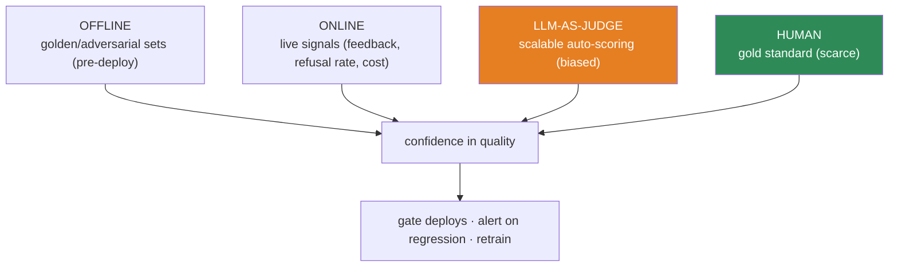
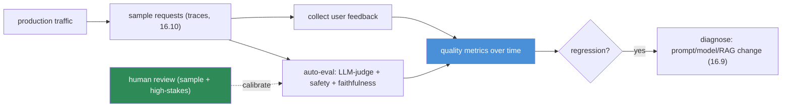

# 16.12 · LLM Evaluation in Production

[⬅ 16.11 Model Monitoring & Drift](16.11-monitoring-drift.md) · [🏠 Module 16](../README.md) · [➡ 16.13 Deployment Strategies](16.13-deployment-strategies.md)

> **The lesson in one line:** For classic ML you monitor accuracy against ground-truth labels; for LLMs "correct" is fuzzy and labels rarely exist in production — so you evaluate continuously with a layered strategy — **offline** (golden sets), **online** (live signals), **human** (the gold standard), and **LLM-as-judge** (scalable proxy) — knowing each has real limits.

---

## 🎯 Learning objectives

- Combine **offline, online, human, and LLM-as-judge** evaluation in production.
- Monitor **answer quality, relevance, faithfulness, hallucination, safety, and user feedback**.
- Understand the **limits** of automated evaluation and design an evaluation pipeline.

## ✅ Prerequisites

- [16.10 observability](16.10-observability.md), [16.11 drift](16.11-monitoring-drift.md), [13.12 RAG evaluation](../../13-RAG/weeks/13.12-evaluation.md), [15.17 model evaluation](../../15-Fine-Tuning/weeks/15.17-evaluation.md).

---

## 🧠 Mental model

> [!IMPORTANT]
> **The reason LLM production evaluation is hard is that there's no label to compare against: a user asks a question, the model answers, and *nobody tells you if it was right*.** In classic ML you eventually get the true label (was it fraud? did they churn?) and compute accuracy ([16.11](16.11-monitoring-drift.md)). For an open-ended LLM answer, "correct" is subjective, there's no ground truth, and you can't have a human check every response. So LLM evaluation is a **layered approximation**: measure what you *can* automatically (offline golden sets, online proxy signals, LLM-judges) and reserve scarce **human evaluation** for calibration and high-stakes checks. No single layer is trustworthy — you **triangulate** ([15.17](../../15-Fine-Tuning/weeks/15.17-evaluation.md)), and every automated method has a blind spot you must respect.



---

## The four evaluation modes

| Mode | When | How | Limit |
|---|---|---|---|
| **Offline** | pre-deploy (CI gate) | run on a fixed golden/adversarial set ([15.18](../../15-Fine-Tuning/weeks/15.18-base-vs-finetuned.md)) | can't cover the live distribution |
| **Online** | in production | live signals: user feedback, refusal rate, edits, engagement, cost | indirect; noisy |
| **Human** | sampled / high-stakes | people rate a slice of outputs | slow, costly, inconsistent |
| **LLM-as-judge** | scaled auto-scoring | an LLM grades outputs vs a rubric | position/verbosity/self bias ([11.17](../../11-LLMs/weeks/11.17-evaluation.md)) |

- **Offline** is your **CI gate** — a change ships only if it holds on the golden set ([16.7](16.7-cicd.md)).
- **Online** is your **production monitor** — proxy signals (👍/👎, correction/refusal rate, escalations) track real quality when there's no label.
- **Human** is the **ground truth you can't scale** — use it to calibrate the automated methods and for high-stakes/safety.
- **LLM-as-judge** is the **scalable middle** — grade many outputs cheaply, but **calibrate it against humans** before trusting it.

---

## What to monitor

| Signal | Measures | Method |
|---|---|---|
| **Answer quality** | is it good overall | LLM-judge + human sample |
| **Relevance** | addresses the question | LLM-judge / rubric |
| **Faithfulness** | grounded in the sources (RAG) | faithfulness check ([13.12](../../13-RAG/weeks/13.12-evaluation.md)) |
| **Hallucination** | invents unsupported content | faithfulness / claim-check |
| **Safety** | toxicity, bias, harmful, leakage | safety classifiers + red-team ([15.17](../../15-Fine-Tuning/weeks/15.17-evaluation.md)) |
| **User feedback** | 👍/👎, edits, escalations | direct product signal ([16.10](16.10-observability.md)) |

> [!IMPORTANT]
> **User feedback is the most honest production quality signal you have — instrument it everywhere, because it's the closest thing to a live "label."** A thumbs-down, a re-generation, an edit of the answer, an escalation to a human — each is a real user telling you the output was wrong. Aggregate these into **quality metrics over time** (like drift, [16.11](16.11-monitoring-drift.md)): a rising thumbs-down rate is your earliest, cheapest signal that quality regressed — from a prompt edit, a provider model update ([16.9](16.9-llmops.md)), or degraded retrieval. **Automated evals catch what you thought to test; user feedback catches what you didn't.**

---

## The limits of automated evaluation

> [!WARNING]
> **Every automated LLM evaluation is itself a fallible model — LLM-judges have systematic biases (favoring longer, first-listed, or their own outputs), reference metrics penalize valid variety, and offline sets miss the live distribution — so automated scores are *directional*, not ground truth.** Treat them as an early-warning and comparison tool, **calibrate LLM-judges against a human-labeled sample** ([15.17](../../15-Fine-Tuning/weeks/15.17-evaluation.md)), and keep a **human in the loop for high-stakes and safety** decisions. Automating evaluation is essential for scale; *trusting it blindly* is how a confidently-wrong judge greenlights a regression.

---

## 💻 An LLM production evaluation pipeline



Sample production requests (from traces, [16.10](16.10-observability.md)), **auto-evaluate** a fraction (LLM-judge + safety + faithfulness), **collect user feedback**, aggregate into **quality-over-time metrics**, and **alert on regression** — with **human review calibrating** the auto-eval and handling high-stakes cases.

---

## 🏭 Production examples

| Setup | Practice |
|---|---|
| Pre-deploy gate | offline golden set + safety ([16.7](16.7-cicd.md)) |
| Live quality monitor | 👍/👎 + refusal-rate + LLM-judge sample |
| RAG faithfulness | claim-vs-source check on sampled answers ([13.12](../../13-RAG/weeks/13.12-evaluation.md)) |
| Safety in prod | classifiers + red-team sampling + human escalation |
| Judge calibration | periodic human-vs-judge agreement check |

## ⚡ Performance & 💲 cost considerations

- **Auto-eval costs LLM calls** — sample (evaluate a fraction, not every request); cheaper judge for routine, stronger for releases ([16.10](16.10-observability.md)).
- **Human eval is the scarce resource** — spend it on calibration and high-stakes, not volume.
- **Feedback collection is nearly free** and high-value — prioritize it.

## 🔒 Security considerations

> [!CAUTION]
> - **Safety evaluation must gate deploys and run in production** — a quality-up-but-safety-down change is a regression ([15.17](../../15-Fine-Tuning/weeks/15.17-evaluation.md)); include injection/red-team ([12.16](../../12-Prompt-Engineering/weeks/12.16-security.md)).
> - **Eval samples contain user data/PII** — govern, redact, access-control ([16.19](16.19-security.md)).
> - **A gamed/biased LLM-judge is a risk** — it can greenlight unsafe outputs; calibrate and keep human oversight.

## 🚫 Common mistakes

| Mistake | Consequence |
|---|---|
| Only monitoring uptime/errors | Quality drifts invisibly |
| Trusting an uncalibrated LLM-judge | Biased scores greenlight regressions |
| No user-feedback collection | No live quality signal |
| Only offline eval | Misses the live distribution |
| No safety in production eval | Unsafe behavior ships/persists |
| Human-eval everything | Doesn't scale; wasted on easy cases |

## 🐛 Debugging workflow

"Quality dropped in production": (1) **Which signal moved?** Feedback (👎 up), faithfulness, safety, refusal rate. (2) **Correlate with an artifact change** ([16.9](16.9-llmops.md)) — prompt/model/RAG/agent version, or a provider update. (3) **Pull the failing traces** ([16.10](16.10-observability.md)); read them. (4) **Confirm with human review** on a sample (auto-eval may be wrong). (5) **Fix + re-gate** offline before redeploy ([16.7](16.7-cicd.md)). Full method in [16.11](16.11-monitoring-drift.md).

## 🏋️ Exercises

1. **Four modes.** Set up offline (golden set), online (feedback), LLM-judge, and a human-review sample for one LLM app.
2. **Judge calibration.** Hand-label 30 outputs; compare to an LLM-judge; report agreement and bias.
3. **Feedback loop.** Instrument 👍/👎; build a quality-over-time metric; simulate a prompt regression and detect it.
4. **Faithfulness in prod.** Sample RAG answers; run a claim-vs-source check; flag hallucinations.
5. **Limits.** Construct a case where the LLM-judge is confidently wrong; show human review catches it.

## 🛠️ Mini project — "LLM evaluation pipeline"

**Goal:** a production evaluation pipeline combining offline gates, online signals, LLM-judge, and human calibration.

**Requirements:** offline golden/adversarial set as a CI gate ([16.7](16.7-cicd.md)); production sampling from traces ([16.10](16.10-observability.md)); LLM-judge (calibrated) + safety + faithfulness; user-feedback capture; quality-over-time metrics + regression alerts; human-review sampling.

**Folder structure**
```
llm-eval-prod/
├── offline.py      # golden-set gate
├── sample.py       # production request sampling
├── judge.py        # LLM-judge (calibrated) + safety + faithfulness
├── feedback.py     # 👍/👎 capture
└── metrics.py      # quality over time + alerts
```

**Testing:** offline gate blocks regressions; online metrics detect a simulated regression; judge calibrated vs humans; safety gated.
**Evaluation:** detection latency; judge–human agreement.
**Security:** safety in the loop; governed eval data ([16.19](16.19-security.md)).
**Monitoring:** the project *is* quality monitoring; tie to drift ([16.11](16.11-monitoring-drift.md)).
**Future improvements:** automated red-teaming; per-segment quality; feedback→retrain loop.

## 📄 Cheat sheet

| Concept | One line |
|---|---|
| **⭐ Why hard** | no ground-truth label in prod; "correct" is fuzzy |
| **Offline** | golden/adversarial set → **CI gate** |
| **Online** | live signals (feedback, refusal rate, cost) |
| **Human** | gold standard, scarce → calibrate + high-stakes |
| **LLM-as-judge** | scalable auto-score; **biased → calibrate** |
| **Monitor** | quality · relevance · faithfulness · hallucination · **safety** · feedback |
| **⭐ Feedback** | 👍/👎/edits/escalations = the live quality signal |
| **⚠️ Limit** | automated evals are directional, not truth — triangulate |

## 🎴 Flashcards

- **⭐ Why is LLM production evaluation harder than classic ML?** → There's no ground-truth label in production and "correct" is fuzzy/subjective, so you can't just compute accuracy — you approximate with layered evaluation.
- **What are the four evaluation modes?** → Offline (golden sets, CI gate), online (live signals), human (gold standard, scarce), and LLM-as-judge (scalable but biased).
- **⭐ What is the most honest production quality signal?** → User feedback — 👍/👎, re-generations, edits, escalations — the closest thing to a live label; instrument it everywhere.
- **What should you monitor for LLM quality?** → Answer quality, relevance, faithfulness, hallucination, safety, and user feedback.
- **⭐ What are the limits of automated evaluation?** → LLM-judges have systematic biases, reference metrics penalize valid variety, and offline sets miss the live distribution — scores are directional, so calibrate judges against humans and keep humans for high-stakes/safety.
- **How does production eval connect to CI and drift?** → Offline eval is the CI deploy gate; online quality metrics behave like drift signals that alert on regression and trigger diagnosis/retraining.

## 💬 Interview questions

1. Why can't you monitor an LLM app like a classic ML model?
2. Compare offline, online, human, and LLM-as-judge evaluation.
3. What signals do you monitor for LLM quality, and how?
4. Why is user feedback the key production quality signal?
5. What are the limits of automated LLM evaluation, and how do you mitigate them?
6. How does production LLM evaluation connect to CI gates and drift monitoring?

## 📝 Summary

- LLM production evaluation is hard because there's **no ground-truth label** and "correct" is fuzzy — so you use a **layered strategy**: **offline** (golden-set CI gate), **online** (live signals), **human** (gold standard, scarce), and **LLM-as-judge** (scalable, biased).
- **Monitor answer quality, relevance, faithfulness, hallucination, safety, and — above all — user feedback** (👍/👎/edits/escalations), the closest thing to a live label, aggregated into **quality-over-time metrics** that alert on regression.
- **Every automated method has limits** — LLM-judges are biased, offline sets miss the live distribution — so **triangulate, calibrate judges against humans, and keep humans for high-stakes/safety**.
- Wire it into the loop: **offline gates CI** ([16.7](16.7-cicd.md)), **online metrics behave like drift** ([16.11](16.11-monitoring-drift.md)), and regressions trace back to a **versioned artifact change** ([16.9](16.9-llmops.md)).

## 📚 References

1. **[15.17 Model Evaluation](../../15-Fine-Tuning/weeks/15.17-evaluation.md) & [13.12 RAG Evaluation](../../13-RAG/weeks/13.12-evaluation.md).** ⭐ Axes and faithfulness.
2. **Zheng et al. (2023) — _LLM-as-a-judge / MT-Bench_.** Judge reliability and bias.
3. **[16.10 AI Observability](16.10-observability.md).** Sampling traces + feedback.
4. **RAGAS / TruLens / Langfuse evals.** Production LLM eval tooling.

---

## 🧭 Navigation

| Direction | Link |
|---|---|
| ⬅ Previous | [16.11 · Model Monitoring & Drift](16.11-monitoring-drift.md) |
| ➡ Next | [16.13 · Deployment Strategies](16.13-deployment-strategies.md) |
| 🏠 Module | [Module 16](../README.md) |
| 📖 Lessons | [Lesson index](README.md) |
