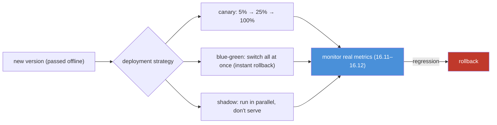
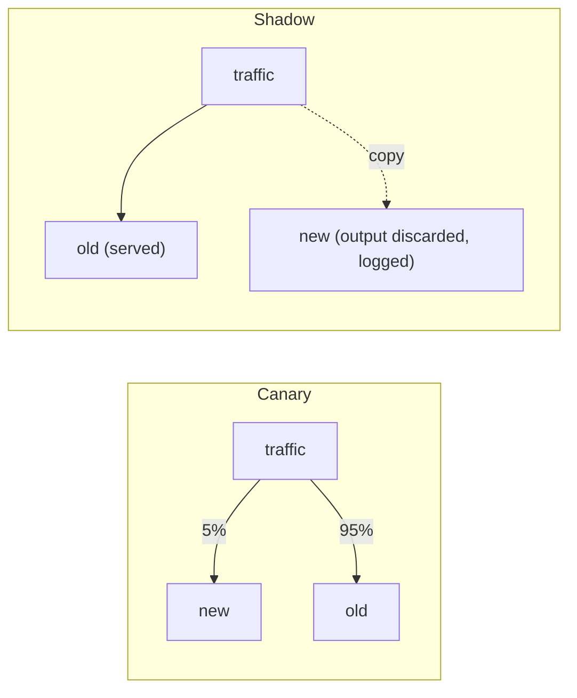

# 16.13 · Deployment Strategies

[⬅ 16.12 LLM Evaluation](16.12-llm-evaluation.md) · [🏠 Module 16](../README.md) · [➡ 16.14 Model Optimization](16.14-model-optimization.md)

> **The lesson in one line:** Shipping a new model or prompt to *all* users at once is a gamble on a quiet failure — so you roll it out gradually with a strategy (**blue-green, canary, rolling, shadow**) that limits blast radius, validates on real traffic, and lets you **roll back instantly** the moment metrics dip.

---

## 🎯 Learning objectives

- Distinguish **blue-green, canary, rolling, and shadow** deployment.
- Choose the right strategy for a model/prompt change and pair it with **rollback**.
- Validate a release on real traffic before full exposure.

## ✅ Prerequisites

- [16.5 model registry](16.5-model-registry.md), [16.8 serving](16.8-model-serving.md), [16.11 monitoring](16.11-monitoring-drift.md), [16.12 LLM eval](16.12-llm-evaluation.md).

---

## 🧠 Mental model

> [!IMPORTANT]
> **A new model passed your offline eval, but offline sets don't match live traffic ([16.12](16.12-llm-evaluation.md)) — so the safest assumption is that it *might* be worse in production, and you deploy to *contain* that risk, not to trust it.** Deploying to 100% of users at once means a regression hits everyone before your monitoring even registers it. Progressive deployment inverts that: expose the new version to a *small slice* (canary), or run it *in parallel without serving its output* (shadow), watch the metrics, and only widen exposure if it holds — **rolling back instantly** if it doesn't ([16.5](16.5-model-registry.md)). The strategy you pick trades **speed, resource cost, and risk**; the constant is **always keep the old version ready to take over.**



---

## The four strategies

| Strategy | How | Blast radius | Rollback | Cost | Best for |
|---|---|---|---|---|---|
| **Blue-green** | run old (blue) + new (green) in full; **switch all traffic** at once | all-or-nothing | **instant** (switch back) | 2× (both full) | fast cutover with instant rollback |
| **Canary** | route a **small %** to new, gradually increase | small, growing | fast (stop rollout) | ~1× + small | validating a risky change on real traffic ⭐ |
| **Rolling** | replace instances **one batch at a time** | partial during roll | medium (roll back) | ~1× | routine, low-risk updates, no extra capacity |
| **Shadow** | new version runs on **copied traffic but its output isn't served** | **zero** (users unaffected) | n/a (never served) | 2× compute | testing a model against real traffic safely ⭐ |

### Blue-green
Two full environments; flip the router from blue → green. **Rollback is instant** (flip back), but you pay for two full environments and the switch is all-at-once (no gradual validation).

### Canary
Send **5% → 25% → 100%** to the new version, watching metrics at each step ([16.11](16.11-monitoring-drift.md)–[16.12](16.12-llm-evaluation.md)). The **workhorse for model/prompt changes** — a regression only ever touches a small, growing slice, and you halt/roll back at the first bad signal.

### Rolling
Replace instances in batches (25% at a time). No extra capacity needed, but during the roll you're running mixed versions and rollback means rolling back. Good for routine low-risk updates.

### Shadow (mirror)
The new model receives **a copy of real traffic** but its output is **discarded** (users get the old model's answer). You compare the new model's would-be outputs to the old on **live traffic with zero user risk** — the safest pre-production test, at the cost of running both.



> [!IMPORTANT]
> **Default to canary for model/prompt changes and shadow for anything you're nervous about — both let real traffic vet the change while limiting or eliminating user risk, and both pair with instant rollback via the registry ([16.5](16.5-model-registry.md)).** Blue-green is for when you want a fast full cutover with an instant undo; rolling is for routine updates without spare capacity. **The non-negotiable across all four: the previous version stays ready, and a metric dip triggers rollback** — automated where possible ([16.7](16.7-cicd.md)). Deployment strategy is how you make the "it might be worse in production" risk survivable.

---

## Rollback strategies

| Trigger | Response |
|---|---|
| Canary metrics dip | halt rollout; route back to old (registry, [16.5](16.5-model-registry.md)) |
| Error/latency spike | auto-rollback on health/SLO breach ([16.17](16.17-reliability.md)) |
| Quality/safety regression | rollback + block the version ([16.12](16.12-llm-evaluation.md)) |
| Blue-green issue | flip router back to blue (instant) |

**Rollback is a registry state change** (re-point Production to the previous version, [16.5](16.5-model-registry.md)) — fast, no retraining. **Automate it on SLO/quality breach** so a bad canary self-heals.

---

## 🏭 Production examples

| Change | Strategy |
|---|---|
| New model version | canary (5→25→100) + auto-rollback |
| Risky prompt/RAG change | shadow first, then canary |
| Routine dependency bump | rolling |
| Fast full cutover needed | blue-green |
| High-stakes model (fraud) | shadow → canary → gradual |

## ⚡ Performance & 💲 cost considerations

- **Blue-green and shadow cost ~2×** (two full/parallel environments) — use them where the risk justifies it.
- **Canary and rolling are ~1×** — the efficient default for most changes.
- **Autoscaling** interacts with rollout — ensure capacity for both versions during transition ([16.16](16.16-kubernetes.md)).

## 🔒 Security considerations

> [!CAUTION]
> - **Shadow traffic duplicates requests** — the shadow environment sees real (possibly sensitive) data; secure and scope it like production ([16.19](16.19-security.md)).
> - **A canary is also a safety net for security regressions** — a change that weakens injection defenses shows up on the canary before full exposure ([12.16](../../12-Prompt-Engineering/weeks/12.16-security.md)).
> - **Rollback must include config/prompt/model together** — a partial rollback can leave an inconsistent, insecure state.

## 🚫 Common mistakes

| Mistake | Consequence |
|---|---|
| Deploying to 100% at once | A regression hits everyone before you notice |
| No rollback plan | Stuck with a bad version |
| Canary without metric gates | Rolling out blind |
| Shadow but never comparing outputs | Wasted parallel compute, no signal |
| Manual rollback only | Slow recovery on an SLO breach |
| Rolling out during peak with no capacity | Degradation during the roll |

## 🐛 Debugging workflow

Rollout going wrong: (1) **Which metric dipped** on the canary/shadow (error, latency, quality, safety, [16.11](16.11-monitoring-drift.md)–[16.12](16.12-llm-evaluation.md))? (2) **Halt the rollout** immediately; **route back** to the previous version ([16.5](16.5-model-registry.md)). (3) **Compare** new-vs-old on the affected traffic (shadow logs / canary slice) to confirm the regression. (4) **Fix + re-gate offline** ([16.7](16.7-cicd.md)) before retrying. (5) **Post-mortem**: add the missed case to the offline gate. Progressive deployment turns a would-be outage into a contained, reversible blip.

## 🏋️ Exercises

1. **Canary.** Implement a 5→25→100 canary with metric gates; halt on a simulated regression.
2. **Blue-green.** Set up two environments; switch traffic; roll back instantly.
3. **Shadow.** Mirror traffic to a new model; compare its outputs to production without serving them.
4. **Auto-rollback.** Wire an SLO/quality breach to automatic rollback via the registry.
5. **Choose.** For 5 change types (model, prompt, dependency, routine, high-stakes), pick a strategy and justify.

## 🛠️ Mini project — "Progressive deployment controller"

**Goal:** a controller that rolls out via canary/shadow/blue-green with metric gates and auto-rollback.

**Requirements:** strategy selection (canary/blue-green/rolling/shadow); traffic splitting; metric gates ([16.11](16.11-monitoring-drift.md)–[16.12](16.12-llm-evaluation.md)); auto-rollback on SLO/quality breach via registry ([16.5](16.5-model-registry.md)); shadow output comparison logging.

**Folder structure**
```
deploy-controller/
├── strategy.py     # canary / blue-green / rolling / shadow
├── traffic.py      # split + gradually shift
├── gates.py        # metric thresholds → advance/halt
└── rollback.py     # auto-revert via registry
```

**Testing:** canary halts on regression; blue-green rollback is instant; shadow never serves new output; auto-rollback fires on breach.
**Evaluation:** MTTR; % rollouts safely gated.
**Security:** scoped shadow environment; consistent full rollback ([16.19](16.19-security.md)).
**Monitoring:** rollout progress + metric gates ([16.10](16.10-observability.md)).
**Future improvements:** automatic promotion on healthy canary; multi-region rollout.

## 📄 Cheat sheet

| Strategy | Blast radius / rollback / cost |
|---|---|
| **Blue-green** | all-or-nothing / **instant** / 2× |
| **⭐ Canary** | small→growing / fast / ~1× — default for model/prompt |
| **Rolling** | partial / medium / ~1× — routine updates |
| **⭐ Shadow** | **zero** (not served) / n/a / 2× — safest test |
| **⭐ Constant** | keep the old version ready; **rollback on metric dip** |
| **Rollback** | registry re-point (fast, no retrain); **automate on SLO breach** |

## 🎴 Flashcards

- **⭐ Why deploy progressively instead of to all users at once?** → Offline eval doesn't match live traffic, so a new version might be worse; progressive rollout contains the blast radius and lets you roll back before a regression hits everyone.
- **Blue-green vs canary?** → Blue-green runs two full environments and switches all traffic at once (instant rollback, 2× cost); canary routes a small, growing percentage to the new version, validating on real traffic (~1× cost).
- **What is shadow deployment?** → The new version runs on a *copy* of real traffic but its output isn't served — zero user risk, letting you compare it to production on live data (at 2× compute).
- **When do you use rolling deployment?** → Routine, low-risk updates with no spare capacity — replace instances batch by batch.
- **⭐ What's the non-negotiable across all strategies?** → Keep the previous version ready and roll back instantly (via the registry) on any metric dip — automated on SLO/quality breach.
- **How does rollback actually work?** → Re-point the registry's Production stage/alias to the previous version — fast, no retraining.

## 💬 Interview questions

1. Compare blue-green, canary, rolling, and shadow deployment.
2. Why deploy progressively rather than all at once?
3. When would you choose shadow over canary?
4. How does rollback work with a model registry, and how do you automate it?
5. What metric gates do you put on a canary rollout?
6. What are the cost and risk trade-offs of each strategy?

## 📝 Summary

- A new model/prompt **passed offline but might be worse live**, so you deploy to **contain** risk, not trust it — via **blue-green** (instant switch/rollback, 2×), **canary** (small→growing %, the default), **rolling** (batch replace, routine), or **shadow** (parallel, unserved, zero-risk test, 2×).
- **Default to canary for model/prompt changes and shadow for anything risky** — both vet the change on real traffic while limiting/eliminating user impact.
- The **non-negotiable**: keep the previous version ready and **roll back instantly on a metric dip** (a registry re-point, [16.5](16.5-model-registry.md)) — **automate it on SLO/quality/safety breach** ([16.17](16.17-reliability.md)).
- Progressive deployment turns a would-be outage into a **contained, reversible blip** and is a **security net** (a canary catches weakened defenses before full exposure).

## 📚 References

1. **Google/AWS deployment strategy guides.** ⭐ Blue-green, canary, rolling.
2. **[16.5 Model Registry](16.5-model-registry.md).** Rollback via stage re-pointing.
3. **[16.11 Monitoring](16.11-monitoring-drift.md) & [16.12 LLM Eval](16.12-llm-evaluation.md).** The metric gates.
4. **Progressive delivery (Argo Rollouts / Flagger).** Automated canary tooling.

---

## 🧭 Navigation

| Direction | Link |
|---|---|
| ⬅ Previous | [16.12 · LLM Evaluation in Production](16.12-llm-evaluation.md) |
| ➡ Next | [16.14 · Model Optimization](16.14-model-optimization.md) |
| 🏠 Module | [Module 16](../README.md) |
| 📖 Lessons | [Lesson index](README.md) |
