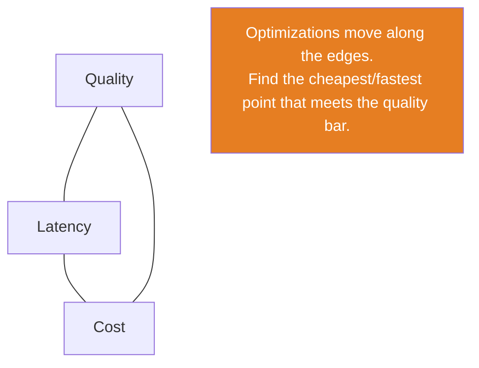
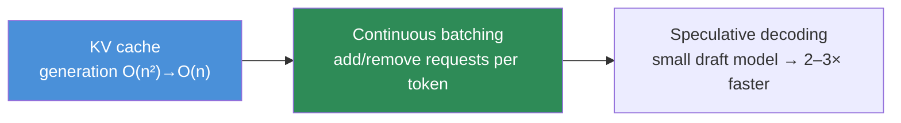

# 16.14 · Model Optimization

[⬅ 16.13 Deployment Strategies](16.13-deployment-strategies.md) · [🏠 Module 16](../README.md) · [➡ 16.15 GPU Infrastructure](16.15-gpu-infrastructure.md)

> **The lesson in one line:** A model that's accurate but too slow or too expensive can't ship — so serving optimization trades a little quality for a lot of latency/cost via **quantization, distillation, pruning, caching, and batching**, and for LLMs specifically the **KV cache, continuous batching, and speculative decoding** — always navigating the **quality ↔ latency ↔ cost** triangle.

---

## 🎯 Learning objectives

- Apply **quantization, distillation, pruning, caching, batching** to serving.
- Apply the LLM-specific levers: **KV cache, continuous batching, speculative decoding**.
- Reason about the **quality ↔ latency ↔ cost** trade-off.

## ✅ Prerequisites

- [16.8 serving](16.8-model-serving.md), [11.16 inference optimization](../../11-LLMs/weeks/11.16-inference-optimization.md), [11.15 KV cache](../../11-LLMs/weeks/11.15-kv-cache.md).

---

## 🧠 Mental model

> [!IMPORTANT]
> **Every serving optimization buys latency or cost by spending a little quality (or a little engineering) — so the job is to find the cheapest/fastest point that still meets your quality bar, not to maximize quality regardless of cost.** A model that's 1% more accurate but 3× slower and 3× more expensive is often a *worse* production choice. The levers fall into two groups: **make the model smaller/cheaper** (quantization, distillation, pruning — a small quality cost for big memory/speed gains) and **serve it more efficiently** (caching, batching, and for LLMs the KV cache + continuous batching — near-free wins). **The frame is a triangle: quality ↔ latency ↔ cost — pick the two that matter for the workload and optimize the third.**



---

## Make the model smaller/cheaper

| Technique | What | Trade-off | Reference |
|---|---|---|---|
| **Quantization** | store/compute in fewer bits (int8/int4) | ~4× smaller/faster for ~1% quality | [11.16](../../11-LLMs/weeks/11.16-inference-optimization.md) |
| **Distillation** | train a small "student" to mimic a big "teacher" | small model, some quality gap | [11.16](../../11-LLMs/weeks/11.16-inference-optimization.md) |
| **Pruning** | remove unimportant weights/structures | smaller, needs care to keep quality | [11.16](../../11-LLMs/weeks/11.16-inference-optimization.md) |

**Quantization is usually the first and highest-leverage** serving optimization — ~4× memory/speed for ~1% quality loss ([15.9](../../15-Fine-Tuning/weeks/15.9-qlora.md) uses it for training too). Distillation gives a genuinely smaller model (cheaper to serve at scale); pruning is more specialized.

## Serve it more efficiently

| Technique | What | Gain |
|---|---|---|
| **Caching** | reuse results for repeated/similar inputs | huge on repetitive traffic (exact + **semantic**, [13.16](../../13-RAG/weeks/13.16-performance.md)) |
| **Batching** | process many requests in one pass | throughput ↑ (latency cost, [16.8](16.8-model-serving.md)) |

**Caching is the biggest near-free win** for repetitive workloads — a semantic cache serving similar past queries skips the model entirely ([13.16](../../13-RAG/weeks/13.16-performance.md)).

---

## LLM-specific levers



| Lever | What | Why |
|---|---|---|
| **KV cache** | cache past tokens' keys/values so each new token is O(n), not O(n²) | mandatory; makes generation viable ([11.15](../../11-LLMs/weeks/11.15-kv-cache.md)) |
| **Continuous batching** | add/remove requests from the batch *per token* (not per request) | the biggest LLM throughput win — GPU never idles ([11.16](../../11-LLMs/weeks/11.16-inference-optimization.md)) |
| **Speculative decoding** | a small draft model guesses tokens; the big model verifies in parallel | 2–3× faster, **identical output** ([11.16](../../11-LLMs/weeks/11.16-inference-optimization.md)) |

> [!IMPORTANT]
> **For LLM serving, continuous batching + the KV cache (via vLLM/TGI) are the levers that dominate — they raise throughput several-fold with no quality loss, so you serve far more requests per GPU.** Because LLM decode is memory-bound ([11.15](../../11-LLMs/weeks/11.15-kv-cache.md)), the win comes from keeping the GPU busy: **continuous batching** packs many requests' decode steps together (amortizing the weight reads), and the **KV cache** avoids recomputing the past. Add **quantization** (fit a bigger model / more requests) and **semantic caching** (skip the model on repeats), and you've covered the highest-leverage LLM cost/latency optimizations — mostly *free* in quality terms.

---

## 🏭 Production examples

| Goal | Levers |
|---|---|
| Cut LLM cost/latency | continuous batching + KV cache (vLLM) + quantization + semantic cache |
| Serve a big model on smaller GPU | quantization (int8/int4) |
| Cheap high-volume classifier | distill to a small model |
| Repetitive query traffic | semantic/exact caching ([13.16](../../13-RAG/weeks/13.16-performance.md)) |
| Faster generation, same output | speculative decoding |

## ⚡ Performance & 💲 cost considerations

- **Order the levers by leverage**: for LLMs — continuous batching + KV cache → quantization → caching → speculative decoding; for classic ML — quantization → batching → caching → distillation.
- **Quality gate every optimization** — re-evaluate after quantizing/distilling/pruning ([16.12](16.12-llm-evaluation.md)); a faster-but-worse model may be a regression ([15.18](../../15-Fine-Tuning/weeks/15.18-base-vs-finetuned.md)).
- **Caching hit rate** is a first-class metric — it directly cuts cost/latency ([16.10](16.10-observability.md)).

## 🔒 Security considerations

> [!CAUTION]
> - **Caches must be scoped by user/tenant/ACL** — a shared semantic cache can leak one user's answer to another ([13.16](../../13-RAG/weeks/13.16-performance.md), [16.19](16.19-security.md)); invalidate on data updates.
> - **Quantization can shift behavior/safety slightly** — re-run safety evals on the optimized model, not just the full one ([15.9](../../15-Fine-Tuning/weeks/15.9-qlora.md)).
> - **Distilled/pruned models are new artifacts** — version and re-evaluate them ([16.5](16.5-model-registry.md)).

## 🚫 Common mistakes

| Mistake | Consequence |
|---|---|
| Optimizing quality regardless of cost | Unshippable (too slow/expensive) |
| No quality gate after optimizing | Faster-but-worse regression ships |
| Skipping continuous batching for LLMs | Massive throughput left on the table |
| Cache not scoped by tenant | Cross-user data leak |
| Serving without a KV cache | O(n²) generation, unusable |
| Distilling without re-evaluating | Quality gap unmeasured |

## 🐛 Debugging workflow

"Serving is too slow/expensive": (1) **LLM?** Are you using continuous batching + KV cache (vLLM/TGI)? If not, that's the biggest win ([11.16](../../11-LLMs/weeks/11.16-inference-optimization.md)). (2) **Cache hit rate low?** Add/tune semantic caching ([13.16](../../13-RAG/weeks/13.16-performance.md)). (3) **Model too big?** Quantize; consider distillation. (4) **Throughput low, GPU idle?** Batch ([16.8](16.8-model-serving.md)). (5) **After any optimization, re-check quality** ([16.12](16.12-llm-evaluation.md)) — confirm you didn't trade too much. Full method in [16.15](16.15-gpu-infrastructure.md).

## 🏋️ Exercises

1. **Quantize.** Quantize a model to int8; measure memory/latency gain and quality delta.
2. **KV + continuous batching.** Serve an LLM with vs without continuous batching; measure throughput.
3. **Semantic cache.** Add a semantic cache to a repetitive workload; measure hit rate + cost/latency drop.
4. **Distill.** Distill a big model into a small one; compare quality/cost.
5. **Triangle.** For one workload, plot quality vs latency vs cost across optimizations; pick the point that meets the bar.

## 🛠️ Mini project — "Serving optimization suite"

**Goal:** apply and measure the optimization levers on a served model, gated on quality.

**Requirements:** quantization (int8/int4); caching (exact + semantic, tenant-scoped); batching; for LLMs continuous batching + KV cache (vLLM/TGI); a quality gate after each optimization ([16.12](16.12-llm-evaluation.md)); a quality/latency/cost report.

**Folder structure**
```
serving-optim/
├── quantize.py     # int8/int4 + quality gate
├── cache.py        # semantic cache (tenant-scoped)
├── batch.py        # (continuous) batching
└── report.py       # quality/latency/cost frontier
```

**Testing:** each optimization improves latency/cost without breaching the quality bar; cache is tenant-scoped; LLM throughput rises with continuous batching.
**Evaluation:** the quality-latency-cost frontier; cache hit rate.
**Security:** scoped caches; re-eval safety on optimized model ([16.19](16.19-security.md)).
**Monitoring:** latency/cost/cache-hit metrics ([16.10](16.10-observability.md)).
**Future improvements:** speculative decoding; adaptive batching; auto-quantization search.

## 📄 Cheat sheet

| Lever | Effect |
|---|---|
| **Quantization** | ~4× smaller/faster, ~1% quality — first lever |
| **Distillation** | small student model; some quality gap |
| **Pruning** | remove weights; specialized |
| **Caching** | reuse repeats (exact + **semantic**) — near-free |
| **Batching** | throughput ↑ (latency cost) |
| **⭐ KV cache** | generation O(n²)→O(n); mandatory |
| **⭐ Continuous batching** | biggest LLM throughput win (vLLM/TGI) |
| **Speculative decoding** | 2–3× faster, identical output |
| **⭐ Frame** | quality ↔ latency ↔ cost; gate every optimization |

## 🎴 Flashcards

- **⭐ What is the model-optimization trade-off?** → Quality ↔ latency ↔ cost — each optimization spends a little quality (or engineering) to buy latency/cost; find the cheapest/fastest point that still meets the quality bar.
- **What's usually the first serving optimization?** → Quantization — ~4× smaller/faster for ~1% quality loss.
- **What's the difference between distillation and pruning?** → Distillation trains a small student to mimic a big teacher (a new smaller model); pruning removes unimportant weights from the existing model.
- **⭐ What dominates LLM serving optimization?** → Continuous batching + the KV cache (vLLM/TGI) — several-fold throughput with no quality loss, because LLM decode is memory-bound.
- **What is speculative decoding?** → A small draft model guesses tokens that the big model verifies in parallel — 2–3× faster with identical output.
- **Why must caches be tenant-scoped?** → A shared semantic cache can serve one user's answer to another — a leak; scope by user/ACL and invalidate on updates.
- **What must you do after any optimization?** → Re-evaluate quality (and safety) — a faster-but-worse model is a regression, not an improvement.

## 💬 Interview questions

1. Explain the quality-latency-cost trade-off in model serving.
2. Compare quantization, distillation, and pruning.
3. Why are continuous batching and the KV cache the dominant LLM serving levers?
4. What is speculative decoding, and what does it preserve?
5. Why must caches be tenant-scoped, and how do they cut cost?
6. Why gate every optimization on a quality (and safety) check?

## 📝 Summary

- Serving optimization trades a little **quality** for large **latency/cost** gains — the goal is the cheapest/fastest point that **meets the quality bar**, navigating the **quality ↔ latency ↔ cost** triangle.
- **Smaller/cheaper model**: **quantization** (first lever, ~4× for ~1%), **distillation** (small student), **pruning**. **Serve efficiently**: **caching** (near-free on repeats, incl. semantic) and **batching**.
- For **LLMs**, the dominant levers are **continuous batching + KV cache** (vLLM/TGI — several-fold throughput, no quality loss), plus **quantization**, **semantic caching**, and **speculative decoding** (2–3× faster, identical output).
- **Gate every optimization on quality and safety** ([16.12](16.12-llm-evaluation.md)), **scope caches by tenant**, and treat optimized models as **new versioned artifacts** ([16.5](16.5-model-registry.md)).

## 📚 References

1. **[11.16 Inference Optimization](../../11-LLMs/weeks/11.16-inference-optimization.md) & [11.15 KV Cache](../../11-LLMs/weeks/11.15-kv-cache.md).** ⭐ LLM levers.
2. **[13.16 RAG Performance](../../13-RAG/weeks/13.16-performance.md).** Semantic caching.
3. **vLLM / TGI documentation.** Continuous batching, PagedAttention.
4. **Hinton et al. (2015) — _Distilling the Knowledge in a Neural Network_.** Distillation.

---

## 🧭 Navigation

| Direction | Link |
|---|---|
| ⬅ Previous | [16.13 · Deployment Strategies](16.13-deployment-strategies.md) |
| ➡ Next | [16.15 · GPU Infrastructure](16.15-gpu-infrastructure.md) |
| 🏠 Module | [Module 16](../README.md) |
| 📖 Lessons | [Lesson index](README.md) |
