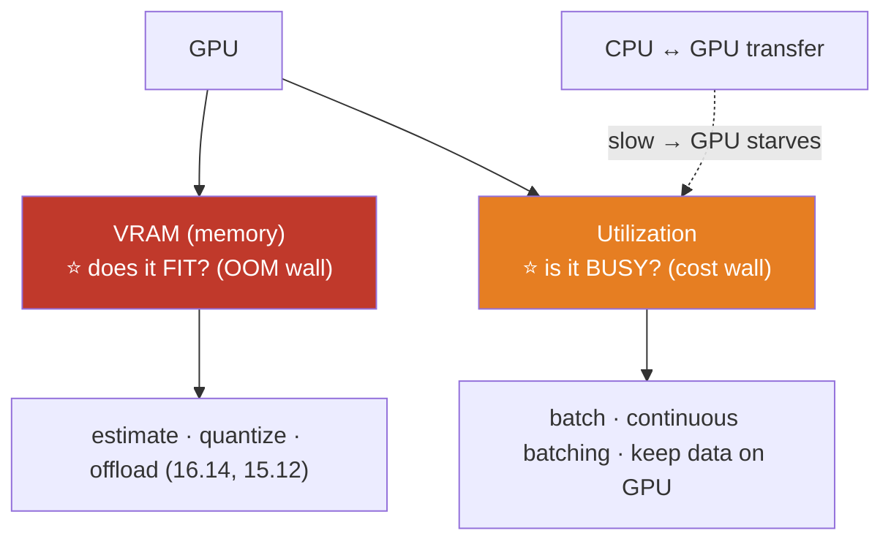

# 16.15 · GPU Infrastructure

[⬅ 16.14 Model Optimization](16.14-model-optimization.md) · [🏠 Module 16](../README.md) · [➡ 16.16 Kubernetes for AI](16.16-kubernetes.md)

> **The lesson in one line:** GPUs are the expensive, scarce heart of AI infrastructure, and the constraint is almost always **VRAM** (GPU memory) — so operating AI at scale means estimating memory requirements, keeping GPUs *utilized* (not idle), and knowing when to move from a single GPU to multi-GPU or distributed setups.

---

## 🎯 Learning objectives

- Understand **GPU memory (VRAM), utilization, and CPU-GPU communication**.
- Estimate **GPU memory requirements** for training and inference.
- Choose **single-GPU vs multi-GPU vs distributed**; troubleshoot GPU issues.

## ✅ Prerequisites

- [15.7 full-FT memory](../../15-Fine-Tuning/weeks/15.7-full-fine-tuning.md), [15.12 training optimization](../../15-Fine-Tuning/weeks/15.12-training-optimization.md), [09.14 performance](../../09-Deep-Learning/weeks/09.14-performance.md).

---

## 🧠 Mental model

> [!IMPORTANT]
> **A GPU has two things you're always fighting over: *memory* (VRAM — does the model + data even fit?) and *utilization* (is the GPU actually doing work, or idling while it waits?). Almost every AI infra problem is one of these two.** VRAM is the hard wall — "CUDA out of memory" stops you cold ([15.7](../../15-Fine-Tuning/weeks/15.7-full-fine-tuning.md)). Utilization is the money wall — a GPU you're paying for that sits at 10% is burning cash. So GPU ops is: **estimate memory before you run** (will it fit?), **maximize utilization** (batching, continuous batching, [16.14](16.14-model-optimization.md)), and **minimize the CPU↔GPU data transfer** that starves the GPU. Get those right and you use fewer, cheaper GPUs; get them wrong and you OOM or pay for idle silicon.



---

## The core concepts

| Concept | What | Why it matters |
|---|---|---|
| **GPU memory (VRAM)** | on-GPU memory (e.g., 24/40/80 GB) | the hard capacity limit — model + activations + KV cache must fit |
| **GPU utilization** | % of time the GPU is computing | low utilization = paying for idle hardware |
| **CPU-GPU communication** | data transfer over PCIe/NVLink | slow transfers **starve** the GPU (data loading bottleneck) |
| **Memory bandwidth** | speed of GPU memory access | LLM decode is bandwidth-bound ([11.15](../../11-LLMs/weeks/11.15-kv-cache.md)) |

---

## Estimating GPU memory

| Workload | Memory ≈ |
|---|---|
| **Inference (classic)** | model weights + activations (small) |
| **LLM inference** | weights + **KV cache** (grows with batch × context, [11.15](../../11-LLMs/weeks/11.15-kv-cache.md)) |
| **Full fine-tuning** | **~16 bytes/param** (weights + grad + optimizer) + activations ([15.7](../../15-Fine-Tuning/weeks/15.7-full-fine-tuning.md)) |
| **LoRA/QLoRA** | (4-bit) base + tiny adapters ([15.8](../../15-Fine-Tuning/weeks/15.8-lora.md)–[15.9](../../15-Fine-Tuning/weeks/15.9-qlora.md)) |

**Rules of thumb:** inference weights ≈ params × bytes/param (fp16 = 2, int8 = 1, int4 = 0.5); full-FT ≈ 16 × params; **LLM serving must budget the KV cache** (often the real limit at high concurrency/long context). Always leave headroom (~10–20%) for fragmentation.

> [!IMPORTANT]
> **Estimate memory *before* you launch, because "will it fit?" is answerable on paper and OOM at hour 3 of training is not.** Sum weights + gradients + optimizer (training) or weights + KV cache (LLM serving), add activation and headroom, and compare to VRAM. If it doesn't fit, you have a known ladder ([15.12](../../15-Fine-Tuning/weeks/15.12-training-optimization.md), [16.14](16.14-model-optimization.md)): **quantize → LoRA/QLoRA → gradient checkpointing → smaller batch/context → offload → multi-GPU**. The estimate tells you which rung you need *first*, saving wasted runs.

---

## Single-GPU vs multi-GPU vs distributed


| Setup | When | How |
|---|---|---|
| **Single-GPU** | model + workload fit one card | simplest; prefer it (QLoRA fits large models, [15.9](../../15-Fine-Tuning/weeks/15.9-qlora.md)) |
| **Multi-GPU (single node)** | too big for one card, or need more throughput | data parallel (replicate, split batch) or model/tensor parallel (split the model) |
| **Distributed (multi-node)** | too big for one machine | ZeRO/FSDP sharding, pipeline parallel across nodes ([15.12](../../15-Fine-Tuning/weeks/15.12-training-optimization.md)) |

**Prefer the simplest setup that fits** — multi-node distributed adds communication overhead, cost, and failure modes; reach for it only when a single GPU (with QLoRA/optimizations) genuinely can't hold the workload ([15.3](../../15-Fine-Tuning/weeks/15.3-strategy-selection.md)).

---

## 🏭 Production examples

| Workload | GPU setup |
|---|---|
| 7B QLoRA fine-tune | single 24 GB GPU |
| LLM serving at scale | multi-GPU with continuous batching (vLLM) |
| 70B full fine-tune | multi-node ZeRO/FSDP |
| Classic model inference | CPU or a small/shared GPU |
| Batch embedding | GPU with high batch utilization |

## ⚡ Performance & 💲 cost considerations

- **Idle GPUs are the biggest waste** — batch, autoscale, and share GPUs across workloads; scale to zero when idle ([16.16](16.16-kubernetes.md)).
- **Right-size the GPU to the model** — don't put a small model on an 80 GB card; use quantization/CPU for small workloads ([16.14](16.14-model-optimization.md)).
- **Spot/preemptible GPUs** cut cost for interruptible batch/training work ([16.22](16.22-cloud.md)).
- **Data-loading bottlenecks** (slow CPU→GPU transfer) leave the GPU idle — profile and fix.

## 🔒 Security considerations

> [!CAUTION]
> - **Shared/multi-tenant GPUs need isolation** — one tenant's workload shouldn't access another's memory ([16.19](16.19-security.md)); use MIG/separate pods.
> - **GPU nodes hold models and data in memory** — secure the nodes; models are sensitive artifacts ([15.20](../../15-Fine-Tuning/weeks/15.20-security.md)).
> - **Cloud GPU quotas/keys** are high-value — protect credentials and set spend limits ([16.18](16.18-cost-optimization.md)).

## 🚫 Common mistakes

| Mistake | Consequence |
|---|---|
| Not estimating memory before running | OOM mid-job; wasted time |
| Low GPU utilization | Paying for idle hardware |
| Multi-node when single-GPU (QLoRA) fits | Needless complexity/cost |
| Oversized GPU for a small model | Wasted VRAM/money |
| Ignoring KV-cache memory for LLM serving | OOM at high concurrency |
| Data-loading bottleneck unaddressed | GPU starved, low utilization |

## 🐛 Debugging workflow

GPU issue: (1) **OOM?** Estimate the actual need (weights + grad + optimizer, or weights + KV cache); descend the ladder — quantize / LoRA-QLoRA / checkpointing / smaller batch-context / offload / multi-GPU ([15.12](../../15-Fine-Tuning/weeks/15.12-training-optimization.md)). (2) **Low utilization?** Check `nvidia-smi` — GPU idle → batching / data-loading bottleneck ([16.14](16.14-model-optimization.md)). (3) **Slow?** Memory-bandwidth-bound (LLM decode) → continuous batching; or CPU↔GPU transfer → keep data on GPU. (4) **Multi-GPU not scaling?** Communication overhead → check interconnect (NVLink vs PCIe). Full method in [16.10](16.10-observability.md).

## 🏋️ Exercises

1. **Estimate.** For 1B/7B/13B, estimate inference and full-FT memory; which GPUs fit?
2. **KV cache.** Compute KV-cache memory for an LLM at batch 16, context 4K; add to weights.
3. **Utilization.** Measure `nvidia-smi` utilization of a training run; find and fix an idle-GPU cause.
4. **Fit ladder.** Take an OOMing job; apply the ladder until it fits on one GPU.
5. **Single vs multi.** Decide single/multi/distributed for three workloads and justify.

## 🛠️ Mini project — "GPU capacity planner + troubleshooter"

**Goal:** a tool that estimates GPU memory, recommends a setup, and diagnoses common GPU issues.

**Requirements:** memory estimator (inference/LLM-serving/full-FT/LoRA-QLoRA incl. KV cache); GPU-fit + setup recommendation (single/multi/distributed); a utilization/OOM troubleshooter mapping symptoms to the fit ladder; cost hint (idle vs right-sized).

**Folder structure**
```
gpu-planner/
├── estimate.py     # memory per workload (+ KV cache)
├── recommend.py    # single/multi/distributed + GPU size
├── troubleshoot.py # OOM/utilization → ladder
└── cost.py         # right-sizing hint
```

**Testing:** estimates match rules of thumb; recommends the simplest setup that fits; troubleshooter maps symptoms correctly.
**Evaluation:** estimate accuracy vs real runs.
**Security:** multi-tenant isolation notes; credential/spend guardrails ([16.19](16.19-security.md)).
**Monitoring:** VRAM/utilization metrics ([16.10](16.10-observability.md)).
**Future improvements:** auto-descend the fit ladder; MIG partitioning advisor.

## 📄 Cheat sheet

| Concept | One line |
|---|---|
| **⭐ VRAM** | the hard wall — model + data must fit (OOM) |
| **⭐ Utilization** | keep the GPU busy — idle = wasted money |
| **CPU↔GPU transfer** | slow = GPU starves (data-loading bottleneck) |
| **Estimate** | inference: params×bytes; full-FT: ~16×params; LLM: + KV cache |
| **Fit ladder** | quantize → LoRA/QLoRA → checkpoint → smaller batch/ctx → offload → multi-GPU |
| **Single-GPU** | prefer it (QLoRA fits large models) |
| **Multi/distributed** | only when one card/node can't hold it |
| **⚠️** | budget KV cache for LLM serving; right-size the GPU |

## 🎴 Flashcards

- **⭐ What are the two things you're always fighting over on a GPU?** → VRAM (does it fit? — the OOM wall) and utilization (is it busy? — the cost wall).
- **How do you estimate memory for full fine-tuning vs LLM inference?** → Full FT ≈ 16 bytes/param (weights + grad + optimizer) + activations; LLM inference ≈ weights + the KV cache (which grows with batch × context).
- **⭐ Why estimate memory before launching?** → "Will it fit?" is answerable on paper; OOM at hour 3 wastes a run — the estimate tells you which fit-ladder rung you need first.
- **What is the fit ladder for OOM?** → Quantize → LoRA/QLoRA → gradient checkpointing → smaller batch/context → offload → multi-GPU.
- **When do you move from single-GPU to multi-GPU/distributed?** → Only when the model + workload genuinely can't fit one card/node — prefer the simplest setup (QLoRA fits large models on one GPU).
- **Why is low GPU utilization a problem?** → You pay for the GPU whether or not it's working; idle GPUs waste money — fix with batching and by removing data-loading bottlenecks.
- **What starves a GPU?** → Slow CPU↔GPU data transfer (data-loading bottleneck) — the GPU waits for data instead of computing.

## 💬 Interview questions

1. What are the two primary GPU constraints, and how do you address each?
2. How do you estimate GPU memory for training vs LLM inference?
3. What's the ladder of options when a job OOMs?
4. When do you use single-GPU vs multi-GPU vs distributed?
5. What causes low GPU utilization, and how do you fix it?
6. Why must you budget the KV cache for LLM serving?

## 📝 Summary

- GPU operations come down to **VRAM** (the OOM wall — does it fit?) and **utilization** (the cost wall — is it busy?), plus avoiding **CPU↔GPU transfer** that starves the GPU.
- **Estimate memory before running**: inference ≈ params × bytes; **full FT ≈ 16 × params**; **LLM serving must budget the KV cache** — then descend the **fit ladder** (quantize → LoRA/QLoRA → checkpointing → smaller batch/context → offload → multi-GPU) as needed.
- **Prefer single-GPU** (QLoRA fits large models); move to **multi-GPU/distributed** (ZeRO/FSDP) only when one card/node can't hold the workload — distributed adds cost, communication overhead, and failure modes.
- **Idle GPUs are the biggest waste** — batch, autoscale, right-size, and use spot for interruptible work; **isolate multi-tenant GPUs** and secure the nodes ([16.19](16.19-security.md)).

## 📚 References

1. **[15.7 Full-FT Memory](../../15-Fine-Tuning/weeks/15.7-full-fine-tuning.md) & [15.12 Training Optimization](../../15-Fine-Tuning/weeks/15.12-training-optimization.md).** ⭐ Memory math + fit ladder.
2. **[11.15 KV Cache](../../11-LLMs/weeks/11.15-kv-cache.md).** LLM serving memory.
3. **NVIDIA `nvidia-smi` / MIG documentation.** Utilization, partitioning.
4. **[16.16 Kubernetes for AI](16.16-kubernetes.md).** GPU scheduling.

---

## 🧭 Navigation

| Direction | Link |
|---|---|
| ⬅ Previous | [16.14 · Model Optimization](16.14-model-optimization.md) |
| ➡ Next | [16.16 · Kubernetes for AI](16.16-kubernetes.md) |
| 🏠 Module | [Module 16](../README.md) |
| 📖 Lessons | [Lesson index](README.md) |
