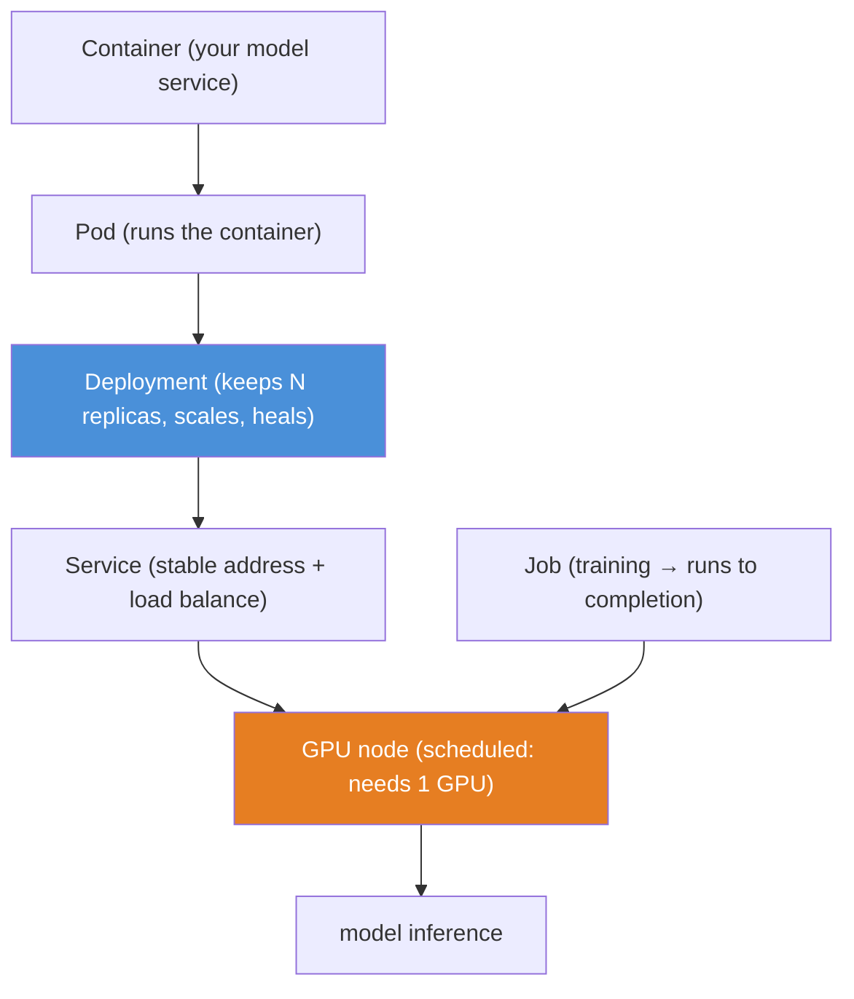
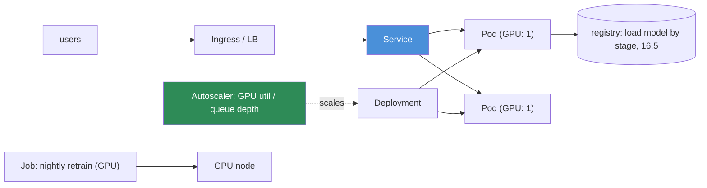

# 16.16 · Kubernetes for AI Systems

[⬅ 16.15 GPU Infrastructure](16.15-gpu-infrastructure.md) · [🏠 Module 16](../README.md) · [➡ 16.17 Reliability](16.17-reliability.md)

> **The lesson in one line:** Kubernetes is the standard for running containers at scale — packaging your model service into **pods**, exposing them via **services**, scaling them with **deployments**, and running training as **jobs** — but AI workloads differ from web apps in ways (GPUs, huge images, long jobs, statefulness) that require **GPU scheduling** and AI-aware configuration.

---

## 🎯 Learning objectives

- Understand **containers, pods, services, deployments, jobs, and GPU scheduling**.
- Explain how **AI workloads differ** from traditional web workloads on K8s.
- Map a model-inference deployment onto Kubernetes primitives.

## ✅ Prerequisites

- [16.8 serving](16.8-model-serving.md), [16.15 GPU infrastructure](16.15-gpu-infrastructure.md), [16.21 IaC](16.21-iac.md).

---

## 🧠 Mental model

> [!IMPORTANT]
> **Kubernetes answers "how do I run *many copies* of a containerized service reliably across *many machines*, healing and scaling automatically?" — and AI just adds the twist that some of those machines have GPUs the scheduler must place workloads onto.** The primitives are a small vocabulary: a **container** is your packaged app; a **pod** runs one (or few) containers; a **deployment** keeps N replica pods running and scales/heals them; a **service** gives them a stable address + load balancing; a **job** runs a task to completion (training). K8s continuously reconciles *desired* state (3 replicas on GPU nodes) with *actual* state (one crashed → restart it). **For AI, the extra concern is GPU scheduling** — telling K8s "this pod needs 1 GPU" and having it placed on a GPU node — plus handling AI's big images, long jobs, and statefulness.



---

## The primitives

| Primitive | What | AI use |
|---|---|---|
| **Container** | packaged app + deps ([16.21](16.21-iac.md)) | the model server (FastAPI/vLLM, [16.8](16.8-model-serving.md)) |
| **Pod** | smallest deployable unit (1+ containers) | one instance of the model service |
| **Deployment** | maintains N replica pods; rolling updates; self-heals | scaled model serving with rolling/canary ([16.13](16.13-deployment-strategies.md)) |
| **Service** | stable network endpoint + load balancing across pods | the model API's address |
| **Job** | runs a pod to completion | a training/batch-inference run ([16.6](16.6-ml-pipelines.md)) |
| **GPU scheduling** | request `nvidia.com/gpu: 1`; place on GPU nodes | how AI pods get GPUs |

### GPU scheduling
You request GPUs as a **resource** in the pod spec (`resources.limits: nvidia.com/gpu: 1`); a device plugin advertises GPUs and the scheduler places the pod on a node with a free one. **Fractional GPUs** (MIG / time-slicing) let multiple small workloads share a card ([16.15](16.15-gpu-infrastructure.md)). Node selectors/taints keep GPU workloads on GPU nodes (and non-GPU work off the expensive nodes).

---

## How AI workloads differ from web workloads

| Web workload | AI workload |
|---|---|
| Small images (MBs), fast startup | **huge images** (GBs: CUDA + weights) → slow startup, needs pre-pull/caching |
| Stateless, cheap replicas | GPU pods are **expensive**; cold starts load a big model → keep warm |
| Scale to zero easily | **model load time** makes scale-to-zero costly (mitigate with warm pools) |
| CPU/memory bound | **GPU-bound**; scheduler must place on GPU nodes |
| Short requests | **long-running** training jobs; long LLM generations (async, [16.8](16.8-model-serving.md)) |
| Autoscale on CPU | autoscale on **GPU utilization / queue depth**, not CPU |

> [!IMPORTANT]
> **The mistake is treating a model service like a stateless web app — GPU pods are expensive, slow to start (big images + model loading), and scheduled differently, so the autoscaling and rollout playbook must be AI-aware.** Scaling from 0→1 means pulling a multi-GB image and loading a model into VRAM — seconds to minutes, during which requests queue. So you keep a **warm minimum**, autoscale on **GPU/queue metrics** (not CPU), pre-pull images, and account for load time in canary rollouts ([16.13](16.13-deployment-strategies.md)). K8s gives you the reliability primitives (self-healing, rolling updates, load balancing) — you just configure them for GPU realities.

---

## Mapping a model service onto K8s



A **Deployment** of GPU pods behind a **Service**, autoscaled on GPU/queue metrics, loading the model **by registry stage** ([16.5](16.5-model-registry.md)); training runs as **Jobs** on GPU nodes. This is the reliable, scalable substrate for [production architecture (16.20)](16.20-production-architecture.md).

---

## 🏭 Production examples

| Need | K8s approach |
|---|---|
| Scalable LLM serving | Deployment of vLLM pods (GPU) + Service + HPA on queue depth |
| Nightly retraining | Job on a GPU node ([16.6](16.6-ml-pipelines.md)) |
| Canary rollout | Deployment + progressive traffic (Argo Rollouts, [16.13](16.13-deployment-strategies.md)) |
| Share a GPU across small models | MIG / time-slicing ([16.15](16.15-gpu-infrastructure.md)) |
| Keep GPU work off CPU nodes | node selectors/taints |

## ⚡ Performance & 💲 cost considerations

- **GPU nodes are the cost center** — bin-pack GPU workloads, use MIG for small models, and scale GPU node pools on demand ([16.18](16.18-cost-optimization.md)).
- **Warm minimum vs scale-to-zero** — trade idle cost against cold-start latency; big models favor a warm pool.
- **Pre-pull images / cache weights** to cut startup time.

## 🔒 Security considerations

> [!CAUTION]
> - **Multi-tenant clusters need isolation** — namespaces, network policies, and GPU isolation (MIG) so tenants can't access each other's pods/memory ([16.19](16.19-security.md)).
> - **Container image supply chain** — scan images, pin base images, use minimal images ([16.21](16.21-iac.md)).
> - **Secrets** (model registry, API keys) via K8s Secrets/external secret managers, not baked into images ([16.19](16.19-security.md)).

## 🚫 Common mistakes

| Mistake | Consequence |
|---|---|
| Treating GPU pods like stateless web pods | Bad autoscaling; cold-start latency |
| Autoscaling on CPU for GPU workloads | Scales on the wrong signal |
| Scale-to-zero with a big model | Multi-minute cold starts |
| No GPU resource requests | Pods land on CPU nodes / OOM |
| Huge un-cached images | Slow pod startup |
| No multi-tenant isolation | Cross-tenant access |

## 🐛 Debugging workflow

K8s AI issue: (1) **Pod pending?** No GPU available / wrong node selector — check GPU requests + node pool ([16.15](16.15-gpu-infrastructure.md)). (2) **Slow startup?** Big image (pre-pull) + model load (warm pool). (3) **OOMKilled?** VRAM or RAM limit — estimate memory, quantize ([16.14](16.14-model-optimization.md)). (4) **Not scaling under load?** Autoscaling on CPU not GPU/queue — fix the metric. (5) **CrashLoopBackOff?** Check logs/health probe. K8s primitives + AI-aware config resolve most. Full method in [16.17](16.17-reliability.md).

## 🏋️ Exercises

1. **Deploy.** Package a model server in a container; deploy as a Deployment + Service with a GPU request.
2. **Autoscale.** Configure autoscaling on queue depth / GPU utilization; load-test.
3. **Job.** Run a training as a K8s Job on a GPU node.
4. **Warm pool.** Compare scale-to-zero vs a warm minimum for a big model (cold-start latency).
5. **Isolation.** Set up namespaces + network policies for two tenants.

## 🛠️ Mini project — "K8s model serving deployment"

**Goal:** deploy a GPU model service on Kubernetes with autoscaling, health, and a training Job.

**Requirements:** containerized model server ([16.21](16.21-iac.md)); Deployment (GPU request, replicas, rolling update) + Service; autoscaling on queue/GPU metric; health/readiness probes; a training Job; warm-minimum config; multi-tenant namespaces.

**Folder structure**
```
k8s-serving/
├── Dockerfile          # model server image
├── deployment.yaml     # Deployment + GPU request + probes
├── service.yaml        # Service
├── hpa.yaml            # autoscale on queue/GPU
└── job.yaml            # training Job
```

**Testing:** pods scheduled on GPU nodes; autoscaling responds to load; rolling update works; Job completes; warm pool cuts cold starts.
**Evaluation:** startup latency; scaling responsiveness.
**Security:** namespaces/network policies; scanned images; K8s Secrets ([16.19](16.19-security.md)).
**Monitoring:** pod/GPU metrics ([16.10](16.10-observability.md)).
**Future improvements:** Argo Rollouts canary; MIG sharing; multi-region.

## 📄 Cheat sheet

| Primitive | One line |
|---|---|
| **Container** | packaged model server |
| **Pod** | one running instance |
| **Deployment** | N replicas, scaling, self-healing, rolling updates |
| **Service** | stable endpoint + load balance |
| **Job** | run-to-completion (training) |
| **⭐ GPU scheduling** | request `nvidia.com/gpu`; place on GPU nodes; MIG to share |
| **⭐ AI differs** | huge images · slow model load · GPU-bound · long jobs |
| **Autoscale on** | GPU util / queue depth (not CPU) |
| **⚠️** | warm minimum for big models; isolate tenants |

## 🎴 Flashcards

- **⭐ What question does Kubernetes answer?** → How to run many copies of a containerized service reliably across many machines, self-healing and autoscaling — reconciling desired vs actual state.
- **What are the core K8s primitives?** → Container (packaged app), pod (runs containers), deployment (N replicas + scaling + healing), service (stable endpoint + LB), job (run to completion).
- **How does a pod get a GPU?** → It requests `nvidia.com/gpu: 1` as a resource; a device plugin advertises GPUs and the scheduler places the pod on a GPU node (MIG/time-slicing to share).
- **⭐ How do AI workloads differ from web workloads on K8s?** → Huge images (GBs), slow model-load startup, GPU-bound and GPU-scheduled, expensive pods, long-running jobs — so autoscaling/rollout must be AI-aware.
- **Why not scale a big-model service to zero?** → Cold start means pulling a multi-GB image and loading the model into VRAM (seconds-to-minutes); keep a warm minimum.
- **What metric should GPU services autoscale on?** → GPU utilization or queue depth — not CPU.
- **How do you run training on K8s?** → As a Job (runs the pod to completion) scheduled on a GPU node.

## 💬 Interview questions

1. Explain the core Kubernetes primitives and how they map to a model service.
2. How does GPU scheduling work in Kubernetes?
3. How do AI workloads differ from web workloads on Kubernetes?
4. Why is scaling a big-model service to zero problematic, and what do you do instead?
5. What metrics should GPU-backed services autoscale on?
6. How do you isolate multi-tenant AI workloads on a shared cluster?

## 📝 Summary

- Kubernetes runs containerized services at scale via a small vocabulary — **container → pod → deployment (N replicas, healing, rolling) → service (stable endpoint)** — plus **jobs** for training and **GPU scheduling** (request `nvidia.com/gpu`, place on GPU nodes, MIG to share).
- **AI workloads differ from web workloads**: huge images, slow model-load startup, GPU-bound and GPU-scheduled, expensive pods, long jobs — so **autoscale on GPU/queue metrics (not CPU), keep a warm minimum, and pre-pull images**.
- Map a model service to a **GPU Deployment behind a Service, autoscaled, loading the model by registry stage** ([16.5](16.5-model-registry.md)); run training as **Jobs** — the reliable substrate for production architecture ([16.20](16.20-production-architecture.md)).
- **Isolate multi-tenant clusters** (namespaces/network policies/MIG), **scan images**, and manage **secrets** via K8s/external managers ([16.19](16.19-security.md)).

## 📚 References

1. **Kubernetes documentation.** ⭐ Pods, deployments, services, jobs.
2. **NVIDIA GPU Operator / device plugin docs.** GPU scheduling + MIG.
3. **Argo Rollouts / KServe / Ray Serve.** AI-on-K8s serving and rollout.
4. **[16.15 GPU Infrastructure](16.15-gpu-infrastructure.md).** GPU sizing and sharing.

---

## 🧭 Navigation

| Direction | Link |
|---|---|
| ⬅ Previous | [16.15 · GPU Infrastructure](16.15-gpu-infrastructure.md) |
| ➡ Next | [16.17 · Reliability](16.17-reliability.md) |
| 🏠 Module | [Module 16](../README.md) |
| 📖 Lessons | [Lesson index](README.md) |
