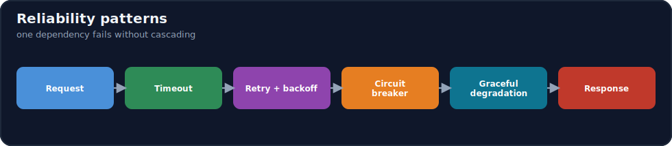
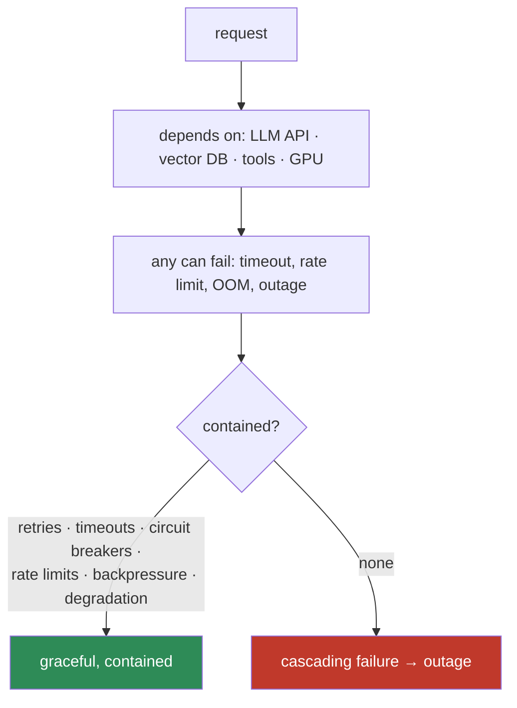
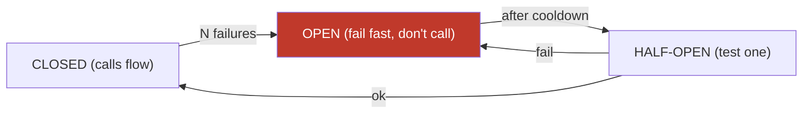

# 16.17 · Reliability ⭐

[⬅ 16.16 Kubernetes for AI](16.16-kubernetes.md) · [🏠 Module 16](../README.md) · [➡ 16.18 Cost Optimization](16.18-cost-optimization.md)

> **The lesson in one line:** AI systems depend on flaky external things — LLM APIs rate-limit, vector DBs time out, tools fail, GPUs OOM — so reliability means engineering for failure with **retries, timeouts, circuit breakers, rate limiting, backpressure, and graceful degradation**, so one slow dependency doesn't cascade into a total outage.



---

## 🎯 Learning objectives

- Apply **retries, timeouts, circuit breakers, rate limiting, backpressure, graceful degradation**.
- Apply them to **model APIs, LLM APIs, vector databases, and tool-calling agents**.
- Design **fault-tolerant** AI architectures.

## ✅ Prerequisites

- [16.8 serving](16.8-model-serving.md), [14.4 tool calling](../../14-AI-Agents/weeks/14.4-tool-calling.md), [13.6 vector DBs](../../13-RAG/weeks/13.6-vector-databases.md).

---

## 🧠 Mental model

> [!IMPORTANT]
> **AI systems have unusually many, unusually flaky dependencies — a single request might call a hosted LLM (rate limits, timeouts, outages), a vector DB (slow queries), several tools (any can fail), and a GPU (OOM under load) — so the question isn't *if* a dependency fails but *what happens to your system when it does*.** The naive answer is "the whole request fails," and worse, retries pile up and a slow dependency drags everything down (a **cascading failure**). Reliability engineering answers it differently: **bound every call (timeout), retry transient failures (with backoff), stop hammering a dead dependency (circuit breaker), shed load you can't handle (rate limit + backpressure), and degrade gracefully** (a partial answer beats an error). **Assume every dependency will fail, and design so one failure stays contained.**



---

## The reliability patterns

| Pattern | What | Guards against |
|---|---|---|
| **Timeout** | cap how long you wait for a call | a slow dependency hanging the whole request |
| **Retry (with backoff)** | re-attempt transient failures, exponentially spaced | flaky networks, rate limits, transient errors |
| **Circuit breaker** | after N failures, stop calling a dead dependency for a while | hammering a down service; cascading failure |
| **Rate limiting** | cap requests/sec to/from a service | overload; runaway cost ([16.18](16.18-cost-optimization.md)) |
| **Backpressure** | signal "slow down" / queue when overloaded | resource exhaustion under load spikes |
| **Graceful degradation** | serve a reduced answer when a dependency is down | total failure when partial would do |

### Timeout + retry + backoff
```python
async def call_with_resilience(fn, timeouts=5, retries=3):
    for attempt in range(retries + 1):
        try:
            return await asyncio.wait_for(fn(), timeout=timeouts)   # ⭐ timeout every call
        except (TimeoutError, TransientError) as e:
            if attempt == retries: raise
            await asyncio.sleep(2 ** attempt + jitter())            # exponential backoff + jitter
        except PermanentError:
            raise                                                    # don't retry permanent (14.4)
```
**Retry only transient failures** (timeouts, rate limits, 5xx), **not permanent** ones (400, 403); use **exponential backoff + jitter** to avoid a retry storm ([14.4](../../14-AI-Agents/weeks/14.4-tool-calling.md)).

### Circuit breaker

After too many failures, the breaker **opens** — calls fail fast instead of piling up against a dead service; after a cooldown it **tests** recovery. This is the key defense against **cascading failure**.

> [!IMPORTANT]
> **The single most important reliability rule for AI systems: bound everything and degrade gracefully — a timely partial answer is infinitely better than a hung request or a cascading outage.** Every external call gets a **timeout** (never wait forever), transient failures get **bounded retries with backoff** (never a retry storm), dead dependencies get a **circuit breaker** (never hammer them), and when something's truly down, **degrade** — return cached results, a simpler model, or "results may be incomplete" rather than a 500. AI dependencies (LLM APIs especially) are flakier than typical services, so these aren't optional niceties — they're the difference between a resilient product and one that falls over whenever a provider hiccups.

---

## Applied to AI components

| Component | Reliability measures |
|---|---|
| **Model/LLM API** | timeout + retry(backoff) + circuit breaker; rate limit; **fallback** to a smaller/cheaper model or cached answer on failure |
| **Vector DB** | timeout; retry; **degrade** to no-RAG (answer from the model) or cached retrieval if down ([13.6](../../13-RAG/weeks/13.6-vector-databases.md)) |
| **Tool-calling agent** | per-tool timeout + bounded retries; failures become observations ([14.4](../../14-AI-Agents/weeks/14.4-tool-calling.md)); step/cost budget as a global circuit breaker ([14.7](../../14-AI-Agents/weeks/14.7-agent-loops.md)) |
| **GPU serving** | health checks + failover ([16.16](16.16-kubernetes.md)); backpressure/queue on overload; autoscale |

> [!IMPORTANT]
> **Graceful degradation is especially powerful for LLM/RAG systems because there are natural "reduced" modes: if the LLM API is down, serve a cached answer; if the vector DB is down, answer from the model alone (with a caveat); if the strong model is rate-limited, fall back to a cheaper one.** The system stays *up and useful* at reduced quality instead of returning errors. Design these fallback paths deliberately — they turn a dependency outage into a quality blip.

---

## 🏭 Production examples

| Failure | Resilient response |
|---|---|
| LLM API rate-limited | backoff retry → fallback to a cheaper model → cached answer |
| LLM API outage | circuit breaker opens → serve cached / degraded |
| Vector DB slow/down | timeout → degrade to no-RAG with a caveat |
| Tool fails in an agent | observation + bounded retry; budget caps the loop |
| Load spike | rate limit + backpressure + autoscale |

## ⚡ Performance & 💲 cost considerations

- **Retries multiply cost/latency** — bound them; backoff+jitter prevents storms ([16.18](16.18-cost-optimization.md)).
- **Circuit breakers save cost** — they stop paying for calls to a dead service.
- **Fallback to a cheaper model** during incidents controls cost *and* keeps the system up.
- **Timeouts protect tail latency** — a p99 blowup is often an un-timed slow dependency ([16.8](16.8-model-serving.md)).

## 🔒 Security considerations

> [!CAUTION]
> - **Rate limiting is a security control** — it resists DoS, cost-exhaustion, and model-extraction attacks ([16.19](16.19-security.md), [15.20](../../15-Fine-Tuning/weeks/15.20-security.md)).
> - **Graceful degradation must not degrade *safety*** — a fallback path still enforces guardrails/validation ([12.16](../../12-Prompt-Engineering/weeks/12.16-security.md)).
> - **Backpressure prevents resource exhaustion** that an attacker could trigger with a load flood.

## 🚫 Common mistakes

| Mistake | Consequence |
|---|---|
| No timeouts on external calls | One slow dependency hangs everything |
| Unbounded retries | Retry storm; runaway cost; worse outage |
| Retrying permanent failures | Wasted calls; never succeeds |
| No circuit breaker | Cascading failure against a dead service |
| Fail hard instead of degrading | Total outage when partial would do |
| No rate limiting/backpressure | Overload under spikes; DoS/cost risk |

## 🐛 Debugging workflow

Reliability incident: (1) **Which dependency failed?** (LLM API, vector DB, tool, GPU) — traces/metrics ([16.10](16.10-observability.md)). (2) **Is it contained?** If a slow dependency hung requests → **missing timeout**. Cascading → **missing circuit breaker**. Retry storm → **unbounded retries**. (3) **Fallback available?** If not, add a degradation path. (4) **Overload?** Add rate limiting + backpressure + autoscaling. (5) **Post-incident**: add the missing pattern. Most AI outages are an *un-bounded* dependency call. Full method in [16.20](16.20-production-architecture.md).

## 🏋️ Exercises

1. **Timeout + retry.** Wrap an LLM call with timeout + backoff retry; simulate rate limits; show it recovers.
2. **Circuit breaker.** Implement a breaker; simulate a dependency outage; show fail-fast + recovery.
3. **Degrade.** Build a RAG app that answers from the model alone when the vector DB is down.
4. **Fallback model.** Fall back from a strong to a cheap model on rate-limit; measure the availability gain.
5. **Backpressure.** Add rate limiting + a queue; load-test past capacity; show graceful shedding.

## 🛠️ Mini project — "Fault-tolerant AI gateway"

**Goal:** a gateway that wraps AI dependencies with the full reliability toolkit.

**Requirements:** timeouts + bounded backoff retries; circuit breakers per dependency; rate limiting + backpressure; graceful degradation (fallback model, no-RAG mode, cached answers); applied to LLM API + vector DB + tools; resilience metrics ([16.10](16.10-observability.md)).

**Folder structure**
```
ai-gateway/
├── resilience.py   # timeout + retry(backoff) + circuit breaker
├── ratelimit.py    # rate limit + backpressure
├── degrade.py      # fallbacks (model/no-RAG/cache)
└── metrics.py      # failures, breaker state, fallbacks
```

**Testing:** slow dependency doesn't hang the request; breaker opens on outage; retries bounded; degradation serves reduced answers; overload shed gracefully.
**Evaluation:** availability under simulated failures; MTTR.
**Security:** rate limiting as DoS/cost defense; safe degradation paths ([16.19](16.19-security.md)).
**Monitoring:** breaker state, failure rates, fallback usage ([16.10](16.10-observability.md)).
**Future improvements:** adaptive timeouts; hedged requests; regional failover.

## 📄 Cheat sheet

| Pattern | Guards against |
|---|---|
| **Timeout** | a slow dependency hanging the request |
| **Retry (backoff+jitter)** | transient failures; retry storms |
| **⭐ Circuit breaker** | hammering a dead service; cascading failure |
| **Rate limiting** | overload; runaway cost; DoS |
| **Backpressure** | resource exhaustion under spikes |
| **⭐ Graceful degradation** | total outage — serve reduced/cached/fallback |
| **⭐ Rule** | bound everything; degrade gracefully; assume every dep fails |
| **Retry** | transient only, bounded; not permanent |

## 🎴 Flashcards

- **⭐ Why do AI systems especially need reliability engineering?** → They depend on many flaky things (LLM APIs rate-limit/time-out, vector DBs, tools, GPUs OOM); the question is what happens when — not if — one fails, and without containment one failure cascades.
- **What are the core reliability patterns?** → Timeout, retry (with backoff), circuit breaker, rate limiting, backpressure, and graceful degradation.
- **What does a circuit breaker do?** → After N failures it "opens" — calls fail fast instead of piling up against a dead dependency — then tests recovery after a cooldown; the key defense against cascading failure.
- **⭐ What's the single most important reliability rule?** → Bound everything (timeouts) and degrade gracefully — a timely partial answer beats a hung request or a cascading outage.
- **What failures do you retry, and how?** → Transient ones (timeouts, rate limits, 5xx) with bounded exponential backoff + jitter — not permanent failures (400/403), and never unbounded (retry storm).
- **What are natural degradation modes for LLM/RAG systems?** → Serve a cached answer, answer from the model alone without RAG (with a caveat), or fall back to a cheaper model — staying up at reduced quality.
- **How is rate limiting a security control?** → It resists DoS, cost-exhaustion, and model-extraction attacks.

## 💬 Interview questions

1. Why are AI systems especially prone to reliability problems?
2. Explain timeout, retry, circuit breaker, rate limiting, backpressure, and graceful degradation.
3. What is a cascading failure, and which patterns prevent it?
4. How do you apply reliability patterns to an LLM API and a vector DB?
5. What are good graceful-degradation modes for a RAG system?
6. How is rate limiting also a security control?

## 📝 Summary

- AI systems have **many flaky dependencies** (LLM APIs, vector DBs, tools, GPUs), so reliability means designing for failure so **one failure stays contained** instead of cascading.
- The toolkit: **timeouts** (bound every call), **retries with backoff+jitter** (transient only, bounded), **circuit breakers** (stop hammering dead services — the anti-cascade), **rate limiting + backpressure** (shed load), and **graceful degradation** (serve reduced/cached/fallback rather than error).
- The rule: **bound everything and degrade gracefully** — LLM/RAG systems have natural reduced modes (cached answer, no-RAG, cheaper model) that keep them **up and useful** during an outage.
- Reliability patterns are also **cost and security controls** — circuit breakers save spend, rate limiting resists DoS/extraction, and degradation must never weaken **safety** ([16.19](16.19-security.md)).

## 📚 References

1. **Nygard — _Release It!_ (circuit breaker, bulkhead).** ⭐ Stability patterns.
2. **Google SRE Book — _Handling Overload / Cascading Failures_.** ⭐ Backpressure, load shedding.
3. **[14.4 Tool Calling](../../14-AI-Agents/weeks/14.4-tool-calling.md) & [14.7 Agent Loops](../../14-AI-Agents/weeks/14.7-agent-loops.md).** Retries, budgets as circuit breakers.
4. **Resilience libraries (tenacity, resilience4j, Polly).** Retry/circuit-breaker implementations.

---

## 🧭 Navigation

| Direction | Link |
|---|---|
| ⬅ Previous | [16.16 · Kubernetes for AI Systems](16.16-kubernetes.md) |
| ➡ Next | [16.18 · Cost Optimization](16.18-cost-optimization.md) |
| 🏠 Module | [Module 16](../README.md) |
| 📖 Lessons | [Lesson index](README.md) |
