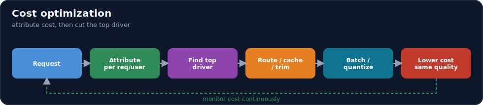
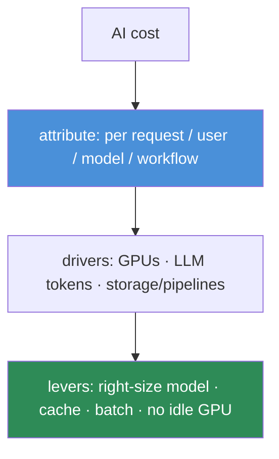

# 16.18 · Cost Optimization ⭐

[⬅ 16.17 Reliability](16.17-reliability.md) · [🏠 Module 16](../README.md) · [➡ 16.19 AI Security](16.19-security.md)

> **The lesson in one line:** AI is expensive in ways traditional software isn't — GPUs, per-token LLM billing, and heavy data pipelines — and cost can spike silently, so cost optimization means **measuring cost per unit that matters** (request, user, model, workflow) and pulling the big levers: right-sizing models, caching, batching, and eliminating idle GPUs.



---

## 🎯 Learning objectives

- Optimize **compute, GPU usage, inference, LLM tokens, storage, and data pipelines**.
- Build a **cost estimation framework**: cost per request / user / model / workflow.
- Apply practical cost-optimization strategies with quality trade-offs.

## ✅ Prerequisites

- [16.10 observability](16.10-observability.md), [16.14 model optimization](16.14-model-optimization.md), [16.15 GPU](16.15-gpu-infrastructure.md).

---

## 🧠 Mental model

> [!IMPORTANT]
> **You can't optimize cost you can't attribute — so the first move is always to measure cost *per unit that matters* (per request, per user, per model, per workflow), because "the AI bill is high" is not actionable but "the research-agent workflow costs $0.40/run and 80% of that is one over-called tool" is.** AI cost has three unusual drivers: **GPUs** (expensive, and *idle* GPUs still bill), **LLM tokens** (per-token pricing that scales with prompt/output length and can spike 10× from a prompt change or a runaway agent), and **data/storage** (versioned datasets, embeddings, logs). The optimization playbook mirrors [performance (16.14)](16.14-model-optimization.md) because *cost and latency share the same levers*: right-size the model, cache, batch, and never pay for idle. **Attribute first, then pull the biggest lever.**



---

## The cost drivers and levers

| Driver | Levers |
|---|---|
| **Compute / GPU** | right-size the GPU; **eliminate idle** (autoscale, scale-to-zero); spot/preemptible; bin-pack/MIG ([16.15](16.15-gpu-infrastructure.md)) |
| **Inference** | quantization, distillation, batching, caching ([16.14](16.14-model-optimization.md)) |
| **LLM tokens** | shorter prompts, smaller/right-sized model, **semantic caching**, cap output length, cascades ([13.16](../../13-RAG/weeks/13.16-performance.md)) |
| **Storage** | data/artifact retention policies; prune checkpoints; compress ([16.3](16.3-data-versioning.md)–[16.4](16.4-experiment-tracking.md)) |
| **Data pipelines** | cache stages; right-size compute per stage; incremental processing ([16.6](16.6-ml-pipelines.md)) |

---

## Cost per unit (the estimation framework)

| Unit | Question | Use |
|---|---|---|
| **Cost per request** | what does one inference/answer cost? | find expensive request types |
| **Cost per user** | what does a user cost you per month? | pricing, unit economics |
| **Cost per model** | what does serving each model cost? | consolidate/retire models |
| **Cost per workflow** | what does an agent run / pipeline cost? | optimize expensive workflows ([14.14](../../14-AI-Agents/weeks/14.14-evaluation.md)) |

```python
# attribute cost from observability (16.10)
def cost_per_request(trace):
    llm = sum(span.input_tokens * IN_PRICE + span.output_tokens * OUT_PRICE
              for span in trace.llm_spans)          # token cost
    compute = trace.gpu_seconds * GPU_PRICE          # compute cost
    return llm + compute + trace.tool_costs          # total, attributable per request
```

> [!IMPORTANT]
> **The biggest LLM cost wins are usually right-sizing the model and semantic caching — a smaller model on the easy 80% of traffic plus a cache for repeats can cut the bill several-fold with little quality loss.** Because retrieval/tools supply the knowledge, a **cheaper model often suffices** ([13.1](../../13-RAG/weeks/13.1-why-rag-exists.md)); a **cascade** routes easy queries to a cheap model and escalates only hard ones ([11.16](../../11-LLMs/weeks/11.16-inference-optimization.md)); and a **semantic cache** skips the model entirely on similar past queries ([13.16](../../13-RAG/weeks/13.16-performance.md)). For **GPUs**, the biggest waste is **idle time** — an always-on GPU at 10% utilization is pure loss; autoscale, batch, and scale-to-zero. **Measure per-unit cost, then attack the top driver.**

---

## 🏭 Production examples

| Situation | Optimization |
|---|---|
| LLM bill too high | semantic cache + right-size model + cap output ([16.14](16.14-model-optimization.md)) |
| GPU cost high | eliminate idle (autoscale/scale-to-zero); spot for batch |
| Cost spiked overnight | attribute via observability → find the change ([16.10](16.10-observability.md)) |
| Agent runs expensive | cost-per-workflow → cap loop/tool calls ([14.7](../../14-AI-Agents/weeks/14.7-agent-loops.md)) |
| Storage bill growing | retention/GC on datasets, checkpoints, logs |

## ⚡ Performance & 💲 cost considerations

- **Cost and latency share levers** — most optimizations ([16.14](16.14-model-optimization.md)) cut both.
- **Gate cost changes on quality** — a cheaper model that regresses quality is a false economy ([16.12](16.12-llm-evaluation.md)).
- **Set budgets/alerts** — a cost alert catches the 10× spike before the invoice does ([16.10](16.10-observability.md)).
- **Cascades and caching** give the best cost/quality ratio for LLM apps.

## 🔒 Security considerations

> [!CAUTION]
> - **Cost-exhaustion is an attack** — an attacker (or a runaway agent) can drive up your token/GPU bill; **rate limiting + budgets** are cost *and* security controls ([16.17](16.17-reliability.md), [15.20](../../15-Fine-Tuning/weeks/15.20-security.md)).
> - **Shared caches must be tenant-scoped** — cost-saving caches can leak across users if not scoped ([16.14](16.14-model-optimization.md)).
> - **Cost anomalies can signal abuse** — a sudden per-user cost spike may indicate scraping/extraction; alert on it.

## 🚫 Common mistakes

| Mistake | Consequence |
|---|---|
| No cost attribution | Can't find or fix the expensive part |
| Idle GPUs | Paying for nothing |
| Biggest model for everything | Overpaying on easy traffic |
| No caching | Recomputing repeats |
| No budgets/alerts | 10× spike discovered on the invoice |
| Cutting cost, ignoring quality | Cheaper-but-worse regression |

## 🐛 Debugging workflow

"Cost spiked / is too high": (1) **Attribute** — per request/user/model/workflow, which unit dominates? ([16.10](16.10-observability.md)). (2) **What changed?** A prompt edit (longer output), a model swap, a runaway agent, a traffic shift ([16.9](16.9-llmops.md)). (3) **Pull the top lever** — right-size model / semantic cache / eliminate idle GPU / cap output ([16.14](16.14-model-optimization.md)). (4) **Gate on quality** — confirm the saving didn't regress quality ([16.12](16.12-llm-evaluation.md)). (5) **Set an alert** so the next spike is caught early. Cost is a metric — monitor it like latency.

## 🏋️ Exercises

1. **Attribute.** Instrument cost per request/user/workflow from traces; find the priciest.
2. **Cache savings.** Add a semantic cache; measure cost reduction vs quality on a repetitive workload.
3. **Right-size.** Route easy queries to a cheap model (cascade); measure cost/quality.
4. **Idle GPU.** Find an idle GPU; add autoscaling/scale-to-zero; measure the saving.
5. **Budget alert.** Set a cost alert; simulate a runaway agent; catch it early.

## 🛠️ Mini project — "AI cost estimation & optimization framework"

**Goal:** a framework that attributes cost per unit and applies/measures optimizations.

**Requirements:** cost attribution (per request/user/model/workflow) from observability ([16.10](16.10-observability.md)); optimization levers (right-size model/cascade, semantic cache, batching, idle-GPU elimination); budgets + alerts; a quality gate on cost changes ([16.12](16.12-llm-evaluation.md)).

**Folder structure**
```
cost-framework/
├── attribute.py    # cost per request/user/model/workflow
├── optimize.py     # cascade, cache, batch, idle elimination
├── budget.py       # budgets + alerts
└── report.py       # cost/quality frontier
```

**Testing:** cost attributed correctly; optimizations cut cost without breaching quality; budget alert fires on a spike.
**Evaluation:** cost reduction vs quality delta; alert latency.
**Security:** rate-limit/budget as cost-exhaustion defense; tenant-scoped caches ([16.19](16.19-security.md)).
**Monitoring:** cost-over-time per unit ([16.10](16.10-observability.md)).
**Future improvements:** auto-cascade tuning; anomaly-based cost alerts; unit-economics dashboard.

## 📄 Cheat sheet

| Concept | One line |
|---|---|
| **⭐ Attribute first** | cost per request / user / model / workflow |
| **Drivers** | GPUs (idle = waste) · LLM tokens · storage/pipelines |
| **GPU levers** | eliminate idle · autoscale/scale-to-zero · spot · MIG |
| **LLM levers** | right-size model · **semantic cache** · cascade · cap output |
| **Inference** | quantize · distill · batch · cache ([16.14](16.14-model-optimization.md)) |
| **⭐ Biggest LLM wins** | right-size model + semantic caching |
| **⭐ Cost = a metric** | budgets + alerts catch the 10× spike early |
| **⚠️** | gate cost cuts on quality; rate-limit vs cost-exhaustion attacks |

## 🎴 Flashcards

- **⭐ What's the first step in cost optimization?** → Attribute cost per unit that matters (per request/user/model/workflow) — "the bill is high" isn't actionable; per-unit attribution points at the driver.
- **What are AI's three unusual cost drivers?** → GPUs (expensive, idle still bills), LLM tokens (per-token, can spike 10×), and data/storage/pipelines.
- **⭐ What are the biggest LLM cost wins?** → Right-sizing the model (a cheaper model on easy traffic / cascade) and semantic caching (skip the model on repeats) — several-fold savings with little quality loss.
- **What's the biggest GPU cost waste?** → Idle GPUs — an always-on GPU at low utilization; eliminate with autoscaling, batching, and scale-to-zero.
- **Why do cost and performance share levers?** → Most optimizations (quantization, caching, batching, right-sizing) cut both latency and cost.
- **How is cost optimization a security concern?** → Cost-exhaustion is an attack (runaway agent or attacker driving up tokens/GPU); rate limiting + budgets are cost *and* security controls, and cost anomalies can signal abuse.
- **What must you check after cutting cost?** → Quality — a cheaper-but-worse model is a false economy, so gate cost changes on a quality check.

## 💬 Interview questions

1. Why is cost attribution the first step, and what units do you attribute to?
2. What are AI's unusual cost drivers, and the lever for each?
3. What are the biggest LLM cost wins, and why?
4. Why are idle GPUs the biggest compute waste, and how do you fix it?
5. How do cost and performance optimizations overlap?
6. How is cost optimization also a security concern?

## 📝 Summary

- **Attribute cost per unit** (request/user/model/workflow) first — you can't optimize what you can't attribute; then attack the top driver among **GPUs, LLM tokens, and storage/pipelines**.
- The **biggest LLM wins are right-sizing the model (cascades) and semantic caching**; the **biggest GPU waste is idle time** (autoscale, batch, scale-to-zero, spot).
- **Cost and performance share levers** ([16.14](16.14-model-optimization.md)) — quantize, cache, batch, right-size cut both — but **gate cost cuts on quality** ([16.12](16.12-llm-evaluation.md)).
- **Treat cost as a monitored metric** with budgets and alerts (catch the 10× spike early), and remember **rate limiting/budgets are also security controls** against cost-exhaustion attacks ([16.17](16.17-reliability.md), [16.19](16.19-security.md)).

## 📚 References

1. **[16.14 Model Optimization](16.14-model-optimization.md) & [13.16 RAG Performance](../../13-RAG/weeks/13.16-performance.md).** ⭐ Shared cost/latency levers, semantic caching.
2. **[11.16 Inference Optimization](../../11-LLMs/weeks/11.16-inference-optimization.md).** Cascades, quantization.
3. **[16.15 GPU Infrastructure](16.15-gpu-infrastructure.md).** Idle-GPU elimination, spot.
4. **Cloud cost-management docs (AWS/GCP/Azure).** Budgets, alerts, spot pricing.

---

## 🧭 Navigation

| Direction | Link |
|---|---|
| ⬅ Previous | [16.17 · Reliability](16.17-reliability.md) |
| ➡ Next | [16.19 · AI Security in Production](16.19-security.md) |
| 🏠 Module | [Module 16](../README.md) |
| 📖 Lessons | [Lesson index](README.md) |
