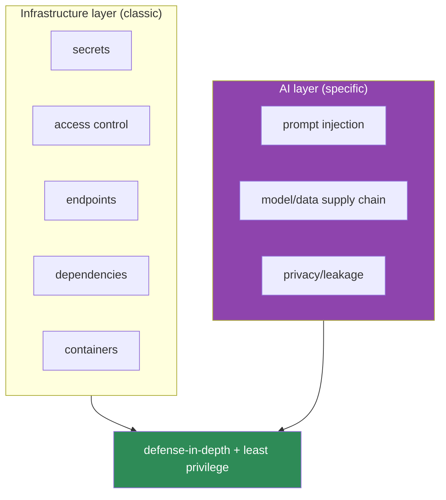
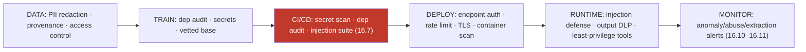

# 16.19 · AI Security in Production

[⬅ 16.18 Cost Optimization](16.18-cost-optimization.md) · [🏠 Module 16](../README.md) · [➡ 16.20 Production Architecture](16.20-production-architecture.md)

> **The lesson in one line:** A production AI system inherits *all* the security concerns of normal software — secrets, access control, endpoints, dependencies, containers — *and* adds AI-specific ones — prompt injection, model/data supply chain, and privacy — so security here is defensive engineering across both layers, applied as checklists at every stage.

> [!NOTE]
> This lesson is **strictly defensive**. It contains no instructions for attacking systems. It consolidates the security threads from Modules 12–15 into a production checklist.

---

## 🎯 Learning objectives

- Apply the security controls: **secrets, access control, endpoint security, data privacy, injection defense, supply-chain & dependency security, container security**.
- Combine **classic** software security with **AI-specific** threats into production checklists.

## ✅ Prerequisites

- [12.16 prompt injection](../../12-Prompt-Engineering/weeks/12.16-security.md), [15.20 fine-tuning security](../../15-Fine-Tuning/weeks/15.20-security.md), [14.13 agent safety](../../14-AI-Agents/weeks/14.13-safety.md).

---

## 🧠 Mental model

> [!IMPORTANT]
> **A production AI system has two security layers stacked on top of each other: the *infrastructure* layer (secrets, endpoints, containers, dependencies — the same as any web service) and the *AI* layer (prompt injection, data/model poisoning, privacy leakage — unique to ML/LLM systems). You must secure both, because an attacker will target the weaker one.** Classic security (auth, secrets, patching, network) is necessary but not sufficient — a perfectly-hardened server can still be prompt-injected into leaking data or a poisoned model can serve a backdoor. Conversely, all the injection defenses in the world don't help if your API keys are in a public repo. **Production AI security = defense-in-depth across both layers, with least privilege throughout** — assume any single control fails, and minimize the blast radius.



---

## The controls

### Infrastructure layer (classic, still essential)
| Control | Practice |
|---|---|
| **Secrets management** | API keys/credentials in a secrets manager (Vault/cloud KMS), **never** in code/images/logs; rotate |
| **Access control** | authn + least-privilege authz on endpoints, registries, data, pipelines ([16.5](16.5-model-registry.md)) |
| **Model endpoint security** | authenticate, rate-limit ([16.17](16.17-reliability.md)), validate inputs, TLS |
| **Dependency security** | pin + audit dependencies (`pip-audit`), verify hashes ([16.2](16.2-reproducibility.md)) |
| **Container security** | minimal/scanned images, non-root, no baked secrets ([16.16](16.16-kubernetes.md), [16.21](16.21-iac.md)) |

### AI layer (specific)
| Control | Practice |
|---|---|
| **Prompt injection defense** | treat retrieved/tool content as untrusted data; least-privilege tools; output filtering ([12.16](../../12-Prompt-Engineering/weeks/12.16-security.md), [14.13](../../14-AI-Agents/weeks/14.13-safety.md)) |
| **Data privacy** | redact PII; govern training data; RAG access control at retrieval ([15.20](../../15-Fine-Tuning/weeks/15.20-security.md), [13.14](../../13-RAG/weeks/13.14-security.md)) |
| **Supply-chain security** | vet base models/datasets/MCP servers; verify provenance/hashes ([15.2](../../15-Fine-Tuning/weeks/15.2-base-models.md), [14.9](../../14-AI-Agents/weeks/14.9-mcp.md)) |
| **Model/data integrity** | detect poisoning (anomalous drift, [16.11](16.11-monitoring-drift.md)); immutable versioned artifacts ([16.3](16.3-data-versioning.md)) |
| **Extraction defense** | rate-limit + monitor for model-extraction/membership attacks ([15.20](../../15-Fine-Tuning/weeks/15.20-security.md)) |

> [!IMPORTANT]
> **The unifying principle across both layers is least privilege plus defense-in-depth: give every component (service account, tool, endpoint, model) the minimum access it needs, and layer independent controls so no single failure is catastrophic.** This is the same principle that anchors agent safety ([14.13](../../14-AI-Agents/weeks/14.13-safety.md)) and RAG/fine-tuning security ([13.14](../../13-RAG/weeks/13.14-security.md), [15.20](../../15-Fine-Tuning/weeks/15.20-security.md)) — production just makes it *systemic*: least privilege on the K8s service accounts, the registry, the data stores, the tools, AND the model's capabilities. **Assume the perimeter will be breached and the model will be injected — then minimize what either can reach.**

---

## Security across the lifecycle (checklist)



| Stage | Checklist |
|---|---|
| **Data** | PII redacted · provenance verified · access-controlled ([15.20](../../15-Fine-Tuning/weeks/15.20-security.md)) |
| **Train** | dependencies audited · secrets external · base model vetted |
| **CI/CD** | secret scan · dependency audit · injection/adversarial suite gate ([16.7](16.7-cicd.md)) |
| **Deploy** | endpoint auth + rate limit + TLS · container scanned · secrets via manager |
| **Runtime** | injection defense · output DLP · least-privilege tools · approval gates ([14.13](../../14-AI-Agents/weeks/14.13-safety.md)) |
| **Monitor** | anomaly/abuse/extraction/cost-exhaustion alerts ([16.10](16.10-observability.md)–[16.11](16.11-monitoring-drift.md)) |

---

## 🏭 Production examples

| Threat | Defense |
|---|---|
| Leaked API key | secrets manager + rotation + secret scanning in CI |
| Prompt injection via a doc | data-as-data + least-privilege tools + output filter |
| Poisoned dataset/model | provenance + validation + anomaly monitoring |
| Model extraction | rate limiting + monitoring |
| Vulnerable dependency | pinned + audited + hash-verified |
| Cross-tenant leak | tenant isolation (data, cache, K8s namespace) |

## ⚡ Performance & 💲 cost considerations

- **Security controls add overhead** (validation, filtering, scanning) — real but non-negotiable; budget for them.
- **Rate limiting is also a cost control** against cost-exhaustion ([16.18](16.18-cost-optimization.md)).
- **Automated scanning in CI** is cheap insurance vs a breach.

## 🔒 Security considerations (this is the lesson)

> [!CAUTION]
> Consolidated: **secrets external + rotated; least-privilege everywhere; endpoints authn'd + rate-limited; dependencies/images pinned + scanned; data PII-redacted + access-controlled; prompt injection defended (data-as-data + least-privilege tools + output DLP); supply chain (models/datasets/MCP servers) vetted; poisoning/extraction/abuse monitored; defense-in-depth (assume any control fails).** See [12.16](../../12-Prompt-Engineering/weeks/12.16-security.md), [13.14](../../13-RAG/weeks/13.14-security.md), [14.13](../../14-AI-Agents/weeks/14.13-safety.md), [15.20](../../15-Fine-Tuning/weeks/15.20-security.md).

## 🚫 Common mistakes

| Mistake | Consequence |
|---|---|
| Securing infra but not the AI layer | Injection/poisoning/leakage |
| Securing AI but leaking secrets | Classic breach |
| Secrets in code/images/logs | Credential theft |
| Broad tool/model permissions | Large blast radius on compromise |
| Unvetted base models/datasets/MCP servers | Supply-chain compromise |
| No CI security gate | Vulnerabilities/injection ship |
| No abuse/extraction monitoring | Silent attack |

## 🐛 Debugging workflow

Security incident: (1) **Which layer?** Infra (leaked secret, vuln, endpoint) or AI (injection, poisoning, leakage)? (2) **Contain** — rotate secrets / roll back model ([16.5](16.5-model-registry.md)) / disable the affected tool. (3) **Assess blast radius** — least privilege limits it; what could the compromised component reach? (4) **Root cause** via logs/traces ([16.10](16.10-observability.md)) — an anomalous drift may be poisoning ([16.11](16.11-monitoring-drift.md)). (5) **Add the missing control** to the CI gate/checklist. Defense-in-depth means an incident is contained, not catastrophic.

## 🏋️ Exercises

1. **Secrets audit.** Scan a repo/images/logs for secrets; move them to a manager.
2. **CI security gate.** Add dependency audit + secret scan + injection suite to CI ([16.7](16.7-cicd.md)).
3. **Least privilege.** Scope a service account / tool to the minimum; show the blast radius shrinks.
4. **Supply chain.** Verify a base model's provenance/hash before use.
5. **Checklist.** Write a security checklist for each lifecycle stage and audit a system against it.

## 🛠️ Mini project — "Production AI security layer"

**Goal:** a security layer + CI gate covering both infrastructure and AI-specific controls.

**Requirements:** secrets management (external, rotated); endpoint auth + rate limit ([16.17](16.17-reliability.md)); dependency/image scanning; CI security gate (secrets/deps/injection suite, [16.7](16.7-cicd.md)); prompt-injection defense + output DLP ([12.16](../../12-Prompt-Engineering/weeks/12.16-security.md)); supply-chain provenance checks; abuse/extraction monitoring; least-privilege service accounts.

**Folder structure**
```
ai-security/
├── secrets.py      # external secrets + rotation
├── ci_gate.py      # secret scan + dep audit + injection suite
├── runtime.py      # injection defense + output DLP + least privilege
├── supply.py       # model/dataset/MCP provenance
└── monitor.py      # abuse/extraction/anomaly alerts
```

**Testing:** no secrets in code/logs; injection has no privileged effect; poisoned/unvetted artifacts blocked; abuse alerts fire; least privilege verified.
**Evaluation:** % controls in place vs checklist; incident blast radius.
**Security:** the whole project — defense-in-depth.
**Monitoring:** anomaly/abuse/extraction/cost-exhaustion ([16.10](16.10-observability.md)).
**Future improvements:** automated red-teaming; SBOM; policy-as-code.

## 📄 Cheat sheet

| Layer | Controls |
|---|---|
| **Infra (classic)** | secrets (external+rotate) · access control · endpoint auth+rate-limit · dep audit · container scan |
| **AI (specific)** | injection defense · data privacy/DLP · supply-chain vetting · poisoning/extraction monitoring |
| **⭐ Principle** | **least privilege + defense-in-depth** across both layers |
| **CI gate** | secret scan · dep audit · injection/adversarial suite ([16.7](16.7-cicd.md)) |
| **Runtime** | data-as-data · least-privilege tools · output DLP · approvals |
| **⭐ Assume** | perimeter breached + model injected → minimize blast radius |

## 🎴 Flashcards

- **⭐ What two security layers does a production AI system have?** → The infrastructure layer (secrets, access control, endpoints, dependencies, containers — classic) and the AI layer (prompt injection, data/model supply chain, privacy) — you must secure both.
- **What is the unifying security principle?** → Least privilege plus defense-in-depth across both layers — give every component minimal access and layer independent controls so no single failure is catastrophic.
- **Where should secrets live?** → In a secrets manager (Vault/cloud KMS), never in code, images, or logs — and rotated.
- **What belongs in a CI security gate?** → Secret scanning, dependency audit, and an injection/adversarial suite — as blocking gates.
- **What is supply-chain security for AI?** → Vetting base models, datasets, and MCP/tool servers for provenance/integrity (hashes) before use, to prevent poisoned/backdoored artifacts.
- **How do you defend against prompt injection in production?** → Treat retrieved/tool content as untrusted data, use least-privilege tools, filter outputs (DLP), and gate high-impact actions — assume some injection succeeds.
- **⭐ What's the assume-breach mindset in production?** → Assume the perimeter will be breached and the model will be injected, then design (least privilege) so either failure reaches as little as possible.

## 💬 Interview questions

1. What two security layers must a production AI system address?
2. What classic infrastructure controls still apply, and why aren't they sufficient?
3. What AI-specific threats and defenses exist?
4. How do least privilege and defense-in-depth apply across the system?
5. What belongs in an AI CI/CD security gate?
6. What is supply-chain security for models/datasets/tools?
7. How do you contain an AI security incident?

## 📝 Summary

- Production AI security spans **two layers**: **infrastructure** (secrets, access control, endpoints, dependencies, containers — classic) and **AI-specific** (prompt injection, model/data supply chain, privacy/leakage) — secure **both**, because attackers target the weaker.
- The unifying principle is **least privilege + defense-in-depth**: minimal access for every component and layered independent controls so no single failure is catastrophic — **assume the perimeter is breached and the model is injected**.
- Apply controls **across the lifecycle** (data → train → CI/CD → deploy → runtime → monitor) as **checklists and CI gates** (secret scan, dependency audit, injection suite), consolidating the security threads from Modules 12–15.
- **Rate limiting/budgets** double as cost-exhaustion defense ([16.18](16.18-cost-optimization.md)), **anomalous drift** can signal poisoning ([16.11](16.11-monitoring-drift.md)), and **immutable versioned artifacts + provenance** anchor integrity ([16.3](16.3-data-versioning.md)).

## 📚 References

1. **OWASP — _Top 10 for LLM Applications_.** ⭐ AI-specific threats.
2. **[12.16](../../12-Prompt-Engineering/weeks/12.16-security.md) · [13.14](../../13-RAG/weeks/13.14-security.md) · [14.13](../../14-AI-Agents/weeks/14.13-safety.md) · [15.20](../../15-Fine-Tuning/weeks/15.20-security.md).** ⭐ The consolidated threads.
3. **NIST AI Risk Management Framework.** AI security governance.
4. **OWASP Top 10 (web) + supply-chain (SLSA).** Infrastructure-layer security.

---

## 🧭 Navigation

| Direction | Link |
|---|---|
| ⬅ Previous | [16.18 · Cost Optimization](16.18-cost-optimization.md) |
| ➡ Next | [16.20 · Production Architecture](16.20-production-architecture.md) |
| 🏠 Module | [Module 16](../README.md) |
| 📖 Lessons | [Lesson index](README.md) |
