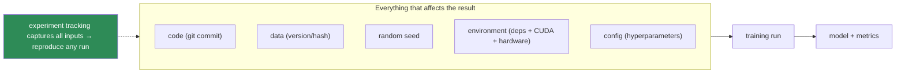
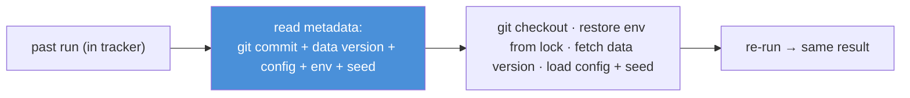

# 16.2 · Reproducibility

[⬅ 16.1 What Is MLOps?](16.1-what-is-mlops.md) · [🏠 Module 16](../README.md) · [➡ 16.3 Data Versioning](16.3-data-versioning.md)

> **The lesson in one line:** If you can't reproduce a result, you can't debug it, trust it, or improve on it — so reproducibility means pinning **everything that affects the output**: random seeds, the environment, dependency versions, configuration, the exact dataset version, and the exact model — captured by experiment tracking so any past run can be recreated.

---

## 🎯 Learning objectives

- Control the sources of non-determinism: **seeds, environments, dependencies, config, data, models**.
- Understand why reproducibility is the **foundation** of all MLOps.
- Reproduce a previous experiment from its captured metadata.

## ✅ Prerequisites

- [16.1 what is MLOps](16.1-what-is-mlops.md), [04 Git](../../04-Git/README.md), [03 Linux/environments](../../03-Linux/README.md).

---

## 🧠 Mental model

> [!IMPORTANT]
> **A machine-learning result is a function of *many* inputs, not just your code — and reproducibility means capturing all of them.** The output depends on: the **code** (Git commit), the **data** (exact version), the **random seed** (init, shuffling, dropout), the **environment** (Python + library versions, CUDA, hardware), and the **config** (hyperparameters). Change any one silently and you get a different model — which is why "it worked on my machine last week" is the default state of ML. Reproducibility is the discipline of **recording every input so the exact output can be recreated**, and it's the *foundation* of the module: you can't version, debug, or roll back what you can't reproduce.



---

## The sources of non-determinism (and their fixes)

| Source | Fix |
|---|---|
| **Random seeds** | set seeds for Python/NumPy/framework; enable deterministic ops where feasible |
| **Environment** | containerize (Docker, [16.21](16.21-iac.md)) or pin a virtual env; record OS/CUDA/hardware |
| **Dependencies** | **lock** exact versions (`requirements.txt` pinned / `poetry.lock` / `uv.lock` / `conda env`) |
| **Configuration** | config files (YAML/Hydra) under version control, not hardcoded values |
| **Data** | dataset **versioning** (hash/DVC, [16.3](16.3-data-versioning.md)) — same data, same result |
| **Model** | model **versioning** in a registry ([16.5](16.5-model-registry.md)) with lineage |
| **Code** | Git commit hash recorded with the run |

### Seeds
```python
import random, numpy as np, torch
def set_seed(seed=42):
    random.seed(seed); np.random.seed(seed)
    torch.manual_seed(seed); torch.cuda.manual_seed_all(seed)
    torch.backends.cudnn.deterministic = True   # slower but reproducible
    torch.backends.cudnn.benchmark = False
```
Seeds control init, shuffling, dropout, augmentation. Note: **full determinism on GPU costs speed** and some ops remain non-deterministic — reproducibility is often "close enough + everything else pinned," not bit-identical.

### Dependency locking
A pinned lockfile records **exact transitive versions** — a library bumping a default (e.g., a new tokenizer behavior) silently changes results otherwise. Rebuild the *exact* environment from the lock.

### Configuration management
Keep hyperparameters and paths in **versioned config**, not scattered literals — so a run's config travels with it and can be replayed ([16.4](16.4-experiment-tracking.md)).

---

## Reproducing a previous experiment



> [!IMPORTANT]
> **Reproducibility isn't a tool you install — it's a set of inputs you *capture* every run so the run can be replayed.** The practical test: given a run ID, can you (or a teammate, six months later, on a different machine) recreate the model? That requires the **git commit + pinned environment + data version + config + seed** all recorded together — which is exactly what **experiment tracking** ([16.4](16.4-experiment-tracking.md)) automates. If any is missing, the run is a dead end you can't debug or build on.

---

## 🏭 Production examples

| Practice | Payoff |
|---|---|
| Dockerized training env | identical env across machines/CI ([16.21](16.21-iac.md)) |
| Pinned lockfile committed | no silent dependency drift |
| Config-driven runs (Hydra/YAML) | replayable, sweepable |
| Data + model versioning | full lineage ([16.3](16.3-data-versioning.md), [16.5](16.5-model-registry.md)) |
| Git commit + seed logged per run | recreate any past model ([16.4](16.4-experiment-tracking.md)) |

## ⚡ Performance & 💲 cost considerations

- **Full GPU determinism costs speed** (deterministic cuDNN, no benchmark autotuning) — use it for debugging/audit, relax for large training if "close" is acceptable.
- **Reproducibility saves far more than it costs** — an irreproducible model that must be re-derived from scratch is the expensive outcome.

## 🔒 Security considerations

> [!CAUTION]
> - **Locked dependencies are a supply-chain control** — pin exact versions and verify hashes to prevent a malicious package update from altering your model ([16.19](16.19-security.md)).
> - **Reproducibility supports auditing/compliance** — proving what data + code produced a model is often a regulatory requirement ([15.20](../../15-Fine-Tuning/weeks/15.20-security.md)).
> - **Config/lock files may embed secrets or private paths** — keep secrets out of tracked config ([16.19](16.19-security.md)).

## 🚫 Common mistakes

| Mistake | Consequence |
|---|---|
| No seed set | Different result every run; can't compare |
| Unpinned dependencies | Silent behavior change on a rebuild |
| Hardcoded hyperparameters | Config not captured; unreplayable |
| Not versioning data | Same code, different data → different model ([16.3](16.3-data-versioning.md)) |
| Not logging the git commit | Can't recover the exact code |
| Assuming bit-identical GPU results | Chasing impossible determinism |

## 🐛 Debugging workflow

"Two runs give different results" — check, in order: (1) **Seed** set and identical? (2) **Data version** identical (hash)? (3) **Dependencies** identical (diff the lockfiles)? (4) **Config** identical? (5) **Hardware/CUDA** difference (GPU non-determinism)? The first difference explains the divergence. "I can't reproduce last month's model" — you're missing one of these captures; add it going forward. Full method in [16.11](16.11-monitoring-drift.md) for the drift-vs-bug distinction.

## 🏋️ Exercises

1. **Seed it.** Run a training twice without a seed (different results), then with (same); quantify the variance removed.
2. **Lock it.** Pin a lockfile; deliberately bump a dependency; show the result changes; revert via the lock.
3. **Config-drive.** Move hardcoded hyperparameters into a YAML config; re-run from config; confirm replay.
4. **Reproduce.** From a run's metadata (commit + data version + config + seed), recreate the model on a clean machine.
5. **Determinism cost.** Measure the speed cost of deterministic cuDNN.

## 🛠️ Mini project — "Reproducible training harness"

**Goal:** a harness that captures every input so any run can be replayed.

**Requirements:** seed setting; a pinned environment (Docker/lockfile); config-driven runs (YAML/Hydra); auto-capture of git commit + data version + config + env + seed into a run record; a `reproduce <run_id>` command that rebuilds and re-runs.

**Folder structure**
```
repro-harness/
├── env/            # Dockerfile + lockfile
├── config/         # YAML configs
├── seed.py         # deterministic setup
├── capture.py      # record commit/data/config/env/seed
└── reproduce.py    # rebuild + re-run from a run id
```

**Testing:** two runs with the same inputs match (within GPU tolerance); `reproduce` recreates a past model.
**Evaluation:** fraction of runs that are replayable.
**Security:** hash-verified locked deps; no secrets in config ([16.19](16.19-security.md)).
**Future improvements:** integrate an experiment tracker ([16.4](16.4-experiment-tracking.md)) and data versioning ([16.3](16.3-data-versioning.md)).

## 📄 Cheat sheet

| Source | Fix |
|---|---|
| **Random seed** | set Python/NumPy/framework seeds; deterministic ops |
| **Environment** | Docker / pinned venv; record OS/CUDA/hardware |
| **Dependencies** | **lockfile** (exact transitive versions) |
| **Config** | versioned YAML/Hydra, not literals |
| **Data** | version/hash ([16.3](16.3-data-versioning.md)) |
| **Model** | registry + lineage ([16.5](16.5-model-registry.md)) |
| **Code** | log the git commit |
| **⭐ Rule** | capture every input every run → replay any run |
| **⚠️** | full GPU determinism costs speed; "close + pinned" often enough |

## 🎴 Flashcards

- **⭐ Why is reproducibility the foundation of MLOps?** → You can't debug, trust, version, or roll back a result you can't recreate; everything else builds on it.
- **What inputs determine an ML result?** → Code (commit), data (version), random seed, environment (deps + CUDA + hardware), and config (hyperparameters).
- **What does a dependency lockfile prevent?** → Silent behavior changes when a transitive dependency bumps a default; it pins exact versions so a rebuild is identical.
- **Why set random seeds, and what's the caveat?** → To control init/shuffling/dropout for comparable runs; caveat: full GPU determinism costs speed and some ops remain non-deterministic.
- **⭐ What does "reproduce a run" require?** → Its recorded git commit + pinned environment + data version + config + seed, captured together (what experiment tracking automates).
- **How is dependency locking also a security control?** → Pinning exact, hash-verified versions blocks a malicious package update from silently altering the model (supply-chain defense).

## 💬 Interview questions

1. What makes an ML result reproducible, and why does it matter operationally?
2. What are the sources of non-determinism, and how do you control each?
3. Why isn't setting a seed enough on its own?
4. How would you reproduce a model trained six months ago?
5. Why is dependency locking both a reproducibility and a security control?
6. What are the limits of GPU determinism, and how do you handle them?

## 📝 Summary

- An ML result depends on **code + data + seed + environment + config** — reproducibility means **capturing every one** so the run can be replayed.
- Fixes: **set seeds**, **containerize/lock dependencies**, **config-drive** runs, and **version data and models** ([16.3](16.3-data-versioning.md), [16.5](16.5-model-registry.md)) — with the **git commit and seed logged** per run ([16.4](16.4-experiment-tracking.md)).
- **Full GPU determinism costs speed** and isn't always attainable — "close + everything else pinned" is usually the practical target.
- Reproducibility is the **foundation** of the module (debug, audit, roll back) and a **supply-chain security** control (pinned, verified dependencies).

## 📚 References

1. **Pineau et al. (2020) — _ML Reproducibility Checklist_.** ⭐ What to capture.
2. **Docker / `uv` / Poetry / conda docs.** Environment & dependency locking.
3. **[16.4 Experiment Tracking](16.4-experiment-tracking.md).** Automating capture.
4. **[16.3 Data Versioning](16.3-data-versioning.md).** The data half of lineage.

---

## 🧭 Navigation

| Direction | Link |
|---|---|
| ⬅ Previous | [16.1 · What Is MLOps & LLMOps?](16.1-what-is-mlops.md) |
| ➡ Next | [16.3 · Data Versioning](16.3-data-versioning.md) |
| 🏠 Module | [Module 16](../README.md) |
| 📖 Lessons | [Lesson index](README.md) |
